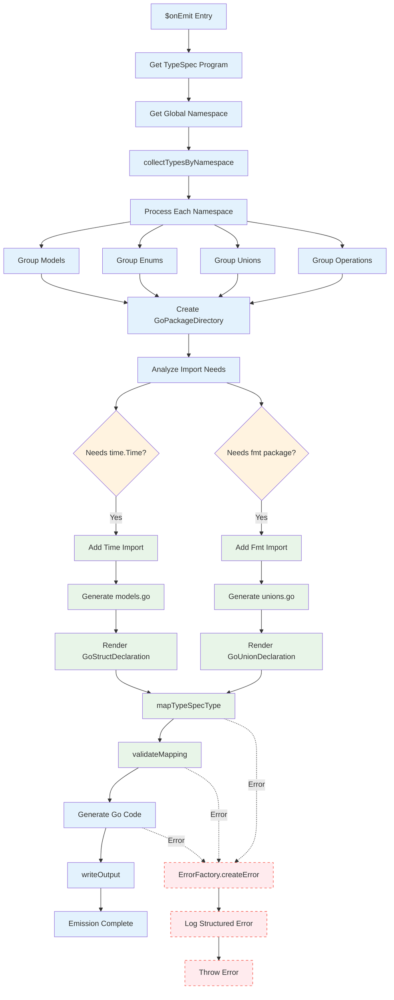
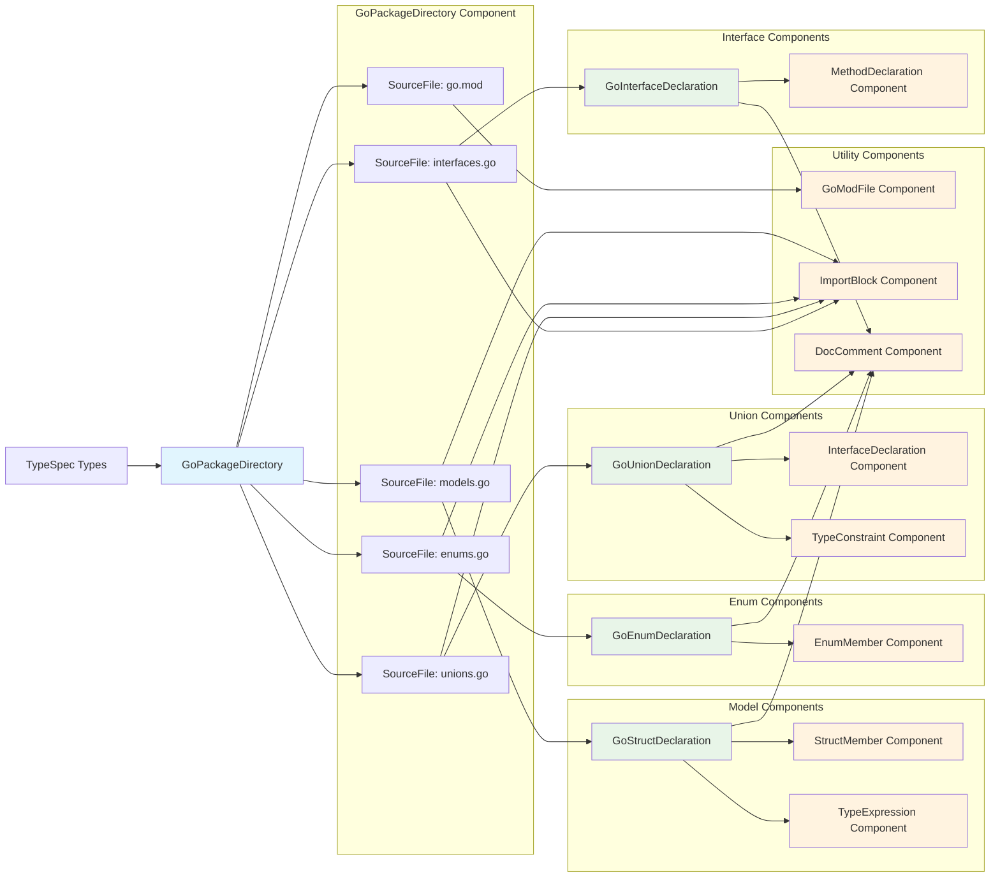
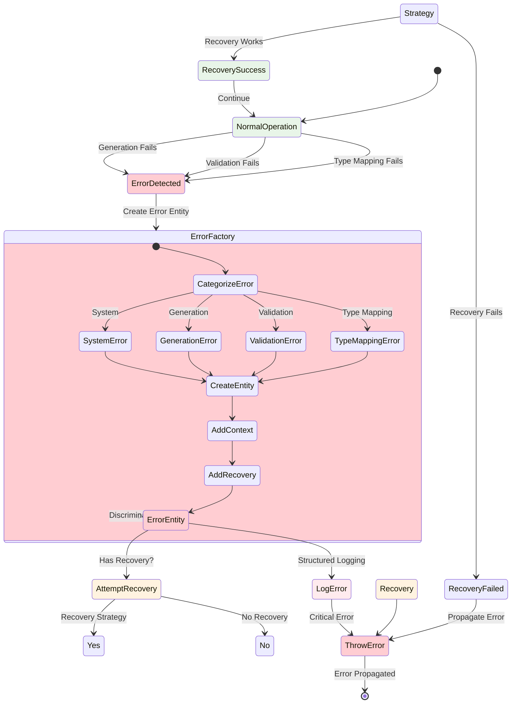
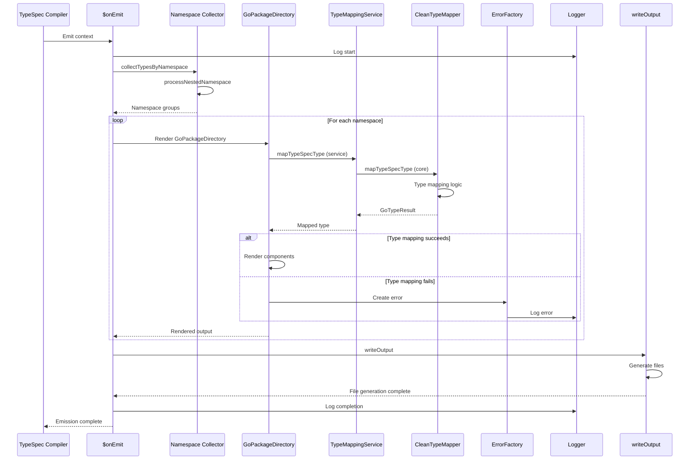
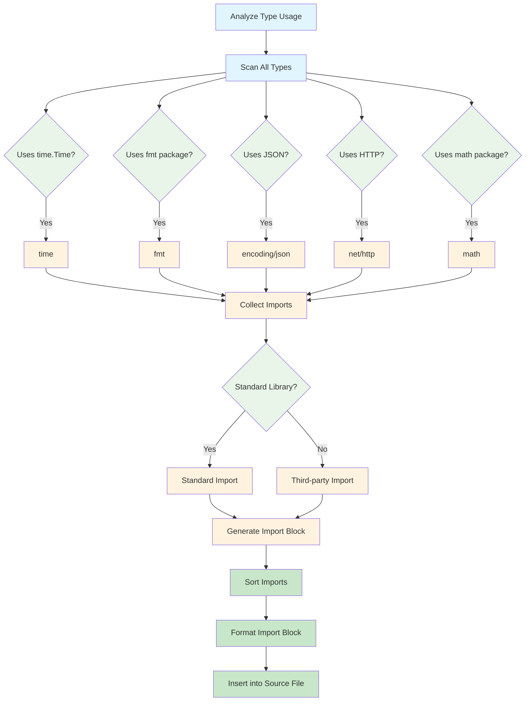
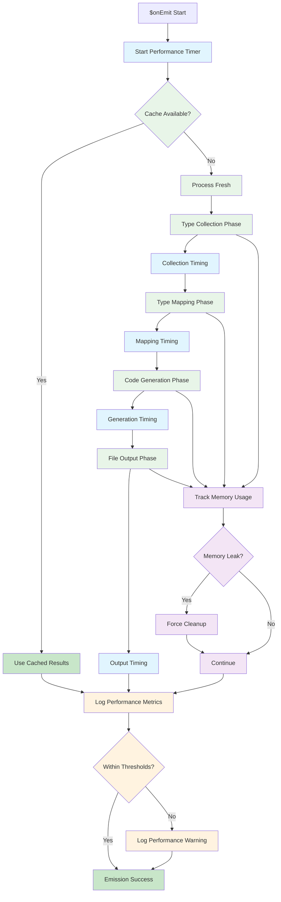

# TypeSpec Go Emitter - Comprehensive Call Graph

## High-Level Architecture Overview

```mermaid
graph TB
    %% Entry Points
    Entry[TypeSpec Compiler] --> $onEmit[$onEmit Function]
    
    %% Main Flow
    $onEmit --> CollectTypes[collectTypesByNamespace]
    $onEmit --> GoPackageDirectory[GoPackageDirectory Component]
    $onEmit --> WriteOutput[writeOutput]
    
    %% Domain Modules
    subgraph "Domain Layer"
        TypeMapper[CleanTypeMapper]
        ErrorFactory[ErrorFactory]
        StructGen[StructGenerator]
        UnionGen[UnionGenerator]
        Logger[StructuredLogger]
    end
    
    %% Component Layer
    subgraph "Component Layer (Alloy-JS)"
        GoStruct[GoStructDeclaration]
        GoEnum[GoEnumDeclaration]
        GoUnion[GoUnionDeclaration]
        GoInterface[GoInterfaceDeclaration]
        GoMod[GoModFile]
    end
    
    %% Service Layer
    subgraph "Service Layer"
        TypeMappingService[TypeMappingService]
    end
    
    %% Utility Layer
    subgraph "Utility Layer"
        Strings[StringUtils]
        TypeSpecUtils[TypeSpecUtils]
        GoFormatter[GoFormatter]
    end
    
    %% Type System
    subgraph "Type System"
        EmitterTypes[Emitter Types]
        DomainTypes[Domain Types]
    end
    
    %% Connections
    CollectTypes --> Logger
    GoPackageDirectory --> GoStruct
    GoPackageDirectory --> GoEnum
    GoPackageDirectory --> GoUnion
    GoPackageDirectory --> GoInterface
    GoPackageDirectory --> GoMod
    
    GoStruct --> TypeMapper
    GoEnum --> TypeMapper
    GoUnion --> TypeMapper
    GoInterface --> TypeMapper
    
    TypeMapper --> EmitterTypes
    TypeMapper --> DomainTypes
    TypeMapper --> Strings
    TypeMapper --> TypeSpecUtils
    
    StructGen --> TypeMapper
    UnionGen --> TypeMapper
    ErrorFactory --> Logger
    
    TypeMappingService --> TypeMapper
    TypeMappingService --> EmitterTypes
    
    %% Error Flow
    TypeMapper -.-> ErrorFactory
    StructGen -.-> ErrorFactory
    UnionGen -.-> ErrorFactory
    GoPackageDirectory -.-> ErrorFactory
    
    %% Styling
    classDef entryPoint fill:#e1f5fe
    classDef domain fill:#f3e5f5
    classDef component fill:#e8f5e8
    classDef service fill:#fff3e0
    classDef utility fill:#fce4ec
    classDef types fill:#f1f8e9
    classDef errorFlow fill:#ffebee,stroke:#f44336,stroke-dasharray:5 5
    
    class Entry entryPoint
    class TypeMapper,ErrorFactory,StructGen,UnionGen,Logger domain
    class GoStruct,GoEnum,GoUnion,GoInterface,GoMod component
    class TypeMappingService service
    class Strings,TypeSpecUtils,GoFormatter utility
    class EmitterTypes,DomainTypes types
```



## Detailed Emission Flow



## Component Architecture Flow



## Type Mapping System Flow

```mermaid
flowchart TD
    StartType[TypeSpec Type] --> TypeGuard{Type Kind?}
    
    TypeGuard -->|Scalar| MapScalar[mapScalarType]
    TypeGuard -->|Model| MapModel[mapModelType]
    TypeGuard -->|Enum| MapEnum[mapEnumType]
    TypeGuard -->|Union| MapUnion[mapUnionType]
    TypeGuard -->|Array| MapArray[mapArrayType]
    TypeGuard -->|Template| MapTemplate[mapTemplateType]
    
    MapScalar --> ScalarCheck{Scalar Type?}
    ScalarCheck -->|string| GoString[GoString]
    ScalarCheck -->|int32| GoInt32[GoInt32]
    ScalarCheck -->|uint32| GoUint32[GoUint32]
    ScalarCheck -->|float64| GoFloat64[GoFloat64]
    ScalarCheck -->|bool| GoBool[GoBool]
    ScalarCheck -->|time.Time| GoTime[GoTime]
    ScalarCheck -->|Unknown| UnknownScalar[UnknownScalarError]
    
    MapModel --> ModelCheck{Model Properties?}
    ModelCheck -->|Has Properties| StructType[StructName]
    ModelCheck -->|No Properties| InterfaceType[InterfaceName]
    ModelCheck -->|Template| TemplateType[TemplateName]
    
    MapArray --> ArrayElement[Map Element Type]
    ArrayElement --> ArraySlice[[]ElementType]
    
    MapUnion --> UnionCheck{Discriminated?}
    UnionCheck -->|Yes| SealedInterface[SealedInterface]
    UnionCheck -->|No| InterfaceUnion[InterfaceUnion]
    
    MapEnum --> EnumOptions{Enum Options?}
    EnumOptions -->|String Values| StringEnum[StringEnum]
    EnumOptions -->|Integer Values| IntEnum[IntEnum]
    EnumOptions -->|Unknown| UnknownEnum[UnknownEnumError]
    
    MapTemplate --> TemplateParams[Process Template]
    TemplateParams --> Instantiate[Instantiate Template]
    
    %% Import Tracking
    GoString --> TrackImports[trackRequiredImports]
    GoTime --> TrackImports
    GoFloat64 --> TrackImports
    ArraySlice --> TrackImports
    SealedInterface --> TrackImports
    
    TrackImports --> ValidateMapping[validateMapping]
    ValidateMapping --> Success[GoTypeResult.Success]
    
    %% Error Paths
    UnknownScalar --> ErrorResult[GoTypeResult.Error]
    UnknownEnum --> ErrorResult
    ValidationFailed --> ErrorResult
    
    %% Styling
    classDef input fill:#e1f5fe
    classDef mapping fill:#e8f5e8
    classDef validation fill:#fff3e0
    classDef success fill:#c8e6c9
    classDef error fill:#ffcdd2
    
    class StartType input
    class MapScalar,MapModel,MapEnum,MapUnion,MapArray,MapTemplate,ScalarCheck,ModelCheck,ArrayElement,UnionCheck,EnumOptions,TemplateParams mapping
    class TrackImports,ValidateMapping validation
    class Success success
    class ErrorResult,UnknownScalar,UnknownEnum error
```

## Error Handling System Flow



## Service Integration Flow



## Import Resolution System



## Performance & Optimization Flow



---

## Call Graph Summary

This comprehensive call graph visualizes the TypeSpec Go emitter's architecture with:

1. **High-Level Overview**: Main modules and their relationships
2. **Detailed Emission Flow**: Step-by-step process from TypeSpec to Go code
3. **Component Architecture**: How Alloy-JS components interact
4. **Type Mapping System**: Complex type conversion logic
5. **Error Handling**: Unified error system with recovery strategies
6. **Service Integration**: How services coordinate the process
7. **Import Resolution**: Dynamic import management
8. **Performance Flow**: Optimization and monitoring

The architecture follows these key patterns:
- **Domain-Driven Design**: Clear separation of concerns
- **Component-Based Generation**: Alloy-JS for maintainable code gen
- **Type Safety**: Discriminated unions and strict typing
- **Error Resilience**: Comprehensive error handling with recovery
- **Performance Focus**: Caching and optimization strategies
- **Observable Operations**: Structured logging throughout

This call graph serves as a comprehensive reference for understanding the TypeSpec Go emitter's internal architecture and execution flow.