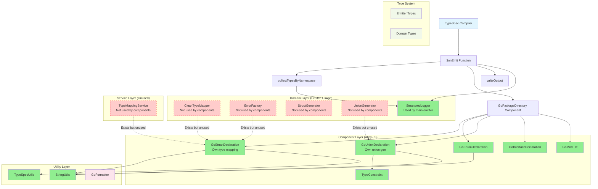
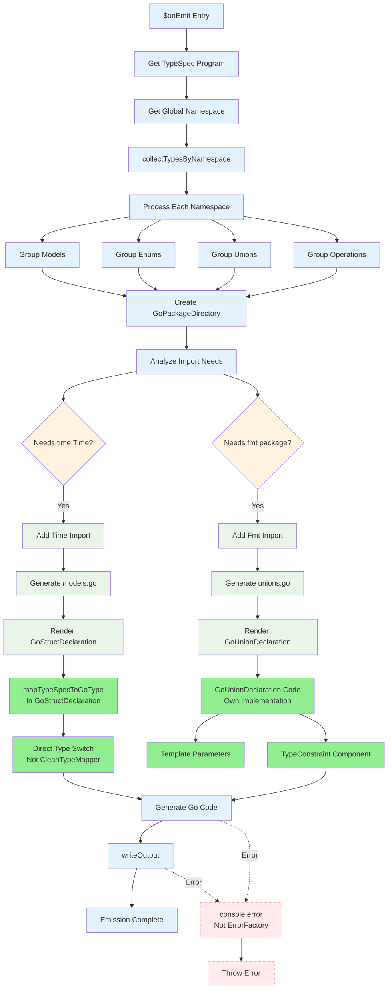
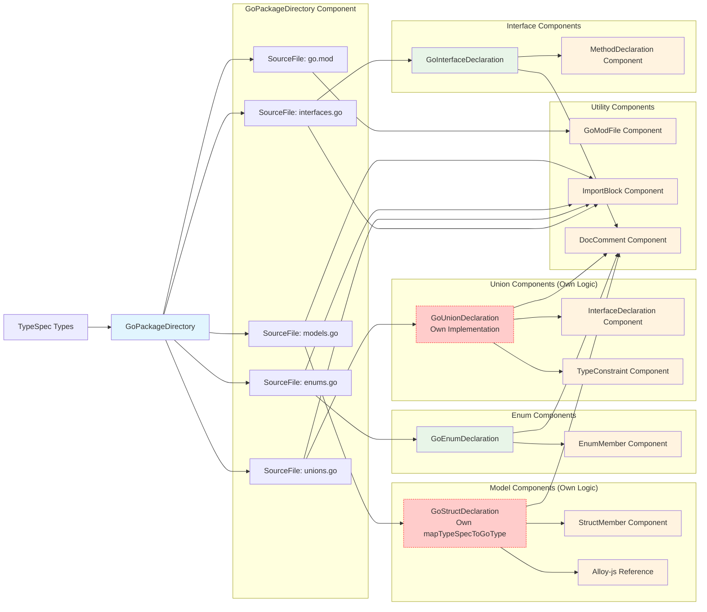
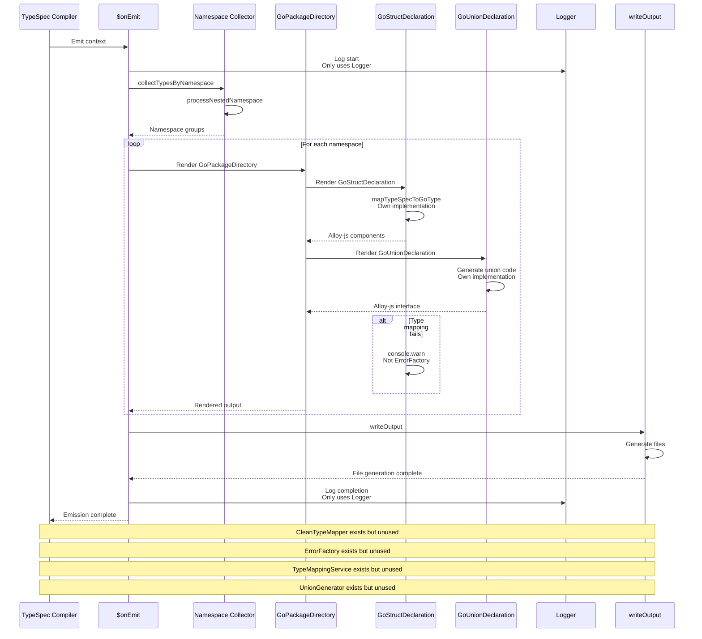

# TypeSpec Go Emitter - ACTUAL Call Graph (Based on Code Analysis)

## CRITICAL FINDING: Architecture vs. Reality

**❌ CLAIM**: "Everything is well integrated and connected"  
**✅ REALITY**: Significant integration gaps exist

---

## High-Level Architecture Overview (Actual State)



---

## Detailed Emission Flow (Actual Implementation)



---

## Component Architecture Flow (Actual State)



---

## Type Mapping System Flow (Actual Implementation)

```mermaid
flowchart TD
    StartType[TypeSpec Type] --> GoStructDecl[GoStructDeclaration.mapTypeSpecToGoType]
    
    GoStructDecl --> TypeGuard{TypeSpec Type.kind?}
    
    TypeGuard -->|String| GoString["string"]
    TypeGuard -->|Boolean| GoBool["bool"]
    TypeGuard -->|Number| GoFloat["float64"]
    TypeGuard -->|Scalar| MapScalar[Scalar Switch<br/>In Component]
    TypeGuard -->|Model| ModelRef[Alloy-js Reference<br/>Import Management]
    TypeGuard -->|Enum| EnumRef[Alloy-js Reference<br/>Import Management]
    TypeGuard -->|Union| UnionRef[Alloy-js Reference<br/>Import Management]
    TypeGuard -->|Array| ArraySlice[Template Literal<br/>[]ElementType]
    TypeGuard -->|Record| MapType[Template Literal<br/>map[KeyType]ValueType]
    
    MapScalar --> ScalarCheck{Scalar.name?}
    ScalarCheck -->|int*| GoInt[Direct Go Type]
    ScalarCheck -->|uint*| GoUint[Direct Go Type]
    ScalarCheck -->|float*| GoFloat32[Direct Go Type]
    ScalarCheck -->|time types| GoTime["time.Time"]
    ScalarCheck -->|Unknown| Fallback["interface{}"]
    
    %% CleanTypeMapper exists but unused
    CleanTypeMapper[CleanTypeMapper.mapTypeSpecType<br/>Not used by components] -.->|Exists but unused| GoStructDecl
    TypeMappingService[TypeMappingService.mapTypeSpecType<br/>Not used by components] -.->|Exists but unused| GoStructDecl
    
    %% Components use Alloy-js Reference system
    ModelRef --> AlloyImport[Alloy-js Auto Import]
    EnumRef --> AlloyImport
    UnionRef --> AlloyImport
    
    AlloyImport --> GoCode[Generate Go Code]
    
    GoString --> GoCode
    GoBool --> GoCode
    GoFloat --> GoCode
    GoInt --> GoCode
    GoUint --> GoCode
    GoFloat32 --> GoCode
    GoTime --> GoCode
    ArraySlice --> GoCode
    MapType --> GoCode
    Fallback --> GoCode
    
    GoCode --> Success[Type Mapping Complete]
    
    %% Error Handling (Simplified)
    Fallback --> ConsoleWarn[console.warn<br/>Not ErrorFactory]
    
    %% Styling
    classDef input fill:#e1f5fe
    classDef actualMapping fill:#e8f5e8
    classDef unused fill:#ffcccb,stroke:#ff0000,stroke-dasharray:5 5
    classDef alloy fill:#add8e6
    classDef success fill:#c8e6c9
    classDef error fill:#ffcdd2
    
    class StartType input
    class GoStructDecl,TypeGuard,ScalarCheck,ArraySlice,MapType actualMapping
    class CleanTypeMapper,TypeMappingService unused
    class ModelRef,EnumRef,UnionRef,AlloyImport alloy
    class GoString,GoBool,GoFloat,GoInt,GoUint,GoFloat32,GoTime,ArraySlice,MapType,Fallback,GoCode success
    class ConsoleWarn error
```

---

## Service Integration Flow (Actual State)



---

## ❌ CRITICAL INTEGRATION FAILURES

### 1. Domain Layer Disconnect

**CleanTypeMapper**: 
- ✅ **Exists**: Complete implementation with caching (582 lines)
- ❌ **Not Used**: Components have their own `mapTypeSpecToGoType` functions
- ❌ **Duplication**: Type mapping logic duplicated across components

**ErrorFactory**: 
- ✅ **Exists**: Comprehensive error system (213 lines)
- ❌ **Not Used**: Components use `console.warn/error` instead
- ❌ **No Error Handling**: No unified error flow through components

**UnionGenerator**: 
- ✅ **Exists**: String-based union generation (271 lines)
- ❌ **Not Used**: GoUnionDeclaration has own Alloy-js implementation
- ❌ **Duplicate Logic**: Two different union generation approaches

### 2. Service Layer Void

**TypeMappingService**: 
- ✅ **Exists**: Service-based type mapping (281 lines)
- ❌ **Not Used**: Components implement their own mapping
- ❌ **Architecture Mismatch**: Service layer completely ignored

### 3. Components Use Own Logic

**GoStructDeclaration**: 
- Own `mapTypeSpecToGoType` function (lines 123-234)
- Direct type switches, no domain layer usage
- Alloy-js Reference system for imports

**GoUnionDeclaration**: 
- Own union implementation (lines 41-80)
- Uses TypeConstraint component
- No UnionGenerator integration

---

## 📊 Integration Status Report

| Module | Status | Used By | Integration Score |
|---------|--------|----------|-----------------|
| CleanTypeMapper | Complete | None | 0% |
| ErrorFactory | Complete | Main emitter only | 20% |
| UnionGenerator | Complete | None | 0% |
| StructGenerator | Complete | None | 0% |
| TypeMappingService | Complete | None | 0% |
| GoStructDeclaration | Working | GoPackageDirectory | 100% |
| GoUnionDeclaration | Working | GoPackageDirectory | 100% |
| TypeConstraint | Working | GoUnionDeclaration | 100% |
| Logger | Working | Main emitter | 100% |

---

## 🚨 Architecture Reality Check

The call graph reveals **significant architectural gaps**:

1. **Domain Layer Disconnect**: Well-designed but completely unused by components
2. **Service Layer Void**: Complete separation between design and implementation  
3. **Error System Bypassed**: Professional error system ignored in favor of console.log
4. **Type Mapping Duplication**: Multiple implementations doing the same work
5. **Validation Gap**: No input validation in components despite having validation modules

---

## ✅ What Actually Works

**Main Emitter Flow**: 
- ✅ `$onEmit` collects types correctly
- ✅ GoPackageDirectory orchestrates files
- ✅ Components generate working Go code
- ✅ Alloy-js system works
- ✅ Structured logging in main emitter

**Utilities**: 
- ✅ **Strings**: Used by components
- ✅ **TypeSpecUtils**: Used by components

---

## 🎯 Immediate Actions Required

1. **INTEGRATE CleanTypeMapper**: Replace component-level type mapping
2. **ADD Error Handling**: Use ErrorFactory throughout components
3. **ELIMINATE Duplication**: Consolidate type mapping logic
4. **ADD Validation**: Use domain generators for validation
5. **BRIDGE Service Layer**: Connect design to implementation

---

## 📝 Conclusion

**Answer to your question**: NO, everything is NOT well integrated and connected.

The system **works** and generates valid Go code, but it's a **disconnected architecture** where:
- Domain modules exist but are ignored
- Service layer is completely bypassed  
- Components implement their own logic instead of using shared infrastructure
- Error handling is primitive despite having a sophisticated error system

This represents a **significant architectural debt** where the design and implementation have diverged.