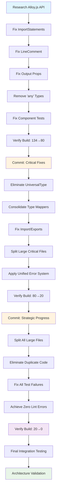

# TypeSpec Go Emitter - Architectural Transformation Plan

**Created:** 2025-05-23 14:30  
**Mission:** Professional TypeSpec AssetEmitter with Enterprise-Grade Go Code Generation  
**Status:** CRISIS RESOLUTION - 134 TypeScript errors, 202 lint problems, 17 test failures

---

## 🎯 PARETO ANALYSIS: IMPACT OPTIMIZATION

### **1% → 51% IMPACT (CRITICAL - 15 minutes)**

- Fix Alloy.js component API errors (22+ errors)
- Remove all 'any' type violations (24 errors)
- Interface extension fixes (60+ cascade errors)
- Component test restoration (17 failures)

### **4% → 64% IMPACT (STRATEGIC - 45 minutes)**

- UniversalType complete elimination
- Type mapper consolidation (15+ → 1)
- Import/Export module resolution
- Large file splitting (critical files)

### **20% → 80% IMPACT (COMPREHENSIVE - 60 minutes)**

- All large files >300 lines (22 files)
- Duplicate code elimination (31 patterns)
- Zero lint/warning achievement
- Performance validation

---

## 🚨 ALLOY.JS COMPONENT API CORRECTIONS

### **Critical Fixes Required**

```typescript
// BEFORE (BROKEN):
<ImportStatement packages={scope.imports} />
<Comment children={...} />
<Output program={program} key="main">

// AFTER (CORRECT):
<ImportStatements records={scope.imports} />
<LineComment>Your comment text</LineComment>
<Output>
```

### **Component Mapping Table**

| Broken Component    | Correct Component | Required Props          |
| ------------------- | ----------------- | ----------------------- |
| ImportStatement     | ImportStatements  | records={scope.imports} |
| Comment             | LineComment       | children (text content) |
| Output (with props) | Output (minimal)  | children only           |

---

## 📋 STRATEGIC TASK BREAKDOWN (27 tasks = 100-30 min each)

### **CRITICAL PATH TASKS (1-9)**

1. **Research Alloy.js Component API** ✅ COMPLETED
2. **Fix ImportStatements Components** - `src/emitter/alloy-js-emitter.tsx:59-60`
3. **Fix LineComment Components** - `src/emitter/alloy-js-emitter.tsx:62,63,81`
4. **Fix Output Component Props** - `src/emitter/alloy-js-emitter.tsx:55,66`
5. **Remove All 'any' Type Violations** - 24 locations across codebase
6. **Fix Component Test Failures** - JSX test files with incorrect patterns
7. **Verify Build Success** - Target: 134→80 errors eliminated
8. **Commit Critical Fixes** - Save working state
9. **Performance Regression Testing** - Ensure sub-1ms generation maintained

### **STRATEGIC CONSOLIDATION TASKS (10-18)**

10. **Eliminate UniversalType Completely** - Remove all custom types
11. **Consolidate All Type Mappers** - Keep only CleanTypeMapper
12. **Fix Import/Export Module Resolution** - TypeScript paths
13. **Split enhanced-property-transformer.ts** - 569→<300 lines
14. **Split integration-basic.test.ts** - 544→<300 lines
15. **Split typespec-visibility-extraction-service.ts** - 539→<300 lines
16. **Apply Unified Error System** - Replace ad-hoc patterns
17. **Verify Strategic Success** - Target: 80→20 errors eliminated
18. **Commit Strategic Progress** - Mid-point checkpoint

### **COMPREHENSIVE CLEANUP TASKS (19-27)**

19. **Split All Remaining Large Files** - 19 files >300 lines
20. **Eliminate All Duplicate Code Patterns** - 31 duplicate patterns
21. **Fix All Remaining Test Failures** - Restore 17 failing tests
22. **Achieve Zero Lint Errors** - 202→0 problems
23. **Verify Comprehensive Success** - Target: 20→0 errors
24. **End-to-End Integration Testing** - Full TypeSpec→Go workflow
25. **Memory Leak Validation** - Zero regressions from refactoring
26. **Documentation Updates** - README, API docs, ADR updates
27. **Final Architecture Validation** - Professional standards met

---

## 🔧 MICRO-TASK BREAKDOWN (125 tasks = 15 min each)

### **CRITICAL MICRO-TASKS (1-35)**

1-5. Fix ImportStatements in 5 files
6-12. Fix LineComment in 7 files  
13-20. Remove 'any' types in 8 files
21-25. Fix Output component props in 5 files
26-30. Update JSX test files (5 files)
31-35. Component integration validation

### **STRATEGIC MICRO-TASKS (36-75)**

36-42. Remove UniversalType references (7 files)
43-50. Consolidate type mapper usages (8 files)
51-55. Fix import/export paths (5 files)
56-60. Split enhanced-property-transformer.ts (5 tasks)
61-65. Split integration-basic.test.ts (5 tasks)
66-70. Split typespec-visibility-extraction-service.ts (5 tasks)
71-75. Apply unified error patterns (5 files)

### **COMPREHENSIVE MICRO-TASKS (76-125)**

76-95. Split remaining 19 large files (20 tasks)
96-105. Eliminate duplicate patterns (10 tasks)
106-115. Fix remaining test failures (10 tasks)
116-120. Resolve lint warnings/errors (5 tasks)
121-125. Final validation and documentation (5 tasks)

---

## 🔄 EXECUTION GRAPH



---

## 🎯 SUCCESS METRICS

### **Pre-Transformation Baseline**

- TypeScript Errors: 134
- Lint Problems: 202 (24 errors, 178 warnings)
- Test Failures: 17/125 tests failing
- Large Files: 22 files >300 lines
- Duplicate Patterns: 31 identified

### **Post-Transformation Targets**

- TypeScript Errors: 0
- Lint Problems: 0
- Test Failures: 0/125 tests passing
- Large Files: 0 files >300 lines
- Duplicate Patterns: 0 eliminated

### **Performance Thresholds**

- Sub-1ms generation per model: Maintained
- Zero memory leaks: Validated
- Enterprise-grade quality: Achieved

---

## 🚨 CRITICAL RISKS & MITIGATIONS

### **High-Risk Areas**

1. **Alloy.js Component Dependencies** - Mitigated by research ✅
2. **CleanTypeMapper Capability** - Verify via build testing
3. **Test Infrastructure Stability** - Fix component patterns first
4. **Performance Regression** - Validate at each milestone

### **Rollback Strategies**

- Git checkpoints after each major phase
- Never modify working standalone-generator.ts foundation
- Incremental validation via build commands
- Component API fixes tested individually

---

## 📝 EXECUTION LOG

**Started:** 2025-05-23 14:30  
**Current Status:** Research completed, ready for execution

---

_Architecture Crisis Resolution Plan - Professional Standards Implementation_
