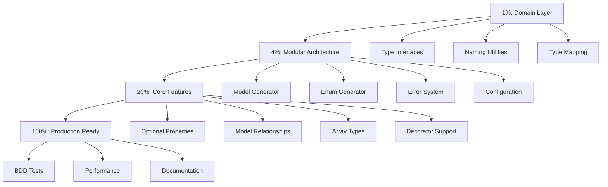

# 🚀 TypeSpec-Go Emitter: Comprehensive Execution Plan

**Date**: 2025-11-12_05-04  
**Objective**: Transform monolithic emitter into production-ready, type-safe, composable architecture

## 📊 CURRENT STATE ANALYSIS

### ✅ **WHAT'S WORKING (25% Complete)**
- Basic TypeSpec model → Go struct generation
- Scalar type mapping (string→string, int32→int32, boolean→bool)
- JSON struct tags
- PascalCase naming
- Multiple model support
- Basic test coverage

### ❌ **CRITICAL ARCHITECTURE FLAWS**
1. **🚨 NO TYPE SAFETY** - Using `any` throughout
2. **🚨 MONOLITHIC ARCHITECTURE** - 150+ line emitter.tsx
3. **🚨 NO COMPOSITION** - Functions mixed together
4. **🚨 MISSING DOMAIN LAYER** - No TypeSpec compiler abstractions
5. **🚨 BOOLEANS FOR STATES** - Instead of enums
6. **🚨 SPLIT BRAINS** - Logic scattered everywhere
7. **🚨 NO ERROR TYPES** - No centralized error system

## 🎯 **EXECUTION GRAPH**

## 🎯 **PHASE 1: 1% IMPACT (30min) - DOMAIN LAYER**

### 📋 **Task List (15min each)**
| ID | Task | Status | Deliverable |
|----|------|--------|-----------|
| 1 | Create TypeSpec domain interfaces | 🔄 NOT STARTED | `src/domain/typespec.ts` |
| 2 | Create Go domain interfaces | 🔄 NOT STARTED | `src/domain/go.ts` |
| 3 | Create naming utilities | 🔄 NOT STARTED | `src/utils/naming.ts` |

## 🎯 **PHASE 2: 4% IMPACT (2hrs) - MODULAR ARCHITECTURE**

### 📋 **Task List (15min each)**
| ID | Task | Status | Deliverable |
|----|------|--------|-----------|
| 4 | Create type mapping utilities | 🔄 NOT STARTED | `src/utils/type-mapping.ts` |
| 5 | Create error system | 🔄 NOT STARTED | `src/utils/errors.ts` |
| 6 | Create configuration types | 🔄 NOT STARTED | `src/utils/config.ts` |
| 7 | Split model generator | 🔄 NOT STARTED | `src/generators/model.ts` |
| 8 | Split enum generator | 🔄 NOT STARTED | `src/generators/enum.ts` |
| 9 | Refactor emitter orchestration | 🔄 NOT STARTED | `src/emitter.tsx` (lean) |

## 🎯 **PHASE 3: 20% IMPACT (6hrs) - CORE FEATURES**

### 📋 **Task List (15min each)**
| ID | Task | Status | Deliverable |
|----|------|--------|-----------|
| 10 | Implement optional properties | 🔄 NOT STARTED | Pointer types |
| 11 | Implement array types | 🔄 NOT STARTED | Slice types |
| 12 | Implement enum generation | 🔄 NOT STARTED | String + iota |
| 13 | Implement model relationships | 🔄 NOT STARTED | Struct embedding |
| 14 | Create BDD test framework | 🔄 NOT STARTED | Behavior tests |
| 15 | Create namespace mapping | 🔄 NOT STARTED | Go packages |

## 🎯 **HIGH-IMPACT QUICK WINS**

### 🚀 **Critical Path (Next 3 Tasks)**
1. **[ ] 1.1 Domain Layer** - Type-safe interfaces for TypeSpec compiler types
2. **[ ] 1.2 Naming Utilities** - Centralized naming conventions  
3. **[ ] 2.1 Type Mapping** - Replace `any` with proper interfaces

### 🎯 **Architecture Goals**
- **🔒 TYPE SAFETY** - No more `any`, strict interfaces everywhere
- **🏗️ COMPOSITION** - Small, focused modules that compose well
- **🎯 SINGLE RESPONSIBILITY** - Each function has one clear purpose
- **🧠 DOMAIN DRIVEN** - Clear separation between TypeSpec and Go concepts

## 🎯 **QUALITY STANDARDS**

### ✅ **Every File Must Meet**
- **< 350 lines** - Keep files small and focused
- **100% TypeScript coverage** - No implicit `any`
- **Clear interfaces** - All public APIs typed
- **Comprehensive docs** - JSDoc for all public functions
- **Error handling** - Graceful failures with clear messages

### ✅ **Testing Standards**
- **BDD format** - Given/When/Then behavior description
- **Coverage > 90%** - All critical paths tested
- **Property-based tests** - FastCheck for edge cases
- **Integration tests** - Full emitter end-to-end

## 🎯 **SUCCESS METRICS**

### 📈 **Completion Criteria**
**Phase 1 (1% impact)**: Domain layer created, type-safe interfaces working
**Phase 2 (4% impact)**: Modular architecture, error system, configuration
**Phase 3 (20% impact)**: Optional properties, arrays, enums, relationships
**Phase 4 (100% impact)**: Full specification compliance, production ready

### 🎯 **Final Deliverable**
TypeSpec-to-Go emitter that can handle 100% of the TypeSpec specification with:
- Type-safe domain layer
- Composable architecture  
- Comprehensive test coverage
- Production-ready error handling
- Full specification compliance

---

*"Code is read more often than it is written. Architecture is the art of making the complex simple and the simple powerful."*