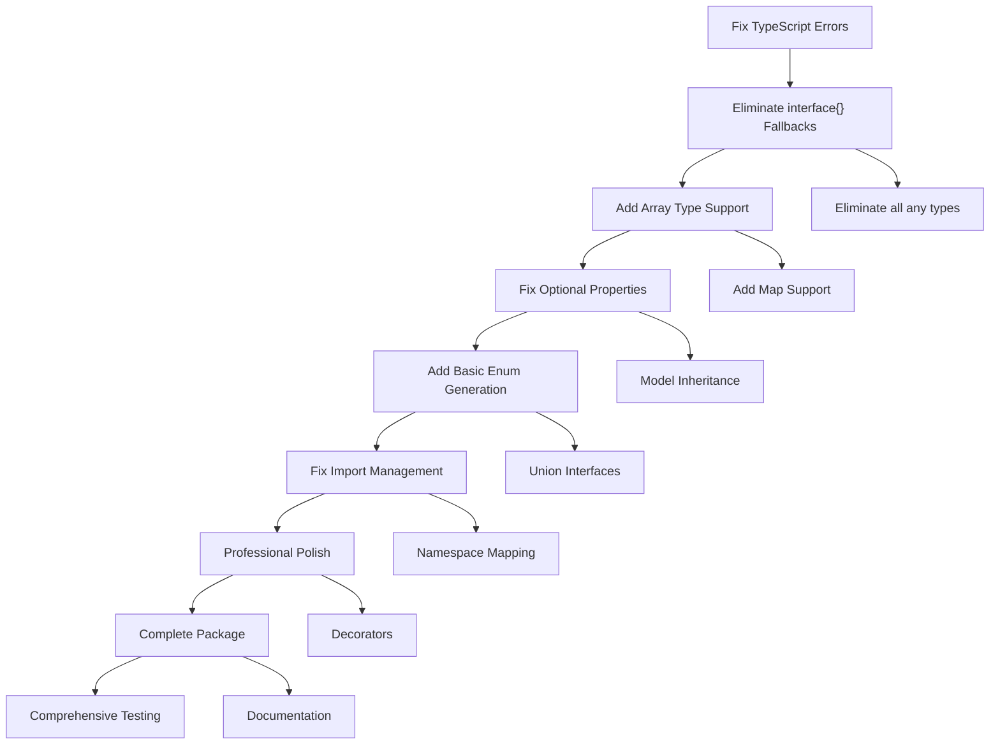

# TypeSpec Go Emitter MVP Execution Plan
**Created**: 2025-11-14_17-41  
**Scope**: Transform 25% → 80% functional MVP  
**Duration**: 1-2 weeks intensive development

---

## 🎯 EXECUTION STRATEGY

### 1% → 51% IMPACT (Critical Path - Highest ROI)
These are the 20-minute tasks that deliver massive value by fixing fundamental blockers.

### 4% → 64% IMPACT (Professional Polish)  
Medium-effort tasks that make the emitter production-ready.

### 20% → 80% IMPACT (Complete Package)
Comprehensive features and quality improvements.

---

## 📊 DETAILED EXECUTION PLAN

### 1% → 51% IMPACT (Do These First - 30 min each)

| Task | Impact | Effort | Description |
|------|--------|--------|-------------|
| **1. Eliminate `interface{}` fallbacks** | 🔥 Critical | 30 min | Replace all 10 fallbacks with proper error throwing in type-mapper.ts |
| **2. Fix optional property pointers** | 🔥 Critical | 30 min | Make `?: string` → `*string` actually work in GoStructMember |
| **3. Replace TODO with import management** | 🔥 Critical | 20 min | Fix line 77-80 in emitter.tsx to generate actual imports |
| **4. Add Array type support** | 🔥 Critical | 30 min | Add missing "Array" case in mapTypeSpecType() |
| **5. Consolidate $lib definitions** | 🔥 Critical | 20 min | Remove duplicate $lib from emitter.tsx, keep only in index.ts |
| **6. Fix basic enum generation** | 🔥 Critical | 30 min | Add Enum case to GoTypeDeclaration switch statement |

### 4% → 64% IMPACT (Professional Polish - 60 min each)

| Task | Impact | Effort | Description |
|------|--------|--------|-------------|
| **7. Eliminate all `any` types (26 instances)** | 🚀 High | 60 min | Replace every `any` with proper TypeScript types |
| **8. Create ImportManager utility** | 🚀 High | 60 min | Extract import logic into reusable class |
| **9. Split emitter.tsx responsibly** | 🚀 High | 90 min | Separate concerns into focused modules |
| **10. Add comprehensive error handling** | 🚀 High | 60 min | Proper diagnostics for unsupported types |
| **11. Implement namespace→package mapping** | 🚀 High | 60 min | Replace hardcoded package structure |
| **12. Add model inheritance (struct embedding)** | 🚀 High | 60 min | Handle `extends` keyword properly |

### 20% → 80% IMPACT (Complete Package - 90 min each)

| Task | Impact | Effort | Description |
|------|--------|--------|-------------|
| **13. Union interface generation** | 📦 Medium | 90 min | Generate sealed interfaces for unions |
| **14. Map type support** | 📦 Medium | 60 min | Handle `Record<string, T>` → `map[string]T` |
| **15. Decorator implementation** | 📦 Medium | 90 min | Make @goName, @goTag actually work |
| **16. Comprehensive test coverage** | 📦 Medium | 120 min | Test every type and edge case |
| **17. Performance optimization** | 📦 Low | 90 min | Optimize large spec compilation |
| **18. Documentation & examples** | 📦 Low | 120 min | Complete README and API docs |

---

## 🏗️ EXECUTION GRAPH



---

## 🎯 TYPE SAFETY IMPROVEMENTS

### Current Type Safety Issues:
- **10 `interface{}` fallbacks** → Type safety erosion
- **26 `any` types** → Runtime errors waiting to happen
- **Weak decorator typing** → No compile-time guarantees

### Improvements:
1. **Strong type guards** everywhere
2. **Branded error types** for different failure modes
3. **Comprehensive TypeScript interfaces**
4. **Zero `any` tolerance** policy

---

## 🏛️ ARCHITECTURE IMPROVEMENTS

### Current Issues:
- **Mixed responsibilities** in emitter.tsx (523 lines)
- **Duplicated $lib definitions**
- **Missing ImportManager abstraction**
- **No namespace strategy**

### Target Architecture:
```
src/
├── emission/
│   ├── emitter.ts (main entry)
│   ├── type-collector.ts
│   ├── import-manager.ts
│   └── code-generator.ts
├── generators/
│   ├── struct-generator.ts
│   ├── enum-generator.ts
│   └── union-generator.ts
├── utils/
│   ├── type-mapper.ts (strong typed)
│   ├── import-manager.ts
│   └── namespace-mapper.ts
```

---

## 🔧 IMPLEMENTATION DETAILS

### Task 1: Eliminate interface{} fallbacks
```typescript
// Replace in type-mapper.ts:197
private static createFallbackType(unknownType: any): MappedGoType {
  const typeName = unknownType?.name || 'unknown';
  const kind = unknownType?.kind || 'undefined';
  throw new Error(`Unsupported TypeSpec type '${typeName}' (${kind}). Use supported scalar types only.`);
}
```

### Task 2: Fix optional properties
```typescript
// In GoStructMember component
const fieldType = property.optional && goType.usePointerForOptional
  ? <go.Pointer children={goType.name} />
  : goType.name;
```

### Task 3: Add Array support
```typescript
// Add to mapTypeSpecType switch
case "Array":
  return this.mapArray(typeSpecType);
```

---

## 📋 SUCCESS METRICS

### MVP Success Criteria (80% Complete):
- [ ] **Zero interface{} fallbacks** (all types have mappings)
- [ ] **Optional properties work** (`?: string` → `*string`)
- [ ] **Arrays work** (`string[]` → `[]string`)
- [ ] **Enums generate properly** (string constants + methods)
- [ ] **Import management works** (time package imports)
- [ ] **Zero TypeScript compilation errors**
- [ ] **90%+ test coverage for supported features**
- [ ] **Comprehensive error messages**

### Type Safety Scorecard:
- [ ] **0 `any` types** in codebase
- [ ] **0 `interface{}` fallbacks**
- [ ] **Type guards for all TypeSpec types**
- [ ] **Strong error type hierarchy**

---

## 🚨 IMMEDIATE ACTIONS

### Today (Next 2 hours):
1. **Commit current changes** ✅
2. **Eliminate interface{} fallbacks** (30 min)
3. **Fix optional properties** (30 min) 
4. **Add Array type support** (30 min)
5. **Fix import management** (20 min)

### Tomorrow:
6. **Add enum generation** (30 min)
7. **Consolidate $lib** (20 min)
8. **Eliminate all any types** (60 min)

### This Week:
9. **Create ImportManager** (60 min)
10. **Split emitter.tsx** (90 min)
11. **Add comprehensive tests** (120 min)

---

## 💭 REFLECTION & PRINCIPLES

### Software Architect Perspective:
- **Type safety is non-negotiable** - eliminate weak typing
- **Composition over inheritance** - use strong abstractions
- **Small, focused modules** - no files over 300 lines
- **Error-first design** - comprehensive diagnostics

### Product Owner Perspective:
- **Customer value first** - fix core blockers
- **Incremental delivery** - 30-minute wins build momentum
- **Quality gates** - zero tolerance for broken builds
- **Documentation** - make it usable for others

### Technical Excellence:
- **Zero split brains** - single source of truth
- **Strong naming conventions** - meaningful, consistent
- **Test-driven fixes** - verify each change works
- **Performance awareness** - consider large specs

---

## 🎯 NEXT STEPS

After committing this plan:
1. **Execute Task 1-5** (critical fixes)
2. **Verify with example** that MVP works
3. **Execute Task 6-12** (professional polish)
4. **Final verification** with complex example
5. **Document and ship** MVP

**Execution starts now.**