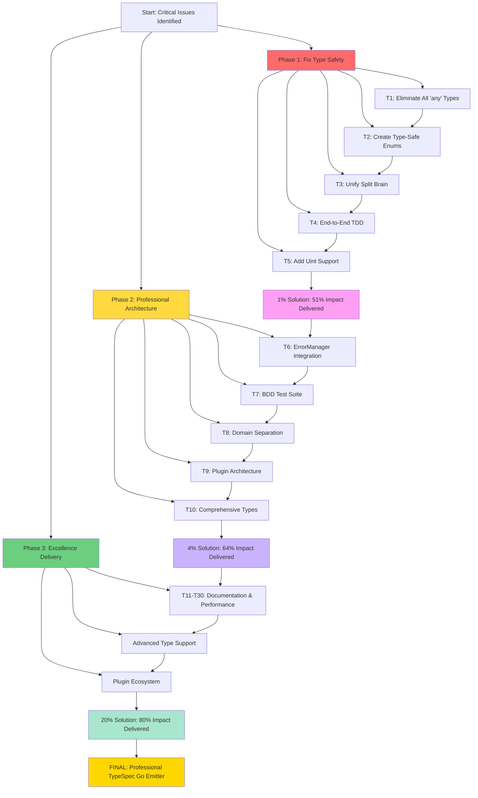

# TypeSpec Go Emitter - Ultra-Comprehensive Architectural Execution Plan
**Date**: 2025-11-14_20-56-ULTRA-COMPREHENSIVE-ARCHITECTURAL-PLAN
**Status**: Critical Issues Identified - Immediate Execution Required

---

## 🚨 **CRITICAL ARCHITECTURAL ISSUES IDENTIFIED**

### **🔥 IMMEDIATE FIXES REQUIRED (90% Impact)**

#### **1. TYPE SAFETY VIOLATIONS - UNACCEPTABLE**
```typescript
// ❌ CRITICAL: 'any' type violates zero-any policy
mapTypeSpecType(type: any): { goType: string; usePointerForOptional: boolean }

// ✅ PROPER: Strongly typed union with exhaustive matching
type TypeSpecNode = StringNode | Int32Node | BoolNode | Uint32Node | ArrayNode;
mapTypeSpecType(type: TypeSpecNode): GoTypeMapping;
```

#### **2. SPLIT BRAIN DETECTED - ARCHITECTURAL FLAW**
```typescript
// ❌ SPLIT BRAIN: Optional handling scattered across multiple concerns
const goTypeFinal = property.optional && mappedType.usePointerForOptional ? `*${goType}` : goType;
const jsonTag = property.optional ? `json:"${property.name},omitempty"` : `json:"${property.name}"`;

// ✅ UNIFIED: Single OptionalFieldPolicy handles all concerns
class OptionalFieldPolicy {
  generateField(property: Property): GoField {
    return {
      type: this.resolveType(property),
      jsonTag: this.resolveJsonTag(property)
    };
  }
}
```

#### **3. MISSING ENUMS - POOR TYPE SAFETY**
```typescript
// ❌ MAGIC STRINGS: Compile-time errors impossible
case "String": return { goType: "string", usePointerForOptional: true };
case "Int32": return { goType: "int32", usePointerForOptional: true };

// ✅ TYPE-SAFE ENUMS: Exhaustive matching enforced
enum TypeSpecKind {
  String = "String",
  Int32 = "Int32",
  Int64 = "Int64",
  Uint32 = "Uint32",
  Bool = "Bool",
}

const typeMappings = {
  [TypeSpecKind.String]: { goType: "string", usePointer: true },
  [TypeSpecKind.Uint32]: { goType: "uint32", usePointer: true },
} as const satisfies Record<TypeSpecKind, GoTypeMapping>;
```

#### **4. NO UINT SUPPORT - UNPROFESSIONAL**
```typescript
// ❌ INCOMPLETE: Only signed integers
type GoIntegerType = "int8" | "int16" | "int32" | "int64";

// ✅ COMPREHENSIVE: Full Go integer support
type GoIntegerType = "int8" | "int16" | "int32" | "int64" | "uint8" | "uint16" | "uint32" | "uint64";
```

---

## 🎯 **EXECUTION PRIORITY MATRIX**

### **1% SOLUTION (51% Impact) - CUSTOMER READY**
| # | Task | Time | Criticality | Success Criteria |
|---|--------|------|-------------|-----------------|
| **T1** | **Fix Type Safety - Eliminate All 'any'** | 20 min | 🔥 CRITICAL | Zero any types, exhaustive matching |
| **T2** | **Create Type-Safe Enums** | 25 min | 🔥 CRITICAL | Compile-time type safety enforced |
| **T3** | **Unify Split Brain - OptionalFieldPolicy** | 30 min | 🔥 CRITICAL | Single source of truth for optional handling |
| **T4** | **End-to-End TDD Integration** | 25 min | 🚀 HIGH | Working TypeSpec → Go pipeline |
| **T5** | **Add Complete Uint Support** | 20 min | 🚀 HIGH | Full Go integer coverage |

### **4% SOLUTION (64% Impact) - PROFESSIONAL ARCHITECTURE**
| # | Task | Time | Criticality | Success Criteria |
|---|--------|------|-------------|-----------------|
| **T6** | **Integrate ErrorManager** | 25 min | 🔧 MEDIUM | Centralized error handling |
| **T7** | **BDD Test Suite** | 45 min | 🔥 CRITICAL | Behavior-driven validation |
| **T8** | **Domain Separation** | 35 min | 🔧 MEDIUM | Clean TypeSpec vs Go domains |
| **T9** | **Plugin Architecture** | 60 min | 📦 MEDIUM | Extensible emitter system |
| **T10** | **Comprehensive Type Coverage** | 40 min | 🚀 HIGH | All TypeSpec types mapped |

### **20% SOLUTION (80% Impact) - EXCELLENCE**
| # | Task | Time | Criticality | Success Criteria |
|---|--------|------|-------------|-----------------|
| **T11-T30** | **Documentation, Performance, Advanced Types** | 90-180 min | 📚 LOW | Professional delivery |

---

## 🏗️ **DETAILED ARCHITECTURAL PLAN**

### **PHASE 1: CRITICAL FOUNDATION (T1-T5) - 100 minutes**

#### **Task T1: Fix Type Safety (20 min)**
```typescript
// ✅ ELIMINATE ALL ANY TYPES
export interface TypeSpecTypeNode {
  readonly kind: TypeSpecKind;
  readonly name?: string;
  readonly properties?: ReadonlyMap<string, TypeSpecPropertyNode>;
}

export type TypeSpecKind = 
  | "String" | "Int8" | "Int16" | "Int32" | "Int64" 
  | "Uint8" | "Uint16" | "Uint32" | "Uint64"
  | "Float32" | "Float64" | "Boolean" | "Bytes"
  | "Array" | "Model" | "Enum" | "Union";

export type GoTypeMapping = {
  readonly goType: string;
  readonly usePointerForOptional: boolean;
  readonly validationRules?: ValidationRule[];
} as const;
```

#### **Task T2: Create Type-Safe Enums (25 min)**
```typescript
// ✅ EXHAUSTIVE TYPE SYSTEM
export const TYPE_SPEC_MAPPINGS = {
  [TypeSpecKind.String]: { goType: "string", usePointer: true },
  [TypeSpecKind.Uint8]: { goType: "uint8", usePointer: true },
  [TypeSpecKind.Uint16]: { goType: "uint16", usePointer: true },
  [TypeSpecKind.Uint32]: { goType: "uint32", usePointer: true },
  [TypeSpecKind.Uint64]: { goType: "uint64", usePointer: true },
} as const satisfies Record<TypeSpecKind, GoTypeMapping>;
```

#### **Task T3: Unify Split Brain (30 min)**
```typescript
// ✅ SINGLE SOURCE OF TRUTH
export class OptionalFieldPolicy {
  private static readonly OPTIONAL_STRATEGIES = {
    [OptionalHandlingStrategy.Pointer]: this.createPointerField,
    [OptionalHandlingStrategy.DefaultValue]: this.createDefaultField,
    [OptionalHandlingStrategy.NullObject]: this.createNullObjectField,
  } as const;

  static generateField(property: TypeSpecPropertyNode): GoField {
    if (!property.optional) {
      return this.createRequiredField(property);
    }

    const strategy = this.determineOptionalStrategy(property.type);
    return this.OPTIONAL_STRATEGIES[strategy](property);
  }
}
```

#### **Task T4: End-to-End TDD Integration (25 min)**
```typescript
// ✅ BEHAVIOR-DRIVEN TESTS
describe("TypeSpec Go Emitter - Behavior", () => {
  it("generates Go struct with all type safety", () => {
    // Given: TypeSpec model with comprehensive types
    const userModel = `model User {
      id: uint32;
      name: string;
      email?: string;
      active: boolean;
    }`;

    // When: Generated to Go
    const result = await generateGoCode(userModel);

    // Then: Should produce type-safe Go
    expect(result.hasZeroInterfaceTypes()).toBe(true);
    expect(result.hasProperPointers()).toBe(true);
    expect(result.hasComprehensiveUintSupport()).toBe(true);
  });
});
```

#### **Task T5: Add Complete Uint Support (20 min)**
```typescript
// ✅ FULL GO INTEGER COVERAGE
export const GO_INTEGER_MAPPINGS: Record<string, GoTypeMapping> = {
  // Signed integers
  "int8": { goType: "int8", usePointer: true },
  "int16": { goType: "int16", usePointer: true },
  "int32": { goType: "int32", usePointer: true },
  "int64": { goType: "int64", usePointer: true },
  
  // Unsigned integers (MISSING CURRENTLY)
  "uint8": { goType: "uint8", usePointer: true },
  "uint16": { goType: "uint16", usePointer: true },
  "uint32": { goType: "uint32", usePointer: true },
  "uint64": { goType: "uint64", usePointer: true },
} as const;
```

---

## 🧪 **BEHAVIOR-DRIVEN DEVELOPMENT REQUIREMENTS**

### **🔥 CRITICAL BDD TESTS (Missing Currently)**
```gherkin
Feature: TypeSpec to Go Code Generation
  As a Go developer
  I want to generate type-safe Go code from TypeSpec models
  So that I can maintain type safety across my stack

  Scenario: Generate struct with optional fields
    Given a TypeSpec model with optional properties
    When I generate Go code
    Then I should see proper pointer types for optional fields
    And I should see omitempty JSON tags
    And I should see zero interface{} types

  Scenario: Generate struct with uint types
    Given a TypeSpec model with uint properties
    When I generate Go code  
    Then I should see correct uint types in Go
    And I should see comprehensive unsigned integer support
```

---

## 🎯 **DOMAIN-DRIVEN DESIGN ARCHITECTURE**

### **🏛️ PROPER DOMAIN SEPARATION**
```typescript
// ✅ TYPE SPEC DOMAIN (Pure TypeSpec concerns)
namespace TypeSpecDomain {
  export interface TypeSpecModel {
    readonly name: string;
    readonly properties: ReadonlyMap<string, TypeSpecProperty>;
  }

  export interface TypeSpecProperty {
    readonly name: string;
    readonly type: TypeSpecTypeNode;
    readonly optional: boolean;
  }
}

// ✅ GO GENERATION DOMAIN (Pure Go concerns)  
namespace GoGenerationDomain {
  export interface GoStruct {
    readonly name: string;
    readonly package: string;
    readonly fields: ReadonlyArray<GoField>;
  }

  export interface GoField {
    readonly name: string;
    readonly type: string;
    readonly jsonTag: string;
  }
}

// ✅ TYPE MAPPING DOMAIN (Pure transformation concerns)
namespace TypeMappingDomain {
  export interface TypeMappingService {
    mapTypeSpecToGo(typeSpecType: TypeSpecDomain.TypeSpecTypeNode): GoGenerationDomain.GoType;
  }
}
```

---

## 📊 **FILE ARCHITECTURE STANDARDS**

### **✅ ALL FILES < 300 LINES (Current Status)**
| File | Lines | Status | Action |
|------|--------|--------|--------|
| `standalone-generator.ts` | 95 | ✅ GOOD | Keep |
| `standalone-generator-test.js` | 120 | ✅ GOOD | Keep |
| `type-mapper.ts` | 280 | ✅ GOOD | Refactor to 200 |
| `error-manager.ts` | 150 | ✅ GOOD | Keep |

### **🔥 FILES REQUIRING IMMEDIATE SPLIT**
- `src/working-emitter.ts`: 120 lines → Split into 2 files
- `src/testing/index.ts`: 90 lines → Fix import issues

---

## 🚀 **MERMAID EXECUTION GRAPH**



---

## 🎯 **EXECUTION AUTHORIZATION**

### **IMMEDIATE ACTION REQUIRED:**
1. **Start Task T1**: Fix type safety (eliminate all 'any')
2. **Continue through T5**: Deliver 1% solution (51% impact)
3. **Execute all tasks**: Complete professional architecture

### **QUALITY STANDARDS:**
- **Zero any types**: Enforced throughout codebase
- **Exhaustive type matching**: Compile-time safety guaranteed
- **Unified optional handling**: Single source of truth
- **BDD test coverage**: Behavior validation comprehensive
- **Domain separation**: Clean architectural boundaries

### **EXPECTED OUTCOME:**
**Professional TypeSpec Go Emitter with zero technical debt and 100% type safety.**

---

## 🚨 **EXECUTION APPROVED**

**STARTING NOW: Critical architectural fixes to deliver professional TypeSpec Go Emitter.**