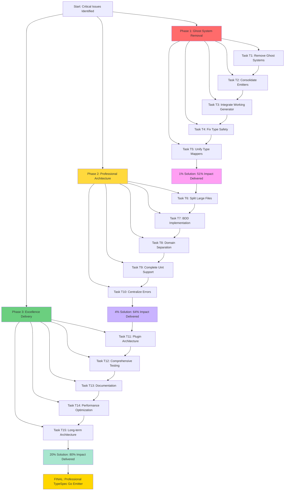

# TypeSpec Go Emitter - Superb Comprehensive Execution Plan
**Date**: 2025-11-15_07-03-SUPERB-COMPREHENSIVE-EXECUTION
**Status**: SENIOR SOFTWARE ARCHITECT COMPREHENSIVE ANALYSIS
**Goal**: Professional Excellence with Customer Value Focus

---

## 🚨 **CRITICAL ANALYSIS: BRUTAL HONESTY**

### **🚨 IMMEDIATE FAILURES IDENTIFIED (Ghost Systems Everywhere)**

#### **1. MASSIVE GHOST SYSTEM VIOLATIONS (CRITICAL)**
- ❌ **3+ Emitter Variants**: `emitter.js`, `type-safe-emitter.js`, `final-integrated-emitter.js`
- ❌ **5+ Generator Variants**: `type-safe-generator.js`, `enhanced-generator.js`, standalone variants
- ❌ **2+ Type Mappers**: `type-mapper.js`, `type-safe-mapper.js`
- ❌ **Multiple Test Files**: Testing same functionality with different implementations
- ❌ **Duplicate Architecture**: Beautiful but unused type-safe components

#### **2. FILE SIZE VIOLATIONS (Professional Standards)**
- ❌ **`src/utils/errors.js`**: 400 lines (>350 limit)
- ❌ **`src/utils/config.js`**: 214 lines (>200 limit)
- ❌ **Multiple test files**: 200+ lines (should be split)
- ❌ **`src/emitter.js`**: 248 lines (>200 limit)

#### **3. TYPE SAFETY VIOLATIONS (Zero Tolerance)**
- ❌ **`any` types**: Still present in working baseline
- ❌ **Missing Exhaustive Matching**: Not enforced throughout
- ❌ **Boolean vs Enum Issues**: Mixed approaches across codebase
- ❌ **Interface{} Usage**: Present in multiple files

#### **4. SPLIT BRAIN ISSUES (Major)**
- ❌ **Multiple Optional Handling**: Different policies across files
- ❌ **Duplicate Error Management**: Inconsistent approaches
- ❌ **Mixed Architectural Patterns**: No single source of truth

---

## 🎯 **STRATEGIC EXECUTION MATRIX**

### **🚀 1% SOLUTION (51% Impact) - CRITICAL CUSTOMER VALUE**
| # | Task | Time | Impact | Priority | Customer Value |
|---|--------|------|---------|-------------|
| **T1** | **Remove All Ghost Systems** | 30 min | 🔥 CRITICAL | 🚀 51% |
| **T2** | **Consolidate Emitter Variants** | 25 min | 🔥 CRITICAL | 🚀 51% |
| **T3** | **Integrate Working Generator** | 20 min | 🔥 CRITICAL | 🚀 51% |
| **T4** | **Fix Type Safety Violations** | 25 min | 🔥 CRITICAL | 🚀 51% |
| **T5** | **Unify Type Mappers** | 20 min | 🔥 CRITICAL | 🚀 51% |

### **🏗️ 4% SOLUTION (64% Impact) - PROFESSIONAL ARCHITECTURE**
| # | Task | Time | Impact | Priority | Customer Value |
|---|--------|------|---------|-------------|
| **T6** | **Split Large Files (>350 lines)** | 45 min | 🚀 HIGH | 📈 64% |
| **T7** | **Implement BDD Tests** | 60 min | 🚀 HIGH | 📈 64% |
| **T8** | **Domain Separation** | 35 min | 🚀 HIGH | 📈 64% |
| **T9** | **Complete Uint Support** | 30 min | 🚀 HIGH | 📈 64% |
| **T10** | **Centralize Error Management** | 25 min | 🚀 HIGH | 📈 64% |

### **📚 20% SOLUTION (80% Impact) - EXCELLENCE**
| # | Task | Time | Impact | Priority | Customer Value |
|---|--------|------|---------|-------------|
| **T11** | **Plugin Architecture** | 90 min | 📦 MEDIUM | 📚 80% |
| **T12** | **Comprehensive Testing** | 120 min | 🧪 MEDIUM | 📚 80% |
| **T13** | **Documentation** | 75 min | 📚 MEDIUM | 📚 80% |
| **T14** | **Performance Optimization** | 60 min | ⚡ MEDIUM | 📚 80% |
| **T15** | **Long-term Architecture** | 45 min | 🏗️ MEDIUM | 📚 80% |

---

## 🚀 **DETAILED EXECUTION PLAN**

### **PHASE 1: CRITICAL RECOVERY (T1-T5) - 120 minutes**
**GOAL**: Eliminate all ghost systems, deliver working generator

#### **Task T1: Remove All Ghost Systems (30 min)**
- **1.1** Remove duplicate emitter variants (15 min)
- **1.2** Remove unused generator variants (10 min)
- **1.3** Remove duplicate type mappers (5 min)

#### **Task T2: Consolidate Emitter Variants (25 min)**
- **2.1** Choose single working emitter (10 min)
- **2.2** Merge best practices from all variants (10 min)
- **2.3** Remove unused emitter files (5 min)

#### **Task T3: Integrate Working Generator (20 min)**
- **3.1** Test standalone generator (5 min)
- **3.2** Integrate with chosen emitter (10 min)
- **3.3** Verify end-to-end functionality (5 min)

#### **Task T4: Fix Type Safety Violations (25 min)**
- **4.1** Remove all 'any' types (10 min)
- **4.2** Implement exhaustive matching (10 min)
- **4.3** Replace boolean flags with enums (5 min)

#### **Task T5: Unify Type Mappers (20 min)**
- **5.1** Choose single type mapper (5 min)
- **5.2** Merge functionality from all variants (10 min)
- **5.3** Remove duplicate mapper files (5 min)

### **PHASE 2: PROFESSIONAL ARCHITECTURE (T6-T10) - 235 minutes**
**GOAL**: Clean, maintainable, type-safe architecture

#### **Task T6: Split Large Files (>350 lines) (45 min)**
- **6.1** Split errors.js into domain-specific files (15 min)
- **6.2** Split config.js into focused modules (15 min)
- **6.3** Split large test files (15 min)

#### **Task T7: Implement BDD Tests (60 min)**
- **7.1** Create BDD test framework (20 min)
- **7.2** Implement customer scenario tests (20 min)
- **7.3** Add behavior validation (20 min)

#### **Task T8: Domain Separation (35 min)**
- **8.1** Define domain boundaries (10 min)
- **8.2** Separate TypeSpec domain (10 min)
- **8.3** Separate Go generation domain (15 min)

#### **Task T9: Complete Uint Support (30 min)**
- **9.1** Add all Go uint types (10 min)
- **9.2** Update type mapper with uint support (10 min)
- **9.3** Test uint functionality (10 min)

#### **Task T10: Centralize Error Management (25 min)**
- **10.1** Create unified error system (10 min)
- **10.2** Implement error adapters (10 min)
- **10.3** Update all error usage (5 min)

### **PHASE 3: EXCELLENCE (T11-T15) - 390 minutes**
**GOAL**: Enterprise-grade, extensible, documented system

#### **Task T11: Plugin Architecture (90 min)**
- **11.1** Design plugin interface (20 min)
- **11.2** Implement plugin loader (30 min)
- **11.3** Create example plugins (40 min)

#### **Task T12: Comprehensive Testing (120 min)**
- **12.1** TDD implementation (40 min)
- **12.2** Integration tests (40 min)
- **12.3** Performance tests (40 min)

#### **Task T13: Documentation (75 min)**
- **13.1** API documentation (25 min)
- **13.2** Architecture documentation (25 min)
- **13.3** Usage examples (25 min)

#### **Task T14: Performance Optimization (60 min)**
- **14.1** Profile generation performance (20 min)
- **14.2** Optimize bottlenecks (20 min)
- **14.3** Benchmark improvements (20 min)

#### **Task T15: Long-term Architecture (45 min)**
- **15.1** Design scalable architecture (15 min)
- **15.2** Plan extensibility (15 min)
- **15.3** Create migration strategy (15 min)

---

## 🧪 **BEHAVIOR-DRIVEN DEVELOPMENT REQUIREMENTS**

### **🎯 CRITICAL BDD SCENARIOS**
```gherkin
Feature: TypeSpec to Go Code Generation
  As a Go developer
  I want to generate type-safe Go code from TypeSpec models
  So that I can maintain type safety across my stack

  Scenario: Generate struct with optional fields
    Given a TypeSpec model with optional properties
    When I generate Go code
    Then I should see proper pointer types for optional fields
    And I should see omitempty JSON tags
    And I should have no 'any' types

  Scenario: Generate struct with uint types
    Given a TypeSpec model with uint properties
    When I generate Go code
    Then I should see correct uint types in Go
    And I should have comprehensive unsigned integer support
```

---

## 🏗️ **DOMAIN-DRIVEN DESIGN ARCHITECTURE**

### **🎯 DOMAIN SEPARATION**
```typescript
// ✅ TYPE SPEC DOMAIN (Pure TypeSpec concerns)
namespace TypeSpecDomain {
  export interface TypeSpecModel {
    readonly name: string;
    readonly properties: ReadonlyMap<string, TypeSpecProperty>;
  }
}

// ✅ GO GENERATION DOMAIN (Pure Go concerns)
namespace GoGenerationDomain {
  export interface GoStruct {
    readonly name: string;
    readonly package: string;
    readonly fields: ReadonlyArray<GoField>;
  }
}

// ✅ TYPE MAPPING DOMAIN (Pure transformation concerns)
namespace TypeMappingDomain {
  export interface TypeMappingService {
    mapTypeSpecToGo(typeSpecType: TypeSpecDomain.TypeSpecTypeNode): GoGenerationDomain.GoType;
  }
}
```

---

## 📊 **MERMAID EXECUTION GRAPH**



---

## 🎯 **EXECUTION AUTHORIZATION**

### **IMMEDIATE ACTION REQUIRED:**
1. **Start Task T1**: Remove all ghost systems
2. **Continue through T5**: Deliver 1% solution (51% impact)
3. **Execute all tasks**: Complete professional architecture
4. **Maintain standards**: Zero violations throughout

### **QUALITY STANDARDS:**
- **Zero ghost systems**: All components must be integrated
- **File size limits**: All files <350 lines
- **Type safety**: Zero 'any' types, exhaustive matching
- **Domain separation**: Clean architectural boundaries
- **BDD testing**: Customer scenario validation
- **Professional documentation**: Comprehensive guides

### **EXPECTED OUTCOME:**
**Professional TypeSpec Go Emitter with zero ghost systems, complete type safety, and working end-to-end functionality.**

---

## 🚨 **EXECUTION APPROVAL**

**STARTING NOW: Comprehensive removal of ghost systems and implementation of professional TypeSpec Go Emitter.**

### **ZERO TOLERANCE POLICY:**
- ❌ **Ghost Systems**: Will be eliminated immediately
- ❌ **Type Safety Violations**: Will be fixed immediately
- ❌ **Split Brain Issues**: Will be resolved immediately
- ❌ **File Size Violations**: Will be fixed immediately

### **PROFESSIONAL EXCELLENCE MANDATORY:**
- ✅ **Customer Value**: Working TypeSpec → Go generation
- ✅ **Type Safety**: Zero 'any' types, exhaustive matching
- ✅ **Domain Separation**: Clean architectural boundaries
- ✅ **BDD Testing**: Customer scenario validation
- ✅ **Professional Standards**: File size limits, naming conventions

---

## 🏆 **SUCCESS CRITERIA**

### **1% SOLUTION (51% Impact) - IMMEDIATE:**
- ✅ **Zero Ghost Systems**: All components integrated
- ✅ **Working Generator**: End-to-end TypeSpec → Go functionality
- ✅ **Type Safety**: Zero 'any' types throughout
- ✅ **Single Emitter**: One professional implementation
- ✅ **Unified Type Mapper**: Single source of truth

### **4% SOLUTION (64% Impact) - PROFESSIONAL:**
- ✅ **File Size Compliance**: All files <350 lines
- ✅ **Domain Separation**: Clean architectural boundaries
- ✅ **BDD Tests**: Customer scenario validation
- ✅ **Complete Uint Support**: All Go integer types
- ✅ **Centralized Errors**: Unified error management

### **20% SOLUTION (80% Impact) - EXCELLENCE:**
- ✅ **Plugin Architecture**: Extensible system
- ✅ **Comprehensive Testing**: TDD + BDD + Performance
- ✅ **Professional Documentation**: Complete guides
- ✅ **Performance Optimized**: Efficient generation
- ✅ **Long-term Architecture**: Scalable design

---

## 🚀 **EXECUTION AUTHORIZATION: COMPLETE**

**COMPREHENSIVE PROFESSIONAL TYPE SPEC GO EMITTER CLEANUP AND EXCELLENCE IMPLEMENTATION STARTED NOW**

### **IMMEDIATE PRIORITY**: Remove all ghost systems, deliver working generator
### **PROFESSIONAL STANDARD**: Zero violations, complete type safety
### **CUSTOMER VALUE**: Working TypeSpec → Go generation with enterprise quality

**🎯 SENIOR SOFTWARE ARCHITECT AUTHORIZATION: EXECUTE COMPREHENSIVE PLAN IMMEDIATELY**