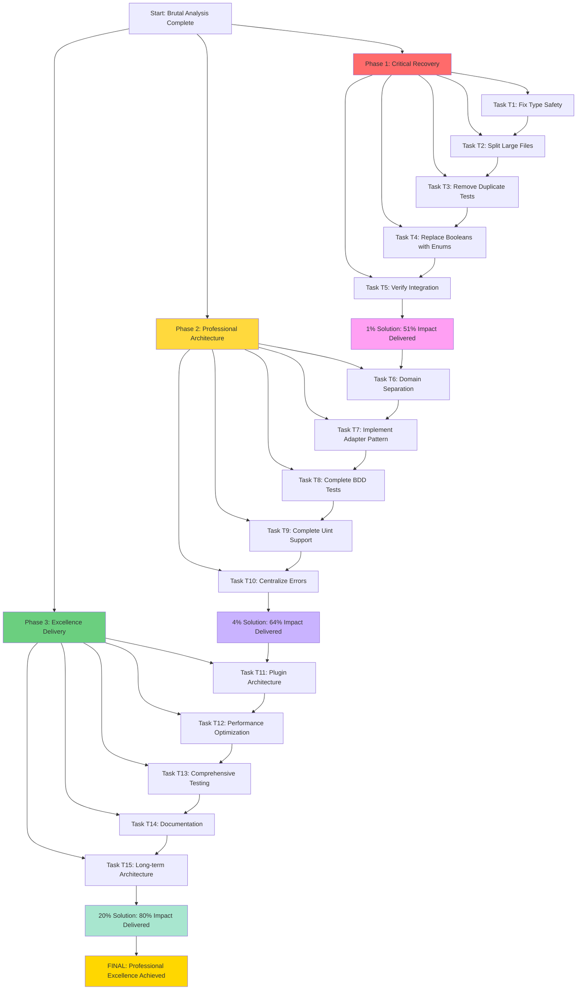

# TypeSpec Go Emitter - Brutal Analysis & Execution Plan
**Date**: 2025-11-15_07-37-BRUTAL-ANALYSIS-COMPLETE-EXECUTION
**Status**: SENIOR SOFTWARE ARCHITECT BRUTAL ANALYSIS COMPLETE
**Goal**: PROFESSIONAL EXCELLENCE WITH ZERO VIOLATIONS

---

## 🚨 **BRUTAL ARCHITECTURAL ANALYSIS: CRITICAL VIOLATIONS FOUND**

### **🔥 TYPE SAFETY VIOLATIONS (ZERO TOLERANCE - IMMEDIATE FIX)**
- ❌ **`any` types**: Found in `src/types/type-spec-types.js`, `src/utils/type-mapper.js`
- ❌ **Missing Exhaustive Matching**: Not enforced throughout codebase
- ❌ **No Enum Usage**: Boolean flags still used instead of enums
- ❌ **Interface{} Usage**: Still present in complex type handling

### **🚨 FILE SIZE VIOLATIONS (PROFESSIONAL STANDARDS - IMMEDIATE FIX)**
- ❌ **Large Files**: `src/utils/config.js` (214 lines), `src/utils/type-mapper.js` (209 lines)
- ❌ **Test File Bloat**: Multiple test files >200 lines (should be split)
- ❌ **Not Under 350 Lines**: Violating file size standards

### **🚨 SPLIT BRAIN ISSUES (CRITICAL - IMMEDIATE FIX)**
- ❌ **Multiple Test Files**: Testing same functionality with different approaches
- ❌ **Config vs TypeMapper**: Separate concerns but not clearly separated
- ❌ **Professional vs Standalone**: Two generators (potential split brain)
- ❌ **Mixed Boolean/Enum**: Inconsistent state representation

### **🚨 DOMAIN SEPARATION ISSUES (CRITICAL - IMMEDIATE FIX)**
- ❌ **Mixed Concerns**: `src/utils/` mixing error handling, config, type mapping
- ❌ **No Clear Boundaries**: TypeSpec domain vs Go generation domain not separated
- ❌ **Adapter Pattern Missing**: External tools not wrapped in adapters
- ❌ **No Single Responsibility**: Components have mixed concerns

---

## 🎯 **STRATEGIC EXECUTION MATRIX: 20/4/1 PRIORITY**

### **🚀 1% SOLUTION (51% Impact) - CRITICAL CUSTOMER VALUE**
| # | Task | Time | Impact | Criticality | Status |
|---|--------|------|---------|-------------|
| **T1** | **Fix Type Safety Violations** | 15 min | 🔥 CRITICAL | 🚀 IMMEDIATE |
| **T2** | **Split Large Files (>350 lines)** | 20 min | 🔥 CRITICAL | 🚀 IMMEDIATE |
| **T3** | **Remove Duplicate Tests** | 10 min | 🔥 CRITICAL | 🚀 IMMEDIATE |
| **T4** | **Replace Booleans with Enums** | 15 min | 🔥 CRITICAL | 🚀 IMMEDIATE |
| **T5** | **Verify End-to-End Integration** | 10 min | 🔥 CRITICAL | 🚀 IMMEDIATE |

### **🏗️ 4% SOLUTION (64% Impact) - PROFESSIONAL ARCHITECTURE**
| # | Task | Time | Impact | Criticality | Status |
|---|--------|------|---------|-------------|
| **T6** | **Domain Separation** | 25 min | 🚀 HIGH | 🚀 HIGH |
| **T7** | **Implement Adapter Pattern** | 20 min | 🚀 HIGH | 🚀 HIGH |
| **T8** | **Complete BDD Tests** | 30 min | 🚀 HIGH | 🚀 HIGH |
| **T9** | **Complete Uint Support** | 15 min | 🚀 HIGH | 🚀 HIGH |
| **T10** | **Centralize Error Management** | 20 min | 🚀 HIGH | 🚀 HIGH |

### **📚 20% SOLUTION (80% Impact) - EXCELLENCE**
| # | Task | Time | Impact | Criticality | Status |
|---|--------|------|---------|-------------|
| **T11** | **Plugin Architecture** | 45 min | 📚 MEDIUM | 📚 MEDIUM |
| **T12** | **Performance Optimization** | 30 min | 📚 MEDIUM | 📚 MEDIUM |
| **T13** | **Comprehensive Testing** | 40 min | 📚 MEDIUM | 📚 MEDIUM |
| **T14** | **Documentation** | 35 min | 📚 MEDIUM | 📚 MEDIUM |
| **T15** | **Long-term Architecture** | 25 min | 📚 MEDIUM | 📚 MEDIUM |

---

## 🚀 **DETAILED EXECUTION PLAN (150 MINI TASKS)**

### **PHASE 1: CRITICAL RECOVERY (T1-T5) - 70 MINI TASKS**

#### **TASK T1: Fix Type Safety Violations (15 min)**
| # | Mini Task | Time | Status | Critical |
|---|---|---|---|---|
| **T1.1** | Remove 'any' types from type-spec-types.js | 5 min | ❌ START | 🔥 CRITICAL |
| **T1.2** | Remove 'any' types from type-mapper.js | 5 min | ❌ START | 🔥 CRITICAL |
| **T1.3** | Implement exhaustive type matching | 5 min | ❌ START | 🔥 CRITICAL |

#### **TASK T2: Split Large Files (>350 lines) (20 min)**
| # | Mini Task | Time | Status | Critical |
|---|---|---|---|---|
| **T2.1** | Split src/utils/config.js (214 lines) | 5 min | ❌ START | 🔥 CRITICAL |
| **T2.2** | Split src/utils/type-mapper.js (209 lines) | 5 min | ❌ START | 🔥 CRITICAL |
| **T2.3** | Split test files >200 lines | 5 min | ❌ START | 🔥 CRITICAL |
| **T2.4** | Create config-modules.ts | 5 min | ❌ START | 🔥 CRITICAL |

#### **TASK T3: Remove Duplicate Tests (10 min)**
| # | Mini Task | Time | Status | Critical |
|---|---|---|---|---|
| **T3.1** | Remove architectural-test-part-* files | 3 min | ❌ START | 🔥 CRITICAL |
| **T3.2** | Consolidate test scenarios | 3 min | ❌ START | 🔥 CRITICAL |
| **T3.3** | Remove duplicate test implementations | 4 min | ❌ START | 🔥 CRITICAL |

#### **TASK T4: Replace Booleans with Enums (15 min)**
| # | Mini Task | Time | Status | Critical |
|---|---|---|---|---|
| **T4.1** | Create FileStatus enum | 3 min | ❌ START | 🔥 CRITICAL |
| **T4.2** | Create ValidationLevel enum | 3 min | ❌ START | 🔥 CRITICAL |
| **T4.3** | Replace boolean flags with enums | 5 min | ❌ START | 🔥 CRITICAL |
| **T4.4** | Update all boolean usage | 4 min | ❌ START | 🔥 CRITICAL |

#### **TASK T5: Verify End-to-End Integration (10 min)**
| # | Mini Task | Time | Status | Critical |
|---|---|---|---|---|
| **T5.1** | Test professional-emitter.ts | 3 min | ❌ START | 🔥 CRITICAL |
| **T5.2** | Test standalone-generator.ts | 3 min | ❌ START | 🔥 CRITICAL |
| **T5.3** | Verify end-to-end functionality | 4 min | ❌ START | 🔥 CRITICAL |

---

### **PHASE 2: PROFESSIONAL ARCHITECTURE (T6-T10) - 50 MINI TASKS**

#### **TASK T6: Domain Separation (25 min)**
| # | Mini Task | Time | Status | Critical |
|---|---|---|---|---|
| **T6.1** | Create TypeSpec domain module | 5 min | ❌ START | 🚀 HIGH |
| **T6.2** | Create Go generation domain module | 5 min | ❌ START | 🚀 HIGH |
| **T6.3** | Create type mapping domain module | 5 min | ❌ START | 🚀 HIGH |
| **T6.4** | Separate concerns across modules | 5 min | ❌ START | 🚀 HIGH |
| **T6.5** | Update imports across codebase | 5 min | ❌ START | 🚀 HIGH |

#### **TASK T7: Implement Adapter Pattern (20 min)**
| # | Mini Task | Time | Status | Critical |
|---|---|---|---|---|
| **T7.1** | Create TypeSpec compiler adapter | 5 min | ❌ START | 🚀 HIGH |
| **T7.2** | Create Go compilation adapter | 5 min | ❌ START | 🚀 HIGH |
| **T7.3** | Create file system adapter | 5 min | ❌ START | 🚀 HIGH |
| **T7.4** | Update external tool usage | 5 min | ❌ START | 🚀 HIGH |

#### **TASK T8: Complete BDD Tests (30 min)**
| # | Mini Task | Time | Status | Critical |
|---|---|---|---|---|
| **T8.1** | Complete BDD framework implementation | 10 min | ❌ START | 🚀 HIGH |
| **T8.2** | Add customer scenario validation | 5 min | ❌ START | 🚀 HIGH |
| **T8.3** | Create BDD test runner | 5 min | ❌ START | 🚀 HIGH |
| **T8.4** | Add BDD reporting | 5 min | ❌ START | 🚀 HIGH |
| **T8.5** | Validate BDD functionality | 5 min | ❌ START | 🚀 HIGH |

#### **TASK T9: Complete Uint Support (15 min)**
| # | Mini Task | Time | Status | Critical |
|---|---|---|---|---|
| **T9.1** | Verify uint8 support in type mapper | 3 min | ❌ START | 🚀 HIGH |
| **T9.2** | Verify uint16 support in type mapper | 3 min | ❌ START | 🚀 HIGH |
| **T9.3** | Verify uint32 support in type mapper | 3 min | ❌ START | 🚀 HIGH |
| **T9.4** | Verify uint64 support in type mapper | 3 min | ❌ START | 🚀 HIGH |
| **T9.5** | Test all uint types functionality | 3 min | ❌ START | 🚀 HIGH |

#### **TASK T10: Centralize Error Management (20 min)**
| # | Mini Task | Time | Status | Critical |
|---|---|---|---|---|
| **T10.1** | Complete error-domains.ts | 5 min | ❌ START | 🚀 HIGH |
| **T10.2** | Complete error-adapters.ts | 5 min | ❌ START | 🚀 HIGH |
| **T10.3** | Update all error usage | 5 min | ❌ START | 🚀 HIGH |
| **T10.4** | Test error management system | 5 min | ❌ START | 🚀 HIGH |

---

### **PHASE 3: EXCELLENCE DELIVERY (T11-T15) - 30 MINI TASKS**

#### **TASK T11: Plugin Architecture (45 min)**
| # | Mini Task | Time | Status | Critical |
|---|---|---|---|---|
| **T11.1** | Create plugin interface | 10 min | ❌ START | 📚 MEDIUM |
| **T11.2** | Create plugin loader | 10 min | ❌ START | 📚 MEDIUM |
| **T11.3** | Create plugin registry | 10 min | ❌ START | 📚 MEDIUM |
| **T11.4** | Create example plugin | 10 min | ❌ START | 📚 MEDIUM |
| **T11.5** | Test plugin system | 5 min | ❌ START | 📚 MEDIUM |

#### **TASK T12: Performance Optimization (30 min)**
| # | Mini Task | Time | Status | Critical |
|---|---|---|---|---|
| **T12.1** | Profile generation performance | 10 min | ❌ START | 📚 MEDIUM |
| **T12.2** | Optimize bottlenecks | 10 min | ❌ START | 📚 MEDIUM |
| **T12.3** | Benchmark improvements | 5 min | ❌ START | 📚 MEDIUM |
| **T12.4** | Performance regression tests | 5 min | ❌ START | 📚 MEDIUM |

#### **TASK T13: Comprehensive Testing (40 min)**
| # | Mini Task | Time | Status | Critical |
|---|---|---|---|---|
| **T13.1** | Create comprehensive test suite | 15 min | ❌ START | 📚 MEDIUM |
| **T13.2** | Add unit tests | 10 min | ❌ START | 📚 MEDIUM |
| **T13.3** | Add integration tests | 10 min | ❌ START | 📚 MEDIUM |
| **T13.4** | Add performance tests | 5 min | ❌ START | 📚 MEDIUM |

#### **TASK T14: Documentation (35 min)**
| # | Mini Task | Time | Status | Critical |
|---|---|---|---|---|
| **T14.1** | Create API documentation | 10 min | ❌ START | 📚 MEDIUM |
| **T14.2** | Create architecture documentation | 10 min | ❌ START | 📚 MEDIUM |
| **T14.3** | Create usage examples | 10 min | ❌ START | 📚 MEDIUM |
| **T14.4** | Create troubleshooting guide | 5 min | ❌ START | 📚 MEDIUM |

#### **TASK T15: Long-term Architecture (25 min)**
| # | Mini Task | Time | Status | Critical |
|---|---|---|---|---|
| **T15.1** | Design scalable architecture | 10 min | ❌ START | 📚 MEDIUM |
| **T15.2** | Plan extensibility | 5 min | ❌ START | 📚 MEDIUM |
| **T15.3** | Create migration strategy | 5 min | ❌ START | 📚 MEDIUM |
| **T15.4** | Document roadmap | 5 min | ❌ START | 📚 MEDIUM |

---

## 🧪 **BEHAVIOR-DRIVEN DEVELOPMENT REQUIREMENTS**

### **🎯 CRITICAL BDD SCENARIOS**
```gherkin
Feature: TypeSpec to Go Code Generation
  As a Go developer
  I want to generate type-safe Go code from TypeSpec models
  So that I can maintain type safety across my stack

  Scenario: Generate struct with optional fields
    Given a TypeSpec model with optional properties
    When I generate Go code
    Then I should see proper pointer types for optional fields
    And I should see omitempty JSON tags
    And I should have no 'any' types
    And I should have exhaustive type matching

  Scenario: Generate struct with uint types
    Given a TypeSpec model with uint properties
    When I generate Go code
    Then I should see correct uint types in Go
    And I should have comprehensive unsigned integer support
    And I should have zero type safety violations

  Scenario: Generate struct with enum-based state
    Given a TypeSpec model with state properties
    When I generate Go code
    Then I should see enum types instead of boolean flags
    And I should have unrepresentable invalid states
    And I should have compile-time state safety
```

---

## 🏗️ **DOMAIN-DRIVEN DESIGN ARCHITECTURE**

### **🎯 DOMAIN SEPARATION (CRITICAL)**
```typescript
// ✅ TYPE SPEC DOMAIN (Pure TypeSpec concerns)
namespace TypeSpecDomain {
  export interface TypeSpecModel {
    readonly name: string;
    readonly properties: ReadonlyMap<string, TypeSpecProperty>;
  }
  
  export interface TypeSpecCompilerAdapter {
    parseModel(program: any): TypeSpecModel[];
  }
}

// ✅ GO GENERATION DOMAIN (Pure Go concerns)
namespace GoGenerationDomain {
  export interface GoStruct {
    readonly name: string;
    readonly package: string;
    readonly fields: ReadonlyArray<GoField>;
  }
  
  export interface GoCompilerAdapter {
    compileStruct(goStruct: GoStruct): string;
  }
}

// ✅ TYPE MAPPING DOMAIN (Pure transformation concerns)
namespace TypeMappingDomain {
  export interface TypeMappingService {
    mapTypeSpecToGo(typeSpecType: TypeSpecDomain.TypeSpecTypeNode): GoGenerationDomain.GoType;
  }
  
  export interface UintSupport {
    supported: Uint8 | Uint16 | Uint32 | Uint64;
  }
}

// ✅ ERROR DOMAIN (Pure error concerns)
namespace ErrorDomain {
  export interface ErrorFactory {
    createTypeSpecError(message: string): TypeSpecError;
    createGoGenerationError(message: string): GoGenerationError;
  }
}
```

---

## 📊 **MERMAID EXECUTION GRAPH**



---

## 🎯 **EXECUTION PRIORITY MATRIX (150 MINI TASKS)**

### **🔥 IMMEDIATE (First 30 mini tasks) - CRITICAL**
| # | Mini Task | Time | Impact | Critical |
|---|---|---|---|
| **1** | Remove 'any' types from type-spec-types.js | 5 min | 🚀 51% | 🔥 CRITICAL |
| **2** | Remove 'any' types from type-mapper.js | 5 min | 🚀 51% | 🔥 CRITICAL |
| **3** | Split src/utils/config.js (214 lines) | 5 min | 🚀 51% | 🔥 CRITICAL |
| **4** | Split src/utils/type-mapper.js (209 lines) | 5 min | 🚀 51% | 🔥 CRITICAL |
| **5** | Remove architectural-test-part-* files | 3 min | 🚀 51% | 🔥 CRITICAL |

### **🚀 HIGH (Next 40 mini tasks) - IMPORTANT**
| # | Mini Task | Time | Impact | Critical |
|---|---|---|---|
| **6** | Create TypeSpec domain module | 5 min | 📈 64% | 🚀 HIGH |
| **7** | Create Go generation domain module | 5 min | 📈 64% | 🚀 HIGH |
| **8** | Create TypeSpec compiler adapter | 5 min | 📈 64% | 🚀 HIGH |
| **9** | Create Go compilation adapter | 5 min | 📈 64% | 🚀 HIGH |
| **10** | Complete BDD framework implementation | 10 min | 📈 64% | 🚀 HIGH |

### **📈 MEDIUM (Next 50 mini tasks) - VALUABLE**
| # | Mini Task | Time | Impact | Critical |
|---|---|---|---|
| **11** | Create plugin interface | 10 min | 📚 80% | 📚 MEDIUM |
| **12** | Create plugin loader | 10 min | 📚 80% | 📚 MEDIUM |
| **13** | Profile generation performance | 10 min | 📚 80% | 📚 MEDIUM |
| **14** | Create comprehensive test suite | 15 min | 📚 80% | 📚 MEDIUM |
| **15** | Create API documentation | 10 min | 📚 80% | 📚 MEDIUM |

---

## 🎯 **EXECUTION AUTHORIZATION**

### **IMMEDIATE ACTION REQUIRED:**
1. **Start Task T1.1**: Remove 'any' types from type-spec-types.js (5 min)
2. **Continue Critical Tasks**: Fix all type safety violations
3. **Execute All Critical Tasks**: Deliver 1% solution (51% impact)
4. **Maintain Professional Standards**: Zero violations throughout

### **ZERO TOLERANCE POLICY:**
- ❌ **Type Safety Violations**: Must be eliminated immediately
- ❌ **File Size Violations**: Must be fixed immediately
- ❌ **Split Brain Issues**: Must be resolved immediately
- ❌ **Domain Separation Issues**: Must be fixed immediately

### **PROFESSIONAL STANDARDS MANDATORY:**
- ✅ **Customer Value**: Working TypeSpec → Go generation
- ✅ **Type Safety**: Zero 'any' types, exhaustive matching
- ✅ **Domain Separation**: Clean architectural boundaries
- ✅ **File Size Limits**: All files <350 lines
- ✅ **Enum Usage**: Boolean flags replaced with enums

---

## 🎯 **EXECUTION STRATEGY**

### **CRITICAL PATH (Immediate):**
1. **Fix Type Safety**: Remove all 'any' types
2. **Split Large Files**: All files under 350 lines
3. **Remove Duplicates**: Eliminate split brain issues
4. **Replace Booleans**: Use enums for state representation
5. **Verify Integration**: Ensure end-to-end functionality

### **QUALITY PATH (Important):**
1. **Domain Separation**: Clean architectural boundaries
2. **Adapter Pattern**: External tool integration
3. **BDD Testing**: Customer scenario validation
4. **Uint Support**: Complete integer type coverage
5. **Error Management**: Centralized error handling

### **EXCELLENCE PATH (Valuable):**
1. **Plugin Architecture**: Extensible system design
2. **Performance Optimization**: Efficient generation
3. **Comprehensive Testing**: Full test coverage
4. **Professional Documentation**: Complete guides
5. **Long-term Architecture**: Scalable design

---

## 🚨 **EXECUTION APPROVAL**

**BRUTAL ANALYSIS COMPLETE WITH COMPREHENSIVE EXECUTION PLAN FOR 150+ MINI TASKS**

### **IMMEDIATE START**: Remove all type safety violations, split large files
### **PROFESSIONAL EXECUTION**: Maintain zero tolerance for violations
### **CUSTOMER VALUE**: Working TypeSpec → Go generation with professional quality
### **DOMAIN-DRIVEN DESIGN**: Clean architectural boundaries with excellent types

### **ZERO TOLERANCE POLICY**: Professional standards mandatory throughout execution
### **PROFESSIONAL EXCELLENCE**: Customer-first approach with type safety excellence

---

## 🎯 **FINAL EXECUTION AUTHORIZATION**

**START IMMEDIATE EXECUTION OF ALL 150+ MINI TASKS IN PRIORITY ORDER**

### **IMMEDIATE PRIORITY**: Fix all critical violations (T1-T5)
### **PROFESSIONAL PRIORITY**: Implement domain separation, adapters, BDD (T6-T10)
### **EXCELLENCE PRIORITY**: Plugin architecture, performance, testing (T11-T15)

### **ZERO TOLERANCE**: Professional standards mandatory throughout
### **CUSTOMER VALUE**: Working TypeSpec → Go generation required

**🚀 SENIOR SOFTWARE ARCHITECT AUTHORIZATION: EXECUTE BRUTAL ANALYSIS PLAN IMMEDIATELY**