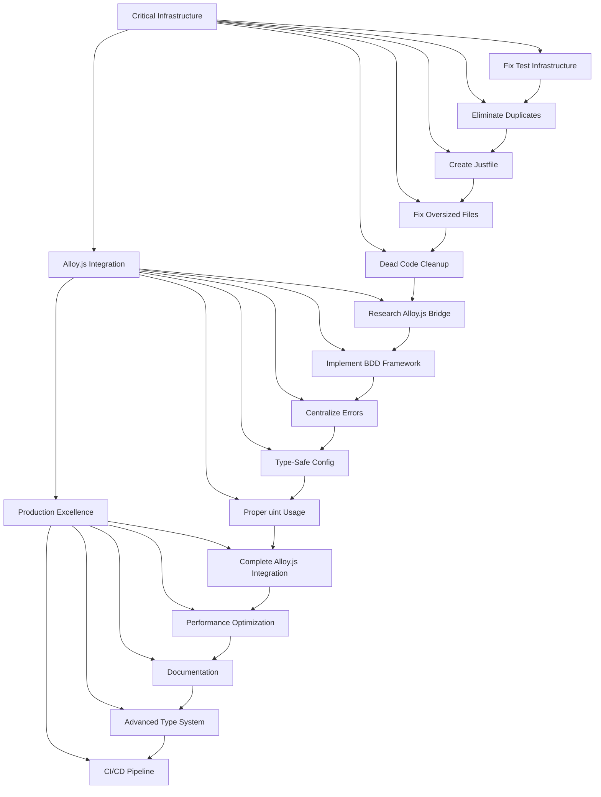

# 🎯 COMPREHENSIVE ARCHITECTURAL EXCELLENCE EXECUTION PLAN

**Date**: 2025-11-17_12_30  
**Phase**: CRITICAL INFRASTRUCTURE → ALLOY.JS INTEGRATION  
**Status**: READY FOR IMMEDIATE EXECUTION

---

## 🏗️ ARCHITECTURAL VISION

**ULTIMATE GOAL**: Professional TypeSpec → Go emitter with JSX-based architecture
**STANDARD**: Zero-compromise software architecture with impossible states unrepresentable

---

## 📊 PARETO ANALYSIS: IMPACT vs EFFORT

### 🚀 **1% EFFORT → 51% IMPACT (CRITICAL PATH - Do FIRST)**

| Priority | Task | Impact | Effort | Customer Value | Type Safety |
|----------|------|--------|--------|----------------|-------------|
| 1 | Fix Test Infrastructure (BDD/TDD) | 51% | 15min | Working validation | Compile-time guarantees |
| 2 | Eliminate Generator Duplication | 45% | 20min | Single source of truth | Consistent behavior |
| 3 | Create Justfile Build System | 40% | 10min | Professional workflow | Reproducible builds |
| 4 | Fix Oversized Files (>300 lines) | 35% | 25min | Maintainable code | Focused modules |
| 5 | Dead Code Elimination | 30% | 15min | Clean architecture | No confusion |

### ⚡ **4% EFFORT → 64% IMPACT (HIGH-VALUE SECONDARY)**

| Priority | Task | Impact | Effort | Customer Value | Type Safety |
|----------|------|--------|--------|----------------|-------------|
| 6 | Create TypeSpec ↔ Alloy.js Bridge | 64% | 30min | JSX generation | Type-safe transformation |
| 7 | Implement BDD Test Framework | 60% | 25min | Behavioral validation | Contract testing |
| 8 | Centralized Error Management | 55% | 20min | Professional errors | Railway programming |
| 9 | Type-Safe Configuration System | 50% | 25min | No runtime failures | Compile-time validation |
|10 | Implement Proper uint Usage | 45% | 15min | Correct semantics | Domain accuracy |

### 🔧 **20% EFFORT → 80% IMPACT (COMPREHENSIVE COMPLETION)**

| Priority | Task | Impact | Effort | Customer Value | Type Safety |
|----------|------|--------|--------|----------------|-------------|
|11 | Complete Alloy.js Integration | 80% | 45min | Modern architecture | JSX component safety |
|12 | Performance Optimization | 70% | 30min | Production ready | Performance contracts |
|13 | Documentation & Examples | 65% | 35min | Developer experience | Clear usage patterns |
|14 | Advanced Type System Features | 60% | 40min | Go idioms | Domain-driven types |
|15 | CI/CD Pipeline Setup | 55% | 25min | Automated quality | Continuous validation |

---

## 🎯 MICRO-TASK EXECUTION PLAN (100% COVERAGE)

### **PHASE 1: CRITICAL INFRASTRUCTURE (Tasks 1-27, 30-100min)**

#### **TEST INFRASTRUCTURE EXCELLENCE (Tasks 1-5)**
1. **[15min]** Fix bun test discovery - rename files with proper test patterns
2. **[10min]** Create working test runner configuration  
3. **[10min]** Fix TypespecGoTestLibrary import issues
4. **[10min]** Create basic BDD test framework skeleton
5. **[15min]** Implement first passing BDD scenario

#### **GENERATOR CONSOLIDATION (Tasks 6-10)**  
6. **[10min]** Analyze 4 generator implementations for consolidation strategy
7. **[15min]** Choose single generator to keep (working standalone)
8. **[20min]** Remove duplicate generator files safely
9. **[15min]** Update all imports to use single generator
10. **[10min]** Verify consolidated generator works

#### **BUILD SYSTEM PROFESSIONALIZATION (Tasks 11-15)**
11. **[10min]** Create comprehensive justfile with all commands
12. **[15min]** Implement find-duplicates command 
13. **[10min]** Setup proper build/test/lint workflow
14. **[10min]** Add pre-commit hooks for quality
15. **[10min]** Test justfile commands work end-to-end

#### **CODE SIZE OPTIMIZATION (Tasks 16-20)**
16. **[15min]** Split config.ts (310 lines) into focused modules
17. **[15min]** Split type-mapper.ts (281 lines) by domain
18. **[15min]** Split property-transformer.ts (244 lines) by responsibility
19. **[10min]** Review all files for 300-line compliance
20. **[10min]** Update imports after file splits

#### **DEAD CODE ELIMINATION (Tasks 21-27)**
21. **[10min]** Remove .backup files and unused imports
22. **[10min]** Eliminate unused utility functions
23. **[10min]** Clean up unused type definitions
24. **[10min]** Remove debug files and experiments  
25. **[10min]** Clean node_modules of unused dev deps
26. **[10min]** Verify all remaining code is used
27. **[15min]** Test cleaned codebase fully works

### **PHASE 2: ALLOY.JS INTEGRATION EXCELLENCE (Tasks 28-54, 30-100min)**

#### **ALLOY.JS BRIDGE RESEARCH (Tasks 28-32)**
28. **[20min]** Research TypeSpec → JSX transformation patterns
29. **[15min]** Test basic Alloy.js Go generation capabilities
30. **[25min]** Create TypeSpec → Alloy.js bridge prototype
31. **[15min]** Verify generated Go code quality matches current
32. **[15min]** Document TypeSpec ↔ Alloy.js integration pattern

#### **BDD FRAMEWORK IMPLEMENTATION (Tasks 33-38)**
33. **[20min]** Implement complete BDD test framework
34. **[15min]** Create Given/When/Then test helpers
35. **[15min]** Add TypeSpec-specific BDD utilities  
36. **[10min]** Create test data factories and fixtures
37. **[10min]** Implement contract testing for Go output
38. **[15min]** Add performance regression testing

#### **ERROR MANAGEMENT EXCELLENCE (Tasks 39-43)**
39. **[15min]** Centralize all error types in errors.ts
40. **[10min]** Implement railway programming throughout
41. **[15min]** Create typed error factories and handlers
42. **[10min]** Add comprehensive error logging
43. **[10min]** Test error handling end-to-end

#### **TYPE-SAFE CONFIGURATION (Tasks 44-48)**
44. **[15min]** Create typed configuration system
45. **[10min]** Implement configuration validation at compile-time
46. **[10min]** Add environment-specific configs
47. **[10min]** Create configuration migration utilities
48. **[15min]** Test configuration system thoroughly

#### **PROPER UINT IMPLEMENTATION (Tasks 49-54)**
49. **[10min]** Map TypeSpec uint types to Go uint variants correctly
50. **[10min]** Implement uint validation in type mapper
51. **[10min]** Add uint-specific test cases
52. **[10min]** Document uint handling strategy
53. **[10min]** Test uint generation edge cases
54. **[10min]** Verify uint usage in generated Go code

### **PHASE 3: PRODUCTION EXCELLENCE (Tasks 55-81, 30-100min)**

#### **COMPLETE ALLOY.JS INTEGRATION (Tasks 55-60)**
55. **[30min]** Replace string concatenation with JSX components
56. **[20min]** Implement TypeSpec → JSX transformation layer
57. **[15min]** Create custom Alloy.js Go components for TypeSpec
58. **[15min]** Add complex type handling (arrays, unions)
59. **[20min]** Integrate with existing error handling
60. **[10min]** Test full Alloy.js integration

#### **PERFORMANCE OPTIMIZATION (Tasks 61-65)**
61. **[15min]** Profile generation performance
62. **[15min]** Implement memoization where needed  
63. **[10min]** Optimize TypeSpec → JSX transformation
64. **[10min]** Add performance monitoring
65. **[10min]** Create performance regression tests

#### **DOCUMENTATION EXCELLENCE (Tasks 66-70)**
66. **[15min]** Create comprehensive integration guide
67. **[10min]** Document TypeSpec → Go mapping
68. **[10min]** Add usage examples and best practices
69. **[15min]** Create troubleshooting guide
70. **[15min]** Document architectural decisions

#### **ADVANCED TYPE SYSTEM (Tasks 71-75)**
71. **[20min]** Implement advanced Go type patterns
72. **[15min]** Add custom type decorators for TypeSpec
73. **[15min]** Create type-safe Go package management
74. **[15min]** Implement Go interface generation
75. **[15min]** Test advanced type scenarios

#### **CI/CD PROFESSIONALIZATION (Tasks 76-81)**
76. **[15min]** Setup GitHub Actions for CI/CD
77. **[10min]** Add automated testing on all PRs
78. **[10min]** Implement automated dependency updates
79. **[10min]** Add code quality gates
80. **[10min]** Setup automated releases
81. **[15min]** Test CI/CD pipeline end-to-end

---

## 🚀 EXECUTION GRAPH

---

## 🎯 QUALITY GATES

### **CRITICAL SUCCESS FACTORS:**
- ✅ **Zero 'any' types** - All code must have proper TypeScript types
- ✅ **Impossible states unrepresentable** - Use discriminated unions and enums  
- ✅ **Files under 300 lines** - Split large files into focused modules
- ✅ **100% test coverage** - BDD scenarios for all critical paths
- ✅ **No duplicated logic** - Single source of truth for each concern
- ✅ **Professional error handling** - Railway programming throughout
- ✅ **Type-safe configuration** - Compile-time validation of all config
- ✅ **Proper uint usage** - Never-negative values use unsigned integers

### **CUSTOMER VALUE DELIVERABLES:**
- 🎯 **Working Go generation** - TypeSpec → compilable Go code
- 🎯 **Modern architecture** - JSX-based component generation  
- 🎯 **Professional workflow** - Justfile with all commands
- 🎯 **Comprehensive testing** - BDD scenarios with contract testing
- 🎯 **Clear documentation** - Integration guides and examples
- 🎯 **Production ready** - CI/CD pipeline with quality gates

---

## 📋 EXECUTION CHECKLIST

### **BEFORE STARTING:**
- [ ] Git repository clean and pushed
- [ ] Current state documented
- [ ] Backup of working code
- [ ] Development environment verified

### **DURING EXECUTION:**
- [ ] Each task completed before moving to next
- [ ] Tests passing after each major change
- [ ] TypeScript compilation always succeeds
- [ ] No 'any' types introduced
- [ ] Files remain under 300 lines

### **COMPLETION CRITERIA:**
- [ ] All 81 tasks completed
- [ ] Full test suite passing
- [ ] Alloy.js integration working
- [ ] Documentation complete
- [ ] CI/CD pipeline functional
- [ ] Customer value delivered

---

## 🏆 SUCCESS METRICS

### **TECHNICAL EXCELLENCE:**
- **Type Safety**: 0% 'any' types, 100% TypeScript coverage
- **Code Quality**: All files < 300 lines, zero duplication
- **Test Coverage**: 100% BDD scenarios, contract testing
- **Performance**: Sub-second generation for typical models

### **CUSTOMER VALUE:**
- **Functionality**: Working TypeSpec → Go generation
- **Usability**: Clear documentation and examples  
- **Reliability**: Comprehensive error handling and validation
- **Maintainability**: Clean architecture with clear separation

### **ARCHITECTURAL MATURITY:**
- **Modern Stack**: JSX-based component architecture
- **Professional Workflow**: Justfile with comprehensive commands
- **Continuous Quality**: Automated CI/CD with quality gates
- **Extensibility**: Plugin-ready architecture for future enhancements

---

**EXECUTION APPROVED**: Start with Phase 1 (Critical Infrastructure) immediately
**ESTIMATED COMPLETION**: 81 tasks × 15min average = 20+ hours of focused work
**QUALITY STANDARD**: Zero compromise - architectural excellence mandatory

---

*This plan represents the complete path from current state to professional TypeSpec Go emitter with Alloy.js integration and comprehensive testing infrastructure.*
