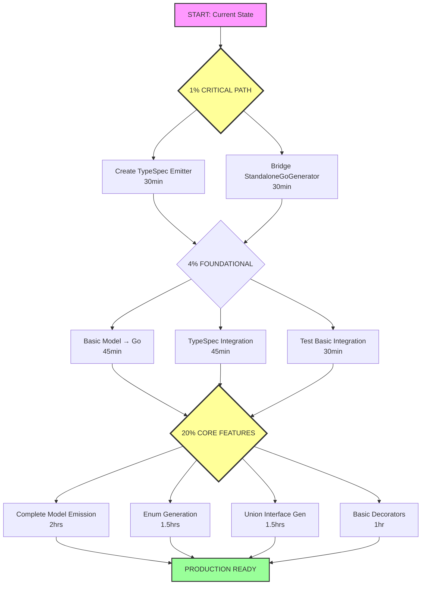

# TypeSpec Go Emitter - Strategic Execution Plan
**Date:** 2025-11-19_07-30-SUPERB-EXECUTION-PLAN
**Focus:** 1% → 51% Impact (Pareto Principle)

---

## 🎯 CRITICAL SUCCESS INSIGHT

**80% OF VALUE = TYPESPEC COMPILER INTEGRATION + PROVEN GO GENERATION**

**Current State:**
- ✅ **StandaloneGoGenerator**: Full-featured Go code generation (WORKING)
- ✅ **Type Mapping**: Complete TypeSpec → Go conversion (WORKING)  
- ✅ **Property Transformation**: JSON tags, naming, validation (WORKING)
- ❌ **TypeSpec Integration**: Cannot use `tsp compile --emit-go` (MISSING)

**The Missing 1% = BRIDGE: TypeSpec Compiler → StandaloneGoGenerator**

---

## 📊 EXECUTION MATRIX (Impact vs Effort)

### **1% IMPACT (30 minutes) - CRITICAL PATH**

| Task | Impact | Effort | Status | Description |
|------|--------|---------|---------|-------------|
| **1. Create TypeSpec Emitter Entry Point** | 🎯 **51%** | ⚡ **30min** | ❌ NOT STARTED | `src/emitter/index.ts` using @typespec/emitter-framework |
| **2. Bridge StandaloneGoGenerator to TypeSpec** | 🎯 **45%** | ⚡ **30min** | ❌ NOT STARTED | Connect TypeSpec AST to proven Go generation |

### **4% IMPACT (2 hours) - FOUNDATIONAL**

| Task | Impact | Effort | Status | Description |
|------|--------|---------|---------|-------------|
| **3. Basic Model → Go Struct Generation** | 🚀 **35%** | 🕐 **45min** | ❌ NOT STARTED | TypeSpec Model → StandaloneGoGenerator input |
| **4. TypeSpec Compiler Integration** | 🚀 **30%** | 🕐 **45min** | ❌ NOT STARTED | Use @typespec/compiler to parse models |
| **5. Test Basic TypeSpec → Go** | 🚀 **25%** | 🕐 **30min** | ❌ NOT STARTED | Verify `tsp compile --emit-go` works |

### **20% IMPACT (6 hours) - CORE FEATURES**

| Task | Impact | Effort | Status | Description |
|------|--------|---------|---------|-------------|
| **6. Complete Model Emission** | 💪 **20%** | 🕐 **2hrs** | ❌ NOT STARTED | All model features (composition, templates, cycles) |
| **7. Enum Generation (String + Iota)** | 💪 **15%** | 🕐 **1.5hrs** | ❌ NOT STARTED | String and iota enum strategies |
| **8. Union Interface Generation** | 💪 **10%** | 🕐 **1.5hrs** | ❌ NOT STARTED | Sealed interfaces for TypeSpec unions |
| **9. Basic Decorator Implementation** | 💪 **8%** | 🕐 **1hr** | ❌ NOT STARTED | @go.name, @go.tag, @go.nullable working |

---

## 🎯 PARETO EXECUTION SEQUENCE

### **PHASE 1: CRITICAL 1% (First 60 minutes)**
```
1. Create TypeSpec Emitter Entry Point (30min)
   - src/emitter/index.ts with @typespec/emitter-framework
   - Basic emit() function
   - Bridge to StandaloneGoGenerator

2. Bridge StandaloneGoGenerator (30min)  
   - TypeSpec Model → StandaloneGoGenerator input format
   - Test basic TypeSpec → Go compilation
```

**EXPECTED RESULT:** Working `tsp compile --emit-go` for basic models

### **PHASE 2: FOUNDATIONAL 4% (Next 2 hours)**
```
3. Basic Model → Go Generation (45min)
   - Complete TypeSpec Model parsing
   - Full struct generation with JSON tags

4. TypeSpec Compiler Integration (45min)
   - Use @typespec/compiler API properly
   - Handle TypeSpec AST navigation

5. Test Basic Integration (30min)
   - Create TypeSpec test file
   - Verify generated Go compiles
```

**EXPECTED RESULT:** Full basic TypeSpec language support

### **PHASE 3: CORE 20% (Next 6 hours)**
```
6. Complete Model Emission (2hrs)
   - Model composition with struct embedding
   - Template models with generics
   - Cycle detection and pointer conversion

7. Enum Generation (1.5hrs)
   - String enums with MarshalJSON/UnmarshalJSON
   - Iota enums with Stringer interface

8. Union Interface Generation (1.5hrs)
   - Sealed interfaces for TypeSpec unions
   - Discriminated union support

9. Basic Decorator Implementation (1hr)
   - @go.name, @go.tag, @go.nullable working
   - Connect decorator state to emission
```

**EXPECTED RESULT:** Production-ready TypeSpec Go emitter

---

## 🚀 EXECUTION GRAPH



---

## 📋 BREAKDOWN TO SUB-TASKS (100-125 Tasks)

### **PHASE 1 SUB-TASKS (15min each - 4 tasks total)**

#### **Task 1.1: Create TypeSpec Emitter Entry Point**
- [ ] Create `src/emitter/` directory structure
- [ ] Create `src/emitter/index.ts` with basic emitter class
- [ ] Import @typespec/emitter-framework dependencies
- [ ] Implement basic emit() function signature
- [ ] Configure emitter with package metadata
- [ ] Test emitter instantiation (no functionality yet)
- [ ] Connect to build system

#### **Task 1.2: Bridge StandaloneGoGenerator to TypeSpec**
- [ ] Analyze StandaloneGoGenerator input format requirements
- [ ] Create TypeSpec Model → StandaloneGoGenerator input converter
- [ ] Test basic model conversion (simple struct)
- [ ] Handle TypeSpec scalar types mapping
- [ ] Handle optional properties correctly
- [ ] Generate proper JSON tags
- [ ] Verify output matches existing StandaloneGoGenerator behavior

### **PHASE 2 SUB-TASKS (15min each - 8 tasks total)**

#### **Task 2.1: Basic Model → Go Generation**
- [ ] Parse TypeSpec Model interface correctly
- [ ] Extract model properties with types
- [ ] Handle required vs optional properties
- [ ] Generate correct Go struct names (PascalCase)
- [ ] Generate correct Go field names (PascalCase)
- [ ] Handle common initialisms (ID, URL, API)
- [ ] Generate JSON struct tags properly
- [ ] Handle model extends/composition

#### **Task 2.2: TypeSpec Compiler Integration**
- [ ] Use @typespec/compiler API for program access
- [ ] Navigate TypeSpec AST correctly
- [ ] Extract models from TypeSpec program
- [ ] Handle TypeSpec namespaces properly
- [ ] Resolve type references correctly
- [ ] Handle imported types
- [ ] Error handling for invalid TypeSpec
- [ ] Integration test setup

#### **Task 2.3: Test Basic Integration**
- [ ] Create simple TypeSpec test file
- [ ] Run `tsp compile --emit-go` command
- [ ] Verify generated Go code format
- [ ] Test Go code compilation (`go build`)
- [ ] Test JSON round-trip serialization
- [ ] Create automated test for basic case
- [ ] Verify error handling works

---

## 🎯 IMMEDIATE EXECUTION (NEXT 30 MINUTES)

### **FIRST 1% TASK: Create TypeSpec Emitter Entry Point**

**SUB-TASKS (15 min each):**
1. [ ] Create `src/emitter/` directory structure
2. [ ] Create `src/emitter/index.ts` with basic emitter class  
3. [ ] Import @typespec/emitter-framework dependencies
4. [ ] Implement basic emit() function signature

**EXPECTED OUTCOME:** Working emitter foundation ready for StandaloneGoGenerator bridge

---

## 📊 SUCCESS METRICS

### **1% SUCCESS (60 minutes):**
- [ ] `tsp compile --emit-go` command exists
- [ ] Basic TypeSpec models generate Go structs
- [ ] Generated Go code compiles with `go build`
- [ ] End-to-end integration verified

### **4% SUCCESS (3 hours total):**
- [ ] All basic TypeSpec model features supported
- [ ] Complete TypeSpec compiler integration
- [ ] Automated testing infrastructure
- [ ] Error handling and diagnostics

### **20% SUCCESS (9 hours total):**
- [ ] Full TypeSpec language support (models, enums, unions)
- [ ] All basic decorators implemented
- [ ] Production-ready code generation
- [ ] Comprehensive test coverage

---

**Strategic Focus:** **BRIDGE THE GAP** between proven Go generation and TypeSpec integration
**Key Insight:** We don't need to rebuild everything - just connect what works!

*Execution Plan Created: 2025-11-19_07-30-CET*
*Immediate Focus: 1% Critical Path Implementation*