# 🎯 **COMPREHENSIVE EXECUTION PLAN - TypeSpec Go Emitter**

**Date**: 2025-11-19  
**Time**: 23:44 CET  
**Project**: TypeSpec AsyncAPI Go Emitter  
**Mission**: CRITICAL TEST API MISMATCH RESOLUTION & FULL SYSTEM ACTIVATION

---

## 🚨 **EXECUTIVE SUMMARY**

### **SINGLE CRITICAL ISSUE IDENTIFIED**
**ROOT CAUSE**: Test API mismatch - tests expect `string` return from `generateModel()`, but receive `GoEmitterResult` discriminated union.

**IMPACT**: 100% test failure blocking entire project verification and deployment.

**SOLUTION**: Systematic test suite modernization to handle professional error system correctly.

---

## 📊 **PARETO ANALYSIS**

### **1% Delivering 51% of Results (40min)**
| Priority | Task | Impact | Effort | Status |
|----------|------|---------|--------|--------|
| 1️⃣ | Fix test API usage for `GoEmitterResult` | 🔥 CRITICAL | 10min | 🚨 BLOCKED |
| 2️⃣ | Verify Go generation end-to-end | 🔥 CRITICAL | 15min | 🚨 BLOCKED |
| 3️⃣ | Create working API example | 🔥 HIGH | 15min | 🚨 BLOCKED |

### **4% Delivering 64% of Results (115min)**  
| Priority | Task | Impact | Effort | Status |
|----------|------|---------|--------|--------|
| 4️⃣ | Fix complete test suite API usage | 🔥 CRITICAL | 30min | 🚨 BLOCKED |
| 5️⃣ | Add end-to-end integration tests | 🔥 HIGH | 20min | 🚨 BLOCKED |
| 6️⃣ | Create comprehensive API documentation | 🔥 HIGH | 25min | 🚨 BLOCKED |
| 7️⃣ | Add error handling examples | 🔥 MEDIUM | 20min | 🚨 BLOCKED |
| 8️⃣ | Establish performance baseline | 🔥 MEDIUM | 15min | 🚨 BLOCKED |
| 9️⃣ | Integrate CI/CD automated testing | 🔥 MEDIUM | 15min | 🚨 BLOCKED |

---

## 🎯 **COMPREHENSIVE TASK BREAKDOWN (27 Tasks - 30-100min each)**

### **PHASE 1: CRITICAL RESCUE (Tasks 1-9) - 135min Total**

#### **IMMEDIATE CRITICAL PATH (Next 45min)**
| Task ID | Task Description | Impact | Effort | Dependencies |
|---------|------------------|---------|--------|--------------|
| **1.1** | **Fix standalone-generator.test.ts API usage** - Update all tests to handle `GoEmitterResult` with discriminated union pattern | 🔥 CRITICAL | 10min | ✅ READY |
| **1.2** | **Fix bdd-framework.test.ts API usage** - Update BDD framework tests for `GoEmitterResult` | 🔥 HIGH | 10min | Task 1.1 |
| **1.3** | **Fix manual-basic-test.ts API usage** - Update manual tests for new API | 🔥 HIGH | 5min | Task 1.2 |
| **1.4** | **Create working API example file** - Demonstrate correct `GoEmitterResult` handling | 🔥 HIGH | 10min | Task 1.3 |
| **1.5** | **Verify Go generation output quality** - Ensure generated Go code is correct | 🔥 CRITICAL | 15min | Task 1.4 |

#### **SYSTEM STABILIZATION (Next 90min)**
| Task ID | Task Description | Impact | Effort | Dependencies |
|---------|------------------|---------|--------|--------------|
| **1.6** | **Complete test suite modernization** - Fix all remaining test files | 🔥 CRITICAL | 30min | Task 1.5 |
| **1.7** | **Add integration test suite** - End-to-end workflow verification | 🔥 HIGH | 20min | Task 1.6 |
| **1.8** | **Create API documentation** - Clear usage examples and patterns | 🔥 HIGH | 25min | Task 1.7 |
| **1.9** | **Establish performance baseline** - Measure generation speed/quality | 🔥 MEDIUM | 15min | Task 1.8 |

### **PHASE 2: PROFESSIONAL EXCELLENCE (Tasks 10-18) - 180min Total**

#### **DOCUMENTATION & EXAMPLES (60min)**
| Task ID | Task Description | Impact | Effort | Dependencies |
|---------|------------------|---------|--------|--------------|
| **2.10** | **Create error handling examples** - Railway programming patterns | 🔥 MEDIUM | 20min | Task 1.9 |
| **2.11** | **Write TypeSpec to Go mapping guide** - Comprehensive type conversion docs | 🔥 MEDIUM | 15min | Task 2.10 |
| **2.12** | **Create quick start tutorial** - 5-minute getting started guide | 🔥 MEDIUM | 15min | Task 2.11 |
| **2.13** | **Document advanced features** - Unsigned integers, optional handling, etc. | 🔥 LOW | 10min | Task 2.12 |

#### **QUALITY & PERFORMANCE (120min)**
| Task ID | Task Description | Impact | Effort | Dependencies |
|---------|------------------|---------|--------|--------------|
| **2.14** | **Add comprehensive error case tests** - Invalid inputs, edge cases | 🔥 HIGH | 25min | Task 2.13 |
| **2.15** | **Performance optimization** - Generation speed improvements | 🔥 MEDIUM | 20min | Task 2.14 |
| **2.16** | **Memory usage validation** - Large model generation testing | 🔥 MEDIUM | 20min | Task 2.15 |
| **2.17** | **Type safety verification** - Ensure 100% type coverage | 🔥 HIGH | 30min | Task 2.16 |
| **2.18** | **Code quality review** - Professional standards compliance | 🔥 MEDIUM | 25min | Task 2.17 |

### **PHASE 3: PRODUCTION READINESS (Tasks 19-27) - 200min Total**

#### **AUTOMATION & CI/CD (80min)**
| Task ID | Task Description | Impact | Effort | Dependencies |
|---------|------------------|---------|--------|--------------|
| **3.19** | **Set up automated testing pipeline** - CI/CD integration | 🔥 MEDIUM | 15min | Task 2.18 |
| **3.20** | **Add automated performance monitoring** - Generation speed tracking | 🔥 LOW | 15min | Task 3.19 |
| **3.21** | **Configure automated quality gates** - Linting, type checking, etc. | 🔥 MEDIUM | 20min | Task 3.20 |
| **3.22** | **Set up automated documentation generation** - API docs updates | 🔥 LOW | 15min | Task 3.21 |
| **3.23** | **Create deployment verification** - Production readiness checks | 🔥 HIGH | 15min | Task 3.22 |

#### **ADVANCED FEATURES (120min)**
| Task ID | Task Description | Impact | Effort | Dependencies |
|---------|------------------|---------|--------|--------------|
| **3.24** | **Enhanced error messages** - User-friendly error guidance | 🔥 MEDIUM | 25min | Task 3.23 |
| **3.25** | **Add Go module support** - Go.mod file generation | 🔥 HIGH | 30min | Task 3.24 |
| **3.26** | **Validation tags generation** - Go struct validation tags | 🔥 MEDIUM | 25min | Task 3.25 |
| **3.27** | **Custom template system** - User-defined Go code templates | 🔥 LOW | 40min | Task 3.26 |

---

## 🚀 **DETAILED EXECUTION GRAPH**

```mermaid
graph TD
    A[START: Critical Test API Mismatch] --> B[Task 1.1: Fix standalone-generator.test.ts]
    B --> C[Task 1.2: Fix bdd-framework.test.ts]
    C --> D[Task 1.3: Fix manual-basic-test.ts]
    D --> E[Task 1.4: Create working API example]
    E --> F[Task 1.5: Verify Go generation quality]
    F --> G[Task 1.6: Complete test suite modernization]
    G --> H[Task 1.7: Add integration tests]
    H --> I[Task 1.8: Create API documentation]
    I --> J[Task 1.9: Performance baseline]
    J --> K[CRITICAL PATH COMPLETE: 51% Value Delivered]
    
    K --> L[Task 2.10: Error handling examples]
    L --> M[Task 2.11: TypeSpec mapping guide]
    M --> N[Task 2.12: Quick start tutorial]
    N --> O[Task 2.13: Advanced features docs]
    O --> P[Task 2.14: Comprehensive error tests]
    P --> Q[Task 2.15: Performance optimization]
    Q --> R[Task 2.16: Memory usage validation]
    R --> S[Task 2.17: Type safety verification]
    S --> T[Task 2.18: Code quality review]
    T --> U[PHASE 2 COMPLETE: 64% Value Delivered]
    
    U --> V[Task 3.19: Automated testing pipeline]
    V --> W[Task 3.20: Performance monitoring]
    W --> X[Task 3.21: Quality gates]
    X --> Y[Task 3.22: Documentation generation]
    Y --> Z[Task 3.23: Deployment verification]
    Z --> AA[Task 3.24: Enhanced error messages]
    AA --> BB[Task 3.25: Go module support]
    BB --> CC[Task 3.26: Validation tags]
    CC --> DD[Task 3.27: Custom templates]
    DD --> EE[COMPLETE: 100% Professional Excellence]
    
    style A fill:#ff6b6b
    style K fill:#4ecdc4
    style U fill:#45b7d1
    style EE fill:#96ceb4
```

---

## 🔥 **IMMEDIATE EXECUTION STRATEGY**

### **FIRST 45 MINUTES - CRITICAL RESCUE**
1. **Task 1.1** (10min): Fix standalone-generator.test.ts to handle `GoEmitterResult`
2. **Task 1.2** (10min): Fix bdd-framework.test.ts for new API  
3. **Task 1.3** (5min): Fix manual-basic-test.ts
4. **Task 1.4** (10min): Create working example
5. **Task 1.5** (15min): Verify Go generation quality

### **EXECUTION MANDATE**
- **ZERO COMPROMISE** on quality or professional standards
- **IMMEDIATE TEST RECOVERY** - All tests must pass within 45min
- **PROFESSIONAL PATTERNS** - Maintain discriminated union error handling
- **TYPE SAFETY** - Zero compromises on TypeScript strict mode
- **DOCUMENTATION** - Every change documented with examples

---

## 🎯 **SUCCESS CRITERIA**

### **IMMEDIATE SUCCESS (45min)**
- ✅ All tests passing with `GoEmitterResult` API
- ✅ Working example demonstrates correct usage
- ✅ Generated Go code verified and correct
- ✅ Professional error handling maintained

### **PHASE COMPLETION SUCCESS (Full Plan)**
- ✅ 100% test coverage with professional patterns
- ✅ Comprehensive documentation and examples
- ✅ Production-ready CI/CD pipeline
- ✅ Performance benchmarks established
- ✅ Type safety excellence maintained

---

## 🚨 **CRITICAL EXECUTION MANDATES**

### **NON-NEGOTIABLE REQUIREMENTS**
1. **NEVER BREAK ARCHITECTURE** - Maintain professional unified error system
2. **NEVER COMPROMISE TYPE SAFETY** - Zero `any` types, strict mode compliance
3. **NEVER INTRODUCE TECHNICAL DEBT** - Professional patterns only
4. **ALWAYS DOCUMENT CHANGES** - Clear examples and usage patterns
5. **ALWAYS VERIFY QUALITY** - Test, build, lint at every step

### **EXECUTION PRINCIPLES**
- **SYSTEMATIC APPROACH** - Follow task dependencies precisely
- **IMMEDIATE VERIFICATION** - Test after each change
- **PROFESSIONAL STANDARDS** - Industry-leading TypeScript patterns
- **CUSTOMER VALUE** - Real working Go code generation
- **LONG-TERM THINKING** - Extensible, maintainable architecture

---

## 🎯 **IMMEDIATE NEXT STEP**

**EXECUTE TASK 1.1**: Fix standalone-generator.test.ts to handle `GoEmitterResult` correctly with discriminated union patterns.

**STATUS**: 🚨 **READY FOR IMMEDIATE EXECUTION**

**MISSION**: Transform the project from test-failure state to professional excellence within 45 minutes.

---

## 🎯 **COMMITMENT TO EXCELLENCE**

This plan represents the **definitive path** from critical blocker to professional excellence. 

**PROMISE**: Execute systematically, maintain professional standards, and deliver a production-ready TypeSpec Go emitter that the community can rely on.

**SUCCESS**: Complete transformation from test failures to professional excellence with zero compromises on quality or architectural integrity.

---

**Status**: 🚀 **READY FOR SYSTEMATIC EXECUTION**  
**Timeline**: 45min for 51% value, Full plan completion available  
**Quality**: Professional excellence with zero compromise  
**Architecture**: Industry-leading TypeScript patterns maintained

---