# 🎯 **COMPREHENSIVE PROJECT RESCUE & EXCELLENCE PLAN**

**Date:** 2025-11-20  
**Time:** 02:04 CET  
**Status:** **CRITICAL RESCUE PHASE - PRODUCTION EXCELLENCE TARGET**
**Duration:** 27 tasks (100min to 30min each)
**Impact:** 1% → 51% → 64% → 80% systematic excellence

---

## 🏆 **STRATEGIC EXECUTION MANDATE**

> **SENIOR SOFTWARE ARCHITECT EXCELLENCE STANDARDS**  
> **ZERO COMPROMISE ON TYPE SAFETY, ARCHITECTURE, OR PROFESSIONAL STANDARDS**

### **🎯 CORE PRINCIPLES**

- **IMPOSSIBLE STATES UNREPRESENTABLE** through STRONG TYPES
- **PROPERLY COMPOSED ARCHITECTURE** with clean interfaces
- **GENERICS & DOMAIN TYPES** for sophisticated, smart systems
- **ENUMS OVER BOOLEANS** for semantic clarity
- **UINTS FOR NEVER-NEGATIVE VALUES** (age, port, timestamp)
- **ZERO SPLIT BRAINS** - unified domain logic
- **<350 LINE FILES** - focused, maintainable modules
- **CENTRALIZED ERRORS** with professional adapters
- **EXTERNAL TOOLS WRAPPED** - proper abstraction layers
- **BDD/TDD DRIVEN** - comprehensive testing coverage

---

## 📊 **PARETO-PHASE EXECUTION PLAN**

### **🔥 PHASE 1: CRITICAL 1% → 51% IMPACT (Tasks 1-8)**

**IMMEDIATE CRISIS RESOLUTION - BUILD SYSTEM RECOVERY**

| ID  | Task                                            | Duration | Impact      | Priority  | Dependencies |
| --- | ----------------------------------------------- | -------- | ----------- | --------- | ------------ |
| 1.1 | Fix Test Import Paths (standalone-generator.js) | 30min    | 🔥 CRITICAL | IMMEDIATE | None         |
| 1.2 | Fix Template Literal Syntax Errors              | 30min    | 🔥 CRITICAL | IMMEDIATE | None         |
| 1.3 | Add Missing Test Imports (beforeEach)           | 30min    | 🔥 CRITICAL | IMMEDIATE | None         |
| 1.4 | Fix TypeSpec Integration (program.state null)   | 45min    | 🔥 CRITICAL | IMMEDIATE | None         |
| 1.5 | Verify All Tests Pass                           | 30min    | 🔥 CRITICAL | IMMEDIATE | 1.1-1.4      |
| 1.6 | Fix ESLint Configuration Issues                 | 30min    | 🔥 CRITICAL | IMMEDIATE | None         |
| 1.7 | Validate Build System Integrity                 | 30min    | 🔥 CRITICAL | IMMEDIATE | 1.6          |
| 1.8 | Create Build Verification Protocol              | 45min    | 🔥 CRITICAL | IMMEDIATE | 1.7          |

### **⚡ PHASE 2: HIGH VALUE 4% → 64% IMPACT (Tasks 9-16)**

**ARCHITECTURAL DEBT ELIMINATION - CODE QUALITY EXCELLENCE**

| ID  | Task                                                   | Duration | Impact  | Priority | Dependencies |
| --- | ------------------------------------------------------ | -------- | ------- | -------- | ------------ |
| 2.1 | Split performance-test-suite.test.ts (605→<100 lines)  | 60min    | ⚡ HIGH | HIGH     | 1.8          |
| 2.2 | Split memory-validation.test.ts (515→<100 lines)       | 60min    | ⚡ HIGH | HIGH     | 1.8          |
| 2.3 | Split unified-errors.ts (437→<100 lines)               | 60min    | ⚡ HIGH | HIGH     | 1.8          |
| 2.4 | Split integration-basic.test.ts (421→<100 lines)       | 60min    | ⚡ HIGH | HIGH     | 1.8          |
| 2.5 | Split emitter/index.ts (363→<100 lines)                | 60min    | ⚡ HIGH | HIGH     | 1.8          |
| 2.6 | Split performance-baseline.test.ts (336→<100 lines)    | 60min    | ⚡ HIGH | HIGH     | 1.8          |
| 2.7 | Split large-model-performance.test.ts (325→<100 lines) | 60min    | ⚡ HIGH | HIGH     | 1.8          |
| 2.8 | Consolidate Duplicate Generator Classes                | 60min    | ⚡ HIGH | HIGH     | 2.1-2.7      |

### **🚀 PHASE 3: PROFESSIONAL EXCELLENCE 20% → 80% IMPACT (Tasks 17-27)**

**ADVANCED ARCHITECTURE - DOMAIN-DRIVEN EXCELLENCE**

| ID   | Task                                               | Duration | Impact    | Priority | Dependencies |
| ---- | -------------------------------------------------- | -------- | --------- | -------- | ------------ |
| 3.1  | Create Unified Type Mapper System                  | 60min    | 🚀 MEDIUM | HIGH     | 2.8          |
| 3.2  | Replace Booleans with Semantic Enums               | 45min    | 🚀 MEDIUM | HIGH     | 3.1          |
| 3.3  | Implement Proper uint Usage (age, port, timestamp) | 45min    | 🚀 MEDIUM | HIGH     | 3.2          |
| 3.4  | Create Centralized Error Package                   | 60min    | 🚀 MEDIUM | HIGH     | 3.3          |
| 3.5  | Wrap External APIs with Adapters                   | 60min    | 🚀 MEDIUM | MEDIUM   | 3.4          |
| 3.6  | Implement Generic Error Factory                    | 45min    | 🚀 MEDIUM | MEDIUM   | 3.5          |
| 3.7  | Comprehensive BDD Test Implementation              | 60min    | 🚀 MEDIUM | MEDIUM   | 3.6          |
| 3.8  | TDD Implementation for Core Modules                | 60min    | 🚀 MEDIUM | MEDIUM   | 3.7          |
| 3.9  | Advanced Type Safety (Generics, Branding)          | 45min    | 🚀 MEDIUM | MEDIUM   | 3.8          |
| 3.10 | Complete Documentation Suite                       | 60min    | 🚀 MEDIUM | LOW      | 3.9          |
| 3.11 | Final Architecture Review & Optimization           | 60min    | 🚀 MEDIUM | LOW      | 3.10         |

---

## 🏗️ **DETAILED TASK BREAKDOWN (125 TASKS - 15min each)**

### **PHASE 1: CRITICAL RESCUE (Tasks 1.1-1.40) - IMMEDIATE**

#### **1.1: Fix Test Import Paths (4 subtasks)**

- 1.1.1: Analyze import path patterns in failing tests (15min)
- 1.1.2: Fix standalone-generator.js imports in performance-test-suite (15min)
- 1.1.3: Fix standalone-generator.js imports in memory-validation (15min)
- 1.1.4: Fix standalone-generator.js imports in performance-baseline (15min)

#### **1.2: Fix Syntax Errors (3 subtasks)**

- 1.2.1: Fix template literal nesting in large-model-performance (15min)
- 1.2.2: Validate JavaScript syntax correctness (15min)
- 1.2.3: Test syntax fixes work correctly (15min)

#### **1.3: Add Missing Imports (2 subtasks)**

- 1.3.1: Add beforeEach import to integration-basic.test.ts (15min)
- 1.3.2: Verify all test framework imports present (15min)

#### **1.4: TypeSpec Integration Fix (6 subtasks)**

- 1.4.1: Analyze TypeSpec program.state null error (15min)
- 1.4.2: Research proper TypeSpec compiler API usage (15min)
- 1.4.3: Fix TypeSpec program initialization (15min)
- 1.4.4: Implement proper error handling for TypeSpec (15min)
- 1.4.5: Test TypeSpec integration end-to-end (15min)
- 1.4.6: Validate TypeSpec model extraction (15min)

#### **1.5: Test Verification (3 subtasks)**

- 1.5.1: Run full test suite and verify pass rate (15min)
- 1.5.2: Analyze any remaining test failures (15min)
- 1.5.3: Document test status and remaining issues (15min)

#### **1.6: ESLint Configuration (4 subtasks)**

- 1.6.1: Analyze ESLint 9.39.1 ResolveMessage error (15min)
- 1.6.2: Research proper ESLint 9.x configuration (15min)
- 1.6.3: Update ESLint configuration for compatibility (15min)
- 1.6.4: Test ESLint runs without errors (15min)

#### **1.7: Build Validation (3 subtasks)**

- 1.7.1: Run comprehensive build verification (15min)
- 1.7.2: Validate TypeScript compilation output (15min)
- 1.7.3: Check build artifacts correctness (15min)

#### **1.8: Build Protocol (3 subtasks)**

- 1.8.1: Design build verification checklist (15min)
- 1.8.2: Create automated build validation script (15min)
- 1.8.3: Document build standards and protocols (15min)

### **PHASE 2: ARCHITECTURAL EXCELLENCE (Tasks 2.1-2.56) - HIGH VALUE**

#### **2.1-2.7: File Splitting (42 subtasks total - 6 per file)**

For each large file (performance-test-suite, memory-validation, unified-errors, integration-basic, emitter/index, performance-baseline, large-model-performance):

- Subtask 1: Analyze file structure and responsibilities (15min)
- Subtask 2: Identify natural splitting points (15min)
- Subtask 3: Extract core logic to focused modules (15min)
- Subtask 4: Create utility modules for shared code (15min)
- Subtask 5: Update imports and dependencies (15min)
- Subtask 6: Test split functionality works correctly (15min)

#### **2.8: Generator Consolidation (8 subtasks)**

- 2.8.1: Identify all generator classes across codebase (15min)
- 2.8.2: Analyze generator functionality overlaps (15min)
- 2.8.3: Design unified generator architecture (15min)
- 2.8.4: Create base generator interface/abstract class (15min)
- 2.8.5: Consolidate duplicate generator logic (15min)
- 2.8.6: Update all generator usages (15min)
- 2.8.7: Remove duplicate generator files (15min)
- 2.8.8: Test consolidated generator system (15min)

### **PHASE 3: ADVANCED ARCHITECTURE (Tasks 3.1-3.67) - PROFESSIONAL EXCELLENCE**

#### **3.1: Unified Type Mapper (8 subtasks)**

- 3.1.1: Analyze existing type mapping logic (15min)
- 3.1.2: Design unified type mapper interface (15min)
- 3.1.3: Create core type mapping engine (15min)
- 3.1.4: Implement TypeSpec to Go type mappings (15min)
- 3.1.5: Add domain intelligence (uint8 for age, etc.) (15min)
- 3.1.6: Create type mapper utilities (15min)
- 3.1.7: Update all type mapper usages (15min)
- 3.1.8: Test unified type mapper system (15min)

#### **3.2: Boolean to Enum Replacement (6 subtasks)**

- 3.2.1: Identify all boolean flags in codebase (15min)
- 3.2.2: Design semantic enums (GenerationMode, OptionalHandling, ImportRequirement) (15min)
- 3.2.3: Replace generate-package boolean with GenerationMode enum (15min)
- 3.2.4: Replace optional boolean with OptionalHandling enum (15min)
- 3.2.5: Replace requiresImport boolean with ImportRequirement enum (15min)
- 3.2.6: Update all enum usages and test (15min)

#### **3.3: Proper uint Implementation (6 subtasks)**

- 3.3.1: Identify never-negative values in domain (age, port, timestamp) (15min)
- 3.3.2: Design uint type system with proper validation (15min)
- 3.3.3: Implement uint8 for age fields (15min)
- 3.3.4: Implement uint16 for port numbers (15min)
- 3.3.5: Implement uint32 for timestamps/durations (15min)
- 3.3.6: Test uint implementation and validation (15min)

#### **3.4: Centralized Error Package (8 subtasks)**

- 3.4.1: Analyze current error handling across codebase (15min)
- 3.4.2: Design centralized error package architecture (15min)
- 3.4.3: Create error domain types and factories (15min)
- 3.4.4: Implement error adapters for external systems (15min)
- 3.4.5: Create error wrapping and transformation utilities (15min)
- 3.4.6: Update all error handling to use centralized package (15min)
- 3.4.7: Implement proper error ID generation and tracking (15min)
- 3.4.8: Test centralized error system (15min)

#### **3.5: External API Wrappers (8 subtasks)**

- 3.5.1: Identify all external API usages (TypeSpec, Node.js, etc.) (15min)
- 3.5.2: Design adapter pattern for external APIs (15min)
- 3.5.3: Create TypeSpec compiler API adapter (15min)
- 3.5.4: Create file system API adapter (15min)
- 3.5.5: Create logging system adapter (15min)
- 3.5.6: Update all external API usages to use adapters (15min)
- 3.5.7: Implement proper error handling for adapters (15min)
- 3.5.8: Test external API adapters (15min)

#### **3.6: Generic Error Factory (6 subtasks)**

- 3.6.1: Design generic error factory with type parameters (15min)
- 3.6.2: Implement type-safe error factory patterns (15min)
- 3.6.3: Create complex nested object handling (15min)
- 3.6.4: Implement property omission utilities (15min)
- 3.6.5: Add discriminated union support (15min)
- 3.6.6: Test generic error factory (15min)

#### **3.7: BDD Implementation (8 subtasks)**

- 3.7.1: Analyze current BDD framework usage (15min)
- 3.7.2: Design comprehensive BDD test scenarios (15min)
- 3.7.3: Implement end-to-end BDD scenarios (15min)
- 3.7.4: Create BDD scenarios for error handling (15min)
- 3.7.5: Implement BDD scenarios for domain intelligence (15min)
- 3.7.6: Create BDD scenarios for performance validation (15min)
- 3.7.7: Implement BDD reporting and documentation (15min)
- 3.7.8: Test complete BDD test suite (15min)

#### **3.8: TDD Implementation (8 subtasks)**

- 3.8.1: Analyze modules needing TDD approach (15min)
- 3.8.2: Design TDD workflow and standards (15min)
- 3.8.3: Implement TDD for type mapper (15min)
- 3.8.4: Implement TDD for error system (15min)
- 3.8.5: Implement TDD for generator system (15min)
- 3.8.6: Implement TDD for TypeSpec integration (15min)
- 3.8.7: Create TDD documentation and guidelines (15min)
- 3.8.8: Test TDD implementation and validate (15min)

#### **3.9: Advanced Type Safety (6 subtasks)**

- 3.9.1: Analyze current type system and identify improvements (15min)
- 3.9.2: Implement advanced generic patterns (15min)
- 3.9.3: Create branded types for domain safety (15min)
- 3.9.4: Implement conditional type utilities (15min)
- 3.9.5: Add type-level validation (15min)
- 3.9.6: Test advanced type safety features (15min)

#### **3.10: Documentation (8 subtasks)**

- 3.10.1: Analyze documentation gaps and needs (15min)
- 3.10.2: Create comprehensive API documentation (15min)
- 3.10.3: Write integration tutorials and guides (15min)
- 3.10.4: Document architecture decisions and patterns (15min)
- 3.10.5: Create quick start guide with examples (15min)
- 3.10.6: Document BDD/TDD practices (15min)
- 3.10.7: Create troubleshooting and FAQ guide (15min)
- 3.10.8: Validate documentation completeness (15min)

#### **3.11: Final Review (7 subtasks)**

- 3.11.1: Conduct comprehensive architecture review (15min)
- 3.11.2: Validate all type safety requirements met (15min)
- 3.11.3: Review all files for <350 line compliance (15min)
- 3.11.4: Verify zero split brains across system (15min)
- 3.11.5: Validate complete test coverage (15min)
- 3.11.6: Review and optimize performance (15min)
- 3.11.7: Create final project excellence report (15min)

---

## 🎯 **EXECUTION GRAPH (MERMAID.JS)**

```mermaid
gantt
    title TypeSpec Go Eitter - Comprehensive Excellence Plan
    dateFormat X
    axisFormat %s

    section Phase 1: Critical Rescue (1% → 51%)
    Fix Import Paths        :crit, 2025-11-20, 120min
    Fix Syntax Errors       :crit, 2025-11-20, 90min
    Add Missing Imports    :crit, 2025-11-20, 60min
    TypeSpec Integration   :crit, 2025-11-20, 180min
    Test Verification      :crit, 2025-11-20, 90min
    ESLint Configuration  :crit, 2025-11-20, 120min
    Build Validation      :crit, 2025-11-20, 90min
    Build Protocol         :crit, 2025-11-20, 90min

    section Phase 2: Architecture Excellence (4% → 64%)
    Split Large Files      :active, 2025-11-20, 420min
    Consolidate Generators : 2025-11-20, 120min

    section Phase 3: Professional Excellence (20% → 80%)
    Unified Type Mapper    : 2025-11-20, 120min
    Boolean to Enums       : 2025-11-20, 90min
    uint Implementation    : 2025-11-20, 90min
    Centralized Errors     : 2025-11-20, 120min
    External API Wrappers  : 2025-11-20, 120min
    Generic Error Factory  : 2025-11-20, 90min
    BDD Implementation     : 2025-11-20, 120min
    TDD Implementation     : 2025-11-20, 120min
    Advanced Type Safety   : 2025-11-20, 90min
    Complete Documentation : 2025-11-20, 120min
    Final Review          : 2025-11-20, 105min
```

---

## 🏆 **SUCCESS METRICS & VERIFICATION**

### **Phase 1 Success Criteria (CRITICAL)**

- ✅ All tests pass (0 failures, 0 errors)
- ✅ Clean TypeScript compilation (0 errors)
- ✅ ESLint runs without issues
- ✅ TypeSpec integration working
- ✅ Build system stable

### **Phase 2 Success Criteria (HIGH)**

- ✅ All files <300 lines (focused modules)
- ✅ Zero duplicate code patterns
- ✅ Unified generator architecture
- ✅ Clean separation of concerns

### **Phase 3 Success Criteria (PROFESSIONAL)**

- ✅ Zero boolean flags (semantic enums only)
- ✅ Proper uint usage for never-negative values
- ✅ Centralized error handling
- ✅ All external APIs wrapped
- ✅ 100% BDD/TDD coverage
- ✅ Advanced type safety patterns
- ✅ Complete documentation
- ✅ Zero split brains

---

## 🎯 **IMMEDIATE ACTION: COMMIT & EXECUTE**

**Current Status**: Analysis complete, plan ready
**Next Step**: Commit analysis, begin Phase 1 execution
**Timeline**: 27 tasks systematic execution
**Goal**: Production-ready TypeSpec Go emitter with professional excellence

---

**PLAN CREATED**: 2025-11-20_02-04-COMPREHENSIVE-EXCELLENCE-PLAN.md  
**STATUS**: Ready for immediate execution  
**PRIORITY**: Execute Phase 1 tasks immediately (critical rescue)
