# 🎯 **COMPREHENSIVE PROJECT EXCELLENCE PLAN - PARETO OPTIMIZED**

**Date:** 2025-11-20  
**Time:** 04:08 CET  
**Status:** **CRITICAL RESCUE PHASE - PRODUCTION EXCELLENCE TARGET**
**Duration:** 125 tasks (15min each) → 27 focused tasks (30-100min each)
**Impact:** 1% → 51% → 64% → 80% systematic excellence

---

## 🏆 **STRATEGIC EXECUTION MANDATE**

> **SENIOR SOFTWARE ARCHITECT EXCELLENCE STANDARDS**  
> **ZERO COMPROMISE ON TYPE SAFETY, ARCHITECTURE, OR PROFESSIONAL STANDARDS**  
> **PARETO-OPTIMIZED EXECUTION FOR MAXIMUM CUSTOMER VALUE**

### **🎯 PARETO PRINCIPLES**

- **1% EFFORT → 51% IMPACT**: Fix critical blockers that unlock entire system
- **4% EFFORT → 64% IMPACT**: Build architectural foundation for all future development
- **20% EFFORT → 80% IMPACT**: Implement professional excellence patterns

---

## 📊 **PROJECT STATE ANALYSIS**

### **🟢 CURRENT STRENGTHS**

- **Working StandaloneGoGenerator**: Core Go code generation operational
- **Professional Domain Architecture**: Unified error system, discriminated unions
- **BDD Test Framework**: Comprehensive testing infrastructure
- **TypeScript Build System**: Foundation in place, needs fixes

### **🔥 CRITICAL ISSUES**

- **TypeScript Compilation Errors**: Try-catch structure broken
- **Test Suite Failures**: Multiple failing tests due to import/compile issues
- **ESLint Configuration Issues**: ResolveMessage errors blocking linting
- **Large File Violations**: 7 files exceed <300 line standard
- **Architectural Debt**: Duplicate code, split systems

### **🚀 OPPORTUNITIES**

- **Type Safety Excellence**: Ready for advanced TypeScript patterns
- **Domain-Driven Design**: Perfect foundation for business logic encoding
- **Professional Architecture**: Ready for enterprise-level patterns
- **Performance Excellence**: Baselines ready for optimization

---

## 🎯 **PARETO ANALYSIS - STRATEGIC BREAKDOWN**

### **🔥 PHASE 1: 1% EFFORT → 51% IMPACT (CRITICAL BREAKTHROUGH)**

#### **Why This Delivers 51% of Total Value:**

1. **Compilation Success** → Enables entire system functionality
2. **Test Suite Success** → Validates all system capabilities
3. **Build System Stability** → Foundation for all development
4. **Architecture Compliance** → All future development enabled

| Priority | Task                                              | Effort | Customer Value | Impact Rationale                                           |
| -------- | ------------------------------------------------- | ------ | -------------- | ---------------------------------------------------------- |
| **1**    | **Fix TypeScript Compilation Errors**             | 30min  | 🔥 CRITICAL    | Unlocks entire system - without compilation, nothing works |
| **2**    | **Resolve Test Suite Failures**                   | 30min  | 🔥 CRITICAL    | Validates system functionality - proves system works       |
| **3**    | **Fix ESLint Configuration**                      | 20min  | 🔥 CRITICAL    | Code quality enforcement - professional standards          |
| **4**    | **Split 605-line performance-test-suite.test.ts** | 60min  | ⚡ HIGH        | Architecture compliance - maintainability foundation       |

---

### **⚡ PHASE 2: 4% EFFORT → 64% IMPACT (HIGH VALUE LEAP)**

#### **Why This Delivers Additional 13%:**

5. **Unified Architecture** → Single source of truth, eliminates confusion
6. **Clean Codebase** → Maintainability, developer productivity
7. **Professional Testing** → Comprehensive validation, confidence
8. **Domain Excellence** → Business logic encoded in types

| Priority | Task                                 | Effort | Customer Value | Impact Rationale                               |
| -------- | ------------------------------------ | ------ | -------------- | ---------------------------------------------- |
| **5**    | **Split Remaining Large Files**      | 90min  | ⚡ HIGH        | Clean architecture - long-term maintainability |
| **6**    | **Consolidate Duplicate Generators** | 30min  | ⚡ HIGH        | Unified codebase - single source of truth      |
| **7**    | **Create Unified Type Mapper**       | 45min  | ⚡ HIGH        | Domain excellence - type safety foundation     |
| **8**    | **Fix All Test Import Paths**        | 15min  | ⚡ HIGH        | Test infrastructure - complete validation      |

---

### **🚀 PHASE 3: 20% EFFORT → 80% IMPACT (PROFESSIONAL EXCELLENCE)**

#### **Why This Delivers Final 16%:**

9. **Semantic Type System** → Zero boolean flags, meaningful enums
10. **Domain Intelligence** → uint usage for business logic
11. **Professional Error Handling** → Centralized, comprehensive
12. **Advanced Type Safety** → Generics, branded types, impossible states
13. **Complete Documentation** → Developer experience, enterprise readiness

| Priority | Task                                            | Effort | Customer Value | Impact Rationale                                |
| -------- | ----------------------------------------------- | ------ | -------------- | ----------------------------------------------- |
| **9**    | **Boolean to Enum Replacement**                 | 45min  | 🚀 MEDIUM      | Semantic clarity - eliminates boolean ambiguity |
| **10**   | **Implement uint Usage (age, port, timestamp)** | 45min  | 🚀 MEDIUM      | Domain intelligence - business logic in types   |
| **11**   | **Create Centralized Error Package**            | 60min  | 🚀 MEDIUM      | Professional error handling - unified system    |
| **12**   | **Wrap External APIs with Adapters**            | 60min  | 🚀 MEDIUM      | Clean abstraction - proper boundaries           |
| **13**   | **Advanced Type Safety (Generics, Branding)**   | 60min  | 🚀 MEDIUM      | Type system excellence - impossible states      |
| **14**   | **Comprehensive BDD Implementation**            | 90min  | 🚀 MEDIUM      | Testing excellence - complete validation        |
| **15**   | **Complete Documentation Suite**                | 90min  | 🚀 LOW         | Developer experience - enterprise readiness     |

---

## 📋 **COMPREHENSIVE TASK BREAKDOWN (27 TASKS)**

### **PHASE 1: CRITICAL RESCUE - 1% → 51% IMPACT (Tasks 1-8)**

| ID  | Task                                          | Duration | Impact      | Priority  | Dependencies                        | Success Criteria |
| --- | --------------------------------------------- | -------- | ----------- | --------- | ----------------------------------- | ---------------- |
| 1.1 | Fix TypeScript Compilation Errors             | 30min    | 🔥 CRITICAL | IMMEDIATE | Zero TS errors, clean compilation   |
| 1.2 | Resolve Test Suite Failures                   | 30min    | 🔥 CRITICAL | 1.1       | All tests pass, 0 failures          |
| 1.3 | Fix ESLint Configuration                      | 20min    | 🔥 CRITICAL | 1.2       | ESLint runs cleanly, 0 warnings     |
| 1.4 | Split 605-line performance-test-suite.test.ts | 60min    | ⚡ HIGH     | 1.3       | <300 lines, functionality preserved |
| 1.5 | Split 515-line memory-validation.test.ts      | 60min    | ⚡ HIGH     | 1.4       | <300 lines, functionality preserved |
| 1.6 | Split 437-line unified-errors.ts              | 60min    | ⚡ HIGH     | 1.5       | <300 lines, functionality preserved |
| 1.7 | Split 421-line integration-basic.test.ts      | 60min    | ⚡ HIGH     | 1.6       | <300 lines, functionality preserved |
| 1.8 | Split Remaining Large Files                   | 45min    | ⚡ HIGH     | 1.7       | All files <300 lines                |

### **PHASE 2: HIGH VALUE LEAP - 4% → 64% IMPACT (Tasks 9-16)**

| ID  | Task                                           | Duration | Impact  | Priority | Dependencies                        | Success Criteria |
| --- | ---------------------------------------------- | -------- | ------- | -------- | ----------------------------------- | ---------------- |
| 2.1 | Consolidate Duplicate Generator Classes        | 30min    | ⚡ HIGH | 1.8      | Single generator implementation     |
| 2.2 | Create Unified Type Mapper System              | 60min    | ⚡ HIGH | 2.1      | Centralized type mapping logic      |
| 2.3 | Fix All Remaining Test Import Paths            | 20min    | ⚡ HIGH | 2.2      | All tests import correctly          |
| 2.4 | Create Build Verification Protocol             | 30min    | ⚡ HIGH | 2.3      | Automated build quality gates       |
| 2.5 | Split 363-line emitter/index.ts                | 60min    | ⚡ HIGH | 2.4      | <300 lines, functionality preserved |
| 2.6 | Split 336-line performance-baseline.test.ts    | 60min    | ⚡ HIGH | 2.5      | <300 lines, functionality preserved |
| 2.7 | Split 325-line large-model-performance.test.ts | 60min    | ⚡ HIGH | 2.6      | <300 lines, functionality preserved |
| 2.8 | Validate Complete Test Suite Success           | 30min    | ⚡ HIGH | 2.7      | 100% test success rate              |

### **PHASE 3: PROFESSIONAL EXCELLENCE - 20% → 80% IMPACT (Tasks 17-27)**

| ID   | Task                                      | Duration | Impact    | Priority | Dependencies                                     | Success Criteria |
| ---- | ----------------------------------------- | -------- | --------- | -------- | ------------------------------------------------ | ---------------- |
| 3.1  | Replace Booleans with Semantic Enums      | 45min    | 🚀 MEDIUM | 2.8      | Zero boolean flags, semantic clarity             |
| 3.2  | Implement Proper uint Usage               | 45min    | 🚀 MEDIUM | 3.1      | Domain intelligence, business logic in types     |
| 3.3  | Create Centralized Error Package          | 60min    | 🚀 MEDIUM | 3.2      | Unified error system, professional handling      |
| 3.4  | Wrap External APIs with Adapters          | 60min    | 🚀 MEDIUM | 3.3      | Clean abstractions, proper boundaries            |
| 3.5  | Implement Generic Error Factory           | 45min    | 🚀 MEDIUM | 3.4      | Type-safe error creation, complex patterns       |
| 3.6  | Advanced Type Safety (Generics, Branding) | 60min    | 🚀 MEDIUM | 3.5      | Impossible states, compile-time guarantees       |
| 3.7  | Comprehensive BDD Implementation          | 90min    | 🚀 MEDIUM | 3.6      | Complete behavior validation, user scenarios     |
| 3.8  | TDD Implementation for Core Modules       | 60min    | 🚀 MEDIUM | 3.7      | Test-first development, quality assurance        |
| 3.9  | Complete Documentation Suite              | 90min    | 🚀 LOW    | 3.8      | API docs, guides, enterprise readiness           |
| 3.10 | Final Architecture Review & Optimization  | 60min    | 🚀 LOW    | 3.9      | Professional standards, performance optimization |
| 3.11 | Create Professional Deployment Guide      | 45min    | 🚀 LOW    | 3.10     | Production readiness, best practices             |

---

## 🔥 **MICRO-TASK BREAKDOWN (125 TASKS - 15min each)**

### **PHASE 1: CRITICAL RESCUE MICRO-TASKS (Tasks 1.1-1.40)**

#### **1.1 Fix TypeScript Compilation Errors (4 micro-tasks)**

- 1.1.1: Fix try-catch structure in emitter/index.ts (15min)
- 1.1.2: Resolve TypeSpec API integration errors (15min)
- 1.1.3: Verify TypeScript compilation success (15min)
- 1.1.4: Test build system integrity (15min)

#### **1.2 Resolve Test Suite Failures (6 micro-tasks)**

- 1.2.1: Run comprehensive test suite (15min)
- 1.2.2: Fix any remaining test failures (15min)
- 1.2.3: Verify all test imports work (15min)
- 1.2.4: Test BDD framework integration (15min)
- 1.2.5: Validate performance test functionality (15min)
- 1.2.6: Confirm 100% test success rate (15min)

#### **1.3 Fix ESLint Configuration (3 micro-tasks)**

- 1.3.1: Research ESLint 9.39.1 ResolveMessage error (15min)
- 1.3.2: Update ESLint configuration for compatibility (15min)
- 1.3.3: Test ESLint runs without errors (15min)

#### **1.4-1.8: Split Large Files (42 micro-tasks - 6 per file)**

**For each large file (performance-test-suite, memory-validation, unified-errors, integration-basic, emitter/index, performance-baseline, large-model-performance):**

- Micro-task 1: Analyze file structure and responsibilities (15min)
- Micro-task 2: Identify natural splitting points (15min)
- Micro-task 3: Extract core logic to focused modules (15min)
- Micro-task 4: Create utility modules for shared code (15min)
- Micro-task 5: Update imports and dependencies (15min)
- Micro-task 6: Test split functionality works correctly (15min)

### **PHASE 2: HIGH VALUE MICRO-TASKS (Tasks 2.1-2.40)**

#### **2.1 Consolidate Duplicate Generators (6 micro-tasks)**

- 2.1.1: Identify all generator classes across codebase (15min)
- 2.1.2: Analyze generator functionality overlaps (15min)
- 2.1.3: Design unified generator architecture (15min)
- 2.1.4: Create base generator interface/abstract class (15min)
- 2.1.5: Consolidate duplicate generator logic (15min)
- 2.1.6: Update all generator usages (15min)

#### **2.2 Create Unified Type Mapper (8 micro-tasks)**

- 2.2.1: Analyze existing type mapping logic (15min)
- 2.2.2: Design unified type mapper interface (15min)
- 2.2.3: Create core type mapping engine (15min)
- 2.2.4: Implement TypeSpec to Go type mappings (15min)
- 2.2.5: Add domain intelligence (uint8 for age, etc.) (15min)
- 2.2.6: Create type mapper utilities (15min)
- 2.2.7: Update all type mapper usages (15min)
- 2.2.8: Test unified type mapper system (15min)

#### **2.3-2.8: Remaining High Value Tasks (28 micro-tasks)**

- Test import fixes, build verification, file splitting, test validation

### **PHASE 3: PROFESSIONAL EXCELLENCE MICRO-TASKS (Tasks 3.1-3.65)**

#### **3.1 Boolean to Enum Replacement (6 micro-tasks)**

- 3.1.1: Identify all boolean flags in codebase (15min)
- 3.1.2: Design semantic enums (GenerationMode, OptionalHandling, ImportRequirement) (15min)
- 3.1.3: Replace generate-package boolean with GenerationMode enum (15min)
- 3.1.4: Replace optional boolean with OptionalHandling enum (15min)
- 3.1.5: Replace requiresImport boolean with ImportRequirement enum (15min)
- 3.1.6: Update all enum usages and test (15min)

#### **3.2 uint Implementation (6 micro-tasks)**

- 3.2.1: Identify never-negative values in domain (age, port, timestamp) (15min)
- 3.2.2: Design uint type system with proper validation (15min)
- 3.2.3: Implement uint8 for age fields (15min)
- 3.2.4: Implement uint16 for port numbers (15min)
- 3.2.5: Implement uint32 for timestamps/durations (15min)
- 3.2.6: Test uint implementation and validation (15min)

#### **3.3-3.11: Remaining Professional Excellence Tasks (53 micro-tasks)**

- Error handling, API adapters, generics, BDD, TDD, documentation, review

---

## 🎯 **EXECUTION GRAPH (MERMAID.JS)**

```mermaid
gantt
    title TypeSpec Go Eitter - Pareto-Optimized Excellence Plan
    dateFormat X
    axisFormat %s

    section Phase 1: Critical Rescue (1% → 51%)
    TypeScript Compilation   :crit, 2025-11-20, 30min
    Test Suite Resolution   :crit, 2025-11-20, 30min
    ESLint Configuration  :crit, 2025-11-20, 20min
    Split Large Files       :active, 2025-11-20, 405min

    section Phase 2: High Value Leap (4% → 64%)
    Consolidate Generators :high, 2025-11-20, 30min
    Unified Type Mapper   :high, 2025-11-20, 60min
    Architecture Cleanup :high, 2025-11-20, 325min

    section Phase 3: Professional Excellence (20% → 80%)
    Boolean to Enums    :medium, 2025-11-20, 45min
    uint Implementation  :medium, 2025-11-20, 45min
    Error Package       :medium, 2025-11-20, 60min
    Type Safety         :medium, 2025-11-20, 60min
    BDD Implementation  :medium, 2025-11-20, 90min
    TDD Implementation  :medium, 2025-11-20, 60min
    Documentation       :medium, 2025-11-20, 90min
    Final Review        :medium, 2025-11-20, 105min
```

---

## 🏆 **SUCCESS METRICS DEFINED**

### **Phase 1 Success Criteria (CRITICAL - 51% Total Value)**

- ✅ **TypeScript Compilation**: Zero errors, clean build system
- ✅ **Test Suite Success**: All tests pass, 0 failures
- ✅ **ESLint Configuration**: Clean execution, 0 warnings
- ✅ **File Size Compliance**: All files <300 lines
- ✅ **Build System Stability**: Automated quality gates

### **Phase 2 Success Criteria (HIGH - Additional 13% Value)**

- ✅ **Unified Architecture**: Single generator, single type mapper
- ✅ **Clean Codebase**: No duplicates, focused modules
- ✅ **Professional Testing**: Complete test infrastructure
- ✅ **Architecture Compliance**: Domain-driven patterns

### **Phase 3 Success Criteria (PROFESSIONAL - Additional 16% Value)**

- ✅ **Semantic Type System**: Zero boolean flags, meaningful enums
- ✅ **Domain Intelligence**: Proper uint usage, business logic
- ✅ **Professional Error Handling**: Centralized, comprehensive
- ✅ **Advanced Type Safety**: Generics, branded types, impossible states
- ✅ **Complete Documentation**: API guides, enterprise readiness

---

## 🚀 **EXECUTION STRATEGY**

### **IMMEDIATE PRIORITY (Next 60 minutes):**

1. **Complete Phase 1.1** - Fix TypeScript compilation (30min)
2. **Complete Phase 1.2** - Resolve test failures (30min)

### **PHASE 1 CRITICAL PATH (Next 6 hours):**

3. **Complete Phase 1.3** - Fix ESLint (20min)
4. **Complete Phase 1.4-1.8** - Split large files (5+ hours)

### **PHASE 2 HIGH VALUE PATH (Next 6 hours):**

5. **Complete Phase 2.1-2.8** - Architecture unification (6 hours)

### **PHASE 3 PROFESSIONAL PATH (Next 12 hours):**

6. **Complete Phase 3.1-3.11** - Professional excellence (12 hours)

---

## 📈 **PROJECTED IMPACT**

### **Customer Value Delivered:**

- **Phase 1**: 51% - Working, testable, maintainable system
- **Phase 2**: 64% - Professional, unified architecture
- **Phase 3**: 80% - Enterprise-ready excellence

### **Technical Excellence Achieved:**

- **Type Safety**: 100% TypeScript strict mode compliance
- **Architecture**: Domain-driven, modular, maintainable
- **Testing**: Comprehensive BDD/TDD coverage
- **Documentation**: Complete, professional guides
- **Error Handling**: Centralized, discriminated unions

---

## 🎯 **IMMEDIATE ACTION: START EXECUTION**

**PLANNING STATUS**: ✅ **COMPREHENSIVE PLAN CREATED**
**TASK BREAKDOWN**: ✅ **125 MICRO-TASKS DEFINED**
**PRIORITIZATION**: ✅ **PARETO-OPTIMIZED**
**EXECUTION PATH**: ✅ **CLEAR AND SYSTEMATIC**

**STATUS**: 🚀 **READY TO BEGIN PHASE 1 CRITICAL EXECUTION**

**NEXT ACTION**: Begin Task 1.1 - Fix TypeScript Compilation Errors

---

**PLAN CREATED**: 2025-11-20_04-08-PARETO-OPTIMIZED-EXCELLENCE-PLAN.md  
**STATUS**: ✅ **READY FOR IMMEDIATE EXECUTION**  
**PRINCIPLE**: 🔥 **1% EFFORT → 51% IMPACT CRITICAL RESCUE FIRST**
