# 🔥 125 ULTRA-DETAILED MICRO-TASK BREAKDOWN

## TypeSpec Go Emitter - Production Excellence Achievement

**Date**: 2025-11-20_05-26  
**Total Tasks**: 125 micro-tasks (≤15min each)  
**Total Duration**: 510 minutes (8.5 hours)  
**Target**: 80% Pareto-Optimized Impact Delivery

---

## 🎯 PHASE 1: CRITICAL 1% → 51% IMPACT (Tasks 1-27, 90min)

### 📁 **Task Group 1.1: Architecture Compliance (Tasks 1-6, 60min)**

| ID     | Micro-Task                                                          | Time  | Files        | Success               | Dependencies |
| ------ | ------------------------------------------------------------------- | ----- | ------------ | --------------------- | ------------ |
| 1.1.1  | Extract performance test runner from performance-test-suite.test.ts | 10min | /src/test/   | ✅ Test runner module |              |
| 1.1.2  | Extract benchmark definitions from performance-test-suite.test.ts   | 10min | /src/test/   | ✅ Benchmark module   | 1.1.1        |
| 1.1.3  | Extract performance reporting from performance-test-suite.test.ts   | 10min | /src/test/   | ✅ Report module      | 1.1.2        |
| 1.1.4  | Update imports in performance-test-suite.test.ts                    | 5min  | /src/test/   | ✅ Clean main file    | 1.1.3        |
| 1.1.5  | Run tests to verify performance module split                        | 5min  | /src/test/   | ✅ All tests pass     | 1.1.4        |
| 1.1.6  | Extract memory test logic from memory-validation.test.ts            | 10min | /src/test/   | ✅ Memory module      |              |
| 1.1.7  | Extract validation utilities from memory-validation.test.ts         | 10min | /src/test/   | ✅ Validation module  | 1.1.6        |
| 1.1.8  | Update imports in memory-validation.test.ts                         | 5min  | /src/test/   | ✅ Clean main file    | 1.1.7        |
| 1.1.9  | Run tests to verify memory module split                             | 5min  | /src/test/   | ✅ All tests pass     | 1.1.8        |
| 1.1.10 | Extract error factories from unified-errors.ts                      | 10min | /src/domain/ | ✅ Error factories    |              |
| 1.1.11 | Extract error type definitions from unified-errors.ts               | 10min | /src/domain/ | ✅ Error types        | 1.1.10       |
| 1.1.12 | Extract error utilities from unified-errors.ts                      | 10min | /src/domain/ | ✅ Error utils        | 1.1.11       |
| 1.1.13 | Update imports in unified-errors.ts                                 | 5min  | /src/domain/ | ✅ Clean main file    | 1.1.12       |
| 1.1.14 | Run tests to verify error module split                              | 5min  | /src/test/   | ✅ All tests pass     | 1.1.13       |

### 🏗️ **Task Group 1.2: Core Infrastructure (Tasks 15-18, 20min)**

| ID    | Micro-Task                                  | Time  | Files            | Success               | Dependencies |
| ----- | ------------------------------------------- | ----- | ---------------- | --------------------- | ------------ |
| 1.2.1 | Create Alloy.js Go generator structure      | 10min | /src/generators/ | ✅ Generator scaffold |              |
| 1.2.2 | Implement basic Alloy.js Go code generation | 10min | /src/generators/ | ✅ Go generation      | 1.2.1        |

### 🧪 **Task Group 1.3: Test Reliability (Tasks 19-27, 10min)**

| ID    | Micro-Task                                 | Time | Files                           | Success             | Dependencies |
| ----- | ------------------------------------------ | ---- | ------------------------------- | ------------------- | ------------ |
| 1.3.1 | Debug BDD framework test assertion failure | 5min | /src/test/bdd-framework.test.ts | ✅ Root cause found |              |
| 1.3.2 | Fix BDD framework test assertion           | 5min | /src/test/bdd-framework.test.ts | ✅ Test passes      | 1.3.1        |

---

## 🚀 PHASE 2: PROFESSIONAL 4% → 64% IMPACT (Tasks 28-81, 180min)

### 🔌 **Task Group 2.1: TypeSpec Integration (Tasks 28-41, 45min)**

| ID    | Micro-Task                                   | Time  | Files         | Success                | Dependencies     |
| ----- | -------------------------------------------- | ----- | ------------- | ---------------------- | ---------------- |
| 2.1.1 | Research TypeSpec compiler API documentation | 10min | /src/emitter/ | ✅ API understanding   | Phase 1 complete |
| 2.1.2 | Implement direct TypeSpec program access     | 10min | /src/emitter/ | ✅ Direct API          | 2.1.1            |
| 2.1.3 | Remove fallback mechanisms                   | 5min  | /src/emitter/ | ✅ Clean API           | 2.1.2            |
| 2.1.4 | Test direct TypeSpec integration             | 5min  | /src/test/    | ✅ Integration working | 2.1.3            |
| 2.1.5 | Implement model relationship detection       | 10min | /src/domain/  | ✅ Relationships       | 2.1.4            |
| 2.1.6 | Add namespace-to-package mapping logic       | 5min  | /src/domain/  | ✅ Package mapping     | 2.1.5            |
| 2.1.7 | Test namespace mapping functionality         | 5min  | /src/test/    | ✅ Mapping working     | 2.1.6            |
| 2.1.8 | Enhance TypeSpec decorator state persistence | 5min  | /src/lib.ts   | ✅ Decorator state     | 2.1.7            |

### 🎯 **Task Group 2.2: Enhanced Generation (Tasks 42-49, 40min)**

| ID    | Micro-Task                               | Time  | Files        | Success                 | Dependencies |
| ----- | ---------------------------------------- | ----- | ------------ | ----------------------- | ------------ |
| 2.2.1 | Design enum generation architecture      | 10min | /src/domain/ | ✅ Enum design          | 2.1.8        |
| 2.2.2 | implement enum type detection            | 10min | /src/domain/ | ✅ Enum detection       | 2.2.1        |
| 2.2.3 | Generate Go enum code                    | 10min | /src/domain/ | ✅ Enum generation      | 2.2.2        |
| 2.2.4 | Test enum generation                     | 5min  | /src/test/   | ✅ Enums working        | 2.2.3        |
| 2.2.5 | Design interface generation architecture | 5min  | /src/domain/ | ✅ Interface design     | 2.2.4        |
| 2.2.6 | Implement interface detection            | 5min  | /src/domain/ | ✅ Interface detection  | 2.2.5        |
| 2.2.7 | Generate Go interface code               | 5min  | /src/domain/ | ✅ Interface generation | 2.2.6        |
| 2.2.8 | Test interface generation                | 5min  | /src/test/   | ✅ Interfaces working   | 2.2.7        |

### 📁 **Task Group 2.3: File System (Tasks 50-56, 35min)**

| ID    | Micro-Task                              | Time  | Files         | Success               | Dependencies |
| ----- | --------------------------------------- | ----- | ------------- | --------------------- | ------------ |
| 2.3.1 | Design file writing architecture        | 10min | /src/emitter/ | ✅ File system design | 2.2.8        |
| 2.3.2 | Implement file writing utilities        | 10min | /src/emitter/ | ✅ File writer        | 2.3.1        |
| 2.3.3 | Add directory creation logic            | 5min  | /src/emitter/ | ✅ Directory handling | 2.3.2        |
| 2.3.4 | Test file writing functionality         | 5min  | /src/test/    | ✅ Files written      | 2.3.3        |
| 2.3.5 | Implement multi-file project generation | 10min | /src/emitter/ | ✅ Multi-file         | 2.3.4        |
| 2.3.6 | Generate go.mod files                   | 5min  | /src/emitter/ | ✅ Go modules         | 2.3.5        |

### 🔍 **Task Group 2.4: Code Quality (Tasks 57-66, 30min)**

| ID    | Micro-Task                             | Time  | Files | Success           | Dependencies |
| ----- | -------------------------------------- | ----- | ----- | ----------------- | ------------ |
| 2.4.1 | Run ESLint to identify critical issues | 5min  | /src/ | ✅ Issue list     | 2.3.6        |
| 2.4.2 | Fix unused variable issues             | 10min | /src/ | ✅ No unused vars | 2.4.1        |
| 2.4.3 | Fix import/export issues               | 5min  | /src/ | ✅ Clean imports  | 2.4.2        |
| 2.4.4 | Fix any type violations                | 5min  | /src/ | ✅ No any types   | 2.4.3        |
| 2.4.5 | Remove unused imports                  | 5min  | /src/ | ✅ Clean imports  | 2.4.4        |

### ⚡ **Task Group 2.5: Performance (Tasks 67-81, 30min)**

| ID    | Micro-Task                                   | Time  | Files         | Success                 | Dependencies |
| ----- | -------------------------------------------- | ----- | ------------- | ----------------------- | ------------ |
| 2.5.1 | Design type mapping cache architecture       | 10min | /src/domain/  | ✅ Cache design         | 2.4.5        |
| 2.5.2 | Implement in-memory type cache               | 10min | /src/domain/  | ✅ Cache working        | 2.5.1        |
| 2.5.3 | Test cache performance                       | 5min  | /src/test/    | ✅ Cache fast           | 2.5.2        |
| 2.5.4 | Design streaming generation for large models | 5min  | /src/emitter/ | ✅ Streaming design     | 2.5.3        |
| 2.5.5 | Implement streaming generation               | 5min  | /src/emitter/ | ✅ Streaming working    | 2.5.4        |
| 2.5.6 | Add performance regression tests             | 5min  | /src/test/    | ✅ Regression tests     | 2.5.5        |
| 2.5.7 | Verify all performance optimizations         | 5min  | /src/test/    | ✅ Performance verified | 2.5.6        |

---

## 🏆 PHASE 3: COMPLETE 20% → 80% IMPACT (Tasks 82-125, 240min)

### 🛡️ **Task Group 3.1: Go Features (Tasks 82-89, 45min)**

| ID    | Micro-Task                               | Time  | Files        | Success              | Dependencies     |
| ----- | ---------------------------------------- | ----- | ------------ | -------------------- | ---------------- |
| 3.1.1 | Design Go method generation architecture | 10min | /src/domain/ | ✅ Method design     | Phase 2 complete |
| 3.1.2 | Implement method detection               | 10min | /src/domain/ | ✅ Method detection  | 3.1.1            |
| 3.1.3 | Generate Go method code                  | 10min | /src/domain/ | ✅ Method generation | 3.1.2            |
| 3.1.4 | Test method generation                   | 5min  | /src/test/   | ✅ Methods working   | 3.1.3            |
| 3.1.5 | Add validation method generation         | 5min  | /src/domain/ | ✅ Validation        | 3.1.4            |
| 3.1.6 | Implement Stringer interface             | 5min  | /src/domain/ | ✅ String() methods  | 3.1.5            |

### 📚 **Task Group 3.2: AsyncAPI Integration (Tasks 90-96, 40min)**

| ID    | Micro-Task                          | Time  | Files        | Success                   | Dependencies |
| ----- | ----------------------------------- | ----- | ------------ | ------------------------- | ------------ |
| 3.2.1 | Research AsyncAPI 3.0 specification | 10min | /src/domain/ | ✅ AsyncAPI understanding | 3.1.6        |
| 3.2.2 | Implement AsyncAPI parser           | 10min | /src/domain/ | ✅ Parser working         | 3.2.1        |
| 3.2.3 | Extract AsyncAPI models             | 10min | /src/domain/ | ✅ Model extraction       | 3.2.2        |
| 3.2.4 | Generate AsyncAPI Go models         | 5min  | /src/domain/ | ✅ AsyncAPI models        | 3.2.3        |
| 3.2.5 | Test AsyncAPI integration           | 5min  | /src/test/   | ✅ AsyncAPI working       | 3.2.4        |

### ⚙️ **Task Group 3.3: Configuration (Tasks 97-102, 35min)**

| ID    | Micro-Task                         | Time  | Files       | Success          | Dependencies |
| ----- | ---------------------------------- | ----- | ----------- | ---------------- | ------------ |
| 3.3.1 | Design configuration type system   | 10min | /src/types/ | ✅ Config types  | 3.2.5        |
| 3.3.2 | Implement configuration loader     | 10min | /src/       | ✅ Config loader | 3.3.1        |
| 3.3.3 | Add CLI configuration options      | 10min | /src/       | ✅ CLI flags     | 3.3.2        |
| 3.3.4 | Implement file-based configuration | 5min  | /src/       | ✅ Config files  | 3.3.3        |

### 📖 **Task Group 3.4: Documentation (Tasks 103-108, 30min)**

| ID    | Micro-Task                         | Time  | Files      | Success             | Dependencies |
| ----- | ---------------------------------- | ----- | ---------- | ------------------- | ------------ |
| 3.4.1 | Consolidate existing documentation | 15min | /docs/     | ✅ Unified docs     | 3.3.4        |
| 3.4.2 | Generate API reference             | 10min | /docs/     | ✅ Auto-generated   | 3.4.1        |
| 3.4.3 | Create working examples            | 5min  | /examples/ | ✅ Examples working | 3.4.2        |

### 🏭 **Task Group 3.5: Production Tooling (Tasks 109-115, 30min)**

| ID    | Micro-Task                   | Time  | Files         | Success        | Dependencies |
| ----- | ---------------------------- | ----- | ------------- | -------------- | ------------ |
| 3.5.1 | Design CLI interface         | 10min | /src/         | ✅ CLI design  | 3.4.3        |
| 3.5.2 | Implement CLI commands       | 10min | /src/         | ✅ CLI working | 3.5.1        |
| 3.5.3 | Add Go module initialization | 10min | /src/emitter/ | ✅ Module init | 3.5.2        |

### 🧪 **Task Group 3.6: Advanced Testing (Tasks 116-121, 30min)**

| ID    | Micro-Task                 | Time  | Files      | Success           | Dependencies |
| ----- | -------------------------- | ----- | ---------- | ----------------- | ------------ |
| 3.6.1 | Design E2E test scenarios  | 10min | /src/test/ | ✅ E2E design     | 3.5.3        |
| 3.6.2 | Implement E2E tests        | 10min | /src/test/ | ✅ E2E working    | 3.6.1        |
| 3.6.3 | Add property-based testing | 10min | /src/test/ | ✅ Property tests | 3.6.2        |

### 🔧 **Task Group 3.7: Developer Experience (Tasks 122-125, 30min)**

| ID    | Micro-Task                        | Time  | Files     | Success              | Dependencies |
| ----- | --------------------------------- | ----- | --------- | -------------------- | ------------ |
| 3.7.1 | Setup VS Code extensions          | 10min | /.vscode/ | ✅ Editor support    | 3.6.3        |
| 3.7.2 | Add TypeSpec language integration | 10min | /src/     | ✅ Language features | 3.7.1        |
| 3.7.3 | Configure debugging               | 10min | /.vscode/ | ✅ Debug setup       | 3.7.2        |

---

## 📊 EXECUTION TIMELINE

```mermaid
gantt
    title 125 Micro-Task Execution Timeline
    dateFormat X
    axisFormat %s

    section Phase 1: Critical (90min)
    Architecture Compliance :crit, 1.1, 0, 60
    Core Infrastructure :crit, 1.2, 60, 80
    Test Reliability :crit, 1.3, 80, 90

    section Phase 2: Professional (180min)
    TypeSpec Integration :crit, 2.1, 90, 135
    Enhanced Generation :crit, 2.2, 135, 175
    File System :crit, 2.3, 175, 210
    Code Quality :crit, 2.4, 210, 240
    Performance :crit, 2.5, 240, 270

    section Phase 3: Complete (240min)
    Go Features :3.1, 270, 315
    AsyncAPI Integration :3.2, 315, 355
    Configuration :3.3, 355, 390
    Documentation :3.4, 390, 420
    Production Tooling :3.5, 420, 450
    Advanced Testing :3.6, 450, 480
    Developer Experience :3.7, 480, 510

    section Milestones
    51% Impact :milestone, M1, 90, 90
    64% Impact :milestone, M2, 270, 270
    80% Impact :milestone, M3, 510, 510
```

---

## 🎯 CRITICAL EXECUTION RULES

### 🚨 **IMMEDIATE EXECUTION SEQUENCE**

1. **Execute Tasks 1.1.1 → 1.1.14 in order** (Architecture compliance)
2. **Execute Tasks 1.2.1 → 1.2.2** (Core infrastructure)
3. **Execute Tasks 1.3.1 → 1.3.2** (Test reliability)
4. **COMMIT PHASE 1 COMPLETION** with detailed message
5. **Execute Tasks 2.1.1 → 2.5.7 in order** (Professional phase)
6. **COMMIT PHASE 2 COMPLETION** with detailed message
7. **Execute Tasks 3.1.1 → 3.7.3 in order** (Complete phase)
8. **FINAL COMMIT** with comprehensive achievement summary

### ⚡ **QUALITY GATES**

- **After Every Task**: Run `bun test` to verify no regression
- **After Every Task Group**: Run `bun run build` to verify compilation
- **After Every Phase**: Run `bun run lint` to verify code quality
- **Any Failure**: Stop and fix before proceeding

### 🔥 **NON-NEGOTIABLE STANDARDS**

- **Zero Any Types**: Maintain strict TypeScript compliance
- **100% Test Success**: All tests must pass after every task
- **Clean Compilation**: Zero TypeScript errors
- **Professional Architecture**: Domain-driven design patterns
- **Performance Excellence**: Sub-50ms generation for complex models

---

## 🚀 EXECUTION CHECKLIST

### 📋 **Pre-Execution Verification**

- [ ] Git repository is clean
- [ ] All tests currently passing
- [ ] TypeScript compilation working
- [ ] Plan documented and committed

### ✅ **During Execution**

- [ ] Execute tasks in exact order
- [ ] Verify success after each task
- [ ] Run quality gates after task groups
- [ ] Document any deviations

### 🏁 **Post-Execution Verification**

- [ ] All 125 tasks completed
- [ ] 100% test success rate
- [ ] Zero compilation errors
- [ ] Zero ESLint issues
- [ ] Performance targets met
- [ ] Documentation updated
- [ ] Final commit with comprehensive summary

---

## 🎯 FINAL SUCCESS METRICS

### 📈 **Phase Completion Targets**

- **Phase 1 (Tasks 1-27)**: 51% impact, 90min
- **Phase 2 (Tasks 28-81)**: 64% impact, 180min
- **Phase 3 (Tasks 82-125)**: 80% impact, 240min

### 🏆 **Production Excellence Achieved**

- ✅ Zero technical debt
- ✅ Professional architecture maintained
- ✅ 100% automated test coverage
- ✅ Production-ready features implemented
- ✅ Comprehensive documentation completed
- ✅ Superior developer experience delivered

**EXECUTION BEGINS WITH TASK 1.1.1: Extract performance test runner**

_All 125 micro-tasks must be completed in sequence with zero compromise on quality standards._
