# 🚀 PARETO-OPTIMIZED EXCELLENCE EXECUTION PLAN
## TypeSpec Go Emitter - Production Excellence Achievement

**Date**: 2025-11-20_05-26  
**Project Status**: 37.5% Critical Rescue Complete - Production Infrastructure Operational  
**Target**: 100% Production Excellence with Zero Technical Debt

---

## 🎯 PARETO ANALYSIS - CRITICAL IMPACT BREAKDOWN

### 📊 **1% → 51% IMPACT (CRITICAL PATH - 90min)**

| Priority | Task | Impact | Time | Dependencies |
|----------|------|--------|------|-------------|
| 1.1 | 🚨 **Split Large Files** (7 files >300 lines) | 15% | 60min | Clean git state |
| 1.2 | 📁 **Complete Empty Generators Directory** | 12% | 20min | Alloy.js integration |
| 1.3 | 🔧 **Fix BDD Framework Test Failure** | 10% | 10min | Test debugging |

**Total 1% Impact**: **37%** (Remaining 14% from previous work = **51% total**)

### 📈 **4% → 64% IMPACT (PROFESSIONAL POLISH - 180min)**

| Priority | Task | Impact | Time | Dependencies |
|----------|------|--------|------|-------------|
| 2.1 | 🏗️ **Complete TypeSpec API Integration** | 10% | 45min | 1.1-1.3 complete |
| 2.2 | 🎯 **Enhance Go Generation** (Enums + Interfaces) | 9% | 40min | TypeSpec API |
| 2.3 | 📁 **Implement File Writing & Multi-File Projects** | 8% | 35min | Enhanced generation |
| 2.4 | 🔍 **Fix ESLint Issues** (62 issues identified) | 7% | 30min | Clean codebase |
| 2.5 | ⚡ **Performance Optimization** (Cache + Streaming) | 6% | 30min | File writing complete |

**Total 4% Impact**: **40%** (Previous 51% + 40% = **91% total**, but capped at **64%** per Pareto)

### 🚀 **20% → 80% IMPACT (COMPLETE PACKAGE - 240min)**

| Priority | Task | Impact | Time | Dependencies |
|----------|------|--------|------|-------------|
| 3.1 | 🛡️ **Go-Specific Features** (Methods + Validation) | 7% | 45min | Enhanced generation |
| 3.2 | 📚 **AsyncAPI Integration Implementation** | 6% | 40min | Core features complete |
| 3.3 | ⚙️ **Comprehensive Configuration System** | 5% | 35min | All features implemented |
| 3.4 | 📖 **Documentation Consolidation** | 4% | 30min | Feature-complete codebase |
| 3.5 | 🏭 **Production Tooling** (CLI + Module Generation) | 4% | 30min | Documentation ready |
| 3.6 | 🧪 **Advanced Testing** (E2E + Property-Based) | 3% | 30min | Production tooling |
| 3.7 | 🔧 **Developer Experience** (VS Code + Examples) | 2% | 30min | Advanced testing |

**Total 20% Impact**: **31%** (Previous 64% + 31% = **95% total**, but capped at **80%** per Pareto)

---

## 🎯 CRITICAL SUCCESS FACTORS

### 🚨 **NON-NEGOTIABLE STANDARDS**
- **Zero Any Types**: Maintain strict TypeScript compliance
- **Domain-Driven Design**: Uphold architectural excellence
- **Test-Driven Development**: 100% automated testing coverage
- **Production Readiness**: Real-world usage scenarios
- **Performance Excellence**: Sub-50ms generation for complex models

### 🔥 **EXECUTION PRINCIPLES**
- **Pareto Focus**: 1% → 51% → 64% → 80% impact delivery
- **Quality Gates**: Build-test-validate after each task
- **Atomic Commits**: Small, focused, well-documented changes
- **Continuous Integration**: Automated quality enforcement
- **Documentation**: Living documentation with examples

---

## 📋 COMPREHENSIVE 27-TASK BREAKDOWN

### 🎯 **PHASE 1: CRITICAL 1% → 51% IMPACT (90min total)**

#### **Task Group 1.1: Architecture Compliance (60min)**
| ID | Task | Time | Files | Success Criteria |
|----|------|------|-------|------------------|
| 1.1.1 | Split performance-test-suite.test.ts (606→<100 lines) | 15min | /src/test/ | Focused test modules |
| 1.1.2 | Split memory-validation.test.ts (515→<100 lines) | 10min | /src/test/ | Memory test modules |
| 1.1.3 | Split unified-errors.ts (437→<100 lines) | 10min | /src/domain/ | Error domain modules |
| 1.1.4 | Split integration-basic.test.ts (421→<100 lines) | 10min | /src/test/ | Integration test modules |
| 1.1.5 | Split emitter/index.ts (395→<100 lines) | 10min | /src/emitter/ | Emitter modules |
| 1.1.6 | Split remaining large files | 5min | /src/test/ | All files <300 lines |

#### **Task Group 1.2: Core Infrastructure (20min)**
| ID | Task | Time | Files | Success Criteria |
|----|------|------|-------|------------------|
| 1.2.1 | Implement Alloy.js Go generator in /src/generators/ | 15min | /src/generators/ | Working Alloy.js integration |
| 1.2.2 | Verify Alloy.js JSX patterns | 5min | /test-alloy.tsx | JSX generation working |

#### **Task Group 1.3: Test Reliability (10min)**
| ID | Task | Time | Files | Success Criteria |
|----|------|------|-------|------------------|
| 1.3.1 | Fix BDD framework test assertion failure | 10min | /src/test/bdd-framework.test.ts | All tests passing |

### 🚀 **PHASE 2: PROFESSIONAL 4% → 64% IMPACT (180min total)**

#### **Task Group 2.1: TypeSpec Integration (45min)**
| ID | Task | Time | Files | Success Criteria |
|----|------|------|-------|------------------|
| 2.1.1 | Replace fallback with proper TypeSpec API | 15min | /src/emitter/ | Direct API access |
| 2.1.2 | Implement model relationship handling | 10min | /src/domain/ | Model relationships |
| 2.1.3 | Add namespace-to-package mapping | 10min | /src/domain/ | Package mapping |
| 2.1.4 | Enhanced TypeSpec decorator state | 10min | /src/lib.ts | Decorator persistence |

#### **Task Group 2.2: Enhanced Generation (40min)**
| ID | Task | Time | Files | Success Criteria |
|----|------|------|-------|------------------|
| 2.2.1 | Implement enum generation | 15min | /src/domain/ | Enum support |
| 2.2.2 | Add interface generation | 10min | /src/domain/ | Interface support |
| 2.2.3 | Struct embedding for inheritance | 10min | /src/domain/ | Inheritance support |
| 2.2.4 | Enhanced array type handling | 5min | /src/domain/ | Advanced arrays |

#### **Task Group 2.3: File System (35min)**
| ID | Task | Time | Files | Success Criteria |
|----|------|------|-------|------------------|
| 2.3.1 | Implement file writing capabilities | 15min | /src/emitter/ | File output |
| 2.3.2 | Multi-file project generation | 10min | /src/emitter/ | Multi-file projects |
| 2.3.3 | Go module generation | 10min | /src/emitter/ | Module files |

#### **Task Group 2.4: Code Quality (30min)**
| ID | Task | Time | Files | Success Criteria |
|----|------|------|-------|------------------|
| 2.4.1 | Fix critical ESLint issues | 15min | /src/ | Zero lint errors |
| 2.4.2 | Remove unused imports and dead code | 10min | /src/ | Clean codebase |
| 2.4.3 | Enhance error messages | 5min | /src/domain/ | User-friendly errors |

#### **Task Group 2.5: Performance (30min)**
| ID | Task | Time | Files | Success Criteria |
|----|------|------|-------|------------------|
| 2.5.1 | Implement type mapping cache | 10min | /src/domain/ | Caching system |
| 2.5.2 | Streaming generation for large models | 10min | /src/emitter/ | Large model support |
| 2.5.3 | Performance regression tests | 10min | /src/test/ | Performance monitoring |

### 🏆 **PHASE 3: COMPLETE 20% → 80% IMPACT (240min total)**

#### **Task Group 3.1: Go Features (45min)**
| ID | Task | Time | Files | Success Criteria |
|----|------|------|-------|------------------|
| 3.1.1 | Generate Go methods | 15min | /src/domain/ | Method generation |
| 3.1.2 | Add validation methods | 10min | /src/domain/ | Validation logic |
| 3.1.3 | Stringer interface implementation | 10min | /src/domain/ | String() methods |
| 3.1.4 | JSON marshaling optimizations | 10min | /src/domain/ | Optimized JSON |

#### **Task Group 3.2: AsyncAPI Integration (40min)**
| ID | Task | Time | Files | Success Criteria |
|----|------|------|-------|------------------|
| 3.2.1 | Parse AsyncAPI specifications | 15min | /src/domain/ | AsyncAPI parsing |
| 3.2.2 | Generate AsyncAPI models | 10min | /src/domain/ | Model generation |
| 3.2.3 | AsyncAPI to Go mapping | 10min | /src/domain/ | Type mapping |
| 3.2.4 | AsyncAPI validation | 5min | /src/test/ | Validation tests |

#### **Task Group 3.3: Configuration (35min)**
| ID | Task | Time | Files | Success Criteria |
|----|------|------|-------|------------------|
| 3.3.1 | Configuration system architecture | 15min | /src/types/ | Config types |
| 3.3.2 | CLI configuration options | 10min | /src/ | CLI flags |
| 3.3.3 | File-based configuration | 10min | /src/ | Config files |

#### **Task Group 3.4: Documentation (30min)**
| ID | Task | Time | Files | Success Criteria |
|----|------|------|-------|------------------|
| 3.4.1 | Consolidate documentation | 15min | /docs/ | Unified docs |
| 3.4.2 | API reference generation | 10min | /docs/ | Auto-generated docs |
| 3.4.3 | Examples and tutorials | 5min | /examples/ | Working examples |

#### **Task Group 3.5: Production Tooling (30min)**
| ID | Task | Time | Files | Success Criteria |
|----|------|------|-------|------------------|
| 3.5.1 | CLI interface implementation | 15min | /src/ | Command-line tool |
| 3.5.2 | Go module initialization | 10min | /src/emitter/ | Module templates |
| 3.5.3 | Build validation tools | 5min | /src/utils/ | Build checks |

#### **Task Group 3.6: Advanced Testing (30min)**
| ID | Task | Time | Files | Success Criteria |
|----|------|------|-------|------------------|
| 3.6.1 | End-to-end integration tests | 10min | /src/test/ | E2E scenarios |
| 3.6.2 | Property-based testing | 10min | /src/test/ | Property tests |
| 3.6.3 | Performance benchmarking | 10min | /src/test/ | Benchmark suite |

#### **Task Group 3.7: Developer Experience (30min)**
| ID | Task | Time | Files | Success Criteria |
|----|------|------|-------|------------------|
| 3.7.1 | VS Code extension setup | 10min | /.vscode/ | Editor support |
| 3.7.2 | TypeSpec language integration | 10min | /src/ | Language features |
| 3.7.3 | Debugging configuration | 10min | /.vscode/ | Debug setup |

---

## 📊 EXECUTION GRAPH

```mermaid
gantt
    title TypeSpec Go Eitter - Pareto-Optimized Excellence Timeline
    dateFormat X
    axisFormat %s
    
    section CRITICAL 1% → 51%
    Architecture Compliance :crit, 1.1, 0, 60
    Core Infrastructure :crit, 1.2, 60, 80
    Test Reliability :crit, 1.3, 80, 90
    
    section PROFESSIONAL 4% → 64%
    TypeSpec Integration :crit, 2.1, 90, 135
    Enhanced Generation :crit, 2.2, 135, 175
    File System :crit, 2.3, 175, 210
    Code Quality :crit, 2.4, 210, 240
    Performance :crit, 2.5, 240, 270
    
    section COMPLETE 20% → 80%
    Go Features :3.1, 270, 315
    AsyncAPI Integration :3.2, 315, 355
    Configuration :3.3, 355, 390
    Documentation :3.4, 390, 420
    Production Tooling :3.5, 420, 450
    Advanced Testing :3.6, 450, 480
    Developer Experience :3.7, 480, 510
    
    section MILESTONES
    51% Impact Critical :milestone, M1, 90, 90
    64% Impact Professional :milestone, M2, 270, 270
    80% Impact Complete :milestone, M3, 510, 510
```

---

## 🎯 SUCCESS METRICS

### 📈 **Phase 1 Complete (51% Impact)**
- ✅ All files <300 lines (architecture compliance)
- ✅ Working Alloy.js integration
- ✅ 100% test pass rate
- ✅ Clean build system
- ✅ Production-ready core functionality

### 🚀 **Phase 2 Complete (64% Impact)**
- ✅ Full TypeSpec API integration
- ✅ Enhanced Go generation (enums, interfaces)
- ✅ Multi-file project generation
- ✅ Zero ESLint issues
- ✅ Optimized performance (<50ms complex models)

### 🏆 **Phase 3 Complete (80% Impact)**
- ✅ Go-specific features (methods, validation)
- ✅ AsyncAPI integration
- ✅ Comprehensive configuration system
- ✅ Professional documentation
- ✅ Production tooling and CLI
- ✅ Advanced testing coverage
- ✅ Superior developer experience

---

## 🚨 EXECUTION MANDATES

### ⚡ **IMMEDIATE ACTION REQUIRED**
1. **START WITH PHASE 1.1**: Split large files (highest impact, lowest risk)
2. **MAINTAIN TEST COVERAGE**: Every task must preserve 100% test success rate
3. **ATOMIC COMMITS**: Small, focused changes with detailed messages
4. **QUALITY GATES**: Build-test-validate after each task group
5. **ZERO COMPROMISE**: Maintain professional standards throughout

### 🔥 **NON-NEGOTIABLE PRINCIPLES**
- **Type Safety First**: Zero any types, strict TypeScript compliance
- **Domain-Driven Design**: Maintain architectural excellence
- **Test-Driven Development**: 100% automated testing
- **Performance Excellence**: Sub-50ms generation target
- **Production Readiness**: Real-world usage scenarios

### 🎯 **CRITICAL SUCCESS FACTORS**
- **Pareto Focus**: 1% → 51% → 64% → 80% impact delivery
- **Quality Gates**: Automated enforcement at every step
- **Documentation**: Living documentation with working examples
- **Performance Monitoring**: Continuous performance validation
- **Developer Experience**: Professional tooling and support

---

## 🚀 EXECUTION ORDER

**IMMEDIATE SEQUENCE (Execute in this exact order):**

1. **Task 1.1.1**: Split performance-test-suite.test.ts
2. **Task 1.1.2**: Split memory-validation.test.ts  
3. **Task 1.1.3**: Split unified-errors.ts
4. **Task 1.1.4**: Split integration-basic.test.ts
5. **Task 1.1.5**: Split emitter/index.ts
6. **Task 1.1.6**: Split remaining large files
7. **Task 1.2.1**: Implement Alloy.js Go generator
8. **Task 1.2.2**: Verify Alloy.js JSX patterns
9. **Task 1.3.1**: Fix BDD framework test

**CRITICAL: Execute ALL Phase 1 tasks (1-9) before proceeding to Phase 2**

**After Phase 1 Complete**: Git commit with comprehensive message, then proceed to Phase 2 tasks 10-26.

**After Phase 2 Complete**: Git commit, then proceed to Phase 3 tasks 27-53.

---

## 🏆 FINAL TARGET

**PRODUCTION EXCELLENCE ACHIEVEMENT**: 80% impact delivery with zero technical debt, professional architecture, and comprehensive production readiness.

*Execution begins with Task 1.1.1: Split performance-test-suite.test.ts*