# 🚀 PRODUCTION EXCELLENCE EXECUTION PLAN
## TypeSpec Go Emitter - Complete System Implementation

**Date**: 2025-11-20_05-49  
**Target**: 100% Production Excellence with Zero Technical Debt  
**Current State**: 21/22 tests passing (95.5% success rate)

---

## 🎯 PARETO OPTIMIZED BREAKDOWN

### **PHASE 1: CRITICAL 1% → 51% IMPACT (90min)**

| Priority | Task | Impact | Time | Dependencies |
|----------|------|--------|------|-------------|
| 1.1 | 🔧 **Fix TypeScript Import Error** (performance-test-suite.test.ts) | 8% | 15min | Clean git state |
| 1.2 | 🐛 **Fix BDD Framework Test Failure** | 10% | 30min | Import fix |
| 1.3 | 🔍 **Fix ESLint Configuration** (ResolveMessage types) | 8% | 20min | BDD fix |
| 1.4 | 📁 **Split Large Files** (Performance + Memory) | 10% | 25min | Lint fix |

### **PHASE 2: PROFESSIONAL 4% → 64% IMPACT (180min)**

| Priority | Task | Impact | Time | Dependencies |
|----------|------|--------|------|-------------|
| 2.1 | 🏗️ **Split Remaining Large Files** (emitter, generator, errors) | 12% | 90min | Phase 1 complete |
| 2.2 | 🔄 **Consolidate Duplicate Error Systems** | 8% | 30min | File splits done |
| 2.3 | 🗺️ **Create Unified Type Mapper** | 7% | 45min | Error consolidation |
| 2.4 | 📦 **Fix All Test Import Paths** | 5% | 15min | Type mapping done |

### **PHASE 3: COMPLETE 20% → 80% IMPACT (240min)**

| Priority | Task | Impact | Time | Dependencies |
|----------|------|--------|------|-------------|
| 3.1 | 🎭 **Boolean → Enum Replacement** | 6% | 45min | Phase 2 complete |
| 3.2 | 🔢 **Add uint Domain Intelligence** | 5% | 45min | Enum replacement |
| 3.3 | 🚨 **Advanced Error System** (IDs, logging, recovery) | 7% | 60min | uint intelligence |
| 3.4 | 🔌 **External API Adapters** (TypeSpec compiler wrappers) | 6% | 60min | Error system |
| 3.5 | 🧪 **Complete BDD Test Coverage** (real scenarios) | 6% | 30min | API adapters |

---

## 📊 EXECUTION GRAPH

```mermaid
gantt
    title TypeSpec Go Emitter - Production Excellence Timeline
    dateFormat X
    axisFormat %s
    
    section PHASE 1: Critical (51% Impact)
    Import Fix :crit, 1.1, 0, 15
    BDD Framework :crit, 1.2, 15, 45
    ESLint Config :crit, 1.3, 45, 65
    File Splits :crit, 1.4, 65, 90
    
    section PHASE 2: Professional (64% Impact)
    Large Files :crit, 2.1, 90, 180
    Error Consolidation :crit, 2.2, 180, 210
    Type Mapper :crit, 2.3, 210, 255
    Import Paths :crit, 2.4, 255, 270
    
    section PHASE 3: Complete (80% Impact)
    Enum Replacement :3.1, 270, 315
    uint Intelligence :3.2, 315, 360
    Error System :3.3, 360, 420
    API Adapters :3.4, 420, 480
    BDD Coverage :3.5, 480, 510
    
    section MILESTONES
    51% Impact Critical :milestone, M1, 90, 90
    64% Impact Professional :milestone, M2, 270, 270
    80% Impact Complete :milestone, M3, 510, 510
```

---

## 🎯 SUCCESS METRICS

### **Phase 1 Complete (51% Impact)**
- ✅ All 22 tests passing (100% success rate)
- ✅ Zero TypeScript compilation errors
- ✅ Zero ESLint warnings
- ✅ All files <300 lines
- ✅ Clean architecture extraction

### **Phase 2 Complete (64% Impact)**
- ✅ Single unified error system
- ✅ Clean consolidated type mapping
- ✅ Professional file organization
- ✅ Standardized import paths
- ✅ Zero duplicate code

### **Phase 3 Complete (80% Impact)**
- ✅ Semantic clarity (enums vs booleans)
- ✅ Domain intelligence (uint detection)
- ✅ Enterprise-grade error handling
- ✅ Clean API abstractions
- ✅ Comprehensive test coverage

---

## 🚨 NON-NEGOTIABLE STANDARDS

### **QUALITY GATES**
- **Zero Any Types**: Maintain strict TypeScript compliance
- **100% Test Success**: All tests must pass after every task
- **Clean Compilation**: Zero TypeScript errors
- **Professional Architecture**: Domain-driven design patterns
- **Performance Excellence**: Sub-50ms generation for complex models

### **EXECUTION PRINCIPLES**
- **Atomic Commits**: Small, focused, well-documented changes
- **Progressive Testing**: Test after each task
- **Quality Gates**: Build-test-validate after each phase
- **Pareto Focus**: 1% → 51% → 64% → 80% impact delivery
- **Zero Regression**: Never break working functionality

---

## 📋 COMPREHENSIVE 27-TASK BREAKDOWN

### **Phase 1: Critical Infrastructure (Tasks 1-4, 90min)**

#### **Task 1.1: Import Path Fix (15min)**
| Subtask | Time | Success Criteria |
|---------|------|-----------------|
| Fix "../src/domain/" → "../domain/" imports | 5min | TypeScript compiles |
| Update all test import paths | 5min | No import errors |
| Verify core functionality | 5min | Tests still pass |

#### **Task 1.2: BDD Framework Fix (30min)**
| Subtask | Time | Success Criteria |
|---------|------|-----------------|
| Replace dynamic import with static require | 10min | No runtime errors |
| Fix assertion logic in BDD framework | 10min | All BDD tests pass |
| Update BDD test cases | 10min | Proper validation working |

#### **Task 1.3: ESLint Configuration (20min)**
| Subtask | Time | Success Criteria |
|---------|------|-----------------|
| Fix ResolveMessage type imports | 10min | ESLint compiles |
| Update ESLint configuration | 5min | Zero lint warnings |
| Run full lint check | 5min | Clean lint output |

#### **Task 1.4: Large File Splits (25min)**
| Subtask | Time | Success Criteria |
|---------|------|-----------------|
| Split performance-test-suite.test.ts into modules | 10min | Each <100 lines |
| Split memory-validation.test.ts into modules | 10min | Each <100 lines |
| Update all import references | 5min | Tests still pass |

### **Phase 2: Professional Polish (Tasks 5-8, 180min)**

#### **Task 2.1: Complete Large File Splits (90min)**
| Subtask | Time | Success Criteria |
|---------|------|-----------------|
| Split emitter/index.ts into focused modules | 20min | Each <150 lines |
| Split standalone-generator.ts into modules | 25min | Clear responsibilities |
| Split unified-errors.ts into domain modules | 25min | Single source of truth |
| Split remaining large files | 20min | All <300 lines |

#### **Task 2.2: Error System Consolidation (30min)**
| Subtask | Time | Success Criteria |
|---------|------|-----------------|
| Merge duplicate error type definitions | 10min | Single error system |
| Consolidate error factory methods | 10min | Unified error creation |
| Update all error imports | 10min | No duplicate imports |

#### **Task 2.3: Unified Type Mapper (45min)**
| Subtask | Time | Success Criteria |
|---------|------|-----------------|
| Consolidate type mapping logic | 15min | Single type mapper |
| Merge scalar mappings with main mapper | 15min | Unified mapping system |
| Update type imports across codebase | 15min | Clean type references |

#### **Task 2.4: Test Import Paths (15min)**
| Subtask | Time | Success Criteria |
|---------|------|-----------------|
| Standardize all relative imports | 10min | Consistent import pattern |
| Fix any remaining broken imports | 5min | All tests import correctly |

### **Phase 3: Complete Excellence (Tasks 9-13, 240min)**

#### **Task 3.1: Boolean → Enum Replacement (45min)**
| Subtask | Time | Success Criteria |
|---------|------|-----------------|
| Create semantic enums for boolean flags | 15min | Clear domain semantics |
| Replace boolean flags with enums | 20min | Semantic codebase |
| Update type definitions | 10min | Type safety maintained |

#### **Task 3.2: uint Domain Intelligence (45min)**
| Subtask | Time | Success Criteria |
|---------|------|-----------------|
| Implement domain rules for uint detection | 15min | Smart type mapping |
| Add field name analysis for uint patterns | 15min | Automatic uint selection |
| Update type mapper with domain logic | 15min | Intelligent mapping |

#### **Task 3.3: Advanced Error System (60min)**
| Subtask | Time | Success Criteria |
|---------|------|-----------------|
| Add error IDs and structured logging | 20min | Traceable errors |
| Implement error recovery patterns | 20min | Resilient error handling |
| Add error context and metadata | 20min | Rich error information |

#### **Task 3.4: External API Adapters (60min)**
| Subtask | Time | Success Criteria |
|---------|------|-----------------|
| Create TypeSpec compiler API wrappers | 20min | Clean API interfaces |
| Implement fallback mechanisms | 20min | Robust error handling |
| Add adapter configuration | 20min | Flexible API usage |

#### **Task 3.5: Complete BDD Coverage (30min)**
| Subtask | Time | Success Criteria |
|---------|------|-----------------|
| Add real-world scenario tests | 15min | Production scenarios |
| Implement comprehensive BDD validation | 15min | Full behavior coverage |

---

## 🎯 EXECUTION SEQUENCE

### **IMMEDIATE EXECUTION (Critical Path):**
1. **Task 1.1**: Fix import paths (unblock compilation)
2. **Task 1.2**: Fix BDD framework (unblock tests)
3. **Task 1.3**: Fix ESLint (unblock quality gates)
4. **Task 1.4**: Split large files (unblock architecture)

### **QUALITY VERIFICATION:**
- **After Each Task**: `bun test` + `bun run build` + `bun run lint`
- **After Each Phase**: Comprehensive system validation
- **After All Tasks**: Production readiness verification

### **SUCCESS CRITERIA:**
- ✅ **100% Test Success**: All 22 tests passing
- ✅ **Zero Build Errors**: Clean TypeScript compilation
- ✅ **Zero Lint Issues**: Professional code quality
- ✅ **All Files <300 lines**: Architectural compliance
- ✅ **Production Ready**: Real-world usage scenarios

---

## 🏆 FINAL TARGET

**PRODUCTION EXCELLENCE ACHIEVEMENT**: 80% Pareto-Optimized Impact Delivery with:
- Zero technical debt
- Professional architecture excellence
- 100% test coverage
- Production-ready features
- Enterprise-grade quality

*Execution begins with Task 1.1: Import Path Fix - 15min*