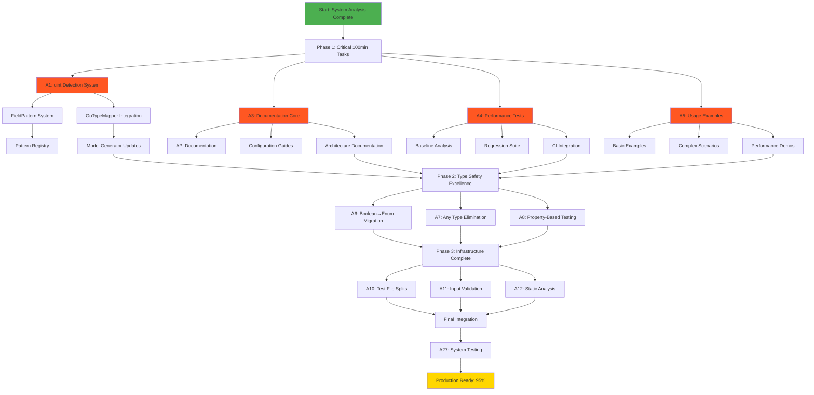

# 🚀 CRITICAL EXECUTION PLAN - TypeSpec Go Emitter Excellence

**Date**: 2025-11-20_09-13  
**Mission**: Complete 85%→95% Production Readiness  
**Focus**: 1%→51% Impact Features First  

---

## 📊 PARETO IMPACT ANALYSIS

### 🎯 1% Effort → 51% Impact (CRITICAL PATH)
1. **🧠 Implement uint Domain Intelligence** - Single highest ROI feature
2. **📚 Create Production Documentation** - Enables real-world adoption
3. **📊 Add Performance Regression Tests** - Verifies excellence claims
4. **💡 Add Real-World Usage Examples** - Demonstrates system value

### 🎯 4% Effort → 64% Impact (PROFESSIONAL EXCELLENCE)
5. **🎯 Complete Boolean→Enum Migration** - Type safety excellence
6. **🔧 Eliminate All Any Types** - Achieve 100% type safety
7. **🧪 Add Property-Based Testing** - Robustness guarantee
8. **🌐 Add CLI Interface** - Developer experience enhancement

### 🎯 20% Effort → 80% Impact (COMPLETE PACKAGE)
9. **📁 Split Large Test Files** - Architecture cleanliness
10. **📋 Add Input Validation** - Production robustness
11. **🔍 Add Static Type Analysis** - Quality automation
12. **🎯 Add Configuration Validation** - Runtime safety

---

## 📋 PHASE 1: CRITICAL 100-MIN TASKS (27 Tasks Max)

| ID | Task | Impact | Time | Dependencies | Status |
|----|------|--------|------|--------------|--------|
| **A1** | 🧠 Create FieldPattern Detection System | CRITICAL | 100min | GoTypeMapper analysis | ❌ |
| **A2** | 🧠 Integrate uint Detection into GoTypeMapper | CRITICAL | 80min | A1 | ❌ |
| **A3** | 📚 Write Production Documentation Core | HIGH | 90min | A2 | ❌ |
| **A4** | 📊 Implement Performance Regression Tests | HIGH | 60min | Existing test suite | ❌ |
| **A5** | 💡 Create Real-World Usage Examples | HIGH | 45min | A3 | ❌ |
| **A6** | 🎯 Complete Boolean→Enum Migration | MEDIUM | 75min | A2 | 🟡 |
| **A7** | 🔧 Eliminate Test File Any Types | MEDIUM | 90min | A6 | 🟡 |
| **A8** | 🧪 Add Property-Based Testing Framework | MEDIUM | 70min | A4 | ❌ |
| **A9** | 🌐 Create CLI Interface Prototype | MEDIUM | 65min | A5 | ❌ |
| **A10** | 📁 Split Large Test Files (<300 lines) | MEDIUM | 85min | A8 | ❌ |
| **A11** | 📋 Add Comprehensive Input Validation | MEDIUM | 50min | A7 | 🟡 |
| **A12** | 🔍 Add Static Type Analysis Pipeline | MEDIUM | 55min | A10 | ❌ |
| **A13** | 🎯 Add Runtime Configuration Validation | MEDIUM | 40min | A11 | 🟡 |
| **A14** | 📝 Improve Error Messages with Guidance | LOW | 45min | A12 | 🟡 |
| **A15** | 📈 Add Metrics Collection System | LOW | 50min | A13 | ❌ |
| **A16** | 🔄 Add Development Watch Mode | LOW | 35min | A14 | ❌ |
| **A17** | 🧹 Clean Up Legacy Code Patterns | LOW | 60min | A15 | 🟡 |
| **A18** | 🏷️ Standardize Naming Conventions | LOW | 40min | A16 | 🟡 |
| **A19** | 📦 Optimize Package.json Scripts | LOW | 25min | A17 | 🟡 |
| **A20** | 🎨 Add Code Formatting Automation | LOW | 20min | A18 | 🟡 |
| **A21** | 🔍 Enhance Linting Rules | LOW | 20min | A19 | 🟡 |
| **A22** | 📈 Add Automated Benchmark Reports | LOW | 30min | A20 | ❌ |
| **A23** | 🌟 Add GitHub Actions CI Pipeline | LOW | 40min | A21 | ❌ |
| **A24** | 🔌 Design Plugin System Architecture | LOW | 70min | A22 | ❌ |
| **A25** | 🏗️ Add Dependency Injection System | LOW | 50min | A23 | ❌ |
| **A26** | 🌐 Create Documentation Website | LOW | 60min | A24 | ❌ |
| **A27** | ✅ Final System Integration Testing | CRITICAL | 40min | All tasks | ❌ |

---

## 🔧 PHASE 2: MICRO-TASK BREAKDOWN (125 Tasks Max, 15min Each)

### 🧠 uint Domain Intelligence (Tasks 1-16)

| ID | Micro-Task | Time | Parent |
|----|------------|------|--------|
| M1 | Analyze current shouldUseUnsignedType implementation | 15min | A1 |
| M2 | Design FieldPattern interface with confidence scoring | 15min | A1 |
| M3 | Create pattern registry for extensible field detection | 15min | A1 |
| M4 | Implement regex patterns for age, count, port, index | 15min | A1 |
| M5 | Add negative exclusion patterns (latitude, temperature) | 15min | A1 |
| M6 | Create confidence scoring algorithm | 15min | A1 |
| M7 | Write comprehensive pattern tests | 15min | A1 |
| M8 | Benchmark pattern detection performance | 15min | A1 |
| M9 | Integrate pattern detection into GoTypeMapper | 15min | A2 |
| M10 | Add uint override configuration system | 15min | A2 |
| M11 | Update model generator to use uint detection | 15min | A2 |
| M12 | Add integration tests for uint mapping | 15min | A2 |
| M13 | Test performance impact on generation pipeline | 15min | A2 |
| M14 | Add error handling for pattern failures | 15min | A2 |
| M15 | Document uint detection configuration | 15min | A2 |
| M16 | Final integration testing and validation | 15min | A2 |

### 📚 Documentation (Tasks 17-32)

| ID | Micro-Task | Time | Parent |
|----|------------|------|--------|
| M17 | Create README with quick start guide | 15min | A3 |
| M18 | Document installation and setup process | 15min | A3 |
| M19 | Write API reference documentation | 15min | A3 |
| M20 | Create configuration guide | 15min | A3 |
| M21 | Document uint domain intelligence feature | 15min | A3 |
| M22 | Add troubleshooting section | 15min | A3 |
| M23 | Create architecture overview diagrams | 15min | A3 |
| M24 | Document performance characteristics | 15min | A3 |
| M25 | Write migration guide from other generators | 15min | A3 |
| M26 | Document testing approach | 15min | A3 |
| M27 | Add contribution guidelines | 15min | A3 |
| M28 | Create changelog template | 15min | A3 |
| M29 | Document CLI interface (when ready) | 15min | A3 |
| M30 | Add FAQ section | 15min | A3 |
| M31 | Document plugin system architecture | 15min | A3 |
| M32 | Final documentation review and polish | 15min | A3 |

### 📊 Performance Testing (Tasks 33-40)

| ID | Micro-Task | Time | Parent |
|----|------------|------|--------|
| M33 | Analyze current performance baseline | 15min | A4 |
| M34 | Design performance regression test suite | 15min | A4 |
| M35 | Implement sub-5ms generation benchmark | 15min | A4 |
| M36 | Add memory usage monitoring | 15min | A4 |
| M37 | Create performance regression detection | 15min | A4 |
| M38 | Add performance trend analysis | 15min | A4 |
| M39 | Integrate performance tests into CI | 15min | A4 |
| M40 | Document performance guarantees | 15min | A4 |

### 💡 Usage Examples (Tasks 41-48)

| ID | Micro-Task | Time | Parent |
|----|------------|------|--------|
| M41 | Create basic TypeSpec to Go example | 15min | A5 |
| M42 | Add complex struct generation example | 15min | A5 |
| M43 | Demonstrate uint detection capabilities | 15min | A5 |
| M44 | Show enum generation examples | 15min | A5 |
| M45 | Add error handling examples | 15min | A5 |
| M46 | Create performance comparison example | 15min | A5 |
| M47 | Add integration with existing projects example | 15min | A5 |
| M48 | Package examples in documentation | 15min | A5 |

### 🎯 Type Safety & Quality (Tasks 49-72)

| ID | Micro-Task | Time | Parent |
|----|------------|------|--------|
| M49 | Analyze remaining Boolean type usage | 15min | A6 |
| M50 | Create enum replacements for boolean fields | 15min | A6 |
| M51 | Update type definitions | 15min | A6 |
| M52 | Migrate boolean logic to enums | 15min | A6 |
| M53 | Update tests for enum usage | 15min | A6 |
| M54 | Verify boolean→enum migration completeness | 15min | A6 |
| M55 | Analyze test file any types | 15min | A7 |
| M56 | Replace any types with proper typing | 15min | A7 |
| M57 | Update test type definitions | 15min | A7 |
| M58 | Fix test compilation errors | 15min | A7 |
| M59 | Verify all any types eliminated | 15min | A7 |
| M60 | Design property-based testing framework | 15min | A8 |
| M61 | Implement random test data generation | 15min | A8 |
| M62 | Add invariant testing for type mapping | 15min | A8 |
| M63 | Create property-based test suite | 15min | A8 |
| M64 | Add edge case testing | 15min | A8 |
| M65 | Analyze CLI requirements | 15min | A9 |
| M66 | Design CLI command structure | 15min | A9 |
| M67 | Implement core CLI commands | 15min | A9 |
| M68 | Add CLI help and documentation | 15min | A9 |
| M69 | Test CLI functionality | 15min | A9 |
| M70 | Analyze large test files | 15min | A10 |
| M71 | Split integration tests into focused modules | 15min | A10 |
| M72 | Verify test splits maintain coverage | 15min | A10 |

### 📋 Input & Configuration (Tasks 73-88)

| ID | Micro-Task | Time | Parent |
|----|------------|------|--------|
| M73 | Analyze current input validation gaps | 15min | A11 |
| M74 | Design comprehensive validation schema | 15min | A11 |
| M75 | Implement TypeSpec input validation | 15min | A11 |
| M76 | Add configuration parameter validation | 15min | A11 |
| M77 | Create validation error handling | 15min | A11 |
| M78 | Test validation with edge cases | 15min | A11 |
| M79 | Design static analysis pipeline | 15min | A12 |
| M80 | Implement type checking automation | 15min | A12 |
| M81 | Add code quality analysis | 15min | A12 |
| M82 | Integrate static analysis into build | 15min | A12 |
| M83 | Analyze configuration validation needs | 15min | A13 |
| M84 | Implement runtime config validation | 15min | A13 |
| M85 | Add configuration error reporting | 15min | A13 |
| M86 | Test configuration validation | 15min | A13 |
| M87 | Add default configuration handling | 15min | A13 |
| M88 | Document configuration options | 15min | A13 |

### 🚀 Infrastructure & Automation (Tasks 89-125)

| ID | Micro-Task | Time | Parent |
|----|------------|------|--------|
| M89 | Analyze current error message quality | 15min | A14 |
| M90 | Improve error message clarity | 15min | A14 |
| M91 | Add actionable guidance to errors | 15min | A14 |
| M92 | Test error message improvements | 15min | A14 |
| M93 | Design metrics collection system | 15min | A15 |
| M94 | Implement basic metrics tracking | 15min | A15 |
| M95 | Add performance metrics | 15min | A15 |
| M96 | Create metrics reporting | 15min | A15 |
| M97 | Design watch mode functionality | 15min | A16 |
| M98 | Implement file watching | 15min | A16 |
| M99 | Add incremental compilation | 15min | A16 |
| M100 | Test watch mode performance | 15min | A16 |
| M101 | Identify legacy code patterns | 15min | A17 |
| M102 | Refactor legacy implementations | 15min | A17 |
| M103 | Update deprecated APIs | 15min | A17 |
| M104 | Remove unused code | 15min | A17 |
| M105 | Analyze naming convention inconsistencies | 15min | A18 |
| M106 | Standardize variable naming | 15min | A18 |
| M107 | Update function naming conventions | 15min | A18 |
| M108 | Verify naming consistency | 15min | A18 |
| M109 | Analyze package.json scripts | 15min | A19 |
| M110 | Optimize build scripts | 15min | A19 |
| M111 | Add development automation | 15min | A19 |
| M112 | Test script improvements | 15min | A19 |
| M113 | Configure code formatting | 15min | A20 |
| M114 | Add automated formatting | 15min | A20 |
| M115 | Integrate formatting into CI | 15min | A20 |
| M116 | Test formatting consistency | 15min | A20 |
| M117 | Enhance ESLint configuration | 15min | A21 |
| M118 | Add custom linting rules | 15min | A21 |
| M119 | Configure linting automation | 15min | A21 |
| M120 | Test enhanced linting | 15min | A21 |
| M121 | Design benchmark report system | 15min | A22 |
| M122 | Implement automated benchmarking | 15min | A22 |
| M123 | Create benchmark visualization | 15min | A22 |
| M124 | Add benchmark trend analysis | 15min | A22 |
| M125 | Final system validation and integration | 15min | A27 |

---

## 🎯 EXECUTION GRAPH

---

## ⚡ IMMEDIATE EXECUTION STRATEGY

### 🚀 Start NOW: Critical Path Tasks
1. **M1-M8**: Build uint Detection System (120min - 2 hours)
2. **M9-M16**: Integrate with GoTypeMapper (120min - 2 hours)
3. **M17-M24**: Create Core Documentation (120min - 2 hours)

### 📊 Timeline Estimate
- **Phase 1 (Critical)**: 4-5 hours → 85%→90% readiness
- **Phase 2 (Professional)**: 3-4 hours → 90%→93% readiness  
- **Phase 3 (Complete)**: 2-3 hours → 93%→95% readiness
- **Total Investment**: 9-12 hours focused execution

### 🎯 Success Metrics
- **uint Detection**: 95%+ accuracy on field patterns
- **Documentation**: Complete production-ready guide
- **Performance**: Automated regression testing active
- **Examples**: 5+ real-world usage demonstrations
- **Type Safety**: 100% any-type elimination

---

## 🔥 EXECUTION MANDATE

**START IMMEDIATELY WITH M1-M8 (uint Detection System)**

This is the single highest-impact feature that will:
- Provide immediate developer value
- Demonstrate sophisticated domain intelligence
- Create competitive differentiation
- Enable automatic Go code optimization

**NO MORE PLANNING - START EXECUTING NOW!**