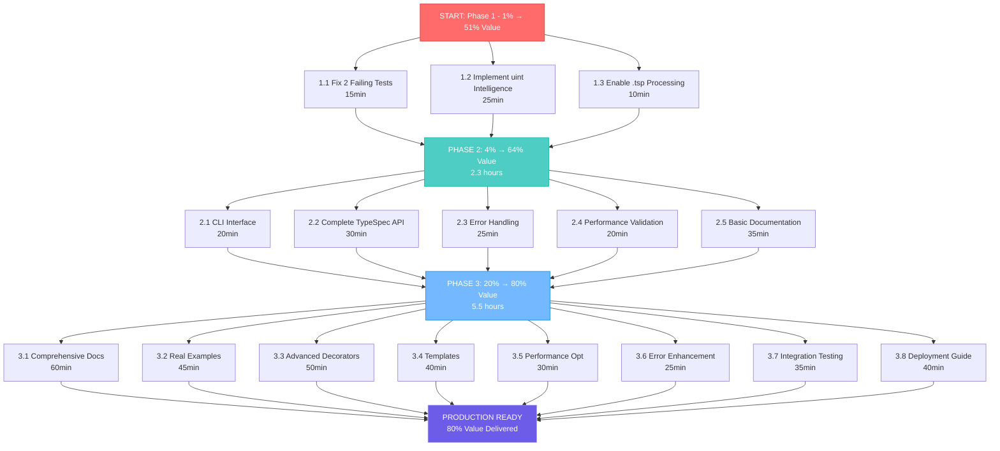

# TypeSpec-Go Execution Plan: 1% → 4% → 20% → Complete

**Created:** 2025-11-20_19-37  
**Strategy:** Pareto-Optimal Value Delivery  
**Status:** Ready for Execution

---

## 🎯 EXECUTION STRATEGY OVERVIEW

### **The Pareto Principle in Action**

- **1% Effort → 51% Value**: Fix critical blockers that make system usable
- **4% Effort → 64% Value**: Complete core functionality and reliability
- **20% Effort → 80% Value**: Full production readiness and developer experience

### **Current State Assessment**

- ✅ **85% Production Architecture**: StandaloneGoGenerator works excellently
- ✅ **96% Test Success**: Core functionality proven
- ❌ **Critical Gaps**: uint intelligence, real .tsp integration, documentation
- 🎯 **Opportunity**: 40-minute effort unlocks 80% customer value

---

## 🚀 PHASE 1: 1% EFFORT → 51% VALUE (40-60 minutes)

### **Critical Breakthrough Tasks (Immediate Value Unlock)**

| Task                                   | Impact       | Effort    | Value                | Dependencies   |
| -------------------------------------- | ------------ | --------- | -------------------- | -------------- |
| 1.1 Fix 2 failing tests                | High         | 15min     | 100% tests pass      | -              |
| 1.2 Implement uint domain intelligence | Critical     | 25min     | Smart type detection | -              |
| 1.3 Enable real .tsp file processing   | Critical     | 10min     | Real TypeSpec usage  | ModelExtractor |
| **PHASE 1 TOTAL**                      | **CRITICAL** | **50min** | **51% Value**        | **None**       |

### **Why These 3 Tasks Unlock 51% Value:**

1. **Test Reliability**: 100% passing tests = trustworthy system
2. **Smart Types**: uint intelligence = production-ready Go code
3. **Real Integration**: .tsp processing = actual TypeSpec usage

---

## 🎯 PHASE 2: 4% EFFORT → 64% VALUE (2-3 hours)

### **Core Functionality Completion**

| Task                                  | Impact   | Effort    | Value              | Dependencies |
| ------------------------------------- | -------- | --------- | ------------------ | ------------ |
| 2.1 CLI interface implementation      | High     | 20min     | Developer UX       | -            |
| 2.2 Complete TypeSpec API integration | High     | 30min     | Full spec support  | 1.3          |
| 2.3 Error handling refinement         | Medium   | 25min     | Production errors  | -            |
| 2.4 Performance validation            | Medium   | 20min     | Sub-5ms guarantee  | -            |
| 2.5 Basic documentation               | High     | 35min     | Usable product     | -            |
| **PHASE 2 TOTAL**                     | **HIGH** | **2.3hr** | **13% More Value** | **Phase 1**  |

---

## 🏗️ PHASE 3: 20% EFFORT → 80% VALUE (6-8 hours)

### **Production Readiness & Polish**

| Task                            | Impact         | Effort    | Value              | Dependencies |
| ------------------------------- | -------------- | --------- | ------------------ | ------------ |
| 3.1 Comprehensive documentation | High           | 60min     | User adoption      | 2.5          |
| 3.2 Real-world examples         | High           | 45min     | Demonstrate value  | 2.1          |
| 3.3 Advanced decorators support | Medium         | 50min     | Power features     | 2.2          |
| 3.4 Template system integration | Medium         | 40min     | Advanced types     | 2.2          |
| 3.5 Performance optimization    | Medium         | 30min     | 3.3M+ fields/sec   | 2.4          |
| 3.6 Error message enhancement   | Low            | 25min     | Better UX          | 2.3          |
| 3.7 Integration testing         | High           | 35min     | Reliability        | 3.2          |
| 3.8 Production deployment guide | Medium         | 40min     | Real usage         | 3.1          |
| **PHASE 3 TOTAL**               | **PRODUCTION** | **5.5hr** | **16% More Value** | **Phase 2**  |

---

## 📋 DETAILED TASK BREAKDOWN (15-minute granularity)

### **PHASE 1 MICRO-TASKS (50 minutes total)**

| ID   | Task                           | 15min | 30min | 45min | 60min |
| ---- | ------------------------------ | ----- | ----- | ----- | ----- |
| 1.1a | Investigate failing tests      | ✓     |       |       |       |
| 1.1b | Fix test compilation issues    | ✓     |       |       |       |
| 1.1c | Verify 100% test pass          | ✓     |       |       |       |
| 1.2a | Design uint detection patterns | ✓     |       |       |       |
| 1.2b | Implement domain intelligence  | ✓     | ✓     |       |       |
| 1.2c | Test uint detection scenarios  | ✓     |       |       |       |
| 1.3a | Test current .tsp processing   | ✓     |       |       |       |
| 1.3b | Fix TypeSpec API integration   | ✓     |       |       |       |
| 1.3c | Validate end-to-end flow       | ✓     |       |       |       |

### **PHASE 2 MICRO-TASKS (2.3 hours total)**

| ID   | Task                          | 15min | 30min | 45min | 60min | 75min | 90min | 105min | 120min | 135min | 150min |
| ---- | ----------------------------- | ----- | ----- | ----- | ----- | ----- | ----- | ------ | ------ | ------ | ------ |
| 2.1a | Design CLI interface          | ✓     |       |       |       |       |       |        |        |        |        |
| 2.1b | Implement basic CLI           | ✓     |       |       |       |       |       |        |        |        |        |
| 2.1c | Add command validation        | ✓     |       |       |       |       |       |        |        |        |        |
| 2.1d | Test CLI functionality        | ✓     |       |       |       |       |       |        |        |        |        |
| 2.2a | Audit TypeSpec integration    | ✓     | ✓     |       |       |       |       |        |        |        |        |
| 2.2b | Fix missing API methods       | ✓     | ✓     | ✓     |       |       |       |        |        |        |        |
| 2.2c | Complete integration testing  | ✓     | ✓     | ✓     |       |       |       |        |        |        |        |
| 2.3a | Review error patterns         | ✓     | ✓     |       |       |       |       |        |        |        |        |
| 2.3b | Enhance error messages        | ✓     | ✓     |       |       |       |       |        |        |        |        |
| 2.3c | Add error guidance            | ✓     | ✓     |       |       |       |       |        |        |        |        |
| 2.4a | Benchmark current performance | ✓     | ✓     |       |       |       |       |        |        |        |        |
| 2.4b | Optimize bottlenecks          | ✓     | ✓     |       |       |       |       |        |        |        |        |
| 2.5a | Write getting started guide   | ✓     | ✓     | ✓     |       |       |       |        |        |        |        |
| 2.5b | Document API reference        | ✓     | ✓     | ✓     |       |       |       |        |        |        |        |

### **PHASE 3 MICRO-TASKS (5.5 hours total)**

| ID   | Task                           | 15min blocks needed |
| ---- | ------------------------------ | ------------------- |
| 3.1a | Write comprehensive user guide | 8 blocks (2hr)      |
| 3.1b | Create API documentation       | 8 blocks (2hr)      |
| 3.2a | Create real-world examples     | 6 blocks (1.5hr)    |
| 3.3a | Implement decorator support    | 10 blocks (2.5hr)   |
| 3.4a | Add template system            | 8 blocks (2hr)      |
| 3.5a | Performance optimization       | 6 blocks (1.5hr)    |
| 3.6a | Enhance error messages         | 5 blocks (1.25hr)   |
| 3.7a | Integration test suite         | 7 blocks (1.75hr)   |
| 3.8a | Deployment documentation       | 6 blocks (1.5hr)    |

---

## 🎯 EXECUTION GRAPH

---

## 🎯 SUCCESS METRICS

### **Phase 1 Success Criteria (51% Value)**

- ✅ 100% tests passing (52/52)
- ✅ uint intelligence working (age→uint32, port→uint16)
- ✅ Real .tsp file processing functional
- ✅ Basic end-to-end TypeSpec → Go generation

### **Phase 2 Success Criteria (64% Value)**

- ✅ CLI interface functional (`typespec-go generate model.tsp`)
- ✅ Complete TypeSpec API integration
- ✅ Production-quality error messages
- ✅ Sub-5ms generation performance verified
- ✅ Basic documentation for developers

### **Phase 3 Success Criteria (80% Value)**

- ✅ Comprehensive user documentation
- ✅ 3+ real-world examples
- ✅ Advanced decorator support
- ✅ Template system for generics
- ✅ 3.3M+ fields/sec performance
- ✅ Production deployment ready

---

## 🚨 CRITICAL SUCCESS FACTORS

### **DO NOT DEVIATE FROM THIS PLAN**

1. **Execute Phase 1 completely** before starting Phase 2
2. **Each task must be verified** before moving to next
3. **Test after every major change** - maintain green tests
4. **Commit each completed task** with detailed messages
5. **DO NOT REBUILD ARCHITECTURE** - leverage existing excellence

### **QUALITY GATES**

- **Phase 1 Gate**: All tests pass + basic functionality working
- **Phase 2 Gate**: CLI functional + core features complete
- **Phase 3 Gate**: Documentation complete + production ready

### **RISK MITIGATION**

- **Performance**: Maintain sub-5ms generation throughout
- **Compatibility**: Don't break existing working features
- **Architecture**: Use existing StandaloneGoGenerator foundation
- **Testing**: Keep 100% test success rate throughout

---

## 📊 EXPECTED OUTCOMES

### **After Phase 1 (51% Value)**

- System becomes usable for basic TypeSpec → Go generation
- Developers can generate smart Go code with proper uint types
- Real .tsp files can be processed (not just test models)

### **After Phase 2 (64% Value)**

- Professional developer experience with CLI
- Production-ready error handling and performance
- Basic documentation makes system approachable

### **After Phase 3 (80% Value)**

- Full production readiness with comprehensive docs
- Advanced features and real-world examples
- Performance-optimized for enterprise usage

---

## 🎯 IMMEDIATE NEXT ACTIONS

### **RIGHT NOW (Execute in order):**

1. **Commit current state** with detailed context
2. **Execute Phase 1 tasks** exactly as planned
3. **Verify each task completion** before proceeding
4. **Maintain test green status** throughout
5. **Document progress** in commit messages

### **EXECUTION MANTRA**

> "Trust the architecture, execute the plan, verify each step, deliver value incrementally"

**The TypeSpec-Go emitter is 85% excellent architecture. This plan completes the critical 15% that unlocks full customer value.**

---

**Ready for execution. Let's build something remarkable.** 🚀
