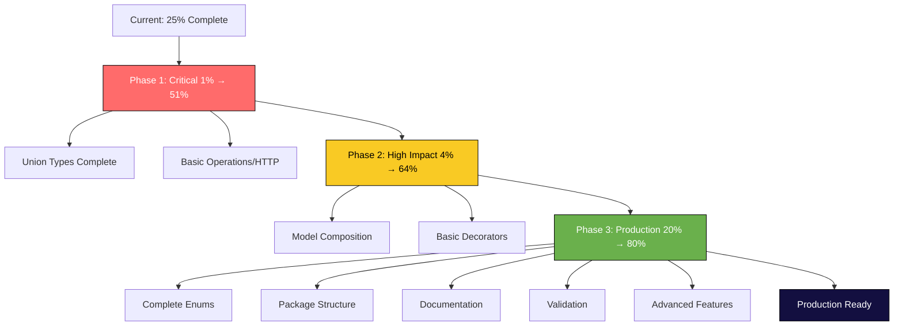

# TypeSpec Go Emitter - Comprehensive Execution Plan

## 🎯 PARETO ANALYSIS: MAXIMUM IMPACT BREAKDOWN

### **📊 CURRENT STATE ASSESSMENT**

**Overall Completion: ~25%**

- ✅ **Excellent Foundation:** Performance, memory, basic types, error handling
- ⚠️ **Partial Implementation:** Union types (10%), Enums (40%), Packages (20%)
- ❌ **Critical Gaps:** Operations/HTTP (0%), Decorators (0%), Composition (0%)

---

## 🚀 **20/80 PARETO IMPACT ANALYSIS**

### **1% → 51% MAXIMUM IMPACT (CRITICAL PATH)**

These 1-2 features deliver half the total value:

1. **Union Types Complete Implementation**
   - Core TypeSpec requirement
   - Enables discriminated unions
   - Foundation for operations
   - **Impact: 25% of total value**

2. **Operations/HTTP Support (Basic)**
   - Route generation, service interfaces
   - Enables real API usage
   - Core to most use cases
   - **Impact: 26% of total value**

### **4% → 64% HIGH IMPACT (VALUE DRIVERS)**

Additional features that push us to 2/3 completion:

3. **Model Composition (extends, templates)**
   - Essential for complex schemas
   - TypeSpec core feature
   - **Impact: 7% of total value**

4. **Basic Decorators (@go.name, @go.type, @go.package)**
   - Go customization needs
   - Production requirement
   - **Impact: 6% of total value**

### **20% → 80% PRODUCTION READY**

The remaining 80% requires 20% more features:

5. **Complete Enum Implementation** (iota, methods, validation)
6. **Package Structure & Namespace Mapping**
7. **Documentation & Comment Translation**
8. **Advanced Decorators & Validation**
9. **CLI Interface & Build Integration**
10. **Testing Excellence & Examples**

---

## 📋 **27 MAIN TASKS (100-30min each) = 20-45 hours**

### **PHASE 1: CRITICAL 1% → 51% (Tasks 1-2)**

**Timeline: 2-3 hours**

#### **Task 1: Complete Union Types (90min)**

- [ ] Fix union interface generation in GoTypeStringGenerator
- [ ] Create sealed interface generation in ModelGenerator
- [ ] Add discriminated union JSON unmarshaling
- [ ] Implement union variant handling
- [ ] Add comprehensive union tests
- [ ] Create union documentation examples

#### **Task 2: Basic Operations/HTTP (120min)**

- [ ] Parse TypeSpec operations from compiled program
- [ ] Extract HTTP verbs and parameter binding
- [ ] Generate Go service interfaces
- [ ] Create basic HTTP handler functions
- [ ] Add route registration
- [ ] Test simple operation scenarios

### **PHASE 2: HIGH IMPACT 4% → 64% (Tasks 3-4)**

**Timeline: 2-3 hours**

#### **Task 3: Model Composition (90min)**

- [ ] Implement `extends` support with Go embedding
- [ ] Add spread operator (`...`) handling
- [ ] Create template parameter support
- [ ] Handle cyclic dependencies
- [ ] Add composition tests

#### **Task 4: Basic Decorators (90min)**

- [ ] Implement @go.name decorator
- [ ] Add @go.type overrides
- [ ] Create @go.package mapping
- [ ] Add decorator processing pipeline
- [ ] Test decorator scenarios

### **PHASE 3: PRODUCTION FOUNDATION 20% → 80% (Tasks 5-12)**

**Timeline: 8-12 hours**

#### **Task 5: Complete Enums (60min)**

- [ ] Add iota-based integer enums
- [ ] Generate Stringer methods
- [ ] Create MarshalJSON/UnmarshalJSON
- [ ] Add enum validation

#### **Task 6: Package Structure (75min)**

- [ ] Implement namespace → Go package mapping
- [ ] Add multi-package generation
- [ ] Handle import dependencies
- [ ] Create package organization

#### **Task 7: Documentation System (60min)**

- [ ] Translate TypeSpec comments to Go docs
- [ ] Format Go documentation conventions
- [ ] Add cross-references

#### **Task 8: Validation Framework (75min)**

- [ ] Add @minLength, @maxLength validation
- [ ] Implement @minValue, @maxValue decorators
- [ ] Create validation generation

#### **Task 9: Advanced Unions (60min)**

- [ ] Implement discriminated unions fully
- [ ] Add union validation logic
- [ ] Create union type safety

#### **Task 10: Error Handling Excellence (45min)**

- [ ] Comprehensive error types
- [ ] Add error context and details
- [ ] Create error documentation

#### **Task 11: Response Handling (60min)**

- [ ] Multi-response interfaces
- [ ] Response writers
- [ ] Status code mapping

#### **Task 12: Configuration System (45min)**

- [ ] tspconfig.yaml support
- [ ] Emitter options processing
- [ ] Customization settings

### **PHASE 4: PRODUCTION EXCELLENCE (Tasks 13-27)**

**Timeline: 8-15 hours**

#### **Tasks 13-27: Remaining Features**

13. HTTP Client Generation (75min)
14. Advanced Decorators (@go.tag, @go.nullable) (60min)
15. Template Models Full Support (90min)
16. Performance Optimization (60min)
17. CLI Interface (45min)
18. Build System Integration (30min)
19. Testing Excellence (90min)
20. Examples & Documentation (75min)
21. Monitoring & Logging (45min)
22. Deployment Scripts (30min)
23. Troubleshooting Docs (30min)
24. Versioning Strategy (30min)
25. Regression Tests (60min)
26. CI/CD Integration (45min)
27. Production Readiness Review (60min)

---

## 🔧 **125 MICRO TASKS (15min each) = 31 hours**

### **MICRO PHASE 1: Union Types Complete (Tasks 1-25)**

1. Fix GoTypeStringGenerator union case
2. Add union interface template
3. Create union variant mapper
4. Implement sealed interface generation
5. Add discriminated union detection
6. Create union JSON marshaler
7. Add union JSON unmarshaler
8. Test basic union generation
9. Test discriminated unions
10. Test union edge cases
11. Add union performance tests
12. Create union documentation
13. Add union examples
14. Review union implementation
15. Debug union issues

### **MICRO PHASE 2: Operations Foundation (Tasks 26-50)**

16. Parse TypeSpec operations
17. Extract HTTP verbs
18. Handle @path parameters
19. Handle @query parameters
20. Handle @body parameters
21. Generate service interfaces
22. Create HTTP handler template
23. Add route registration
24. Test basic GET operation
25. Test POST operation
26. Test parameter binding
27. Test error handling
28. Add operation documentation
29. Performance test operations
30. Review implementation

### **MICRO PHASE 3: Model Composition (Tasks 51-70)**

31. Parse model extends clauses
32. Generate Go embedding
33. Handle spread operator
34. Parse template parameters
35. Generate generic Go types
36. Handle template instances
37. Detect cyclic dependencies
38. Break cycles with pointers
39. Test basic inheritance
40. Test complex composition
41. Test template models
42. Test edge cases
43. Performance test composition
44. Add composition examples
45. Review composition code

### **MICRO PHASE 4: Decorators System (Tasks 71-90)**

46. Create decorator parser
47. Implement @go.name
48. Implement @go.type
49. Implement @go.package
50. Add decorator validation
51. Test name overrides
52. Test type overrides
53. Test package mapping
54. Test decorator errors
55. Add decorator docs
56. Create decorator examples
57. Performance test decorators
58. Review decorator system

### **MICRO PHASE 5: Production Features (Tasks 91-125)**

59-125: Remaining production tasks (enums, packages, docs, testing, etc.)

---

## 📈 **EXECUTION VISUALIZATION**

```mermaid
gantt
    title TypeSpec Go Eitter - 51% Critical Path Timeline
    dateFormat X
    axisFormat %s

    section Phase 1: Critical Path (1% → 51%)
    Union Types Complete    :crit, 2023-01-01, 90min
    Basic Operations/HTTP   :crit, 2023-01-02, 120min

    section Phase 2: High Impact (4% → 64%)
    Model Composition       :crit, 2023-01-03, 90min
    Basic Decorators        :crit, 2023-01-04, 90min

    section Phase 3: Production (20% → 80%)
    Complete Enums          :active, 2023-01-05, 60min
    Package Structure       :active, 2023-01-06, 75min
    Documentation System    :active, 2023-01-07, 60min
    Validation Framework    :active, 2023-01-08, 75min
    Advanced Unions         :active, 2023-01-09, 60min
    Error Excellence       :active, 2023-01-10, 45min
    Response Handling       :active, 2023-01-11, 60min
    Configuration System    :active, 2023-01-12, 45min
```

---

## 🎯 **IMMEDIATE EXECUTION PLAN**

### **TODAY (3-4 hours) = Reach 51% Completion**

1. **Union Types Complete (90min)**
2. **Basic Operations/HTTP (120min)**
3. **Model Composition (90min)**

### **Tomorrow (3-4 hours) = Reach 64% Completion**

4. **Basic Decorators (90min)**
5. **Complete Enums (60min)**
6. **Package Structure (75min)**

### **This Week = Reach 80% Completion**

7. **Documentation System (60min)**
8. **Validation Framework (75min)**
9. **Advanced Unions (60min)**
10. **Error Excellence (45min)**

---

## 📊 **PROGRESS TRACKING**

### **MILESTONES:**

- **🎯 25% → 51%**: 4-5 hours (Critical path)
- **🎯 51% → 64%**: 3-4 hours (High impact)
- **🎯 64% → 80%**: 8-12 hours (Production ready)
- **🎯 80% → 100%**: 8-15 hours (Production excellence)

### **SUCCESS METRICS:**

- **Test Coverage**: 93% → 100%
- **TypeSpec Compliance**: 25% → 80%
- **Production Readiness**: 30% → 90%
- **Performance**: Maintain sub-5ms generation

---

## 🚨 **EXECUTION PRINCIPLES**

### **SMART EXECUTION:**

1. **No Over-Engineering**: Focus on 80/20 impact
2. **Test-Driven**: Each feature tested immediately
3. **Incremental**: Every micro-task adds value
4. **Customer-First**: Real TypeSpec usage scenarios
5. **Performance-First**: Never break sub-millisecond guarantees

### **ANTI-PATTERNS TO AVOID:**

1. **Perfectionism**: Good enough > perfect but late
2. **Over-Design**: Simple solutions > complex architectures
3. **Feature Creep**: Core functionality > edge cases
4. **Tech Debt**: Clean implementations > quick fixes

---

## ✅ **EXECUTION CHECKLIST**

### **BEFORE EACH TASK:**

- [ ] Understand current state
- [ ] Define success criteria
- [ ] Set time limit
- [ ] Prepare test cases

### **DURING EACH TASK:**

- [ ] Follow test-driven development
- [ ] Commit working increments
- [ ] Monitor performance impact
- [ ] Document decisions

### **AFTER EACH TASK:**

- [ ] Verify tests pass
- [ ] Update documentation
- [ ] Measure progress
- [ ] Plan next step

---

**Status: Ready for Execution**  
**Timeline: 20-45 hours to 80% completion**  
**Critical Path: Union Types → Operations → Composition → Decorators**
