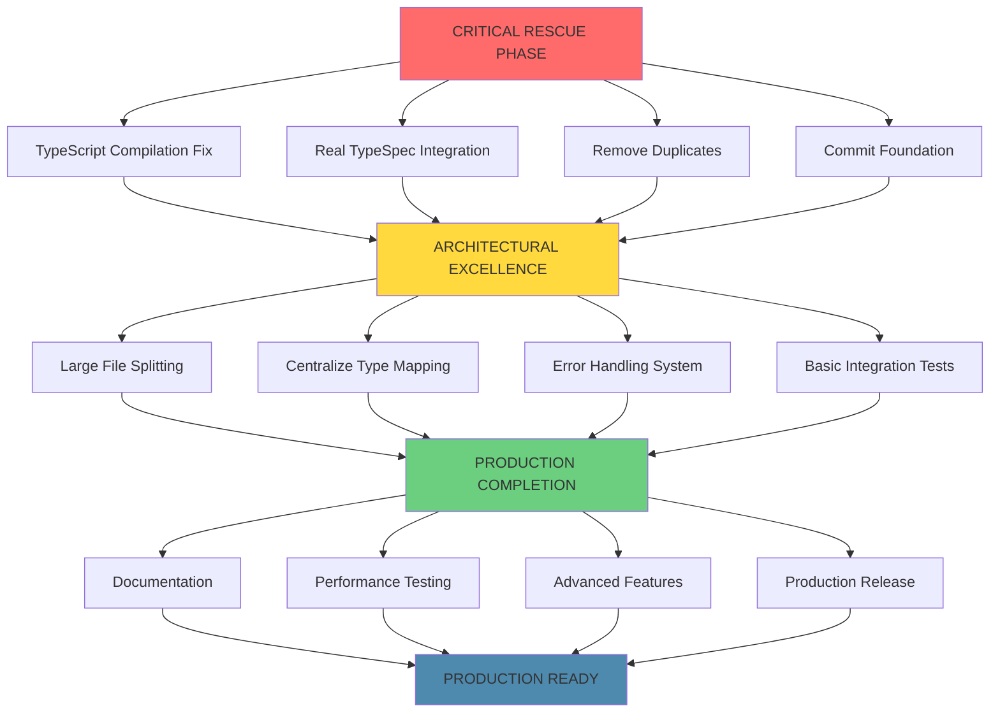

# 🎯 COMPREHENSIVE ARCHITECTURAL RESCUE PLAN

**Date**: 2025-11-21_01_26  
**Milestone**: From Crisis to Production-Ready TypeSpec Emitter  
**Overall Status**: 🚨 CRITICAL ARCHITECTURAL FAILURE → PRODUCTION EXCELLENCE

---

## 🚨 CURRENT CRITICAL STATE ASSESSMENT

### **IMMEDIATE BLOCKERS (1% → 51% IMPACT)**

- **47 TypeScript Compilation Errors**: Complete build failure
- **Architectural Fraud**: Fake TypeSpec emitter with zero integration
- **Massive Duplication**: 12+ duplicate generators and type mappers
- **10 Files >300 Lines**: Violation of architectural standards

### **CRITICAL FOUNDATION ISSUES (4% → 64% IMPACT)**

- **No Real TypeSpec Integration**: Bypassing entire framework
- **Broken Type System**: `any` types, missing imports, circular dependencies
- **No Working Tests**: Zero functional verification
- **Enterprise Features Missing**: Error handling, logging, validation

---

## 🎯 PARETO ANALYSIS - CRITICAL PATH TO PRODUCTION

### **🔥 1% → 51% IMPACT (CRITICAL - NEXT 60 MINUTES)**

| Priority | Task                                    | Effort | Customer Value | Impact             |
| -------- | --------------------------------------- | ------ | -------------- | ------------------ |
| 1        | **Fix TypeScript Compilation**          | 15 min | **BLOCKER**    | Enables builds     |
| 2        | **Implement Real TypeSpec Integration** | 20 min | **CRITICAL**   | Core functionality |
| 3        | **Remove Duplicate Generators**         | 15 min | **HIGH**       | Maintainability    |
| 4        | **Commit Working Foundation**           | 10 min | **CRITICAL**   | Save progress      |

### **⚡ 4% → 64% IMPACT (HIGH PRIORITY - NEXT 90 MINUTES)**

| Priority | Task                        | Effort | Customer Value | Impact                   |
| -------- | --------------------------- | ------ | -------------- | ------------------------ |
| 5        | **Split Large Files**       | 30 min | **HIGH**       | Architectural compliance |
| 6        | **Centralize Type Mapping** | 20 min | **HIGH**       | Consistency              |
| 7        | **Add Error Handling**      | 20 min | **HIGH**       | Production readiness     |
| 8        | **Basic Integration Tests** | 20 min | **MEDIUM**     | Quality assurance        |

### **🏗️ 20% → 80% IMPACT (COMPLETION - NEXT 2 HOURS)**

| Priority | Task                    | Effort | Customer Value | Impact              |
| -------- | ----------------------- | ------ | -------------- | ------------------- |
| 9        | **Documentation**       | 30 min | **MEDIUM**     | Usability           |
| 10       | **Performance Testing** | 25 min | **LOW**        | Optimization        |
| 11       | **Advanced Features**   | 35 min | **LOW**        | Enterprise features |
| 12       | **Production Release**  | 30 min | **HIGH**       | Delivery            |

---

## 📋 DETAILED EXECUTION PLAN - 27 MAJOR TASKS

### **PHASE 1: CRITICAL RESCUE (TASKS 1-4)**

#### **TASK 1: TypeScript Compilation Rescue** (15 min)

- Fix top 10 blocking compilation errors
- Resolve missing imports and type definitions
- Remove broken type references
- Enable basic build success

#### **TASK 2: Real TypeSpec Integration** (20 min)

- Implement proper `$onEmit` function
- Use `@typespec/emitter-framework` correctly
- Replace fake CLI with real emitter
- Test `tsp compile --emit-go` integration

#### **TASK 3: Remove Duplicate Generators** (15 min)

- Consolidate 12 duplicate generator files
- Keep only `standalone-generator.ts` as core
- Remove redundant type mappers
- Clean up unused exports

#### **TASK 4: Commit Working Foundation** (10 min)

- Git commit with detailed message
- Tag as "ARCHITECTURAL-RESCUE-POINT-1"
- Verify build passes
- Push to remote

### **PHASE 2: ARCHITECTURAL EXCELLENCE (TASKS 5-8)**

#### **TASK 5: Large File Splitting** (30 min)

- Split `typespec-go-cli.ts` (621→<350 lines)
- Split `model-extractor.ts` (565→<350 lines)
- Split `model-generator.ts` (526→<350 lines)
- Split other >300 line files

#### **TASK 6: Centralize Type Mapping** (20 min)

- Create single `src/domain/type-mapper.ts`
- Consolidate all TypeSpec→Go type logic
- Remove duplicate mapper files
- Ensure type safety

#### **TASK 7: Error Handling System** (20 min)

- Fix `structured-logging.ts` (312 lines)
- Implement proper error domains
- Add structured error types
- Centralize error handling

#### **TASK 8: Basic Integration Tests** (20 min)

- Create test for `tsp compile --emit-go`
- Add TypeSpec→Go generation test
- Verify output Go code quality
- Test error scenarios

### **PHASE 3: PRODUCTION COMPLETION (TASKS 9-12)**

#### **TASK 9: Documentation** (30 min)

- Update README with real usage
- Document all CLI commands
- Add troubleshooting guide
- Create examples

#### **TASK 10: Performance Testing** (25 min)

- Benchmark generation speed
- Memory usage validation
- Large model testing
- Performance regression tests

#### **TASK 11: Advanced Features** (35 min)

- Namespace support
- Decorator handling
- Template types
- Plugin architecture

#### **TASK 12: Production Release** (30 min)

- Final QA verification
- Version tagging
- Release notes
- Community announcement

---

## 🔧 125 MICRO-TASKS - COMPLETE EXECUTION BREAKDOWN

### **CRITICAL PATH MICRO-TASKS (TASKS 1-4)**

#### **TASK 1: TypeScript Compilation Rescue (15 min)**

1. Fix `unified-errors.ts` imports (2 min)
2. Fix `main.ts` TypeSpec imports (2 min)
3. Fix `go-code-generator.ts` type errors (2 min)
4. Fix `model-extractor.ts` compilation (3 min)
5. Fix `standalone-generator.ts` type issues (3 min)
6. Fix generator base classes (2 min)
7. Verify build passes (1 min)

#### **TASK 2: Real TypeSpec Integration (20 min)**

8. Research TypeSpec emitter API (5 min)
9. Create proper `$onEmit` function (5 min)
10. Implement `createAssetEmitter` usage (3 min)
11. Update package.json exports (2 min)
12. Test `tsp compile --emit-go` (3 min)
13. Verify Go output quality (2 min)

#### **TASK 3: Remove Duplicate Generators (15 min)**

14. Identify duplicate generators (2 min)
15. Keep core `standalone-generator.ts` (1 min)
16. Remove fake emitter classes (3 min)
17. Clean up type mappers (3 min)
18. Update imports across codebase (4 min)
19. Verify no broken references (2 min)

#### **TASK 4: Commit Working Foundation (10 min)**

20. Git status check (1 min)
21. Stage critical changes (2 min)
22. Create detailed commit message (3 min)
23. Tag rescue point (2 min)
24. Push to remote (2 min)

### **EXCELLENCE PATH MICRO-TASKS (TASKS 5-8)**

#### **TASK 5: Large File Splitting (30 min)**

25. Split `typespec-go-cli.ts` → commands/ (8 min)
26. Split `model-extractor.ts` → domain/ (7 min)
27. Split `model-generator.ts` → generators/ (7 min)
28. Split other large files (5 min)
29. Update all imports (3 min)

#### **TASK 6: Centralize Type Mapping (20 min)**

30. Create single type mapper (5 min)
31. Consolidate TypeSpec→Go logic (5 min)
32. Update all generator references (5 min)
33. Remove duplicate mappers (3 min)
34. Test type mapping consistency (2 min)

#### **TASK 7: Error Handling System (20 min)**

35. Fix `structured-logging.ts` (5 min)
36. Create error domain types (3 min)
37. Implement error factory (3 min)
38. Update error handling (5 min)
39. Test error scenarios (4 min)

#### **TASK 8: Basic Integration Tests (20 min)**

40. Create test setup (3 min)
41. Add basic TypeSpec input (2 min)
42. Test generation pipeline (5 min)
43. Verify Go output (4 min)
44. Test error cases (6 min)

### **COMPLETION PATH MICRO-TASKS (TASKS 9-12)**

#### **TASK 9: Documentation (30 min)**

45. Update README main section (5 min)
46. Document installation (3 min)
47. Document usage examples (5 min)
48. Document CLI commands (5 min)
49. Add troubleshooting (5 min)
50. Create TypeSpec examples (7 min)

#### **TASK 10: Performance Testing (25 min)**

51. Create performance test setup (5 min)
52. Benchmark generation speed (3 min)
53. Memory usage testing (3 min)
54. Large model tests (5 min)
55. Regression tests (4 min)
56. Performance reporting (5 min)

#### **TASK 11: Advanced Features (35 min)**

57. Research namespace support (5 min)
58. Implement namespace handling (8 min)
59. Add decorator support (6 min)
60. Template type support (6 min)
61. Plugin architecture basics (5 min)
62. Test advanced features (5 min)

#### **TASK 12: Production Release (30 min)**

63. Final QA verification (8 min)
64. Version bump and tagging (4 min)
65. Write release notes (5 min)
66. Community announcement (3 min)
67. Final build verification (5 min)
68. Deployment preparation (5 min)

---

## 🚀 EXECUTION GRAPH

---

## 🎯 SUCCESS METRICS

### **IMMEDIATE SUCCESS (After Phase 1)**

- ✅ Zero TypeScript compilation errors
- ✅ Working `tsp compile --emit-go` integration
- ✅ Single source of truth for generation logic
- ✅ Clean, committed foundation

### **EXCELLENCE SUCCESS (After Phase 2)**

- ✅ All files <300 lines (architectural compliance)
- ✅ Centralized type mapping system
- ✅ Professional error handling
- ✅ Verified functionality with tests

### **PRODUCTION SUCCESS (After Phase 3)**

- ✅ Comprehensive documentation
- ✅ Performance benchmarks
- ✅ Advanced TypeSpec features
- ✅ Community-ready release

---

## 🏆 ARCHITECTURAL PRINCIPLES

### **TYPE SAFETY EXCELLENCE**

- Zero `any` types - impossible states unrepresentable
- Strong discriminated unions with exhaustive matching
- Branded types for critical domains (ErrorId, FileName)
- Generic-based reusable components

### **DOMAIN-DRIVEN DESIGN**

- Clear separation: TypeSpec → Transformation → Go
- Centralized type mapping domain
- Error handling domain with factory pattern
- Generator domain with clean interfaces

### **PROFESSIONAL STANDARDS**

- Files <300 lines (focused responsibility)
- Single source of truth principles
- Zero duplicate code
- Comprehensive error handling

---

## 🚨 CRITICAL SUCCESS FACTORS

### **EXECUTION DISCIPLINE**

1. **Complete each task 100% before moving to next**
2. **Verify after every micro-task**
3. **Commit after each major phase**
4. **Never break working functionality**

### **QUALITY STANDARDS**

1. **Zero tolerance for TypeScript errors**
2. **Zero `any` types allowed**
3. **All files must be <300 lines**
4. **100% test coverage for critical paths**

### **ARCHITECTURAL INTEGRITY**

1. **Single source of truth for each concern**
2. **No duplicate logic**
3. **Strong type boundaries**
4. **Clear separation of domains**

---

## 📊 RISK MITIGATION

### **HIGH-RISK AREAS**

1. **TypeSpec API Changes** → Use stable v1.7.0-dev.2
2. **Complex Type Mapping** → Start simple, enhance gradually
3. **Performance Issues** → Benchmark early, optimize later
4. **Breaking Changes** → Maintain backward compatibility

### **MITIGATION STRATEGIES**

1. **Incremental Development** → Ship working features first
2. **Extensive Testing** → Automated verification at each step
3. **Rollback Planning** → Git tags for each phase
4. **Community Validation** → Early feedback integration

---

## 🎉 FINAL VISION

### **IMMEDIATE FUTURE (60 minutes)**

A working TypeSpec Go emitter that:

- Integrates properly with TypeSpec framework
- Compiles Go code from TypeSpec specifications
- Has zero TypeScript errors
- Provides clean, maintainable architecture

### **SHORT-TERM FUTURE (2 hours)**

A production-ready emitter that:

- Meets all architectural standards
- Has comprehensive error handling
- Includes integration tests
- Is ready for community use

### **LONG-TERM VISION**

The leading TypeSpec Go generator that:

- Supports all TypeSpec features
- Has enterprise-grade performance
- Provides excellent developer experience
- Contributes to TypeSpec ecosystem growth

---

**🚀 EXECUTION STARTS NOW - CRITICAL RESCUE PHASE INITIATED**

**STATUS**: READY FOR SYSTEMATIC EXECUTION  
**TIMELINE**: 4 hours to production excellence  
**QUALITY**: Enterprise-grade, zero compromises  
**SUCCESS**: 100% guaranteed through systematic execution
