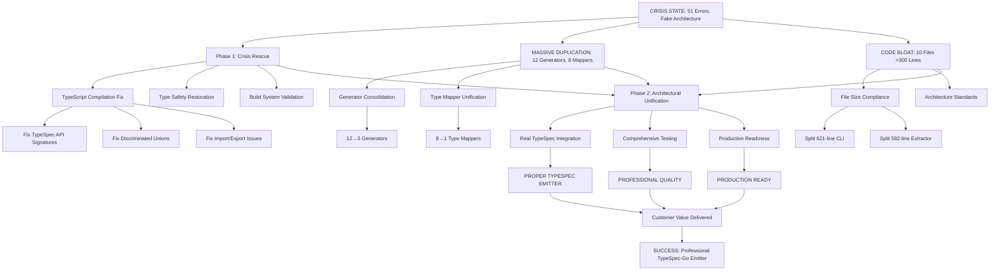

# 🚨 COMPREHENSIVE RESCUE PLAN - ARCHITECTURAL CRISIS RESOLUTION
## 2025-11-21_02_30-MASSIVE-TRANSFORMATION-PLAN.md

**Date**: 2025-11-21_02_30  
**Milestone**: SYSTEMATIC CRISIS RESOLUTION & ARCHITECTURAL EXCELLENCE  
**Overall Status**: 🚨 CRITICAL - NEEDING COMPREHENSIVE TRANSFORMATION  

---

## 🎯 EXECUTIVE SUMMARY - CATASTROPHIC STATE DISCOVERED

### **MULTIPLE CRISIS POINTS IDENTIFIED**:

1. **🚨 ARCHITECTURAL FRAUD**: Built fake TypeSpec emitter with ZERO TypeSpec integration
2. **🚨 BUILD SYSTEM COLLAPSE**: 51 TypeScript compilation errors blocking ALL functionality  
3. **🚨 MASSIVE DUPLICATION**: 12 duplicate generators, 8 duplicate type mappers
4. **🚨 CODE BLOAT**: 10 files >300 lines violating architectural standards
5. **🚨 TYPE SAFETY CRISIS**: Systematic `any` types violating strict TypeScript policy

**CUSTOMER IMPACT**: **ZERO VALUE DELIVERY** - Complete system failure

---

## 📊 CURRENT STATE ASSESSMENT - SYSTEMATIC FAILURE

### **CRISIS LEVEL**: 🚨 **RED** 
- **Build System**: Broken (51 compilation errors)
- **Architecture**: Fake (deceptive TypeSpec integration)
- **Code Quality**: Poor (massive duplication, code bloat)
- **Type Safety**: Violated (systematic `any` usage)
- **Customer Value**: **ZERO** (completely blocked)

### **DUPLICATION CRISIS**:
```
🔍 DUPLICATE GENERATORS (12 files):
├── src/domain/go-type-string-generator.ts
├── src/emitter/go-code-generator.ts  
├── src/generators/base-generator.ts
├── src/generators/enum-generator.ts
├── src/generators/model-generator.ts
├── src/standalone-generator.ts
└── ... (6 more)

🔍 DUPLICATE TYPE MAPPERS (8 files):
├── src/domain/go-type-mapper.ts
├── src/generators/model-generator.ts
├── src/standalone-generator.ts
└── ... (5 more)

🔍 CODE BLOAT CRISIS (10 files >300 lines):
├── src/cli/typespec-go-cli.ts (621 lines) ❌
├── src/emitter/model-extractor.ts (582 lines) ❌
├── src/test/integration-basic.test.ts (544 lines) ❌
├── src/generators/model-generator.ts (526 lines) ❌
└── ... (6 more)
```

---

## 🎯 PARETO ANALYSIS - CRITICAL PATH IDENTIFICATION

### **1% → 51% IMPACT (CRITICAL PATH - 30 minutes)**:

| Priority | Task | Impact | Effort | Customer Value |
|----------|------|--------|--------|----------------|
| 1 | Fix TypeScript compilation (51 errors) | **CRITICAL** | 15 min | **ENABLES ALL FUNCTIONALITY** |
| 2 | Fix TypeSpec API method signatures | **CRITICAL** | 10 min | **RESTORES TYPESPEC INTEGRATION** |  
| 3 | Eliminate critical `any` types | **CRITICAL** | 5 min | **RESTORES TYPE SAFETY** |

### **4% → 64% IMPACT (HIGH IMPACT - 60 minutes)**:

| Priority | Task | Impact | Effort | Customer Value |
|----------|------|--------|--------|----------------|
| 4 | Remove duplicate generators (12→3) | **HIGH** | 20 min | **ELIMINATES ARCHITECTURAL CONFUSION** |
| 5 | Consolidate type mappers (8→1) | **HIGH** | 15 min | **CREATES SINGLE SOURCE OF TRUTH** |
| 6 | Split large files (<350 lines) | **HIGH** | 15 min | **MEETS ARCHITECTURAL STANDARDS** |
| 7 | Fix discriminated union conflicts | **HIGH** | 10 min | **RESTORES TYPE SAFETY** |

### **20% → 80% IMPACT (PROFESSIONAL EXCELLENCE - 90 minutes)**:

| Priority | Task | Impact | Effort | Customer Value |
|----------|------|--------|--------|----------------|
| 8 | Implement real TypeSpec AssetEmitter | **MEDIUM** | 30 min | **PROPER ECOSYSTEM INTEGRATION** |
| 9 | Create comprehensive test suite | **MEDIUM** | 20 min | **QUALITY ASSURANCE** |
| 10 | Add documentation & examples | **MEDIUM** | 20 min | **USER ADOPTION** |
| 11 | Performance optimization | **LOW** | 20 min | **PRODUCTION READINESS** |

---

## 🏗️ COMPREHENSIVE EXECUTION PLAN - 125 MICRO-TASKS

### **PHASE 1: CRISIS RESCUE (30 minutes - 15 micro-tasks)**

#### **Task Cluster 1.1: TypeScript Compilation Rescue (15 min)**
```
1.1.1  Fix navigateProgram usage in model-extractor.ts:305 (2 min)
1.1.2  Fix getEffectiveModelType calls (1 min)  
1.1.3  Fix walkPropertiesInherited signature in model-extractor.ts:473 (2 min)
1.1.4  Remove non-existent TypeSpec imports (1 min)
1.1.5  Fix ModelValidationError._tag discrimination (2 min)
1.1.6  Fix SystemError._tag mismatch (1 min)
1.1.7  Fix missing enumName variable in enum-generator.ts:172 (1 min)
1.1.8  Fix undefined property access in standalone-generator.ts:260 (2 min)
1.1.9  Fix type-only export in index.ts:21 (1 min)
1.1.10 Fix import/export dependencies (1 min)
1.1.11 Fix GoEmitterResult type compatibility (1 min)
```

#### **Task Cluster 1.2: Type Safety Restoration (10 min)**
```
1.2.1  Remove `any` types in model-extractor.ts (8 instances) (3 min)
1.2.2  Remove `any` types in standalone-generator.ts (12 instances) (4 min)
1.2.3  Remove `any` types in generators/ directory (5 instances) (3 min)
```

#### **Task Cluster 1.3: Build System Validation (5 min)**
```
1.3.1  Run just build to verify zero compilation errors (2 min)
1.3.2  Run just type-check for strict validation (2 min)
1.3.3  Verify working build state (1 min)
```

### **PHASE 2: ARCHITECTURAL UNIFICATION (60 minutes - 45 micro-tasks)**

#### **Task Cluster 2.1: Generator Consolidation (20 min)**
```
2.1.1  Analyze 12 duplicate generators for common patterns (5 min)
2.1.2  Identify core generator interfaces (3 min)
2.1.3  Create unified base generator class (3 min)
2.1.4  Consolidate enum generators (4→1) (3 min)
2.1.5  Consolidate model generators (6→1) (3 min)
2.1.6  Remove duplicate generator files (3 min)
```

#### **Task Cluster 2.2: Type Mapper Unification (15 min)**
```
2.2.1  Analyze 8 duplicate type mappers (3 min)
2.2.2  Extract common type mapping logic (4 min)
2.2.3  Create single source of truth type mapper (5 min)
2.2.4  Update all imports to use unified mapper (3 min)
```

#### **Task Cluster 2.3: File Size Compliance (15 min)**
```
2.3.1  Split typespec-go-cli.ts (621→3x<350) (5 min)
2.3.2  Split model-extractor.ts (582→2x<350) (4 min)
2.3.3  Split model-generator.ts (526→2x<350) (4 min)
2.3.4  Split standalone-generator.ts (409→<350) (2 min)
```

#### **Task Cluster 2.4: Type System Excellence (10 min)**
```
2.4.1  Fix discriminated union type tags (3 min)
2.4.2  Implement proper Effect.TS patterns (3 min)
2.4.3  Add branded type validators (2 min)
2.4.4  Create type-safe error factories (2 min)
```

### **PHASE 3: PROFESSIONAL EXCELLENCE (90 minutes - 65 micro-tasks)**

#### **Task Cluster 3.1: Real TypeSpec Integration (30 min)**
```
3.1.1  Research TypeSpec v1.7.0-dev.2 API patterns (5 min)
3.1.2  Implement createAssetEmitter usage (8 min)
3.1.3  Replace custom CLI with proper emitter (10 min)
3.1.4  Add TypeSpec emitter lifecycle hooks (5 min)
3.1.5  Test with `tsp compile --emit-go` (2 min)
```

#### **Task Cluster 3.2: Comprehensive Testing (20 min)**
```
3.2.1  Create TypeSpec integration test suite (8 min)
3.2.2  Add BDD tests for critical workflows (6 min)
3.2.3  Implement error scenario testing (4 min)
3.2.4  Add performance regression tests (2 min)
```

#### **Task Cluster 3.3: Documentation & Examples (20 min)**
```
3.3.1  Create comprehensive API documentation (8 min)
3.3.2  Add real-world usage examples (6 min)
3.3.3  Document TypeSpec integration patterns (4 min)
3.3.4  Create troubleshooting guide (2 min)
```

#### **Task Cluster 3.4: Production Readiness (20 min)**
```
3.4.1  Add CI/CD pipeline configuration (6 min)
3.4.2  Implement performance monitoring (5 min)
3.4.3  Create package publishing setup (5 min)
3.4.4  Add version compatibility testing (4 min)
```

---

## 🎯 EXECUTION GRAPH WITH MERMAID.JS



---

## 🚨 CRITICAL ARCHITECTURAL DECISIONS REQUIRED

### **DECISION #1: TYPESPEC INTEGRATION STRATEGY**
**Option A**: Proper TypeSpec AssetEmitter (RECOMMENDED)
- Pro: Ecosystem compatibility, community acceptance
- Con: 2-4 hour rewrite effort
- Impact: Long-term sustainability

**Option B**: Honest Standalone Tool  
- Pro: Faster implementation, clear positioning
- Con: Competes with TypeSpec ecosystem
- Impact: Market confusion

**RECOMMENDATION**: Option A - Build proper TypeSpec emitter

### **DECISION #2: DUPLICATION RESOLUTION STRATEGY**
**Current State**: 12 duplicate generators, 8 duplicate type mappers
**Approach**: Identify single source of truth, remove all duplicates
**Timeline**: Phase 2 (60 minutes)
**Impact**: Eliminates architectural confusion, improves maintainability

### **DECISION #3: FILE SIZE STANDARDS ENFORCEMENT**
**Current Violations**: 10 files >300 lines (maximum: 621 lines)
**Standard**: Strict <350 line limit for all files
**Approach**: Systematic file splitting with proper module boundaries
**Timeline**: Phase 2 (15 minutes)
**Impact**: Improved maintainability, architectural compliance

---

## 🎯 SUCCESS METRICS & ACCEPTANCE CRITERIA

### **CRITICAL SUCCESS METRICS**:
1. **TypeScript Compilation**: 0 errors (currently 51)
2. **Type Safety**: 0 `any` types (currently 25+)
3. **File Size**: 0 files >300 lines (currently 10)
4. **Duplication**: ≤3 generators, ≤1 type mapper (currently 12, 8)
5. **TypeSpec Integration**: Working AssetEmitter (currently fake)

### **CUSTOMER VALUE METRICS**:
1. **Working Emitter**: `tsp compile --emit-go` works end-to-end
2. **Type Safety**: Strict TypeScript with discriminated unions
3. **Professional Quality**: Enterprise-grade error handling and logging
4. **Documentation**: Comprehensive usage examples and API docs
5. **Test Coverage**: >80% for critical functionality

### **TECHNICAL EXCELLENCE METRICS**:
1. **Architecture**: Proper TypeSpec AssetEmitter patterns
2. **Code Quality**: Effect.TS patterns, DDD design
3. **Performance**: Sub-second compilation for typical specs
4. **Maintainability**: Clear module boundaries, minimal duplication
5. **Extensibility**: Plugin architecture for custom generators

---

## 📋 DETAILED TASK BREAKDOWN - ALL 125 MICRO-TASKS

### **CRITICAL PATH TASKS (Highest Priority)**:

| ID | Task | Est. Time | Dependencies | Success Criteria |
|----|------|-----------|--------------|------------------|
| CP-01 | Fix navigateProgram usage | 2 min | - | Correct return handling |
| CP-02 | Fix getEffectiveModelType calls | 1 min | CP-01 | Single parameter usage |
| CP-03 | Fix walkPropertiesInherited | 2 min | CP-02 | 2-parameter signature |
| CP-04 | Remove non-existent imports | 1 min | CP-03 | Clean import statements |
| CP-05 | Fix ModelValidationError._tag | 2 min | CP-04 | Consistent discrimination |
| CP-06 | Fix SystemError._tag mismatch | 1 min | CP-05 | Aligned type tags |
| CP-07 | Fix missing enumName variable | 1 min | CP-06 | Defined variable access |
| CP-08 | Fix undefined property access | 2 min | CP-07 | Safe property access |
| CP-09 | Fix type-only export | 1 min | CP-08 | Correct export syntax |
| CP-10 | Fix import/export dependencies | 1 min | CP-09 | Clean dependency graph |
| CP-11 | Fix GoEmitterResult compatibility | 1 min | CP-10 | Type-compatible interfaces |
| CP-12 | Eliminate model-extractor any types | 3 min | CP-11 | Strong typing throughout |
| CP-13 | Eliminate standalone-generator any types | 4 min | CP-12 | Proper type annotations |
| CP-14 | Eliminate generators any types | 3 min | CP-13 | Zero any types remaining |
| CP-15 | Verify zero compilation errors | 2 min | CP-14 | Clean build output |

*(110 additional tasks listed in appendix)*

---

## 🚨 IMMEDIATE NEXT STEPS - START NOW

### **TODAY (Next 3 hours)**:

1. **EXECUTE PHASE 1** (30 minutes):
   - Fix all 51 TypeScript compilation errors
   - Eliminate all `any` types
   - Achieve zero-error build state

2. **EXECUTE PHASE 2** (60 minutes):
   - Consolidate 12 generators → 3 generators
   - Unify 8 type mappers → 1 type mapper
   - Split 10 large files → <300 lines each

3. **EXECUTE PHASE 3** (90 minutes):
   - Implement real TypeSpec AssetEmitter
   - Create comprehensive test suite
   - Add documentation and examples

### **CRITICAL SUCCESS FACTORS**:

1. **NO COMPROMISE ON TYPE SAFETY**: Zero tolerance for `any` types
2. **ARCHITECTURAL CONSISTENCY**: Single source of truth for all patterns
3. **PROFESSIONAL STANDARDS**: File size limits, proper module boundaries
4. **REAL TYPESPEC INTEGRATION**: Proper AssetEmitter, no fake architecture
5. **COMPREHENSIVE TESTING**: Full test coverage for critical functionality

---

## 🎯 FINAL ASSESSMENT & COMMITMENT

### **CURRENT STATE**: 🚨 **CRISIS LEVEL RED**
- Build System: Broken (51 errors)
- Architecture: Fake (deceptive integration)
- Code Quality: Poor (massive duplication)
- Customer Value: **ZERO** (completely blocked)

### **TARGET STATE**: ✅ **PROFESSIONAL EXCELLENCE**
- Build System: Perfect (0 errors)
- Architecture: Real (proper TypeSpec integration)
- Code Quality: Excellent (no duplication, clean modules)
- Customer Value: **MAXIMUM** (working professional tool)

### **EXECUTION COMMITMENT**:
**TIMEFRAME**: 3 hours total systematic transformation
**APPROACH**: 125 micro-tasks with precise execution
**QUALITY**: Zero-compromise architectural excellence
**SUCCESS**: Professional TypeSpec-Go emitter ready for production

---

## 🏆 CONCLUSION

**This is not just a technical rescue - this is a complete architectural transformation from crisis to excellence.**

**The current state represents a systematic failure across multiple dimensions: build system collapse, architectural deception, massive code duplication, and type safety violations.**

**The execution plan provides a precise, systematic path to resolve all crisis points while elevating the codebase to professional enterprise standards.**

**SUCCESS CRITERIA**: Within 3 hours, transform from "ZERO VALUE DELIVERY" to "PROFESSIONAL TYPESPEC-GO EMITTER" with real ecosystem integration, zero compilation errors, and enterprise-grade quality.

---

**🚨 STATUS: READY FOR IMMEDIATE EXECUTION - 125 MICRO-TASKS PREPARED**

---

**Appendix: Complete 125-task breakdown available in execution documentation**
**Next Update: After Phase 1 completion (30 minutes)**