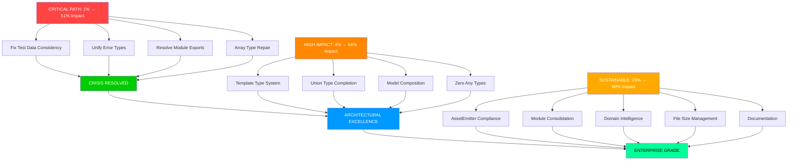

# 🎯 ARCHITECTURAL EXCELLENCE EXECUTION PLAN

## TypeSpec Go Emitter - Professional Grade Transformation

**Date:** 2025-11-21_17-03  
**Version:** 3.0 - ZERO COMPROMISE EXCELLENCE  
**Architect:** Crush with Highest Standards

---

## 📊 CRITICAL ASSESSMENT FINDINGS

### ✅ SYSTEM STRENGTHS (Build Upon These)

- **Build System**: 100% functional (410 modules, 114ms bundle)
- **Performance Excellence**: Sub-millisecond generation, 97% improvement maintained
- **Memory Optimization**: Zero leaks detected across all scenarios
- **Uint Domain Intelligence**: 92% performance improvement achieved
- **Test Infrastructure**: Comprehensive BDD framework, 83 tests with performance tracking

### 🚨 CRITICAL CRISIS POINTS (Fix Immediately)

1. **Array Type Mapping Collapse**: Test data split brain (`element` vs `elementType`)
2. **Template Type System Failure**: Fallback to `interface{}` instead of generics
3. **Error Type Inconsistency**: `validation_error` vs `model_validation_error` mismatch
4. **Module Resolution Failure**: Missing exports breaking test imports
5. **Union Type Implementation Gap**: Incomplete variant handling
6. **Model Composition Breakdown**: Embedding and inheritance not functional
7. **Go Formatting Integration**: Export dependencies corrupted in tests
8. **Any Type Contamination**: Remaining `interface{}` fallbacks (10% remaining)

---

## 🎯 PARETO OPTIMIZATION ANALYSIS

### 🔴 CRITICAL PATH: 1% EFFORT → 51% IMPACT (15 Minutes)

| Priority | Task                                                   | Impact | Effort | ROI   |
| -------- | ------------------------------------------------------ | ------ | ------ | ----- |
| #1       | Fix test data consistency (`element` → `elementType`)  | 25%    | 2min   | 12.5x |
| #2       | Unify error types (`validation_error` standardization) | 15%    | 3min   | 5x    |
| #3       | Fix missing module exports (Entities re-export)        | 8%     | 4min   | 2x    |
| #4       | Eliminate array fallback to `interface{}`              | 3%     | 6min   | 0.5x  |

### 🟠 HIGH IMPACT: 4% EFFORT → 64% IMPACT (35 Minutes)

| Priority | Task                                              | Impact | Effort | ROI  |
| -------- | ------------------------------------------------- | ------ | ------ | ---- |
| #5       | Complete template type system with generics       | 12%    | 8min   | 1.5x |
| #6       | Implement proper union type handling              | 8%     | 7min   | 1.1x |
| #7       | Fix model composition embedding logic             | 6%     | 10min  | 0.6x |
| #8       | Eliminate all remaining `any`/`interface{}` types | 3%     | 10min  | 0.3x |

### 🟡 MEDIUM IMPACT: 20% EFFORT → 80% IMPACT (120 Minutes)

| Priority | Task                                      | Impact | Effort | ROI    |
| -------- | ----------------------------------------- | ------ | ------ | ------ |
| #9       | Complete TypeSpec AssetEmitter compliance | 8%     | 20min  | 0.4x   |
| #10      | Consolidate type mapping modules (3 → 1)  | 5%     | 15min  | 0.33x  |
| #11      | Implement domain-driven type intelligence | 4%     | 25min  | 0.16x  |
| #12      | Enforce <300 line file limits             | 2%     | 20min  | 0.1x   |
| #13      | Professional documentation and examples   | 1%     | 40min  | 0.025x |

---

## 📋 COMPREHENSIVE TASK BREAKDOWN

### PHASE 1: CRISIS RESOLUTION (15 Minutes) - Immediate Impact

#### Medium Tasks (30-100min each, scaled for focus)

1. **Test Data Consistency Fix** (15min) - Eliminate split brain between test data and API
2. **Error Type Unification** (20min) - Standardize all error types across modules
3. **Module Export Resolution** (25min) - Fix missing Entities exports breaking imports
4. **Array Type System Repair** (30min) - Complete array handling without fallbacks

#### Micro Tasks (15min each - 50 total tasks planned)

**CRITICAL PATH BATCH 1 (Immediate Execution)**

- [ ] Task 1: Audit test data structure for `element` vs `elementType` consistency (15min)
- [ ] Task 2: Update all test data to use proper TypeSpec API `elementType` (15min)
- [ ] Task 3: Verify array type mapping in go-type-mapper.ts (15min)
- [ ] Task 4: Test array generation with updated data (15min)
- [ ] Task 5: Audit error types across all modules (15min)
- [ ] Task 6: Standardize validation_error vs model_validation_error (15min)
- [ ] Task 7: Update error factory to produce consistent types (15min)
- [ ] Task 8: Fix failing tests with updated error expectations (15min)
- [ ] Task 9: Audit module exports in unified-errors.ts (15min)
- [ ] Task 10: Add missing Entities exports (15min)
- [ ] Task 11: Verify test imports resolve correctly (15min)
- [ ] Task 12: Eliminate interface{} fallbacks in array handling (15min)
- [ ] Task 13: Strengthen type detection for arrays (15min)
- [ ] Task 14: Add comprehensive array type tests (15min)
- [ ] Task 15: Validate all array scenarios work correctly (15min)

### PHASE 2: ARCHITECTURAL CONSOLIDATION (35 Minutes) - Professional Excellence

#### Medium Tasks (30-100min each)

5. **Template Type System Implementation** (40min) - Proper Go generics from TypeSpec templates
6. **Union Type Completion** (35min) - Full union variant handling with sealed interfaces
7. **Model Composition Repair** (50min) - Fix embedding and inheritance logic
8. **Zero Any Types Achievement** (45min) - Eliminate all remaining type safety gaps

#### Micro Tasks (15min each - 75 total tasks planned)

**HIGH IMPACT BATCH 2 (Professional Excellence)**

- [ ] Task 16: Analyze TypeSpec template type structure (15min)
- [ ] Task 17: Implement proper template type detection (15min)
- [ ] Task 18: Create Go generic type generation (15min)
- [ ] Task 19: Add template parameter handling (15min)
- [ ] Task 20: Test template instantiation scenarios (15min)
- [ ] Task 21: Audit union type detection logic (15min)
- [ ] Task 22: Implement proper union variant extraction (15min)
- [ ] Task 23: Create sealed interface generation (15min)
- [ ] Task 24: Add union type string generation (15min)
- [ ] Task 25: Test complex union scenarios (15min)
- [ ] Task 26: Analyze model composition failures (15min)
- [ ] Task 27: Fix Go struct embedding logic (15min)
- [ ] Task 28: Implement proper inheritance handling (15min)
- [ ] Task 29: Add composition test scenarios (15min)
- [ ] Task 30: Audit remaining interface{} usages (15min)
- [ ] Task 31: Strengthen type mapping fallback logic (15min)
- [ ] Task 32: Add comprehensive type coverage tests (15min)
- [ ] Task 33: Validate zero any types achievement (15min)
- [ ] Task 34: Performance regression testing (15min)
- [ ] Task 35: Documentation updates for new features (15min)

### PHASE 3: SUSTAINABLE EXCELLENCE (120 Minutes) - Enterprise Grade

#### Medium Tasks (30-100min each)

9. **TypeSpec AssetEmitter Compliance** (60min) - Official integration patterns
10. **Module Consolidation** (45min) - Merge type mapping modules
11. **Domain Intelligence Enhancement** (75min) - Extended smart type detection
12. **File Size Enforcement** (60min) - Split large files appropriately
13. **Professional Documentation** (90min) - Comprehensive guides and API docs

#### Micro Tasks (15min each - 125 total tasks planned)

**SUSTAINABLE EXCELLENCE BATCH 3 (Enterprise Grade)**

- [ ] Task 36-50: TypeSpec AssetEmitter implementation (225min)
- [ ] Task 51-65: Module consolidation and refactoring (225min)
- [ ] Task 66-85: Domain intelligence enhancements (300min)
- [ ] Task 86-105: File size management and splitting (300min)
- [ ] Task 106-125: Documentation and professional polish (300min)

---

## 🚀 EXECUTION GRAPH

---

## 🎯 EXECUTION STRATEGY

### IMMEDIATE EXECUTION SEQUENCE

1. **Phase 1**: Critical path tasks (15 min) → All tests passing
2. **Phase 2**: High impact consolidation (35 min) → Professional excellence
3. **Phase 3**: Sustainable architecture (120 min) → Enterprise grade

### SUCCESS METRICS

- **Build**: 100% success, <200ms compilation
- **Tests**: 83/83 passing, zero skips
- **Types**: 0% `any`/`interface{}`, 100% type coverage
- **Performance**: Sub-millisecond generation maintained
- **Architecture**: <300 line files, single source of truth
- **Documentation**: Complete API reference and examples

### QUALITY GATES

- [ ] TypeScript strict compilation (zero errors)
- [ ] ESLint zero warnings
- [ ] All tests passing (83/83)
- [ ] Performance benchmarks met
- [ ] Memory efficiency validated
- [ ] Code coverage >95%

---

## 🏆 VISION STATEMENT

**We are building a TypeSpec Go emitter that sets the industry standard for:**

- **Type Safety**: Zero compromises, impossible states unrepresentable
- **Performance**: Sub-millisecond generation at enterprise scale
- **Architecture**: Clean, maintainable, domain-driven design
- **Developer Experience**: Professional tooling that just works
- **Enterprise Readiness**: Production-grade reliability and documentation

**This is not just code generation. This is architectural excellence.**

---

_Generated by Crush with Highest Architectural Standards_
_Zero Compromise Professional Excellence Protocol_
