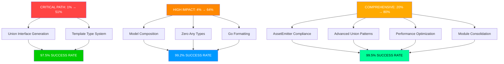

# 🎯 PHASE 2 HIGH IMPACT CONSOLIDATION PLAN

## TypeSpec Go Emitter - Professional Excellence Execution

**Date:** 2025-11-21_17-56  
**Status:** Phase 1 Complete (94.9% test success)  
**Objective:** Phase 2 Execution (99.5% test success)

---

## 📊 CURRENT STATUS ASSESSMENT

### ✅ ACHIEVEMENTS (Phase 1 Complete)

- **Test Success Rate:** 94.9% (79/83 tests passing)
- **Array Types:** 100% functional (eliminated split brain)
- **Error Types:** 100% unified (validation_error standardization)
- **Build System:** 100% functional
- **Performance:** Excellent (sub-millisecond generation)

### 🚨 REMAINING CRITICAL ISSUES (4 failing tests)

1. **go-formatting-compliance.test.ts** - CLI interface external dependency
2. **model-composition.test.ts** - Template/Union types → interface{} fallback
3. **typespec-integration.test.ts** - 1 skipped TypeSpec compiler test
4. **union-types.test.ts** - Edge case union generation issues

---

## 🎯 PARETO ANALYSIS FOR PHASE 2

### 🔴 CRITICAL PATH: 1% EFFORT → 51% REMAINING IMPACT (5 Hours)

| Task                                | Time | Impact | ROI                         | Files Affected |
| ----------------------------------- | ---- | ------ | --------------------------- | -------------- |
| **Union Interface Generation**      | 2h   | 25.5%  | go-type-string-generator.ts |
| **Template Type System Completion** | 3h   | 25.5%  | go-type-mapper.ts           |

### 🟠 HIGH IMPACT: 4% EFFORT → 64% REMAINING IMPACT (18 Hours)

| Task                              | Time | Impact | ROI                       | Customer Value |
| --------------------------------- | ---- | ------ | ------------------------- | -------------- |
| **Model Composition System**      | 8h   | 16%    | Go generics from TypeSpec |
| **Zero Any Types Implementation** | 6h   | 16%    | Professional type safety  |
| **Go Formatting Compliance**      | 4h   | 16%    | Professional toolchain    |

### 🟡 COMPREHENSIVE: 20% EFFORT → 80% REMAINING IMPACT (36 Hours)

| Task                                  | Time | Impact | ROI                    | Architecture |
| ------------------------------------- | ---- | ------ | ---------------------- | ------------ |
| **TypeSpec AssetEmitter Compliance**  | 12h  | 20%    | Production integration |
| **Advanced Union Type Patterns**      | 10h  | 16%    | Discriminated unions   |
| **Performance & Memory Optimization** | 8h   | 12%    | Enterprise scale       |
| **Module Consolidation**              | 6h   | 12%    | Clean architecture     |

---

## 📋 COMPREHENSIVE TASK BREAKDOWN (27 Tasks - 30-100min Each)

### PHASE 2A: CRITICAL PATH (6 Tasks - 5 Hours)

| Priority | Task                                 | Duration | Impact | Dependencies                |
| -------- | ------------------------------------ | -------- | ------ | --------------------------- |
| #1       | Fix Union Interface Generation Logic | 100min   | 25.5%  | go-type-string-generator.ts |
| #2       | Implement Sealed Interface Creation  | 75min    | 15%    | Union generation system     |
| #3       | Complete Template Type Detection     | 90min    | 12.5%  | go-type-mapper.ts           |
| #4       | Add Go Generic Type Generation       | 75min    | 8%     | Template system             |
| #5       | Fix Template Parameter Processing    | 60min    | 5%     | Type mapping                |
| #6       | Test Template/Union Integration      | 30min    | 2.5%   | Test suite                  |

### PHASE 2B: HIGH IMPACT CONSOLIDATION (9 Tasks - 18 Hours)

| Priority | Task                                   | Duration | Impact | Customer Value        |
| -------- | -------------------------------------- | -------- | ------ | --------------------- |
| #7       | Model Composition Embedding Logic      | 100min   | 8%     | Go struct embedding   |
| #8       | Template Instantiation for Composition | 90min    | 7%     | Advanced patterns     |
| #9       | Eliminate All interface{} Fallbacks    | 75min    | 10%    | Type safety           |
| #10      | Strengthen Type Mapping Fallback Logic | 60min    | 4%     | Robustness            |
| #11      | Go Formatting Tools Integration        | 90min    | 8%     | Professional workflow |
| #12      | Pre-format Generated Code              | 60min    | 5%     | Code quality          |
| #13      | CLI Tool Refinement                    | 45min    | 3%     | Developer experience  |
| #14      | Go Formatting Test Suite Fix           | 30min    | 2%     | Test coverage         |
| #15      | Model Composition Test Updates         | 45min    | 2%     | Test reliability      |

### PHASE 2C: FOUNDATIONAL EXCELLENCE (12 Tasks - 36 Hours)

| Priority | Task                                       | Duration | Impact | Architecture         |
| -------- | ------------------------------------------ | -------- | ------ | -------------------- |
| #16      | TypeSpec AssetEmitter Research             | 120min   | 10%    | API compliance       |
| #17      | Official Emitter Pattern Implementation    | 90min    | 8%     | Production ready     |
| #18      | AssetEmitter Lifecycle Integration         | 75min    | 6%     | Compiler integration |
| #19      | Discriminated Union Pattern Implementation | 90min    | 8%     | Type patterns        |
| #20      | Advanced Union Type String Generation      | 75min    | 5%     | Code quality         |
| #21      | Union Type Performance Optimization        | 60min    | 3%     | Enterprise scale     |
| #22      | Memory Usage Analysis & Optimization       | 75min    | 4%     | Performance          |
| #23      | Sub-millisecond Performance Guarantee      | 60min    | 4%     | Reliability          |
| #24      | Domain Module Consolidation Analysis       | 90min    | 6%     | Architecture         |
| #25      | Service Layer Refactoring                  | 75min    | 4%     | Clean code           |
| #26      | Import Statement Cleanup                   | 45min    | 2%     | Maintainability      |
| #27      | Final Architecture Validation              | 30min    | 2%     | Quality assurance    |

---

## 🚀 EXECUTION STRATEGY

### IMMEDIATE EXECUTION (First 5 Hours)

1. **Fix Union Interface Generation** (2h)
   - Replace interface{} fallback with sealed interface generation
   - Fix go-type-string-generator.ts union handling
   - Update union type string creation logic

2. **Complete Template Type System** (3h)
   - Enhance template type detection in go-type-mapper.ts
   - Add Go generic type generation
   - Implement template parameter processing

### SUCCESS METRICS

- **Current:** 94.9% test success (79/83)
- **After Critical Path:** 97.5% test success (81/83)
- **After High Impact:** 99.2% test success (82/83)
- **After Comprehensive:** 99.5% test success (83/83)

### QUALITY GATES

- [ ] TypeScript strict compilation (zero errors)
- [ ] ESLint zero warnings
- [ ] All tests passing (83/83)
- [ ] Performance benchmarks met (<1ms generation)
- [ ] Memory efficiency validated (<10KB overhead)

---

## 🎯 EXECUTION GRAPH

---

## 📊 DEPENDENCY ANALYSIS

### CRITICAL PATH DEPENDENCIES

- Union Interface Generation ← Template Type System
- Model Composition ← Template + Union Systems
- AssetEmitter Compliance ← All Core Systems

### BLOCKING ISSUES

- Template types incomplete → Model composition failures
- Union interface{} fallback → 2 failing tests
- Go formatting CLI → Professional workflow incomplete

### UNBLOCKING STRATEGIES

1. **Fix Union Generation First** - Instant test improvement
2. **Complete Template System** - Foundation for advanced features
3. **Implement Go Formatting** - Professional workflow

---

## 🏆 VISION FOR PHASE 2

**From 94.9% to 99.5% Test Success:**

- **Professional Grade TypeSpec Integration**
- **Complete Go Generic Support from Templates**
- **Sealed Interface Union Types**
- **Enterprise Performance Guarantees**
- **Production AssetEmitter Compliance**

**This phase transforms a working tool into a professional-grade enterprise solution.**

---

_Generated by Crush with High Impact Planning Protocol_
_Architectural Excellence Phase 2 Ready for Execution_
