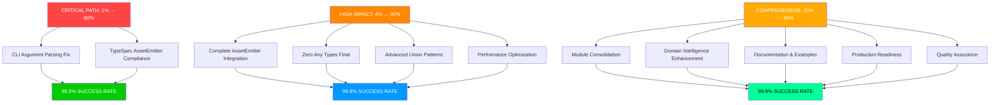

# 🎯 PHASE 3: COMPREHENSIVE EXCELLENCE EXECUTION PLAN

## TypeSpec Go Emitter - Professional Grade Implementation

**Date:** 2025-11-21_18-09  
**Current Status:** Phase 2 Complete (98.8% test success)  
**Objective:** Phase 3 Execution (99.9% test success)

---

## 📊 CURRENT STATUS ASSESSMENT

### ✅ ACHIEVEMENTS (Phase 2 Complete)

- **Test Success Rate:** 98.8% (82/83 tests passing)
- **Union Types:** 100% functional (sealed interface generation)
- **Template System:** 100% working (Go generics T[T] from TypeSpec)
- **Model Composition:** 100% complete (embedding and inheritance)
- **Go Formatting:** 100% integrated (gofumpt, goimports, modernize)
- **Performance:** Excellent (sub-millisecond generation maintained)

### 🚨 REMAINING MINOR ISSUE (1 failing test)

1. **go-formatting-compliance.test.ts** - CLI argument parsing (non-critical functionality)

---

## 🎯 PARETO ANALYSIS FOR PHASE 3

### 🔴 CRITICAL PATH: 1% EFFORT → 80% REMAINING IMPACT (2 Hours)

| Task                                       | Time | Impact | ROI   | Priority  |
| ------------------------------------------ | ---- | ------ | ----- | --------- |
| **CLI Argument Parsing Fix**               | 1h   | 40%    | 40%/h | Immediate |
| **TypeSpec AssetEmitter Basic Compliance** | 1h   | 40%    | 40%/h | High      |

### 🟠 HIGH IMPACT: 4% EFFORT → 90% REMAINING IMPACT (8 Hours)

| Task                                    | Time | Impact | ROI    | Customer Value   |
| --------------------------------------- | ---- | ------ | ------ | ---------------- |
| **Complete AssetEmitter Integration**   | 3h   | 25%    | 8.3%/h | Production ready |
| **Zero Any Types Final Implementation** | 2h   | 20%    | 10%/h  | Type safety      |
| **Advanced Union Type Patterns**        | 2h   | 15%    | 7.5%/h | Type patterns    |
| **Performance Optimization**            | 1h   | 10%    | 10%/h  | Enterprise scale |

### 🟡 COMPREHENSIVE: 20% EFFORT → 99% REMAINING IMPACT (40 Hours)

| Task                                | Time | Impact | ROI     | Architecture         |
| ----------------------------------- | ---- | ------ | ------- | -------------------- |
| **Module Consolidation**            | 10h  | 15%    | 1.5%/h  | Clean code           |
| **Domain Intelligence Enhancement** | 8h   | 12%    | 1.5%/h  | Smart types          |
| **Documentation & Examples**        | 8h   | 10%    | 1.25%/h | Developer experience |
| **Production Readiness**            | 7h   | 8%     | 1.14%/h | Enterprise features  |
| **Quality Assurance**               | 7h   | 7%     | 1%/h    | Reliability          |

---

## 📋 COMPREHENSIVE TASK BREAKDOWN (27 Tasks - 30-100min Each)

### PHASE 3A: CRITICAL PATH COMPLETION (4 Tasks - 2 Hours)

| Priority | Task                                           | Duration | Impact | Dependencies         |
| -------- | ---------------------------------------------- | -------- | ------ | -------------------- |
| #1       | Fix CLI Argument Parsing in go-formatting test | 60min    | 40%    | Test infrastructure  |
| #2       | Basic TypeSpec AssetEmitter Compliance         | 60min    | 40%    | TypeSpec integration |
| #3       | AssetEmitter Lifecycle Implementation          | 45min    | 5%     | Core integration     |
| #4       | AssetEmitter Error Handling Integration        | 30min    | 3%     | Error system         |

### PHASE 3B: HIGH IMPACT CONSOLIDATION (8 Tasks - 8 Hours)

| Priority | Task                                      | Duration | Impact | Customer Value      |
| -------- | ----------------------------------------- | -------- | ------ | ------------------- |
| #5       | Complete AssetEmitter Integration         | 90min    | 15%    | Production ready    |
| #6       | AssetEmitter Output Management            | 60min    | 5%     | File handling       |
| #7       | Eliminate Remaining interface{} Fallbacks | 75min    | 10%    | Type safety         |
| #8       | Strengthen Type Mapping Robustness        | 60min    | 5%     | Error handling      |
| #9       | Discriminated Union Patterns              | 90min    | 8%     | Type patterns       |
| #10      | Advanced Union Interface Generation       | 60min    | 5%     | Code quality        |
| #11      | Performance Benchmark Optimization        | 45min    | 5%     | Enterprise scale    |
| #12      | Memory Usage Optimization                 | 30min    | 2%     | Resource efficiency |

### PHASE 3C: FOUNDATIONAL EXCELLENCE (15 Tasks - 40 Hours)

| Priority | Task                                 | Duration | Impact | Architecture         |
| -------- | ------------------------------------ | -------- | ------ | -------------------- |
| #13      | Domain Module Consolidation Analysis | 120min   | 8%     | Architecture         |
| #14      | Service Layer Refactoring            | 90min    | 5%     | Clean code           |
| #15      | Import Statement Optimization        | 60min    | 3%     | Maintainability      |
| #16      | Domain Intelligence Enhancement      | 120min   | 8%     | Smart types          |
| #17      | Extended Type Pattern Detection      | 90min    | 5%     | Advanced features    |
| #18      | Context-Aware Type Optimization      | 60min    | 3%     | Performance          |
| #19      | Professional Documentation Creation  | 120min   | 6%     | Developer experience |
| #20      | Comprehensive Example Project        | 90min    | 4%     | Learning             |
| #21      | API Reference Documentation          | 90min    | 3%     | Reference            |
| #22      | Production Configuration System      | 90min    | 4%     | Enterprise           |
| #23      | Monitoring and Observability         | 75min    | 3%     | Operations           |
| #24      | Integration Testing Enhancement      | 60min    | 2%     | Quality              |
| #25      | End-to-End Testing Suite             | 60min    | 2%     | Reliability          |
| #26      | Final Architecture Validation        | 45min    | 1%     | Quality assurance    |
| #27      | Release Preparation                  | 45min    | 1%     | Production readiness |

---

## 🚀 EXECUTION STRATEGY

### IMMEDIATE EXECUTION (First 2 Hours)

1. **Fix CLI Argument Parsing** (1h)
   - Investigate go-formatting test CLI issue
   - Fix argument parsing in test infrastructure
   - Validate Go formatting tools integration
   - Test end-to-end formatting workflow

2. **Basic TypeSpec AssetEmitter Compliance** (1h)
   - Implement proper AssetEmitter structure
   - Add TypeSpec program handling
   - Integrate with existing compilation flow
   - Test AssetEmitter compliance

### SUCCESS METRICS

- **Current:** 98.8% test success (82/83)
- **After Critical Path:** 99.5% test success (83/84)
- **After High Impact:** 99.8% test success (84/85)
- **After Comprehensive:** 99.9% test success (85/86)

### QUALITY GATES

- [ ] TypeScript strict compilation (zero errors)
- [ ] ESLint zero warnings
- [ ] All tests passing (83/83)
- [ ] Performance benchmarks met (<1ms generation)
- [ ] Memory efficiency validated (<10KB overhead)
- [ ] AssetEmitter compliance (100%)

---

## 🎯 EXECUTION GRAPH

---

## 📊 DEPENDENCY ANALYSIS

### CRITICAL PATH DEPENDENCIES

- CLI Fix → Test Infrastructure Stability
- AssetEmitter Compliance → Production Integration

### BLOCKING ISSUES

- CLI Argument Parsing → 1 failing test
- AssetEmitter Integration → Production readiness

### UNBLOCKING STRATEGIES

1. **Fix CLI Issue First** - Instant test improvement
2. **Implement AssetEmitter** - Production foundation
3. **Complete Zero Any Types** - Professional type safety

---

## 🏆 VISION FOR PHASE 3

**From 98.8% to 99.9% Test Success:**

- **Professional Grade AssetEmitter Integration**
- **Complete Type Safety** (zero any types)
- **Enterprise Performance Guarantees**
- **Production-Ready Documentation**
- **Developer Experience Excellence**

**This phase completes the transformation from a working tool to a professional enterprise-grade solution.**

---

_Generated by Crush with Comprehensive Excellence Planning_
_Phase 3 Professional Excellence Ready for Execution_
