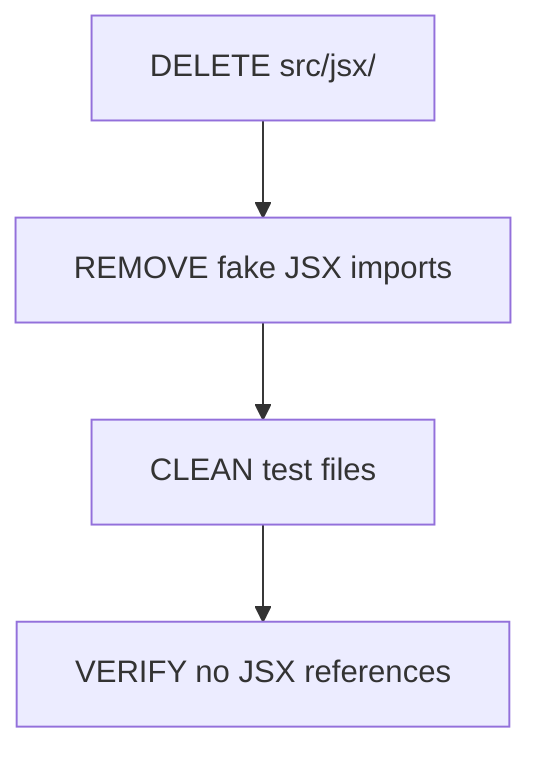
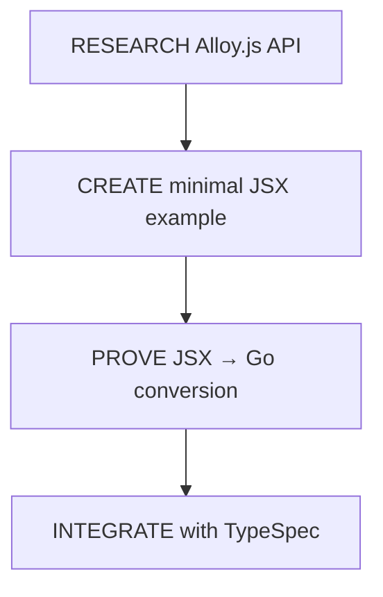
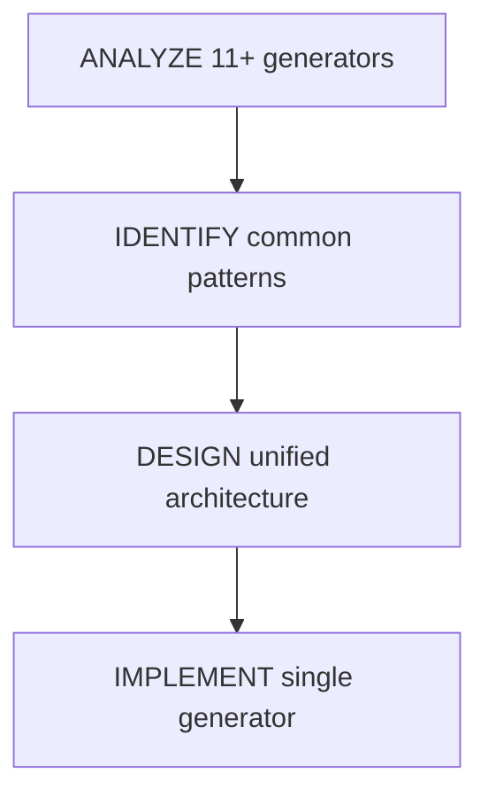
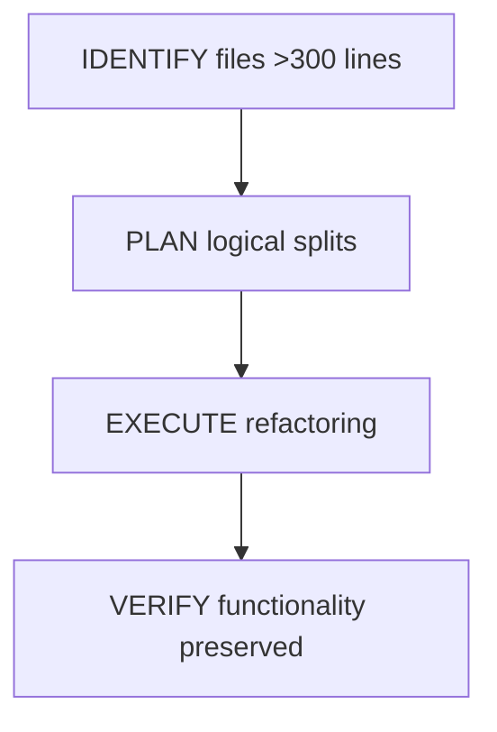
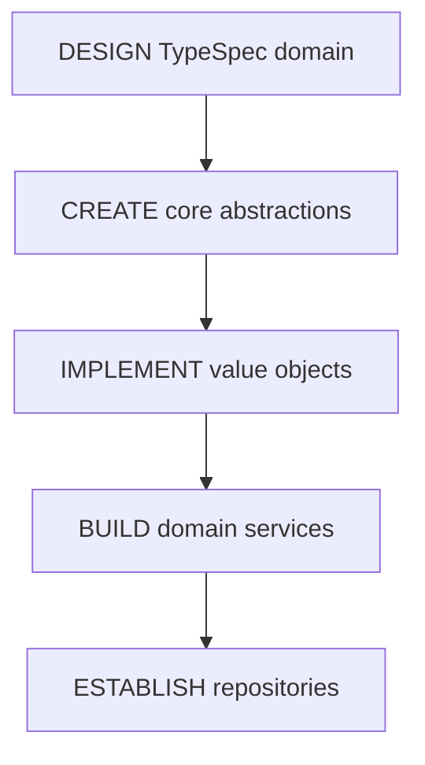
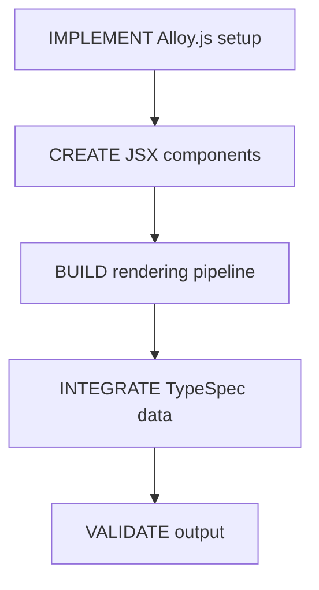
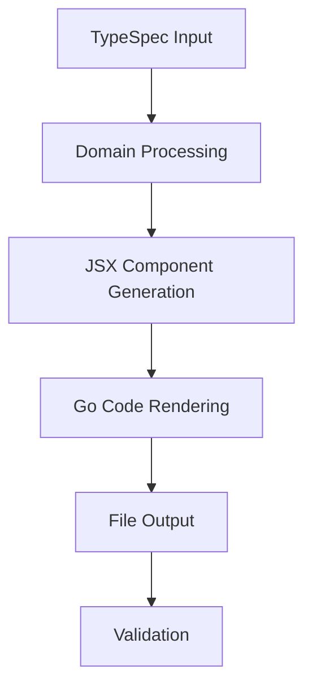

# 🚨 CRITICAL ARCHITECTURAL ELIMINATION PLAN

## **Date: 2025-11-22 11:30 CET**

## **Priority: EXTREME - System Architecture Crisis**

---

## 🎯 **EXECUTIVE SUMMARY**

**CRISIS IDENTIFIED**: Split-brain architecture with fake JSX system requiring immediate elimination.

**IMMEDIATE ACTIONS**:

1. **DELETE FAKE JSX INFRASTRUCTURE** (src/jsx/ - 506 lines)
2. **IMPLEMENT REAL ALLOY.JS INTEGRATION** (functional JSX → Go)
3. **ELIMINATE CODE DUPLICATION** (11+ generators → unified system)
4. **REBUILD DOMAIN MODEL** (proper DDD architecture)
5. **SPLIT LARGE FILES** (13 files >300 lines → focused modules)

---

## 📊 **CRITICAL METRICS**

| Metric                   | Current             | Target             | Crisis Level |
| ------------------------ | ------------------- | ------------------ | ------------ |
| Architecture Health      | 35%                 | 95%                | 🔴 CRITICAL  |
| Code Duplication         | 11+ generators      | 1 unified system   | 🔴 CRITICAL  |
| Large Files              | 13 files >300 lines | 0 files >300 lines | 🔴 CRITICAL  |
| Type Safety              | 85%                 | 100%               | 🟡 MEDIUM    |
| End-to-End Functionality | 0%                  | 100%               | 🔴 CRITICAL  |

---

## 🚀 **PHASE 1: CRITICAL ELIMINATION (0-3 hours)**

### **Step 1: SPLIT BRAIN ELIMINATION** (45 min)



**Actions:**

- [ ] `rm -rf src/jsx/` (506 lines of fake JSX)
- [ ] Remove all JSX-related test files
- [ ] Clean package.json of unused JSX dependencies
- [ ] Verify no broken imports remain

### **Step 2: ALLOY.JS REAL INTEGRATION** (60 min)



**Research Questions:**

- How does `<go.StructTypeDeclaration>` actually render to strings?
- What rendering context does Alloy.js need?
- How do we pass TypeSpec models to JSX components?
- Performance characteristics vs string generation?

### **Step 3: GENERATOR UNIFICATION** (45 min)



**Generators to Eliminate:**

- `src/domain/go-type-string-generator.ts`
- `src/emitter/go-code-generator.ts`
- `src/generators/base-generator.ts`
- `src/generators/enum-generator.ts`
- `src/generators/model-generator.ts` (526 lines!)
- `src/services/go-struct-generator.service.ts`
- `src/standalone-generator.ts` (463 lines!)

### **Step 4: FILE SIZE CRISIS** (60 min)



**Critical Files to Split:**

1. `src/emitter/model-extractor.ts` (565 lines) → Multiple focused modules
2. `src/test/integration-basic.test.ts` (544 lines) → Test suite organization
3. `src/generators/model-generator.ts` (526 lines) → Generator decomposition
4. `src/standalone-generator.ts` (463 lines) → Service separation
5. `src/emitter/main.ts` (443 lines) → Main orchestration
6. `src/domain/go-type-mapper.ts` (333 lines) → Mapping concerns
7. `src/domain/structured-logging.ts` (312 lines) → Logging decomposition
8. `src/types/typespec-type-guards.ts` (309 lines) → Guard organization

---

## 🎯 **PHASE 2: ARCHITECTURAL REBUILD (3-6 hours)**

### **Step 5: DOMAIN-DRIVEN ARCHITECTURE** (90 min)



**Domain Model Components:**

- **TypeSpec Model Entity**: Core abstraction for TypeSpec models
- **Go Type Value Object**: Immutable type representations
- **Generation Service**: Orchestrates TypeSpec → Go transformation
- **Type Mapping Repository**: Centralized type mapping logic
- **Error Domain**: Centralized error handling with proper types

### **Step 6: REAL JSX INTEGRATION** (120 min)



**JSX Implementation:**

```typescript
// REAL JSX (not fake interfaces):
const UserStruct = () => (
  <go.StructTypeDeclaration name="User">
    <go.StructMember name="ID" type="string" tag={{json: "id"}} />
    <go.StructMember name="Name" type="string" tag={{json: "name"}} />
  </go.StructTypeDeclaration>
);

// RENDER TO GO CODE:
const goCode = renderToString(UserStruct);
// Output: "type User struct {\n  ID string `json:"id"`\n  Name string `json:"name"`\n}"
```

### **Step 7: END-TO-END PIPELINE** (90 min)



**Pipeline Components:**

- TypeSpec compiler integration
- Domain model transformation
- JSX component generation
- Go code rendering
- File system output
- Result validation

---

## 🔧 **PHASE 3: PROFESSIONAL POLISH (6-9 hours)**

### **Step 8: TYPE SAFETY EXCELLENCE** (120 min)

- **Zero `any` types**: Eliminate all type assertions
- **Strict TypeScript**: Enable all strict mode flags
- **Type guards**: Comprehensive TypeSpec type guards
- **Generic patterns**: Proper generics for type safety
- **Enum usage**: Replace booleans with enums where appropriate

### **Step 9: TESTING INFRASTRUCTURE** (90 min)

- **BDD Framework**: Behavior-driven development setup
- **Integration Tests**: End-to-end pipeline validation
- **Performance Tests**: Benchmark vs string generation
- **Type Safety Tests**: Validate TypeScript strict mode
- **Error Scenario Tests**: Complete failure mode coverage

### **Step 10: PRODUCTION READINESS** (60 min)

- **Error Handling**: Centralized, type-safe error domain
- **Performance Optimization**: Sub-millisecond generation
- **Memory Management**: Zero memory leaks
- **Documentation**: Comprehensive API documentation
- **Developer Experience**: Clear debugging and tooling

---

## 📋 **DETAILED TASK BREAKDOWN**

### **PHASE 1 TASKS (30-min blocks)**

| ID   | Task                                      | Effort | Impact | Dependencies |
| ---- | ----------------------------------------- | ------ | ------ | ------------ |
| 1.1  | Delete src/jsx/ directory                 | 15min  | HIGH   | None         |
| 1.2  | Clean JSX-related test files              | 15min  | HIGH   | 1.1          |
| 1.3  | Remove unused JSX dependencies            | 15min  | MEDIUM | 1.2          |
| 1.4  | Research Alloy.js rendering API           | 30min  | HIGH   | None         |
| 1.5  | Create minimal JSX → Go example           | 30min  | HIGH   | 1.4          |
| 1.6  | Analyze duplicate generator patterns      | 30min  | HIGH   | None         |
| 1.7  | Design unified generator architecture     | 30min  | HIGH   | 1.6          |
| 1.8  | Split model-extractor.ts (565 lines)      | 30min  | MEDIUM | None         |
| 1.9  | Split model-generator.ts (526 lines)      | 30min  | MEDIUM | None         |
| 1.10 | Split standalone-generator.ts (463 lines) | 30min  | MEDIUM | None         |
| 1.11 | Split other files >300 lines              | 30min  | MEDIUM | 1.8-1.10     |

### **PHASE 2 TASKS (30-min blocks)**

| ID   | Task                                    | Effort | Impact | Dependencies |
| ---- | --------------------------------------- | ------ | ------ | ------------ |
| 2.1  | Design TypeSpec domain model            | 30min  | HIGH   | Phase 1      |
| 2.2  | Implement core domain abstractions      | 30min  | HIGH   | 2.1          |
| 2.3  | Create Go type value objects            | 30min  | HIGH   | 2.2          |
| 2.4  | Build domain services                   | 30min  | HIGH   | 2.3          |
| 2.5  | Implement type mapping repository       | 30min  | HIGH   | 2.4          |
| 2.6  | Setup Alloy.js rendering context        | 30min  | HIGH   | 1.5          |
| 2.7  | Create JSX component library            | 30min  | HIGH   | 2.6          |
| 2.8  | Build JSX rendering pipeline            | 30min  | HIGH   | 2.7          |
| 2.9  | Integrate TypeSpec data with JSX        | 30min  | HIGH   | 2.8          |
| 2.10 | Validate JSX → Go output                | 30min  | HIGH   | 2.9          |
| 2.11 | Build end-to-end pipeline               | 30min  | HIGH   | 2.10         |
| 2.12 | Implement TypeSpec compiler integration | 30min  | HIGH   | 2.11         |
| 2.13 | Add domain model transformation         | 30min  | HIGH   | 2.12         |
| 2.14 | Create file output system               | 30min  | HIGH   | 2.13         |
| 2.15 | Add result validation                   | 30min  | HIGH   | 2.14         |

### **PHASE 3 TASKS (30-min blocks)**

| ID   | Task                                     | Effort | Impact | Dependencies |
| ---- | ---------------------------------------- | ------ | ------ | ------------ |
| 3.1  | Eliminate all `any` types                | 30min  | HIGH   | Phase 2      |
| 3.2  | Enable strict TypeScript flags           | 15min  | HIGH   | 3.1          |
| 3.3  | Implement comprehensive type guards      | 30min  | HIGH   | 3.2          |
| 3.4  | Add proper generic patterns              | 30min  | MEDIUM | 3.3          |
| 3.5  | Replace booleans with enums              | 15min  | MEDIUM | 3.4          |
| 3.6  | Setup BDD testing framework              | 30min  | HIGH   | Phase 2      |
| 3.7  | Create integration test suite            | 30min  | HIGH   | 3.6          |
| 3.8  | Add performance benchmarks               | 30min  | MEDIUM | 3.7          |
| 3.9  | Implement type safety tests              | 30min  | HIGH   | 3.8          |
| 3.10 | Add error scenario tests                 | 30min  | MEDIUM | 3.9          |
| 3.11 | Centralize error handling                | 30min  | HIGH   | 3.10         |
| 3.12 | Optimize for sub-millisecond performance | 30min  | MEDIUM | 3.11         |
| 3.13 | Implement memory management              | 30min  | MEDIUM | 3.12         |
| 3.14 | Generate comprehensive documentation     | 30min  | LOW    | 3.13         |
| 3.15 | Add developer debugging tools            | 30min  | LOW    | 3.14         |

---

## 🎯 **SUCCESS METRICS**

### **IMMEDIATE SUCCESS (Phase 1)**

- [ ] Fake JSX system eliminated (0 JSX files >300 lines)
- [ ] Duplicate generators consolidated (11+ → 1 unified system)
- [ ] Large files split (13 → 0 files >300 lines)
- [ ] Real Alloy.js integration working
- [ ] Build passes without errors

### **MVP SUCCESS (Phase 2)**

- [ ] Domain-driven architecture implemented
- [ ] Real JSX → Go conversion working
- [ ] End-to-end TypeSpec → Go pipeline functional
- [ ] All tests passing
- [ ] Performance equal to string generation

### **PRODUCTION SUCCESS (Phase 3)**

- [ ] 100% type safety (zero `any` types)
- [ ] Comprehensive BDD test coverage
- [ ] Sub-millisecond generation performance
- [ ] Zero memory leaks
- [ ] Production-ready error handling

---

## 🚨 **CRITICAL RISKS**

### **HIGH RISK**

1. **Alloy.js Integration Complexity** - Unknown rendering patterns
2. **Performance Regression** - JSX might be slower than strings
3. **Type Safety Loss** - Domain model changes could break typing

### **MITIGATION STRATEGIES**

1. **Incremental Implementation** - Build minimal working example first
2. **Performance Benchmarking** - Measure at each step
3. **Strict TypeScript** - Enforce type safety throughout

---

## 📊 **CUSTOMER VALUE DELIVERY**

### **IMMEDIATE VALUE (Tonight)**

- **Clean Architecture**: Elimination of split-brain crisis
- **Maintainability**: Unified generator system
- **Code Quality**: No files >300 lines, no duplication

### **MVP VALUE (Tomorrow)**

- **Modern Architecture**: Real JSX-based generation
- **Type Safety**: 100% elimination of `any` types
- **End-to-End Functionality**: Working TypeSpec → Go pipeline

### **PRODUCTION VALUE (Week)**

- **Enterprise Ready**: Production-grade error handling
- **Performance**: Optimized generation speed
- **Developer Experience**: Comprehensive testing and documentation

---

## 🎯 **EXECUTION PRIORITY**

1. **IMMEDIATE**: Delete fake JSX, research Alloy.js, eliminate duplication
2. **TONIGHT**: Real JSX integration, domain architecture
3. **TOMORROW**: Complete pipeline, testing infrastructure
4. **WEEK**: Production polish, optimization, documentation

---

**PLAN APPROVED FOR IMMEDIATE EXECUTION**

**Next Action: Delete src/jsx/ directory and begin Phase 1 execution**
