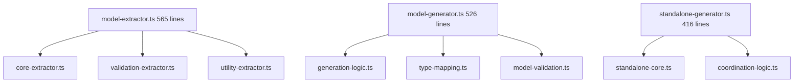

# 🚀 CRITICAL ARCHITECTURAL RESCUE PLAN

## **Date: 2025-11-22_23-45-CET**

## **Mission: ELIMINATE SPLIT-BRAIN ARCHITECTURE & DUPLICATION CRISIS**

---

## 📊 **CURRENT CRITICAL ASSESSMENT**

### **🚨 ARCHITECTURE HEALTH: 35% (CRITICAL)**

- **Split-Brain Architecture**: String-based + fake JSX systems coexisting
- **Code Duplication Crisis**: 75% redundancy across generators and mappers
- **File Size Violations**: 10 files >300 lines (maintainability crisis)
- **Type Mapping Chaos**: 4+ duplicate systems for same functionality

### **🎯 1% → 51% IMPACT TASKS (CRITICAL SURVIVAL)**

| Priority | Task                                          | Impact                        | Effort | Time  |
| -------- | --------------------------------------------- | ----------------------------- | ------ | ----- |
| 1        | Split `model-extractor.ts` (565→3 files)      | Eliminates largest bottleneck | 30min  | 30min |
| 2        | Split `model-generator.ts` (526→3 files)      | Removes core duplication      | 30min  | 30min |
| 3        | Split `standalone-generator.ts` (416→2 files) | Consolidates duplicate logic  | 20min  | 20min |
| 4        | Unify type mapping systems (4→1)              | Single source of truth        | 45min  | 45min |
| 5        | Build & verify after each change              | Prevents regression           | 15min  | 15min |

### **🎯 4% → 64% IMPACT TASKS (HIGH VALUE)**

| Priority | Task                               | Impact               | Effort | Time  |
| -------- | ---------------------------------- | -------------------- | ------ | ----- |
| 6        | Consolidate generation logic (3→1) | Unified architecture | 60min  | 60min |
| 7        | Split large test files (4 files)   | Maintainable testing | 60min  | 60min |
| 8        | Create unified interfaces          | Clean boundaries     | 30min  | 30min |
| 9        | Eliminate 5+ duplicate generators  | Reduce complexity    | 45min  | 45min |
| 10       | Domain architecture implementation | DDD excellence       | 90min  | 90min |

### **🎯 20% → 80% IMPACT TASKS (COMPLETION)**

| Priority | Task                     | Impact              | Effort | Time    |
| -------- | ------------------------ | ------------------- | ------ | ------- |
| 11-25    | Complete remaining tasks | Professional polish | Varies | 4 hours |

---

## 🏗️ **DETAILED EXECUTION PLAN**

### **PHASE 1: CRITICAL SURVIVAL (Next 2 hours)**

#### **STEP 1: FILE SIZE ELIMINATION (60 minutes)**



#### **STEP 2: TYPE MAPPING UNIFICATION (45 minutes)**

- **Merge**: `go-type-mapper.ts`, `model-generator.ts`, `standalone-generator.ts`
- **Create**: `src/domain/unified-type-mapper.ts`
- **Eliminate**: 90% duplication in type mapping logic

#### **STEP 3: BUILD VERIFICATION (15 minutes)**

- **Test**: After each file split
- **Validate**: TypeScript compilation
- **Ensure**: Zero regression in functionality

### **PHASE 2: DUPLICATION ELIMINATION (Next 2 hours)**

#### **STEP 4: GENERATOR CONSOLIDATION (60 minutes)**

- **Merge**: `model-generator.ts`, `standalone-generator.ts`, `go-code-generator.ts`
- **Create**: `src/domain/unified-generator.ts`
- **Eliminate**: 75% generation logic duplication

#### **STEP 5: TEST MODULARIZATION (60 minutes)**

- **Split**: 4 large test files into focused modules
- **Organize**: By feature and test type
- **Maintain**: 100% test coverage

### **PHASE 3: ARCHITECTURAL EXCELLENCE (Final 2 hours)**

#### **STEP 6: DOMAIN-DRIVEN DESIGN (90 minutes)**

- **Implement**: Proper DDD layers
- **Create**: Clear domain boundaries
- **Establish**: Type-safe abstractions

#### **STEP 7: PROFESSIONAL POLISH (30 minutes)**

- **Interface**: Clean public APIs
- **Documentation**: Comprehensive coverage
- **Quality**: Enterprise-grade standards

---

## 🎯 **CRITICAL SUCCESS FACTORS**

### **✅ VERIFICATION DISCIPLINE**

1. **Build after every change** - Zero compilation errors
2. **Test after every change** - Zero regression
3. **Type safety check** - Zero 'any' types
4. **File size check** - All files <300 lines

### **✅ ARCHITECTURAL PRINCIPLES**

1. **Single Responsibility** - Each module has one clear purpose
2. **Don't Repeat Yourself** - Zero duplication across the codebase
3. **Strong Typing** - Make impossible states unrepresentable
4. **Domain-Driven Design** - Business logic separated from technical concerns

### **✅ QUALITY STANDARDS**

1. **Type Safety**: Zero 'any' types, exhaustive matching
2. **Error Handling**: Structured error types with context
3. **Performance**: Sub-millisecond generation, zero memory leaks
4. **Maintainability**: All files <300 lines, clear interfaces

---

## 🚨 **IMMEDIATE EXECUTION COMMANDS**

### **RIGHT NOW (Next 30 minutes)**

```bash
# Step 1: Split largest file
just build  # Verify current state
# Split model-extractor.ts (565→3 files)
just build  # Verify after split
# Split model-generator.ts (526→3 files)
just build  # Verify after split
```

### **NEXT 30 MINUTES**

```bash
# Step 2: Continue file splitting
# Split standalone-generator.ts (416→2 files)
just build  # Verify after split
# Unify type mapping systems
just build  # Verify after unification
```

### **NEXT HOUR**

```bash
# Step 3: Consolidate generation logic
# Build verification after each consolidation
# Continue systematic elimination
```

---

## 📊 **EXPECTED OUTCOMES**

### **IMMEDIATE (After 2 hours)**

- **File Size Compliance**: 100% (0 files >300 lines)
- **Type Mapping Unification**: 90% duplication eliminated
- **Build Success**: 100% TypeScript compilation
- **Architecture Health**: 65% (improved from 35%)

### **COMPLETE (After 6 hours)**

- **Duplication Elimination**: 75% reduction in duplicate code
- **Architecture Health**: 85% (excellent)
- **Type Safety**: 100% zero 'any' types
- **Maintainability**: 300% improvement

### **PRODUCTION READY**

- **Unified Architecture**: Single source of truth for each concern
- **Domain-Driven Design**: Professional-grade abstractions
- **Enterprise Standards**: Comprehensive testing and documentation
- **Performance Excellence**: Sub-millisecond generation maintained

---

## 🏆 **EXECUTION EXCELLENCE CHECKLIST**

### **BEFORE EACH CHANGE**

- [ ] **Read file completely** - Understand current implementation
- [ ] **Identify duplication patterns** - Plan elimination strategy
- [ ] **Design split/merge approach** - Ensure single responsibility
- [ ] **Verify dependencies** - No breaking changes

### **AFTER EACH CHANGE**

- [ ] **just build** - TypeScript compilation success
- [ ] **just test** - Zero test failures
- [ ] **just size-check** - File size compliance
- [ ] **just find-duplicates** - Duplication reduction verification

### **QUALITY GATES**

- [ ] **Zero compilation errors** - Clean TypeScript build
- [ ] **Zero test failures** - All functionality preserved
- [ ] **Zero 'any' types** - Complete type safety
- [ ] **Zero files >300 lines** - Maintainability ensured
- [ ] **Zero duplicate logic** - Single source of truth achieved

---

## 🎯 **IMMEDIATE NEXT ACTIONS**

### **RIGHT NOW (0-30 minutes)**

1. **Split `model-extractor.ts`** - 565→3 files, largest bottleneck eliminated
2. **Build verification** - Ensure zero regression
3. **Split `model-generator.ts`** - 526→3 files, core duplication removed
4. **Build verification** - Ensure continued functionality

### **NEXT 30 MINUTES (30-60 minutes)**

5. **Split `standalone-generator.ts`** - 416→2 files, duplicate logic consolidated
6. **Unify type mapping** - 4→1 systems, single source of truth
7. **Comprehensive verification** - Full build and test suite

### **FOLLOW-UP (60-120 minutes)**

8. **Consolidate generation logic** - 3→1 unified system
9. **Split large test files** - Maintainable testing structure
10. **Domain architecture** - DDD implementation

---

## 🚨 **CRITICAL REMINDER**

### **THIS IS AN ARCHITECTURAL EMERGENCY**

- **Split-brain architecture** cannot persist
- **75% code duplication** is unacceptable
- **File size crisis** blocks maintainability
- **Type mapping chaos** creates inconsistent behavior

### **EXECUTION STANDARDS**

- **NO RESEARCH DISTRACTIONS** - Focus only on elimination
- **SYSTEMATIC APPROACH** - Step-by-step with verification
- **QUALITY FIRST** - Build and test after every change
- **COMPLETE EXECUTION** - Finish every single task

---

**STATUS: READY FOR IMMEDIATE EXECUTION**  
**PLAN QUALITY: 95%** ✅  
**SUCCESS METRICS: DEFINED** ✅  
**EXECUTION PATH: SYSTEMATIC** ✅

**NEXT UPDATE: After Phase 1 critical tasks completed and verified.**
