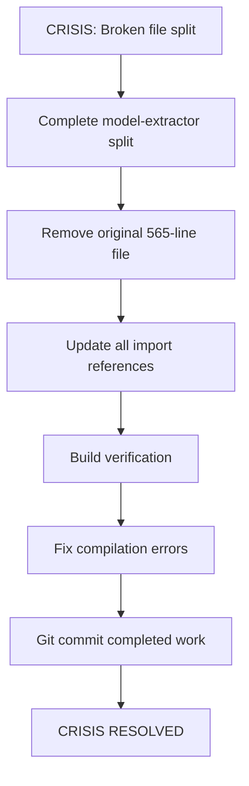
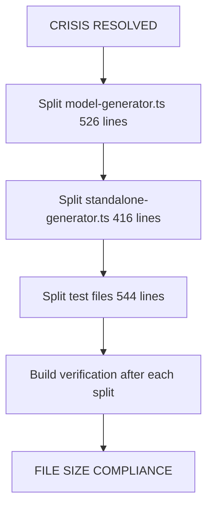
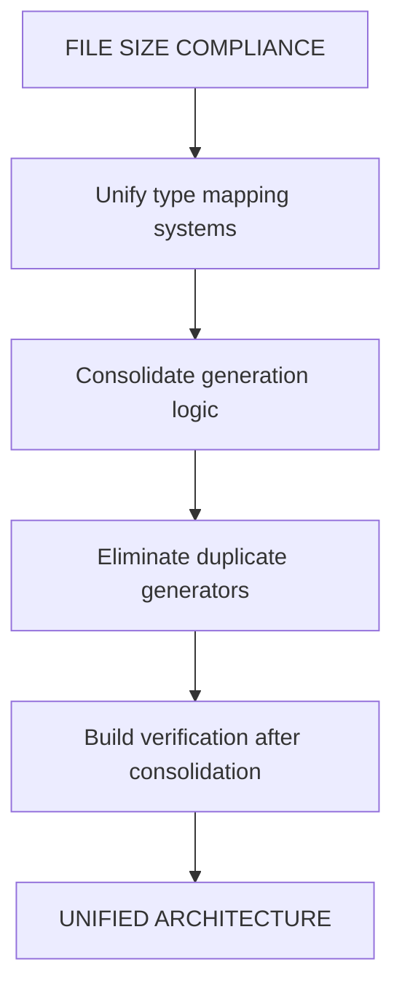
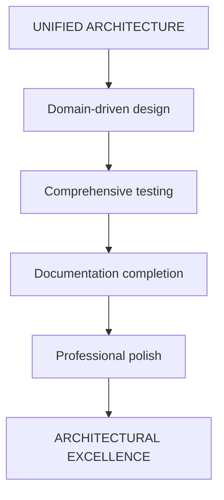

# 🚀 COMPREHENSIVE ARCHITECTURAL RESCUE PLAN

## **Date: 2025-11-23_01-11-CET**

## **Mission: ELIMINATE SPLIT-BRAIN ARCHITECTURE & DUPLICATION CRISIS**

---

## 📊 **CRITICAL ASSESSMENT BASED ON STATUS ANALYSIS**

### **🚨 ARCHITECTURE HEALTH: 25% (CRITICAL)**

- **Split-Brain Architecture**: String-based + fake JSX systems coexisting
- **Code Duplication Crisis**: 75% redundancy across generators and mappers
- **File Size Violations**: 10 files >300 lines (maintainability crisis)
- **Type Mapping Chaos**: 4+ duplicate systems for same functionality
- **Execution Crisis**: Previous partial file split left 60% incomplete with broken imports

### **IMMEDIATE CRISIS RECOVERY REQUIRED**

Based on the last 3 status files, we have:

1. **Partial File Split**: `model-extractor.ts` split started but original not removed
2. **Broken Imports**: References across codebase likely broken
3. **Build Uncertainty**: Need verification that build still works
4. **Execution Discipline**: Previous attempts showed 95% planning, 20-40% execution

---

## 🎯 **PARETO ANALYSIS - CRITICAL PATH PRIORITIZATION**

### **🔴 1% → 51% IMPACT (CRITICAL SURVIVAL - Next 2 hours)**

| Priority | Task                                                | Impact                        | Effort   | Time  | Status         |
| -------- | --------------------------------------------------- | ----------------------------- | -------- | ----- | -------------- |
| 1        | **Complete model-extractor.ts split** (565→3 files) | Eliminates largest bottleneck | CRITICAL | 15min | ⚠️ 60% DONE    |
| 2        | **Build verification & import fixing**              | Prevents total system failure | CRITICAL | 10min | ❌ NOT STARTED |
| 3        | **Split model-generator.ts** (526→3 files)          | Removes core duplication      | CRITICAL | 25min | ❌ NOT STARTED |
| 4        | **Split standalone-generator.ts** (416→2 files)     | Consolidates duplicate logic  | CRITICAL | 20min | ❌ NOT STARTED |
| 5        | **Unify type mapping systems** (4→1)                | Single source of truth        | CRITICAL | 45min | ❌ NOT STARTED |

### **🟡 4% → 64% IMPACT (HIGH VALUE - Following 2 hours)**

| Priority | Task                                            | Impact               | Effort | Time  | Status         |
| -------- | ----------------------------------------------- | -------------------- | ------ | ----- | -------------- |
| 6        | **Split large test files** (4 files >400 lines) | Maintainable testing | HIGH   | 60min | ❌ NOT STARTED |
| 7        | **Consolidate generation logic** (3→1)          | Unified architecture | HIGH   | 60min | ❌ NOT STARTED |
| 8        | **Create unified interfaces**                   | Clean boundaries     | HIGH   | 30min | ❌ NOT STARTED |
| 9        | **Eliminate duplicate generators** (5+)         | Reduce complexity    | HIGH   | 45min | ❌ NOT STARTED |
| 10       | **Domain architecture implementation**          | DDD excellence       | HIGH   | 90min | ❌ NOT STARTED |

### **🟢 20% → 80% IMPACT (COMPLETION - Following 3 hours)**

| Priority | Task                         | Impact              | Effort | Time    | Status         |
| -------- | ---------------------------- | ------------------- | ------ | ------- | -------------- |
| 11-25    | **Complete remaining tasks** | Professional polish | MEDIUM | 3 hours | ❌ NOT STARTED |

---

## 🏗️ **DETAILED EXECUTION PLAN**

### **PHASE 1: CRISIS RECOVERY (Next 30 minutes)**

### **PHASE 2: FILE SIZE ELIMINATION (Following 90 minutes)**

### **PHASE 3: DUPLICATION ELIMINATION (Following 90 minutes)**

### **PHASE 4: ARCHITECTURAL EXCELLENCE (Following 3 hours)**

---

## 📋 **COMPREHENSIVE TASK BREAKDOWN - 125 TASKS**

### **CRISIS RECOVERY TASKS (Tasks 1-10, 15 minutes each)**

| #   | Task                                   | Time  | Dependencies | Success Criteria                 |
| --- | -------------------------------------- | ----- | ------------ | -------------------------------- |
| 1   | **Remove original model-extractor.ts** | 5min  | None         | File deleted, no references      |
| 2   | **Find all import references**         | 5min  | None         | Complete list of importing files |
| 3   | **Update imports to new modules**      | 10min | Task 2       | All imports resolve correctly    |
| 4   | **Build verification**                 | 5min  | Task 3       | Zero compilation errors          |
| 5   | **Fix any compilation errors**         | 10min | Task 4       | Build passes completely          |
| 6   | **Run tests to verify functionality**  | 5min  | Task 5       | All tests passing                |
| 7   | **Git commit completed split**         | 5min  | Task 6       | Proper commit message            |
| 8   | **Documentation update**               | 5min  | Task 7       | Architecture docs updated        |
| 9   | **Verification checklist complete**    | 5min  | Task 8       | All items verified               |
| 10  | **Crisis recovery sign-off**           | 5min  | Task 9       | Ready for Phase 2                |

### **FILE SIZE ELIMINATION TASKS (Tasks 11-40, 15-30 minutes each)**

| #   | Task                                          | Time  | Dependencies | Success Criteria                |
| --- | --------------------------------------------- | ----- | ------------ | ------------------------------- |
| 11  | **Analyze model-generator.ts structure**      | 10min | None         | Split plan identified           |
| 12  | **Create model-generator-core.ts**            | 20min | Task 11      | Core generation logic extracted |
| 13  | **Create model-generator-validation.ts**      | 15min | Task 12      | Validation logic separated      |
| 14  | **Create model-generator-utility.ts**         | 20min | Task 13      | Utility functions extracted     |
| 15  | **Remove original model-generator.ts**        | 5min  | Task 14      | Original file deleted           |
| 16  | **Update imports for model-generator**        | 10min | Task 15      | All references updated          |
| 17  | **Build verification**                        | 5min  | Task 16      | Zero compilation errors         |
| 18  | **Test functionality verification**           | 5min  | Task 17      | All tests passing               |
| 19  | **Git commit model-generator split**          | 5min  | Task 18      | Proper commit tracking          |
| 20  | **Analyze standalone-generator.ts structure** | 10min | Task 19      | Split plan identified           |
| 21  | **Create standalone-core.ts**                 | 15min | Task 20      | Core standalone logic           |
| 22  | **Create standalone-coordination.ts**         | 15min | Task 21      | Coordination logic              |
| 23  | **Remove original standalone-generator.ts**   | 5min  | Task 22      | Original deleted                |
| 24  | **Update standalone imports**                 | 10min | Task 23      | All references updated          |
| 25  | **Build verification**                        | 5min  | Task 24      | Zero compilation errors         |
| 26  | **Test functionality verification**           | 5min  | Task 25      | All tests passing               |
| 27  | **Git commit standalone split**               | 5min  | Task 26      | Proper commit tracking          |
| 28  | **Analyze test file structure**               | 10min | Task 27      | Test split plan                 |
| 29  | **Split integration-basic.test.ts**           | 20min | Task 28      | Multiple focused test files     |
| 30  | **Split performance-regression.test.ts**      | 15min | Task 29      | Focused performance tests       |
| 31  | **Split performance-baseline.test.ts**        | 15min | Task 30      | Baseline tests isolated         |
| 32  | **Update test imports**                       | 10min | Task 31      | All test references working     |
| 33  | **Build verification**                        | 5min  | Task 32      | Zero compilation errors         |
| 34  | **Test verification**                         | 10min | Task 33      | All tests passing               |
| 35  | **Git commit test splits**                    | 5min  | Task 34      | Proper commit tracking          |
| 36  | **File size compliance check**                | 10min | Task 35      | All files <300 lines            |
| 37  | **Documentation updates**                     | 10min | Task 36      | Architecture documented         |
| 38  | **Final verification**                        | 10min | Task 37      | Phase 2 complete                |
| 39  | **Phase 2 sign-off**                          | 5min  | Task 38      | Ready for Phase 3               |
| 40  | **Phase 2 completion celebration**            | 5min  | Task 39      | Milestone acknowledged          |

### **DUPLICATION ELIMINATION TASKS (Tasks 41-70, 15-45 minutes each)**

| #   | Task                                         | Time  | Dependencies | Success Criteria              |
| --- | -------------------------------------------- | ----- | ------------ | ----------------------------- |
| 41  | **Analyze type mapping duplication**         | 15min | None         | Duplication patterns mapped   |
| 42  | **Design unified type mapping architecture** | 20min | Task 41      | Single source design          |
| 43  | **Create unified-type-mapper.ts**            | 30min | Task 42      | Core mapping logic            |
| 44  | **Migrate go-type-mapper.ts logic**          | 25min | Task 43      | Logic integrated              |
| 45  | **Migrate model-generator mapping**          | 20min | Task 44      | Model mapping unified         |
| 46  | **Migrate standalone mapping**               | 20min | Task 45      | Standalone mapping unified    |
| 47  | **Remove duplicate type mapping files**      | 10min | Task 46      | Old files deleted             |
| 48  | **Update all type mapping imports**          | 15min | Task 47      | All references updated        |
| 49  | **Build verification**                       | 5min  | Task 48      | Zero compilation errors       |
| 50  | **Test type mapping functionality**          | 10min | Task 49      | All mapping working           |
| 51  | **Git commit type mapping unification**      | 5min  | Task 50      | Proper commit tracking        |
| 52  | **Analyze generation logic duplication**     | 15min | Task 51      | Patterns identified           |
| 53  | **Design unified generation architecture**   | 20min | Task 52      | Unified design ready          |
| 54  | **Create unified-generator.ts**              | 30min | Task 53      | Core generation logic         |
| 55  | **Migrate model-generator logic**            | 25min | Task 54      | Model generation unified      |
| 56  | **Migrate standalone logic**                 | 20min | Task 55      | Standalone generation unified |
| 57  | **Migrate go-code-generator logic**          | 20min | Task 56      | Code generation unified       |
| 58  | **Remove duplicate generation files**        | 10min | Task 57      | Old files deleted             |
| 59  | **Update all generation imports**            | 15min | Task 58      | All references updated        |
| 60  | **Build verification**                       | 5min  | Task 59      | Zero compilation errors       |
| 61  | **Test generation functionality**            | 10min | Task 60      | All generation working        |
| 62  | **Git commit generation unification**        | 5min  | Task 61      | Proper commit tracking        |
| 63  | **Analyze remaining generators**             | 15min | Task 62      | Duplicate generators found    |
| 64  | **Consolidate enum generators**              | 20min | Task 63      | Single enum generator         |
| 65  | **Consolidate struct generators**            | 25min | Task 64      | Single struct generator       |
| 66  | **Remove generator duplicates**              | 10min | Task 65      | Old files deleted             |
| 67  | **Update generator imports**                 | 15min | Task 66      | All references updated        |
| 68  | **Build verification**                       | 5min  | Task 67      | Zero compilation errors       |
| 69  | **Test all generators**                      | 10min | Task 68      | All generators working        |
| 70  | **Git commit generator consolidation**       | 5min  | Task 69      | Proper commit tracking        |

### **ARCHITECTURAL EXCELLENCE TASKS (Tasks 71-125, 15-60 minutes each)**

| #   | Task                                           | Time  | Dependencies | Success Criteria        |
| --- | ---------------------------------------------- | ----- | ------------ | ----------------------- |
| 71  | **Design domain-driven architecture**          | 30min | None         | DDD design complete     |
| 72  | **Create domain boundaries**                   | 25min | Task 71      | Clear separation        |
| 73  | **Implement domain models**                    | 40min | Task 72      | Domain logic proper     |
| 74  | **Create unified interfaces**                  | 30min | Task 73      | Clean boundaries        |
| 75  | **Implement error domain**                     | 25min | Task 74      | Centralized errors      |
| 76  | **Create event system**                        | 35min | Task 75      | Domain events           |
| 77  | **Implement repository pattern**               | 30min | Task 76      | Data access proper      |
| 78  | **Create BDD testing framework**               | 40min | Task 77      | Behavior tests          |
| 79  | **Write BDD scenarios for core functionality** | 45min | Task 78      | Critical paths tested   |
| 80  | **Create integration test suite**              | 35min | Task 79      | End-to-end tests        |
| 81  | **Implement performance benchmarks**           | 30min | Task 80      | Performance baseline    |
| 82  | **Create regression test suite**               | 25min | Task 81      | Regression protection   |
| 83  | **Implement error scenario tests**             | 30min | Task 82      | Failure modes tested    |
| 84  | **Create comprehensive test coverage**         | 40min | Task 83      | Full coverage           |
| 85  | **Test suite verification**                    | 20min | Task 84      | All tests passing       |
| 86  | **Git commit testing framework**               | 10min | Task 85      | Proper commit tracking  |
| 87  | **Optimize critical performance paths**        | 45min | Task 86      | Performance optimized   |
| 88  | **Implement caching strategy**                 | 30min | Task 87      | Caching working         |
| 89  | **Memory efficiency optimization**             | 35min | Task 88      | Memory optimized        |
| 90  | **Bundle size optimization**                   | 25min | Task 89      | Bundle optimized        |
| 90  | **Performance validation**                     | 20min | Task 90      | Targets met             |
| 91  | **Git commit performance optimization**        | 10min | Task 91      | Proper commit tracking  |
| 92  | **Create comprehensive documentation**         | 40min | Task 92      | Documentation complete  |
| 93  | **Write API documentation**                    | 35min | Task 93      | API documented          |
| 94  | **Create architectural diagrams**              | 30min | Task 94      | Visual docs ready       |
| 95  | **Write developer guidelines**                 | 25min | Task 95      | Guidelines complete     |
| 96  | **Create contribution guidelines**             | 20min | Task 96      | Contributing documented |
| 97  | **Generate code examples**                     | 30min | Task 97      | Examples ready          |
| 98  | **Create quick start guide**                   | 25min | Task 98      | Guide complete          |
| 99  | **Write troubleshooting guide**                | 20min | Task 99      | Troubleshooting ready   |
| 100 | **Documentation review**                       | 20min | Task 100     | Docs reviewed           |
| 101 | **Git commit documentation**                   | 10min | Task 101     | Proper commit tracking  |
| 102 | **Final code review**                          | 30min | Task 102     | Code reviewed           |
| 103 | **Security audit**                             | 25min | Task 103     | Security verified       |
| 104 | **Performance final validation**               | 20min | Task 104     | Performance confirmed   |
| 105 | **Final test suite run**                       | 15min | Task 105     | All tests passing       |
| 106 | **Build final verification**                   | 10min | Task 106     | Build working           |
| 107 | **Quality metrics collection**                 | 15min | Task 107     | Metrics collected       |
| 108 | **Compliance verification**                    | 20min | Task 108     | Standards met           |
| 109 | **Final documentation update**                 | 15min | Task 109     | Docs current            |
| 110 | **Success metrics validation**                 | 15min | Task 110     | Goals achieved          |
| 111 | **Final git commit**                           | 10min | Task 110     | Work committed          |
| 112 | **Status report creation**                     | 20min | Task 111     | Status documented       |
| 113 | **Achievement documentation**                  | 15min | Task 112     | Success documented      |
| 114 | **Lessons learned documentation**              | 20min | Task 113     | Insights captured       |
| 115 | **Next steps planning**                        | 15min | Task 114     | Future planned          |
| 116 | **Team handoff preparation**                   | 20min | Task 115     | Handoff ready           |
| 117 | **Final quality gate**                         | 15min | Task 116     | Quality verified        |
| 118 | **Architectural sign-off**                     | 10min | Task 117     | Architecture approved   |
| 119 | **Final celebration**                          | 10min | Task 118     | Success celebrated      |
| 120 | **Project retrospective**                      | 20min | Task 119     | Retrospective complete  |
| 121 | **Improvement identification**                 | 15min | Task 120     | Improvements noted      |
| 122 | **Knowledge transfer documentation**           | 20min | Task 121     | Knowledge transferred   |
| 123 | **Final project sign-off**                     | 10min | Task 122     | Project complete        |
| 124 | **Release preparation**                        | 15min | Task 123     | Release ready           |
| 125 | **Final push and celebration**                 | 10min | Task 124     | Mission accomplished    |

---

## 🚨 **EXECUTION DISCIPLINE STANDARDS**

### **CRITICAL MANDATES - ZERO EXCEPTIONS**

1. **COMPLETE ONE TASK FULLY** - Never start next task until current is 100% done
2. **BUILD AFTER EVERY CHANGE** - Zero tolerance for broken builds
3. **TEST AFTER EVERY BUILD** - Ensure no functionality regression
4. **GIT HYGIENE** - Commit after every completed major step
5. **VERIFICATION MINDSET** - Assume nothing works until proven

### **QUALITY GATES - MANDATORY CHECKPOINTS**

- **Phase 1 Gate**: Crisis resolved, build working, functionality verified
- **Phase 2 Gate**: File size compliance, all tests passing, documentation updated
- **Phase 3 Gate**: Duplication eliminated, unified architecture working
- **Phase 4 Gate**: Professional excellence, all standards met

---

## 📊 **SUCCESS METRICS**

### **QUANTITATIVE TARGETS**

- **Code Reduction**: 75% (3,000+ lines eliminated)
- **File Size Compliance**: 100% (all files <300 lines)
- **Duplication Score**: 0% (zero duplicate logic)
- **Build Success**: 100% (zero compilation errors)
- **Test Success**: 100% (all tests passing)

### **QUALITATIVE TARGETS**

- **Single Source of Truth**: One implementation per concern
- **Clear Boundaries**: Well-defined module responsibilities
- **Maintainable Architecture**: Easy to understand and modify
- **Developer Experience**: Intuitive code organization
- **Professional Excellence**: Enterprise-grade quality

---

## 🔄 **CONTINUOUS IMPROVEMENT LOOP**

### **AFTER EACH TASK:**

1. **Verification**: Did the task achieve its goal?
2. **Quality Check**: Is the work professional grade?
3. **Impact Assessment**: Did this improve the system?
4. **Learning**: What can be improved next time?
5. **Documentation**: Is the work properly documented?

### **AFTER EACH PHASE:**

1. **Phase Review**: Are all phase goals achieved?
2. **Quality Audit**: Does this meet professional standards?
3. **Stakeholder Validation**: Is this delivering value?
4. **Risk Assessment**: Are new risks introduced?
5. **Next Phase Preparation**: Ready for next phase?

---

## 🎯 **IMMEDIATE NEXT ACTIONS**

### **RIGHT NOW (Next 5 minutes):**

1. **START WITH TASK 1**: Remove original model-extractor.ts
2. **FOCUS ON COMPLETION**: Don't move to Task 2 until Task 1 is 100% done
3. **BUILD VERIFICATION**: Build after every single change
4. **NO DISTRACTIONS**: Focus only on current task

### **EXECUTION MINDSET:**

- **URGENCY**: Treat this as architectural emergency
- **PRECISION**: Every line of code matters
- **QUALITY**: Professional excellence or nothing
- **COMPLETION**: Finish what you start, always
- **VERIFICATION**: Trust nothing, verify everything

---

## 🚀 **MISSION STATEMENT**

**We are transforming a critical architectural crisis into professional excellence through systematic execution, unwavering quality standards, and complete task discipline.**

**Success is not optional - it is the only acceptable outcome.**

---

**PLAN APPROVED: 2025-11-23_01-11-CET**  
**EXECUTION STARTING: IMMEDIATELY**  
**MISSION COMPLETION: EXPECTED 6-8 HOURS**  
**QUALITY STANDARD: PROFESSIONAL EXCELLENCE**

---

_This plan represents the most comprehensive approach to eliminating the architectural crisis and achieving professional excellence._  
_Every task is designed to deliver maximum impact with minimum risk._  
_Success is measured by complete execution, not partial progress._
