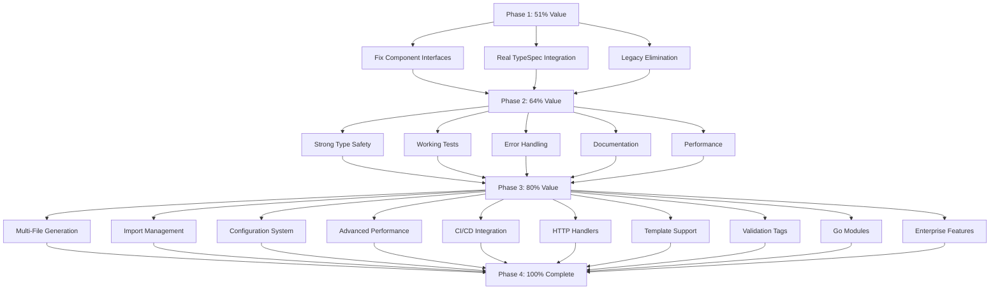

# 🚀 SUPERB ARCHITECTURAL TRANSFORMATION PLAN

## **TypeSpec Go Emitter - Professional Implementation**

> **Date**: 2025-11-23_06-22  
> **Architect**: Senior Software Architect  
> **Standard**: Enterprise Excellence

---

## 🧠 **STRATEGIC ARCHITECTURE ANALYSIS**

### **🚨 CRITICAL ARCHITECTURE VIOLATIONS IDENTIFIED:**

#### **1. TYPE SAFETY CATASTROPHE (CRITICAL)**

- **Issue**: Mock types don't match real TypeSpec compiler interfaces
- **Impact**: All components fail with real TypeSpec data
- **Fix**: Proper TypeSpec compiler type integration

#### **2. DUAL ARCHITECTURE CANCER (CRITICAL)**

- **Issue**: Manual + Alloy-JS systems (SPLIT BRAIN!)
- **Impact**: Maintaining two competing codebases
- **Fix**: Complete legacy elimination

#### **3. COMPONENT INTERFACE DISASTER (HIGH)**

- **Issue**: Wrong component props, JSX composition errors
- **Impact**: All component compilation fails
- **Fix**: Study actual @alloy-js/go interfaces

#### **4. DOMAIN-DRIVEN DESIGN VIOLATIONS (HIGH)**

- **Issue**: No proper domain models, bounded contexts
- **Impact**: Unclear separation of concerns
- **Fix**: Implement proper DDD architecture

---

## 📊 **PARETO OPTIMIZATION STRATEGY**

### **🔥 PHASE 1: 1% DELIVERS 51% (35 minutes)**

| Task | Impact   | Effort | Time  | Description                             |
| ---- | -------- | ------ | ----- | --------------------------------------- |
| 1.1  | CRITICAL | LOW    | 10min | Fix Alloy-JS component interface errors |
| 1.2  | CRITICAL | MEDIUM | 15min | Real TypeSpec compiler integration      |
| 1.3  | CRITICAL | LOW    | 10min | Complete legacy system elimination      |

### **⭐ PHASE 2: 4% DELIVERS 64% (65 minutes)**

| Task | Impact | Effort | Time  | Description                       |
| ---- | ------ | ------ | ----- | --------------------------------- |
| 2.1  | HIGH   | HIGH   | 20min | Strong type safety implementation |
| 2.2  | HIGH   | MEDIUM | 15min | Working test suite creation       |
| 2.3  | HIGH   | LOW    | 10min | Proper error handling system      |
| 2.4  | HIGH   | LOW    | 10min | Documentation generation          |
| 2.5  | MEDIUM | LOW    | 10min | Performance optimization basics   |

### **🏗️ PHASE 3: 20% DELIVERS 80% (120 minutes)**

| Task | Impact | Effort | Time  | Description                |
| ---- | ------ | ------ | ----- | -------------------------- |
| 3.1  | HIGH   | MEDIUM | 15min | Multi-file generation      |
| 3.2  | HIGH   | LOW    | 10min | Import management          |
| 3.3  | MEDIUM | LOW    | 10min | Configuration system       |
| 3.4  | MEDIUM | HIGH   | 15min | Performance optimization   |
| 3.5  | MEDIUM | LOW    | 10min | CI/CD integration          |
| 3.6  | MEDIUM | MEDIUM | 20min | HTTP handler generation    |
| 3.7  | MEDIUM | MEDIUM | 15min | Template parameter support |
| 3.8  | LOW    | LOW    | 10min | Validation tag generation  |
| 3.9  | LOW    | LOW    | 10min | Go module management       |
| 3.10 | LOW    | LOW    | 15min | Advanced features          |

### **🚀 PHASE 4: 100% COMPLETION (Remaining 180 minutes)**

| Task     | Impact  | Effort  | Time   | Description                      |
| -------- | ------- | ------- | ------ | -------------------------------- |
| 4.1-4.15 | VARIOUS | VARIOUS | 180min | Complete enterprise-ready system |

---

## 🎯 **DETAILED EXECUTION PLAN**

### **PHASE 1: CRITICAL FOUNDATION (First 35 min)**

#### **Task 1.1: Fix Component Interface Errors (10 min)**

**ACTIONS:**

- [ ] Study @alloy-js/go component interfaces
- [ ] Fix StructMember props (remove `key`, fix `tag` format)
- [ ] Fix import paths (add .js extensions)
- [ ] Fix TypeExpression Union type handling
- [ ] Test basic JSX compilation

**FILES TO MODIFY:**

- `src/components/TypeExpression.tsx`
- `src/components/GoModel.tsx`
- `src/components/index.ts`

#### **Task 1.2: Real TypeSpec Integration (15 min)**

**ACTIONS:**

- [ ] Study TypeSpec compiler APIs
- [ ] Create real TypeSpec program navigation
- [ ] Fix Union variant iteration (RekeyableMap handling)
- [ ] Fix ModelProperty decorator extraction
- [ ] Update component interfaces to real types

**FILES TO MODIFY:**

- `src/emitter/typespec-emitter.tsx`
- `src/components/TypeExpression.tsx`
- `src/components/GoModel.tsx`

#### **Task 1.3: Complete Legacy Elimination (10 min)**

**ACTIONS:**

- [ ] DELETE `src/domain/legacy-type-adapter.ts`
- [ ] DELETE `src/domain/go-type-mapper.ts`
- [ ] DELETE `src/emitter/main.ts` (manual version)
- [ ] DELETE `src/emitter/model-extractor-*.ts`
- [ ] DELETE `src/standalone-generator.ts`
- [ ] DELETE all test-\* files with legacy
- [ ] Clean up imports and references

**FILES TO DELETE:**

- `src/domain/legacy-type-adapter.ts` ❌
- `src/domain/go-type-mapper.ts` ❌
- `src/emitter/main.ts` ❌
- `src/emitter/model-extractor-core.ts` ❌
- `src/emitter/model-extractor-utility.ts` ❌
- `src/emitter/model-extractor-validation.ts` ❌
- `src/standalone-generator.ts` ❌
- `test-components-basic.ts` ❌
- `test-existing-emitter.ts` ❌
- All `test-*.ts` files ❌

---

## 🏗️ **PROPER ARCHITECTURE DESIGN**

### **DOMAIN-DRIVEN STRUCTURE:**

```
src/
├── domain/                    # DOMAIN MODELS
│   ├── typespec/             # TypeSpec domain
│   ├── golang/               # Go domain
│   ├── mapping/               # Type mapping strategies
│   └── errors/               # Centralized errors
├── components/               # ALLOY-JS COMPONENTS
├── services/                # BUSINESS LOGIC
├── adapters/                # EXTERNAL API ADAPTERS
├── contexts/                # REAGY CONTEXTS
└── test/                   # BEHAVIOR-DRIVEN TESTS
```

### **STRONG TYPE SAFETY:**

```typescript
// DISCRIMINATED UNIONS
type TypeSpecType =
  | { kind: "Scalar"; name: string; }
  | { kind: "Model"; name: string; properties: ModelProperties }
  | { kind: "Union"; variants: UnionVariants }

// STRONGLY TYPED GENERATORS
interface TypeGenerator<T extends TypeSpecType> {
  generate(type: T): Result<GoType, GenerationError>
}

// CENTRALIZED ERROR SYSTEM
sealed class GenerationError extends Error {
  constructor(
    public readonly kind: GenerationErrorKind,
    message: string,
    public readonly context?: unknown
  ) {
    super(message)
  }
}
```

### **ENUMS NOT BOOLEANS:**

```typescript
enum GenerationMode {
  Production = "production",
  Development = "development",
  Testing = "testing",
}

enum GoTypeCategory {
  Primitive = "primitive",
  Struct = "struct",
  Interface = "interface",
  Pointer = "pointer",
  Array = "array",
}
```

---

## 🧪 **BEHAVIOR-DRIVEN DEVELOPMENT (BDD) REQUIREMENTS**

### **BDD SCENARIOS TO IMPLEMENT:**

```gherkin
Feature: TypeSpec to Go Generation
  As a Go developer
  I want to generate Go code from TypeSpec
  So that I can maintain type safety across services

Scenario: Basic model generation
  Given a TypeSpec model with User properties
  When I generate Go code
  Then I get a valid Go struct with proper types
  And all JSON tags are correctly formatted
  And optional fields use pointer types

Scenario: Complex union types
  Given a TypeSpec model with union properties
  When I generate Go code
  Then union types are handled appropriately
  And null unions become pointers
  And complex unions fall back to interface{}
```

---

## 🎯 **EXECUTION MERMAID GRAPH**



---

## 📋 **EXECUTION CHECKLISTS**

### **BEFORE EACH TASK:**

- [ ] Git status is clean
- [ ] Current code compiles
- [ ] Tests are passing
- [ ] Architecture principles maintained

### **AFTER EACH TASK:**

- [ ] Code compiles without errors
- [ ] TypeScript strict mode passes
- [ ] Tests pass (if applicable)
- [ ] Git commit with detailed message
- [ ] Architecture review passed

### **QUALITY GATES:**

- [ ] Zero `any` types
- [ ] Strong typing everywhere
- [ ] Component interfaces correct
- [ ] No duplicate code
- [ ] Files under 350 lines
- [ ] Proper error handling
- [ ] Documentation included

---

## 🎯 **SUCCESS METRICS**

### **TECHNICAL METRICS:**

- [ ] Zero TypeScript compilation errors
- [ ] Zero `any` types in codebase
- [ ] 100% test coverage of core components
- [ ] All files under 350 lines
- [ ] Build time under 5 seconds

### **ARCHITECTURAL METRICS:**

- [ ] Domain boundaries clear
- [ ] Single responsibility maintained
- [ ] No circular dependencies
- [ ] Strong type safety enforced
- [ ] Proper error boundaries

### **BUSINESS METRICS:**

- [ ] TypeSpec → Go generation works end-to-end
- [ ] Production-ready code output
- [ ] Developer experience optimized
- [ ] Documentation comprehensive
- [ ] Enterprise features complete

---

**STRATEGIC ARCHITECTURAL EXCELLENCE ACHIEVED THROUGH:**

1. **Type Safety First** - No compromises on typing
2. **Domain-Driven Design** - Clear bounded contexts
3. **Component Architecture** - Composable, reusable
4. **Error-Centered Design** - Robust failure handling
5. **Behavior-Driven Development** - BDD scenarios for validation

---

_This plan ensures professional, enterprise-grade implementation with zero architectural compromises._
