# 🚀 PARETO-BASED EXECUTION GRAPH
**Created:** 2025-11-23_07-03  
**Strategy:** 1% → 51% → 64% → 80% Impact Optimization

```mermaid
graph TD
    %% Phase 1: Critical Recovery (1% Effort → 51% Impact)
    subgraph "Phase 1: Critical Recovery (45min)"
        T1[T1.1: Analyze Array Failures<br/>5min]
        T2[T1.2: Fix Array Element Resolution<br/>10min]
        T3[T1.3: Test Array Resolution<br/>5min]
        T4[T1.4: Analyze Logging Errors<br/>5min]
        T5[T1.5: Fix Constructor<br/>5min]
        T6[T1.6: Fix Logging Calls<br/>5min]
        T7[T1.7: Test Logging Fix<br/>5min]
        T8[T1.8: Analyze Union Issues<br/>5min]
        T9[T1.9: Basic Union Detection<br/>5min]
        
        T1 --> T2 --> T3
        T4 --> T5 --> T6 --> T7
        T8 --> T9
    end
    
    %% Phase 2: System Completion (4% Effort → 64% Impact)
    subgraph "Phase 2: System Completion (2hrs)"
        %% Union System
        T10[T2.1: Analyze Union Failures<br/>10min]
        T11[T2.2: Design Union Strategy<br/>10min]
        T12[T2.3: Extract Union Variants<br/>15min]
        T13[T2.4: Generate Union Interfaces<br/>15min]
        T14[T2.5: Discriminated Unions<br/>15min]
        T15[T2.6: Test Union Interfaces<br/>10min]
        T16[T2.7: Test Discriminated<br/>10min]
        T17[T2.8: Fix Union Naming<br/>10min]
        T18[T2.9: Test Union Names<br/>5min]
        T19[T2.10: Handle Empty Variants<br/>10min]
        T20[T2.11: Test Empty Variants<br/>5min]
        T21[T2.12: Optimize Performance<br/>10min]
        T22[T2.13: Test Performance<br/>5min]
        T23[T2.14: Handle Complex Scenarios<br/>10min]
        T24[T2.15: Validate Union System<br/>10min]
        
        %% Operation System
        T25[T2.16: Analyze Operation Failures<br/>10min]
        T26[T2.17: Fix Return Types<br/>15min]
        T27[T2.18: Fix Parameter Types<br/>15min]
        T28[T2.19: Fix Method Names<br/>10min]
        T29[T2.20: Test Interfaces<br/>10min]
        T30[T2.21: Test HTTP Handlers<br/>5min]
        T31[T2.22: Test Route Registration<br/>5min]
        T32[T2.23: Test HTTP Verbs<br/>5min]
        
        %% Template System
        T33[T2.24: Analyze Template Failures<br/>10min]
        T34[T2.25: Fix Template Detection<br/>15min]
        T35[T2.26: Fix Generic Parameters<br/>15min]
        T36[T2.27: Generate Go Generics<br/>15min]
        T37[T2.28: Test Template Support<br/>10min]
        T38[T2.29: Test Instantiation<br/>10min]
        T39[T2.30: Fix Generic Naming<br/>5min]
        T40[T2.31: Test Generic Names<br/>5min]
        T41[T2.32: Validate Template System<br/>10min]
        
        T9 --> T10 --> T11 --> T12 --> T13 --> T14 --> T15 --> T16 --> T17 --> T18 --> T19 --> T20 --> T21 --> T22 --> T23 --> T24
        T3 --> T25 --> T26 --> T27 --> T28 --> T29 --> T30 --> T31 --> T32
        T3 --> T33 --> T34 --> T35 --> T36 --> T37 --> T38 --> T39 --> T40 --> T41
    end
    
    %% Phase 3: Architecture Excellence (20% Effort → 80% Impact)
    subgraph "Phase 3: Architecture Excellence (2hrs 15min)"
        %% Type Mapping Unification
        T42[T3.1: Analyze Fragmentation<br/>10min]
        T43[T3.2: Design Unified Architecture<br/>15min]
        T44[T3.3: Migrate Core Logic<br/>15min]
        T45[T3.4: Deprecate Legacy<br/>10min]
        T46[T3.5: Update References<br/>15min]
        T47[T3.6: Test Unified System<br/>10min]
        T48[T3.7: Validate Performance<br/>10min]
        T49[T3.8: Remove Legacy<br/>15min]
        T50[T3.9: Add Validation<br/>10min]
        T51[T3.10: Test Validation<br/>5min]
        T52[T3.11: Optimize Memory<br/>10min]
        T53[T3.12: Test Memory<br/>5min]
        T54[T3.13: Add Debug Support<br/>10min]
        T55[T3.14: Test Debug<br/>5min]
        T56[T3.15: Add Error Recovery<br/>10min]
        T57[T3.16: Test Recovery<br/>5min]
        T58[T3.17: Add Performance Monitoring<br/>10min]
        T59[T3.18: Test Monitoring<br/>5min]
        T60[T3.19: Validate Completeness<br/>10min]
        T61[T3.20: Final Integration Test<br/>10min]
        
        %% Error System Professionalization
        T62[T3.21: Analyze Error Patterns<br/>10min]
        T63[T3.22: Design Error Architecture<br/>10min]
        T64[T3.23: Implement Error Types<br/>15min]
        T65[T3.24: Update Error Creation<br/>10min]
        T66[T3.25: Update Error Handling<br/>15min]
        T67[T3.26: Add Error Recovery<br/>10min]
        T68[T3.27: Test Error Patterns<br/>10min]
        T69[T3.28: Test Recovery<br/>5min]
        T70[T3.29: Enhance Error Logging<br/>10min]
        T71[T3.30: Test Error Logging<br/>5min]
        T72[T3.31: Add Performance Monitoring<br/>10min]
        T73[T3.32: Test Error Performance<br/>5min]
        T74[T3.33: Validate Type Safety<br/>10min]
        T75[T3.34: Test Type Safety<br/>5min]
        T76[T3.35: Optimize Performance<br/>10min]
        T77[T3.36: Test Performance<br/>5min]
        T78[T3.37: Add Documentation<br/>10min]
        T79[T3.38: Validate Completeness<br/>5min]
        T80[T3.39: Final Error Test<br/>5min]
        
        %% Performance Optimization
        T81[T3.40: Baseline Measurement<br/>10min]
        T82[T3.41: Identify Bottlenecks<br/>10min]
        T83[T3.42: Optimize Type Mapping<br/>15min]
        T84[T3.43: Optimize Error Handling<br/>10min]
        T85[T3.44: Optimize Memory Usage<br/>10min]
        T86[T3.45: Validate Improvements<br/>10min]
        T87[T3.46: Test Sub-Millisecond<br/>5min]
        T88[T3.47: Test Memory Leaks<br/>5min]
        T89[T3.48: Add Regression Tests<br/>10min]
        T90[T3.49: Test Regression<br/>5min]
        T91[T3.50: Validate Guarantees<br/>5min]
        T92[T3.51: Final Performance Test<br/>5min]
        
        %% Documentation and Validation
        T93[T3.52: Update README<br/>10min]
        T94[T3.53: Update Architecture Docs<br/>10min]
        T95[T3.54: Update API Docs<br/>10min]
        T96[T3.55: Update Developer Docs<br/>10min]
        T97[T3.56: Update Performance Docs<br/>5min]
        T98[T3.57: Validate Accuracy<br/>10min]
        T99[T3.58: Test Examples<br/>10min]
        T100[T3.59: Add Migration Guide<br/>10min]
        T101[T3.60: Test Migration Guide<br/>5min]
        T102[T3.61: Add Troubleshooting<br/>5min]
        T103[T3.62: Validate Completeness<br/>5min]
        T104[T3.63: Final Documentation Review<br/>5min]
        
        %% Final Integration and Cleanup
        T105[T3.64: Clean Up Imports<br/>10min]
        T106[T3.65: Remove Unused Code<br/>10min]
        T107[T3.66: Optimize Build Process<br/>10min]
        T108[T3.67: Add Type Safety Scripts<br/>10min]
        T109[T3.68: Test Type Safety Scripts<br/>5min]
        T110[T3.69: Add Architecture Scripts<br/>10min]
        T111[T3.70: Test Architecture Scripts<br/>5min]
        T112[T3.71: Add Configuration<br/>10min]
        T113[T3.72: Test Configuration<br/>5min]
        T114[T3.73: Add Debug Logging Config<br/>10min]
        T115[T3.74: Test Debug Config<br/>5min]
        T116[T3.75: Add Error Recovery Config<br/>10min]
        T117[T3.76: Test Error Recovery Config<br/>5min]
        T118[T3.77: Validate Go Formatting<br/>10min]
        T119[T3.78: Validate TypeScript<br/>5min]
        T120[T3.79: Validate ESLint<br/>5min]
        T121[T3.80: Run Integration Tests<br/>10min]
        T122[T3.81: Run Performance Tests<br/>5min]
        T123[T3.82: Run Memory Tests<br/>5min]
        T124[T3.83: Validate Core Functionality<br/>10min]
        T125[T3.84: Validate Type Mapping<br/>10min]
        T126[T3.85: Validate Error Handling<br/>5min]
        T127[T3.86: Validate Performance<br/>5min]
        T128[T3.87: Validate Memory<br/>5min]
        T129[T3.88: Final System Integration<br/>10min]
        T130[T3.89: Validate 100% Success<br/>5min]
        T131[T3.90: Validate Architecture Excellence<br/>5min]
        T132[T3.91: Final Performance Validation<br/>5min]
        T133[T3.92: Final Memory Validation<br/>5min]
        
        T24 --> T42 --> T43 --> T44 --> T45 --> T46 --> T47 --> T48 --> T49 --> T50 --> T51 --> T52 --> T53 --> T54 --> T55 --> T56 --> T57 --> T58 --> T59 --> T60 --> T61
        T24 --> T62 --> T63 --> T64 --> T65 --> T66 --> T67 --> T68 --> T69 --> T70 --> T71 --> T72 --> T73 --> T74 --> T75 --> T76 --> T77 --> T78 --> T79 --> T80
        T61 --> T81 --> T82 --> T83 --> T84 --> T85 --> T86 --> T87 --> T88 --> T89 --> T90 --> T91 --> T92
        T41 --> T93 --> T94 --> T95 --> T96 --> T97 --> T98 --> T99 --> T100 --> T101 --> T102 --> T103 --> T104
        T104 --> T105 --> T106 --> T107 --> T108 --> T109 --> T110 --> T111 --> T112 --> T113 --> T114 --> T115 --> T116 --> T117 --> T118 --> T119 --> T120 --> T121 --> T122 --> T123 --> T124 --> T125 --> T126 --> T127 --> T128 --> T129 --> T130 --> T131 --> T132 --> T133
    end
    
    %% Success Metrics
    subgraph "Success Metrics"
        START[Test Success: 77%]
        PHASE1_TARGET[Phase 1 Target: 85%]
        PHASE2_TARGET[Phase 2 Target: 95%]
        PHASE3_TARGET[Phase 3 Target: 100%]
        
        PERFORMANCE[Performance: <0.1ms]
        MEMORY[Memory: Zero Leaks]
        QUALITY[Type Quality: Professional]
        
        START --> PHASE1_TARGET --> PHASE2_TARGET --> PHASE3_TARGET
        PHASE3_TARGET --> PERFORMANCE --> MEMORY --> QUALITY
    end
    
    %% Pareto Impact Visualization
    subgraph "Pareto Impact Visualization"
        IMPACT1["1% Effort → 51% Impact<br/>Critical Recovery"]
        IMPACT2["4% Effort → 64% Impact<br/>System Completion"] 
        IMPACT3["20% Effort → 80% Impact<br/>Architecture Excellence"]
        
        IMPACT1 --> IMPACT2 --> IMPACT3
    end
    
    %% Connect phases to success metrics
    T3 --> START
    T24 --> PHASE1_TARGET
    T41 --> PHASE2_TARGET
    T133 --> PHASE3_TARGET
    
    %% Style definitions
    classDef phase1 fill:#ff6b6b,stroke:#d63447,color:#ffffff
    classDef phase2 fill:#4ecdc4,stroke:#2a9d8f,color:#ffffff
    classDef phase3 fill:#457b9d,stroke:#1d3557,color:#ffffff
    classDef metrics fill:#f4a261,stroke:#e76f51,color:#ffffff
    classDef impact fill:#2a9d8f,stroke:#264653,color:#ffffff
    
    class T1,T2,T3,T4,T5,T6,T7,T8,T9 phase1
    class T10,T11,T12,T13,T14,T15,T16,T17,T18,T19,T20,T21,T22,T23,T24,T25,T26,T27,T28,T29,T30,T31,T32,T33,T34,T35,T36,T37,T38,T39,T40,T41 phase2
    class T42,T43,T44,T45,T46,T47,T48,T49,T50,T51,T52,T53,T54,T55,T56,T57,T58,T59,T60,T61,T62,T63,T64,T65,T66,T67,T68,T69,T70,T71,T72,T73,T74,T75,T76,T77,T78,T79,T80,T81,T82,T83,T84,T85,T86,T87,T88,T89,T90,T91,T92,T93,T94,T95,T96,T97,T98,T99,T100,T101,T102,T103,T104,T105,T106,T107,T108,T109,T110,T111,T112,T113,T114,T115,T116,T117,T118,T119,T120,T121,T122,T123,T124,T125,T126,T127,T128,T129,T130,T131,T132,T133 phase3
    class START,PHASE1_TARGET,PHASE2_TARGET,PHASE3_TARGET,PERFORMANCE,MEMORY,QUALITY metrics
    class IMPACT1,IMPACT2,IMPACT3 impact
```

---

## 🎯 EXECUTION CRITICAL PATHS

### Critical Path 1: Array Type Resolution (20min)
**T1.1 → T1.2 → T1.3**  
**Impact:** Fixes 6 test failures immediately  
**ROI:** 35% impact for 20min effort

### Critical Path 2: Enhanced Property Transformer (15min)
**T1.4 → T1.5 → T1.6 → T1.7**  
**Impact:** Fixes 2 critical logging failures  
**ROI:** 10% impact for 15min effort

### Critical Path 3: Union Type System (45min)
**T2.1 → T2.2 → T2.3 → T2.4 → T2.5 → T2.6 → T2.7 → T2.8 → T2.9 → T2.10 → T2.11 → T2.12 → T2.13 → T2.14 → T2.15**  
**Impact:** Fixes 8 union test failures  
**ROI:** 25% impact for 45min effort

---

## 📊 PARETO OPTIMIZATION SUMMARY

| Phase | Effort | Impact | Primary Targets | Success Metrics |
|-------|--------|--------|-----------------|-----------------|
| **Phase 1** | 1% (45min) | 51% | Array, Logging, Basic Unions | 85% test success |
| **Phase 2** | 4% (2hrs) | 64% | Complete Union, Operation, Template Systems | 95% test success |
| **Phase 3** | 20% (2hrs 15min) | 80% | Architecture Unification, Performance | 100% test success |

---

## 🚨 EXECUTION MANDATES

### Immediate Execution Rules
1. **Sequential Execution:** Follow exact task order
2. **Validation After Each Task:** Run targeted tests
3. **Phase Gates:** Cannot proceed without phase completion
4. **Performance Guarantees:** Maintain <0.1ms generation
5. **Zero Regressions:** No new failures introduced

### Success Criteria
- ✅ **Phase 1:** 85% test success rate (84/99)
- ✅ **Phase 2:** 95% test success rate (94/99)  
- ✅ **Phase 3:** 100% test success rate (99/99)
- ✅ **Performance:** Sub-millisecond generation maintained
- ✅ **Memory:** Zero leaks confirmed
- ✅ **Architecture:** Clean principles maintained

---

*This execution graph provides the optimal path to eliminate all 21 test failures while maintaining professional architectural standards and performance guarantees.*