# 🚀 TYPESPEC GO EMITTER - EXECUTION GRAPH & PLAN

**Date:** 2025-11-23_07-27  
**Strategy:** Maximum Impact Delivery with Phased Approach

---

## 📊 IMPACT-DRIVEN EXECUTION STRATEGY

### 🎯 Critical Path Analysis
- **1% Effort → 51% Impact:** Fix core Go generation (45 min)
- **4% Effort → 64% Impact:** Add CLI and production features (3.25 hrs)
- **20% Effort → 80% Impact:** Enterprise-grade excellence (8.25 hrs)
- **100% Effort → 100% Impact:** Complete professional solution (15-20 hrs)

---

## 🔄 MERMAID EXECUTION GRAPH

```mermaid
graph TD
    %% Phase 1: Critical Path (1% → 51% Impact)
    A[Phase 1 Start] --> B[Task 1: Fix Go Hierarchy<br/>15min]
    B --> C[Task 2: Add SourceDirectory<br/>10min]
    C --> D[Task 3: Fix Tag Syntax<br/>5min]
    D --> E[Task 4: Test Basic Emission<br/>15min]
    E --> F[PHASE 1 COMPLETE<br/>Working Go Generation<br/>✅ 51% IMPACT DELIVERED]
    
    %% Phase 2: Production Ready (4% → 64% Impact)
    F --> G[Task 5: Create main.ts CLI<br/>15min]
    G --> H[Task 6: Add package.json bin<br/>5min]
    H --> I[Task 7: Integration Tests<br/>20min]
    I --> J[Task 8: Go Package Declaration<br/>10min]
    J --> K[Task 9: Real TypeSpec Testing<br/>15min]
    K --> L[Task 10: Validate Go Compile<br/>10min]
    L --> M[Task 11: Error Handling<br/>10min]
    M --> N[Task 12: Basic Documentation<br/>15min]
    N --> O[PHASE 2 COMPLETE<br/>Production Ready Emitter<br/>✅ 64% IMPACT DELIVERED]
    
    %% Phase 3: Professional Excellence (20% → 80% Impact)
    O --> P[Task 13-18: Type Safety Tests<br/>3 hours]
    P --> Q[Task 19-24: Advanced Go Features<br/>2 hours]
    Q --> R[PHASE 3 COMPLETE<br/>Enterprise Grade Excellence<br/>✅ 80% IMPACT DELIVERED]
    
    %% Phase 4: Comprehensive Excellence
    R --> S[Task 25-32: Performance<br/>3 hours]
    S --> T[Task 33-40: Error Handling & UX<br/>2 hours]
    T --> U[Task 41-50: Go Integration<br/>5 hours]
    U --> V[PHASE 4 COMPLETE<br/>Comprehensive Excellence]
    
    %% Phase 5: Advanced Features
    V --> W[Task 51-60: Advanced TypeSpec<br/>5 hours]
    W --> X[Task 61-70: Code Quality<br/>4 hours]
    X --> Y[Task 71-75: Tooling Integration<br/>2 hours]
    Y --> Z[PHASE 5 COMPLETE<br/>Advanced Features]
    
    %% Phase 6: Community Excellence
    Z --> AA[Task 76-90: Documentation<br/>8 hours]
    AA --> BB[Task 91-105: Quality Assurance<br/>6 hours]
    BB --> CC[Task 106-125: Community & Ecosystem<br/>8 hours]
    CC --> DD[PHASE 6 COMPLETE<br/>Professional Excellence<br/>✅ 100% COMPLETE]
    
    %% Success Metrics
    F --> SUCCESS1[🎯 SUCCESS: Users can generate<br/>basic Go code from TypeSpec]
    O --> SUCCESS2[🚀 SUCCESS: Full CLI ready for<br/>production use]
    R --> SUCCESS3[💪 SUCCESS: Enterprise-grade<br/>emitter with type safety]
    DD --> SUCCESS4[🏆 SUCCESS: Complete professional<br/>solution with community support]
    
    %% Styling
    classDef critical fill:#ff6b6b,stroke:#c92a2a,color:#fff
    classDef production fill:#4ecdc4,stroke:#0b7285,color:#fff  
    classDef enterprise fill:#845ef7,stroke:#5f3dc4,color:#fff
    classDef comprehensive fill:#fab005,stroke:#e67700,color:#fff
    classDef success fill:#51cf66,stroke:#2f9e44,color:#fff
    
    class A,B,C,D,E,F critical
    class G,H,I,J,K,L,M,N,O production
    class P,Q,R enterprise
    class S,T,U,V,W,X,Y,Z comprehensive
    class SUCCESS1,SUCCESS2,SUCCESS3,SUCCESS4,DD success
```



---

## ⚡ IMMEDIATE EXECUTION PLAN

### **START NOW (Next 45 Minutes):**

#### 🎯 Task 1: Fix Go Hierarchy (15min)
```typescript
// CURRENT (BROKEN):
<go.SourceFile path="models.go">

// TARGET (FIXED):  
<go.ModuleDirectory name="github.com/user/project">
  <go.SourceDirectory path="models">
    <go.SourceFile path="models.go">
```

#### 🎯 Task 2: Add SourceDirectory Layer (10min)
```typescript
// Add proper Go package structure
<go.ModuleDirectory name="github.com/example/project">
  <go.SourceDirectory path="models">
    <go.SourceFile path="models.go">
```

#### 🎯 Task 3: Fix Tag Syntax (5min)
```typescript
// CURRENT (BROKEN):
tag={`json:"${prop.name}"`}

// TARGET (FIXED):
tag={{json: prop.name}}
```

#### 🎯 Task 4: Test Basic Emission (15min)
```bash
# Create test.tsp and validate generation
tsp compile --emit-go test.tsp
# Verify generated Go compiles
go build output/**/*.go
```

---

### **FOLLOW IMMEDIATELY (Next 2.5 Hours):**

#### ⚡ Task 5-12: Production Ready Features
- CLI entry point implementation
- Package.json configuration
- Integration testing framework
- Real TypeSpec validation
- Go compilation verification
- Professional error handling
- Basic documentation

---

## 📊 SUCCESS METRICS BY PHASE

### **Phase 1 Success (45 min):**
- [ ] Go hierarchy fixed and working
- [ ] Basic TypeSpec → Go generation functional
- [ ] Generated Go code compiles successfully
- [ ] **IMPACT:** Users can generate working Go code

### **Phase 2 Success (3.25 hours total):**
- [ ] CLI `tsp compile --emit-go` working
- [ ] Integration test framework in place
- [ ] Real TypeSpec projects generate valid Go
- [ ] Professional error handling implemented
- [ ] **IMPACT:** Production-ready emitter for real projects

### **Phase 3 Success (8.25 hours total):**
- [ ] Comprehensive type safety testing
- [ ] Advanced Go features (imports, pointers, tags)
- [ ] Enterprise-grade error handling
- [ ] Performance optimization
- [ ] **IMPACT:** Enterprise-ready professional emitter

---

## 🎯 EXECUTION COMMANDS

### **START PHASE 1 NOW:**
```bash
# Fix Go hierarchy
vim src/emitter/typespec-emitter.tsx

# Test basic emission  
node test-basic-emission.js

# Validate generated Go
go build output/**/*.go
```

### **CONTINUE WITH PHASE 2:**
```bash
# Create CLI entry point
vim src/emitter/main.ts

# Update package.json
vim package.json

# Run integration tests
bun test src/test/integration/
```

---

## 💯 GUARANTEED OUTCOMES

### **IMMEDIATE (45 minutes):**
✅ Working Go code generation from TypeSpec  
✅ Proper Go package hierarchy  
✅ Valid Go compilation  
✅ **HALF THE TOTAL VALUE DELIVERED**

### **PRODUCTION READY (3.25 hours):**
✅ Full CLI functionality  
✅ Integration testing framework  
✅ Real-world project support  
✅ **TWO-THIRDS OF TOTAL VALUE DELIVERED**

### **ENTERPRISE EXCELLENCE (8.25 hours):**
✅ Professional type safety  
✅ Advanced Go features  
✅ Performance optimization  
✅ **EIGHTY PERCENT OF TOTAL VALUE DELIVERED**

---

## 🚀 CRITICAL SUCCESS FACTORS

1. **EXECUTE PHASE 1 IMMEDIATELY** - Maximum impact in 45 minutes
2. **MAINTAIN TYPE SAFETY** - Zero tolerance for `as any` violations
3. **TEST CONTINUOUSLY** - Validate each phase before proceeding
4. **FOCUS ON USER VALUE** - Working Go generation is primary goal

---

**🎯 READY TO EXECUTE: Start with Task 1 for immediate impact delivery!**

---

*Generated with Crush - Maximum Impact Execution Planning*