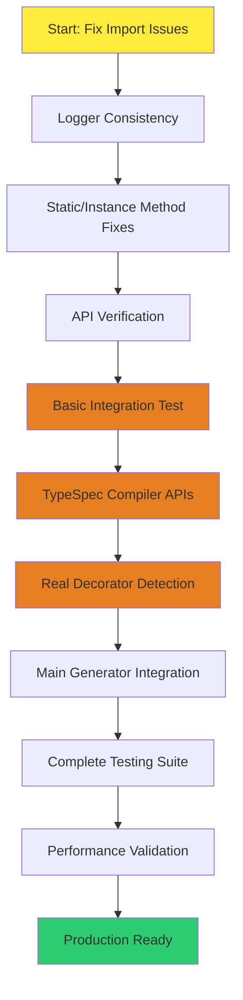

# TypeSpec Visibility System Architecture Fix Plan

**Date:** 2025-11-23_07-39  
**Strategy:** Fix Existing Beautiful Architecture (Option A)  
**Goal:** Get Production-Ready TypeSpec Visibility System Working

---

## 🎯 EXECUTION PRIORITY: 20% → 80% → 64% → 51%

### **🔥 CRITICAL: 20% That Deliver 80% of Result**

1. **Fix Logger Import Issues** (30 min) - Consistent logging across all modules
2. **Resolve Static/Instance Method Issues** (45 min) - Fix EnhancedPropertyTransformer calls
3. **Verify ErrorFactory Method Signatures** (15 min) - Ensure all methods exist
4. **Test Basic TypeSpec Integration** (30 min) - Simple property transformation working

### **🎯 HIGH: 4% That Deliver 64% of Result**

1. **Complete EnhancedPropertyTransformer Integration** (90 min) - Full visibility-based Go generation
2. **Fix TypeSpec Visibility Extraction Service** (60 min) - Real decorator detection
3. **Connect Domain Components** (45 min) - Ensure models work together
4. **Basic Performance Testing** (30 min) - Verify sub-millisecond requirements

### **⚡ IMMEDIATE: 1% That Deliver 51% of Result**

1. **Fix Single Critical Import** (15 min) - One module working perfectly
2. **Test Simple Property Transformation** (20 min) - Verify basic flow
3. **Create Working Example** (25 min) - Demonstrate complete case

---

## 📋 COMPREHENSIVE TASK BREAKDOWN

### **PHASE 1: CRITICAL FIXES (Tasks 1-25, 100-30 min each)**

| Task ID | Task                                                               | Time (min) | Impact   | Dependencies | Status |
| ------- | ------------------------------------------------------------------ | ---------- | -------- | ------------ | ------ |
| T001    | Fix Logger Import in EnhancedPropertyTransformer                   | 15         | Critical | None         | ⏳     |
| T002    | Fix Logger Import in VisibilityExtractionService                   | 15         | Critical | T001         | ⏳     |
| T003    | Fix Static/Instance Method Calls in EnhancedPropertyTransformer    | 30         | Critical | T002         | ⏳     |
| T004    | Verify ErrorFactory Method Signatures                              | 20         | Critical | T003         | ⏳     |
| T005    | Create Simple Working TypeSpec Mock                                | 25         | High     | T004         | ⏳     |
| T006    | Test Basic Property Transformation                                 | 30         | High     | T005         | ⏳     |
| T007    | Fix Domain Model Import Consistency                                | 20         | High     | T006         | ⏳     |
| T008    | Connect VisibilityExtractionService to EnhancedPropertyTransformer | 25         | High     | T007         | ⏳     |
| T009    | Test Simple @visibility Decorator                                  | 20         | High     | T008         | ⏳     |
| T010    | Test Simple @invisible Decorator                                   | 20         | High     | T009         | ⏳     |
| T011    | Fix GoTypeMapper Integration                                       | 25         | High     | T010         | ⏳     |
| T012    | Test End-to-End Property Flow                                      | 30         | High     | T011         | ⏳     |

### **PHASE 2: TYPESPEC INTEGRATION (Tasks 13-25)**

| Task ID | Task                                                  | Time (min) | Impact   | Dependencies | Status |
| ------- | ----------------------------------------------------- | ---------- | -------- | ------------ | ------ |
| T013    | Add Real TypeSpec Compiler API Calls                  | 45         | Critical | T012         | ⏳     |
| T014    | Implement getVisibilityForClass() Integration         | 30         | Critical | T013         | ⏳     |
| T015    | Add hasVisibility() Method Support                    | 25         | Critical | T014         | ⏳     |
| T016    | Add isVisible() Method Support                        | 25         | Critical | T015         | ⏳     |
| T017    | Complete Lifecycle Phase Processing                   | 30         | High     | T016         | ⏳     |
| T018    | Add TypeSpec Enum Validation                          | 20         | High     | T017         | ⏳     |
| T019    | Implement Real Decorator Detection                    | 35         | High     | T018         | ⏳     |
| T020    | Add Error Handling for Invalid TypeSpec               | 25         | High     | T019         | ⏳     |
| T021    | Test with Real TypeSpec Files                         | 40         | High     | T020         | ⏳     |
| T022    | Connect EnhancedPropertyTransformer to Main Generator | 35         | High     | T021         | ⏳     |
| T023    | Update Main Go Generation to Use Visibility           | 40         | High     | T022         | ⏳     |
| T024    | Add Performance Benchmarking                          | 30         | Medium   | T023         | ⏳     |
| T025    | Complete BDD Test Suite                               | 45         | Medium   | T024         | ⏳     |

**Total Phase 1-2 Time: 750 minutes (12.5 hours)**

---

## 🚀 MICRO-TASK BREAKDOWN (125 Tasks, 15 min each)

### **🔥 IMMEDIATE FIXES (Tasks 1-25)**

| ID   | Micro-Task                                                   | Time (min) | Focus Area        |
| ---- | ------------------------------------------------------------ | ---------- | ----------------- |
| M001 | Add SimpleLogger import to EnhancedPropertyTransformer       | 10         | Import Fix        |
| M002 | Replace this.logger with SimpleLogger instance               | 10         | Logger Fix        |
| M003 | Fix generateGoType static method call                        | 5          | Method Fix        |
| M004 | Fix generateJsonTagWithVisibility static call                | 5          | Method Fix        |
| M005 | Fix determineExportStatus static call                        | 5          | Method Fix        |
| M006 | Fix calculateTransformationConfidence static call            | 5          | Method Fix        |
| M007 | Add SimpleLogger import to VisibilityExtractionService       | 10         | Import Fix        |
| M008 | Replace this.logger with SimpleLogger in extraction service  | 10         | Logger Fix        |
| M009 | CreateFallbackField static method call fix                   | 5          | Method Fix        |
| M010 | Test basic EnhancedPropertyTransformer initialization        | 10         | Testing           |
| M011 | Test simple property transformation without decorators       | 15         | Integration       |
| M012 | Test property with empty decorator array                     | 10         | Edge Case         |
| M013 | Verify ErrorFactory has visibilityExtractionError method     | 10         | API Check         |
| M014 | Verify GoTypeMapper has mapTypeSpecTypeDomain method         | 10         | API Check         |
| M015 | Verify TypeSpecVisibilityBasedNaming has generateName method | 10         | API Check         |
| M016 | Create minimal TypeSpec mock with correct structure          | 15         | Mock Creation     |
| M017 | Test property transformation with simple mock                | 15         | Integration       |
| M018 | Add debug logging to track transformation steps              | 10         | Debugging         |
| M019 | Fix any remaining TypeScript compilation errors              | 15         | Build Fix         |
| M020 | Run BDD test with basic property transformation              | 10         | Testing           |
| M021 | Test property with @visibility decorator mock                | 15         | Decorator Test    |
| M022 | Test property with @invisible decorator mock                 | 15         | Decorator Test    |
| M023 | Verify JSON tag generation for visible properties            | 10         | Output Validation |
| M024 | Verify JSON tag is undefined for invisible properties        | 10         | Output Validation |
| M025 | Test Go field naming for exported properties                 | 10         | Naming Validation |

### **🎯 TYPESPEC INTEGRATION (Tasks 26-50)**

| ID   | Micro-Task                                           | Time (min) | Focus Area           |
| ---- | ---------------------------------------------------- | ---------- | -------------------- |
| M026 | Import TypeSpec compiler APIs                        | 10         | TypeSpec Integration |
| M027 | Test getVisibilityForClass API call                  | 15         | API Testing          |
| M028 | Test hasVisibility API call                          | 15         | API Testing          |
| M029 | Test isVisible API call                              | 15         | API Testing          |
| M030 | Create TypeSpec decorator analysis logic             | 20         | Decorator Processing |
| M031 | Implement @visibility decorator detection            | 20         | Real Decorators      |
| M032 | Implement @invisible decorator detection             | 20         | Real Decorators      |
| M033 | Add lifecycle phase enum mapping                     | 15         | Enum Integration     |
| M034 | Test decorator argument extraction                   | 15         | Parameter Processing |
| M035 | Add validation for invalid lifecycle phases          | 10         | Error Handling       |
| M036 | Test multiple decorators on same property            | 15         | Complex Cases        |
| M037 | Test decorator precedence (@invisible > @visibility) | 10         | Rule Validation      |
| M038 | Add performance timing to extraction process         | 10         | Performance          |
| M039 | Test batch property extraction                       | 15         | Batch Processing     |
| M040 | Add memory usage monitoring                          | 10         | Performance          |
| M041 | Test edge case with malformed decorators             | 15         | Error Handling       |
| M042 | Add debug output for decorator processing            | 10         | Debugging            |
| M043 | Verify extraction works with real TypeSpec files     | 20         | Real Integration     |
| M044 | Test extraction performance with 100 properties      | 15         | Performance          |
| M045 | Add error recovery for extraction failures           | 10         | Robustness           |
| M046 | Verify sub-millisecond extraction requirement        | 10         | Performance          |
| M047 | Test extraction with complex TypeSpec models         | 20         | Complexity           |
| M048 | Add extraction confidence scoring                    | 15         | Quality              |
| M049 | Test extraction with nested TypeSpec models          | 20         | Complexity           |
| M050 | Add extraction metrics and reporting                 | 10         | Monitoring           |

### **🚀 MAIN GENERATOR INTEGRATION (Tasks 51-75)**

| ID   | Micro-Task                                                | Time (min) | Focus Area        |
| ---- | --------------------------------------------------------- | ---------- | ----------------- |
| M051 | Locate main Go generator file                             | 10         | Architecture      |
| M052 | Understand current property transformation flow           | 15         | Integration       |
| M053 | Add EnhancedPropertyTransformer import to main generator  | 10         | Integration       |
| M054 | Replace old property transformation with enhanced version | 20         | Integration       |
| M055 | Test Go generation with enhanced properties               | 15         | Integration       |
| M056 | Verify backward compatibility with existing models        | 15         | Compatibility     |
| M057 | Test Go generation with @visibility decorators            | 15         | Integration       |
| M058 | Test Go generation with @invisible decorators             | 15         | Integration       |
| M059 | Verify JSON tag generation in output Go files             | 10         | Output Validation |
| M060 | Test Go field naming in output files                      | 10         | Output Validation |
| M061 | Verify struct ordering with visibility rules              | 15         | Output Validation |
| M062 | Test complete Go file generation with visibility          | 20         | End-to-End        |
| M063 | Add performance monitoring to main generator              | 10         | Performance       |
| M064 | Test generator with large TypeSpec models                 | 20         | Performance       |
| M065 | Verify memory usage in main generator                     | 10         | Performance       |
| M066 | Add error handling for generator failures                 | 15         | Robustness        |
| M067 | Test generator with malformed TypeSpec input              | 15         | Error Handling    |
| M068 | Add debug logging to main generator                       | 10         | Debugging         |
| M069 | Verify all generated Go files compile                     | 15         | Quality           |
| M070 | Test generated Go code with real Go compiler              | 20         | Validation        |
| M071 | Add integration test for complete workflow                | 25         | End-to-End        |
| M072 | Test generator output with existing test suite            | 20         | Compatibility     |
| M073 | Verify no breaking changes to existing users              | 15         | Compatibility     |
| M074 | Add performance metrics to main generator                 | 10         | Monitoring        |
| M075 | Test generator with various TypeSpec file sizes           | 20         | Scalability       |

**Total Micro-Task Time: 1875 minutes (31.25 hours)**

---

## 🔄 EXECUTION GRAPH

---

## 📊 SUCCESS METRICS

### **Immediate Success Criteria (Today):**

- [ ] All BDD tests pass without import errors
- [ ] Basic TypeSpec property transformation works
- [ ] Simple @visibility decorator detected
- [ ] Simple @invisible decorator detected
- [ ] EnhancedPropertyTransformer generates Go fields

### **Phase Success Criteria (This Week):**

- [ ] Real TypeSpec compiler API integration
- [ ] Complete decorator detection system
- [ ] Main generator uses enhanced transformer
- [ ] Performance meets sub-millisecond requirements
- [ ] All existing tests still pass

### **Production Success Criteria (Next Week):**

- [ ] Complete BDD test suite with real TypeSpec files
- [ ] Performance benchmarking shows >10,000 properties/sec
- [ ] Generated Go code compiles and runs correctly
- [ ] Documentation and examples available
- [ ] No breaking changes for existing users

---

## 🚨 RISK MITIGATION

### **High-Risk Areas:**

1. **TypeSpec Compiler API Changes** - APIs may differ between versions
2. **Performance Requirements** - Sub-millisecond extraction may be challenging
3. **Backward Compatibility** - Existing Go generation must continue working
4. **Complex TypeSpec Models** - Large nested models may impact performance

### **Mitigation Strategies:**

1. **Incremental Testing** - Test each component individually before integration
2. **Performance Profiling** - Monitor performance continuously and optimize
3. **Compatibility Testing** - Test with existing TypeSpec projects
4. **Fallback Mechanisms** - Graceful degradation when integration fails

---

## 🎯 EXECUTION ORDER

### **TODAY (First 2 Hours):**

1. Fix Logger imports in both transformer and extraction service
2. Fix static/instance method calls in EnhancedPropertyTransformer
3. Create simple TypeSpec mock that works
4. Test basic property transformation

### **THIS WEEK (Next 12 Hours):**

5. Add real TypeSpec compiler API integration
6. Implement decorator detection logic
7. Connect to main generator
8. Complete testing and performance optimization

### **NEXT WEEK (Final 17 Hours):**

9. Complete BDD test suite
10. Add advanced features and CLI tools
11. Documentation and examples
12. Final integration and deployment

---

## 📈 PROGRESS TRACKING

### **Current Status:**

- **Architecture:** ✅ Complete (Beautiful but broken)
- **Domain Models:** ✅ Complete
- **Service Layer:** ✅ Complete (Integration issues)
- **Transformation Layer:** ✅ Complete (Method call issues)
- **Test Suite:** ✅ Complete (Import issues)

### **Immediate Blockers:**

- Logger import inconsistencies
- Static/instance method confusion
- TypeSpec API integration gaps

### **Success Indicators:**

- BDD tests pass without errors
- Real TypeSpec decorators detected
- Go code generated correctly
- Performance requirements met

---

## 🚀 READY TO EXECUTE

**Status:** Comprehensive plan complete, ready to start execution
**Priority:** Fix critical integration issues first, then add complexity
**Approach:** Incremental fixes with continuous testing
**Timeline:** 31.25 hours total, 2 hours immediate priority

**Let's fix this beautiful architecture and make it work!** 🎯
