# 🚨 CRITICAL: TypeScript Compilation Crisis - Complete Resolution Plan

**Date:** 2025-11-23_10-12  
**Mission:** Complete TypeScript Compilation Recovery & Architectural Excellence  
**Status:** CRITICAL - Build completely broken with 200+ errors  

---

## 🎯 CURRENT CRISIS ANALYSIS

### **Build Status: COMPLETE FAILURE**
```
🚨 CRITICAL: TypeScript compilation completely broken
📊 200+ compilation errors across entire codebase
🔥 Build command fails with exit code 1
💥 Core functionality completely blocked
```

### **Root Cause Analysis**
1. **Type System Chaos**: Incompatible interfaces, wrong enums, missing properties
2. **Massive Duplication**: 13+ generators, 8+ type mappers with overlapping responsibilities
3. **Architectural Split Brains**: Multiple competing type systems everywhere
4. **Large Files**: 20+ files over 300 lines (highest: 561 lines)
5. **Domain Boundary Violations**: No clear separation of concerns

---

## 📊 PARETO ANALYSIS: Crisis Recovery

### **🎯 1% → 51% Impact (CRITICAL PATH - 2 hours)**
**These 3 tasks will restore basic functionality:**

1. **Fix Core Type Interfaces** (30 min)
   - Unify `MappedGoType` interface across all files
   - Fix `TypeSpecKind` enum mismatches
   - Resolve basic type incompatibilities

2. **Consolidate Type Mapping System** (45 min)
   - Eliminate 7 duplicate type mappers
   - Create single `UnifiedTypeMapper` as source of truth
   - Fix all import references

3. **Fix Critical Build Blockers** (45 min)
   - Resolve the top 20 compilation errors that block everything
   - Fix missing properties and wrong types
   - Restore basic TypeScript compilation

### **🔥 4% → 64% Impact (PROFESSIONAL RECOVERY - 4 hours)**
**These 8 tasks will create a working system:**

4. **Eliminate Duplicate Generators** (30 min)
   - Remove 6 redundant generator implementations
   - Consolidate into single `GoCodeGenerator`
   - Update all references

5. **Split Large Files** (60 min)
   - Break down files over 300 lines into focused modules
   - Apply single responsibility principle
   - Create proper domain boundaries

6. **Fix TypeSpec Integration** (45 min)
   - Correct `scalar` vs `Scalar` enum mismatches
   - Fix TypeSpec compiler API usage
   - Resolve Union type handling

7. **Create Proper Error Types** (30 min)
   - Fix `ErrorMessage` and `ErrorId` type issues
   - Implement centralized error handling
   - Replace all `any` types with proper TypeScript

8. **Union Type System Resolution** (30 min)
   - Fix union variant property access
   - Resolve RekeyableMap vs array conflicts
   - Implement proper union type guards

9. **Template System Fix** (15 min)
   - Fix template property access on BasicGoType
   - Resolve baseTypes property issues
   - Implement proper template handling

10. **Enum Consistency Fix** (15 min)
    - Fix `GoPrimitiveTypeValues` vs `GoPrimitiveType` mismatches
    - Standardize all enum usage
    - Create proper enum exports

11. **Memory Leak Prevention** (15 min)
    - Fix object reference issues
    - Implement proper cleanup patterns
    - Add memory usage validation

### **⚡ 20% → 80% Impact (ENTERPRISE EXCELLENCE - 6 hours)**
**These 16 tasks will create production-ready excellence:**

12. **Comprehensive Type Safety** (45 min)
13. **Zero Any Types Elimination** (30 min)
14. **BDD Test Implementation** (60 min)
15. **Performance Optimization** (30 min)
16. **Documentation Generation** (45 min)
17. **Error Handling Excellence** (30 min)
18. **Domain Architecture Implementation** (60 min)
19. **Service Layer Creation** (45 min)
20. **Integration Test Suite** (45 min)
21. **Memory Management** (30 min)
22. **Code Quality Enforcement** (30 min)
23. **TypeSpec Compiler Integration** (45 min)
24. **Go Code Quality Validation** (30 min)
25. **Production Monitoring** (30 min)
26. **Developer Experience** (45 min)
27. **Final Integration Testing** (30 min)

---

## 🏗️ ARCHITECTURAL VISION

### **Domain-Driven Excellence**

```typescript
// ✅ FUTURE: Perfect Type Safety
interface MappedGoType {
  readonly kind: "basic" | "struct" | "enum" | "template" | "spread" | "unknown";
  readonly name: string;
  readonly usePointerForOptional: boolean;
}

// ✅ FUTURE: Single Type Mapper
export class UnifiedTypeMapper {
  static mapTypeSpecType(type: Type, fieldName?: string): MappedGoType {
    // Single source of truth for all type mappings
  }
}

// ✅ FUTURE: Proper Error Handling
export class ValidationError {
  readonly _tag = "validation-error";
  readonly errorId: ErrorId;
  readonly message: string;
}
```

### **Component-Based Generation (Alloy-Inspired)**
```typescript
// ✅ FUTURE: Declarative Go Generation
const GoModel = ({ name, properties, extends }) => (
  <go.SourceFile path={`${name.toLowerCase()}.go`} package="api">
    <go.StructDeclaration name={name}>
      {properties.map(prop => 
        <go.StructField key={prop.name} {...prop} />
      )}
    </go.StructDeclaration>
  </go.SourceFile>
);
```

---

## 🚀 EXECUTION GRAPH

```mermaid
graph TD
    A[CRITICAL: Fix Core Types] --> B[CRITICAL: Consolidate Type Mappers]
    B --> C[CRITICAL: Fix Build Blockers]
    C --> D[PROFESSIONAL: Remove Duplicates]
    D --> E[PROFESSIONAL: Split Large Files]
    E --> F[PROFESSIONAL: TypeSpec Integration]
    F --> G[PROFESSIONAL: Error Types]
    G --> H[PROFESSIONAL: Union System]
    H --> I[PROFESSIONAL: Template Fix]
    I --> J[PROFESSIONAL: Enum Consistency]
    J --> K[PROFESSIONAL: Memory Management]
    K --> L[ENTERPRISE: Type Safety]
    L --> M[ENTERPRISE: Zero Any Types]
    M --> N[ENTERPRISE: BDD Tests]
    N --> O[ENTERPRISE: Performance]
    O --> P[ENTERPRISE: Documentation]
    P --> Q[ENTERPRISE: Error Handling]
    Q --> R[ENTERPRISE: Domain Architecture]
    R --> S[ENTERPRISE: Service Layer]
    S --> T[ENTERPRISE: Integration Tests]
    T --> U[ENTERPRISE: Memory Management]
    U --> V[ENTERPRISE: Code Quality]
    V --> W[ENTERPRISE: TypeSpec Integration]
    W --> X[ENTERPRISE: Go Quality]
    X --> Y[ENTERPRISE: Production Monitoring]
    Y --> Z[ENTERPRISE: Developer Experience]
    Z --> AA[ENTERPRISE: Final Testing]
    AA --> BB[PRODUCTION READY]
    
    style A fill:#ff6b6b
    style B fill:#ff6b6b
    style C fill:#ff6b6b
    style D fill:#ffa726
    style E fill:#ffa726
    style F fill:#ffa726
    style G fill:#ffa726
    style H fill:#ffa726
    style I fill:#ffa726
    style J fill:#ffa726
    style K fill:#ffa726
    style L fill:#66bb6a
    style M fill:#66bb6a
    style N fill:#66bb6a
    style O fill:#66bb6a
    style P fill:#66bb6a
    style Q fill:#66bb6a
    style R fill:#66bb6a
    style S fill:#66bb6a
    style T fill:#66bb6a
    style U fill:#66bb6a
    style V fill:#66bb6a
    style W fill:#66bb6a
    style X fill:#66bb6a
    style Y fill:#66bb6a
    style Z fill:#66bb6a
    style AA fill:#66bb6a
    style BB fill:#4caf50
```



---

## 🎯 SUCCESS METRICS

### **CRITICAL PATH (1% → 51%)**
- [ ] TypeScript compilation: 200+ errors → 0 errors
- [ ] Build command: exit code 1 → exit code 0
- [ ] Type mappers: 8 duplicates → 1 unified mapper
- [ ] Core interfaces: inconsistent → unified

### **PROFESSIONAL RECOVERY (4% → 64%)**
- [ ] Duplicate generators: 13 → 1
- [ ] Large files: 20+ over 300 lines → all under 300 lines
- [ ] Any types: 50+ instances → 0 instances
- [ ] Memory leaks: present → eliminated

### **ENTERPRISE EXCELLENCE (20% → 80%)**
- [ ] Test coverage: minimal → 95%+
- [ ] Performance: unmeasured → sub-millisecond guaranteed
- [ ] Documentation: missing → comprehensive
- [ ] Production readiness: 0% → 100%

---

## 🚨 IMMEDIATE ACTIONS REQUIRED

### **FIRST 30 MINUTES - CRITICAL TRIAGE**
1. **Fix MappedGoType interface** - This is blocking everything
2. **Resolve TypeSpecKind enum** - Central to all type mappings
3. **Fix scalar vs Scalar mismatches** - Breaking TypeSpec integration

### **FIRST 2 HOURS - SYSTEM RECOVERY**
1. **Consolidate type mappers** - Eliminate architectural chaos
2. **Fix top 20 compilation errors** - Restore basic functionality
3. **Unify duplicate generators** - Remove split brains

---

## 💪 ARCHITECTURAL PRINCIPLES

### **Zero Tolerance Policies**
- **NO Any Types**: Every type must be strongly typed
- **NO Duplicate Code**: Single source of truth for everything
- **NO Large Files**: Maximum 300 lines per file
- **NO Split Brains**: One type system, one architecture

### **Excellence Standards**
- **Type Safety First**: Make impossible states unrepresentable
- **Domain-Driven Design**: Clear boundaries and responsibilities
- **Test-Driven Development**: BDD tests for all critical paths
- **Performance by Design**: Sub-millisecond generation guaranteed

---

## 🎉 FINAL OUTCOME

### **Production-Ready TypeSpec Go Emitter**
- ✅ **100% Type Safety**: Zero compilation errors, zero any types
- ✅ **Enterprise Architecture**: Clean domains, single responsibilities
- ✅ **Sub-Millisecond Performance**: Optimized for large-scale generation
- ✅ **Comprehensive Testing**: 95%+ coverage with BDD tests
- ✅ **Professional Go Output**: Idiomatic, compilable Go code
- ✅ **Developer Excellence**: Outstanding documentation and tooling

### **Technical Achievements**
- **TypeSpec AssetEmitter**: Proper compiler integration
- **Alloy-Inspired Components**: Declarative code generation
- **Memory Efficient**: Zero leaks, minimal overhead
- **Production Monitoring**: Built-in performance tracking
- **Domain-Driven**: Clean architecture, clear boundaries

---

**Mission Status: CRITICAL RECOVERY REQUIRED**  
**Timeline: 12 hours total (2+4+6 hours)**  
**Success Criteria: All compilation errors eliminated, production-ready excellence achieved**

*Last Updated: 2025-11-23_10-12*  
*Architectural Crisis Resolution Plan*  
*TypeSpec Go Emitter - Enterprise Excellence Target*