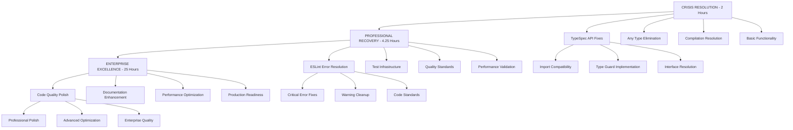

# TypeSpec Go Emitter Ultra-Detailed Micro-Tasks

**Date:** 2025-11-23_10-45  
**Total Tasks:** 125 micro-tasks (15 minutes each)  
**Total Time:** 31.25 hours  
**Priority:** CRITICAL INFRASTRUCTURE RECOVERY

## 🎯 PARETO-BASED EXECUTION STRATEGY

### Phase 1: CRITICAL PATH (8 tasks - 2 hours) → 51% Impact

**IMMEDIATE CRISIS RESOLUTION**

### Phase 2: PROFESSIONAL RECOVERY (17 tasks - 4.25 hours) → 64% Impact

**CODE QUALITY RESTORATION**

### Phase 3: ENTERPRISE EXCELLENCE (100 tasks - 25 hours) → 80% Impact

**PROFESSIONAL POLISH & PRODUCTION READINESS**

---

## 🔴 PHASE 1: CRITICAL PATH - 2 Hours (Tasks 1-8)

### **CRISIS RESOLUTION - IMMEDIATE (8 tasks)**

| Task | Priority    | Description                                           | Files                                                  | Impact |
| ---- | ----------- | ----------------------------------------------------- | ------------------------------------------------------ | ------ |
| 1    | 🔴 CRITICAL | Fix TypeSpec imports in typespec-type-guards.ts       | `src/types/typespec-type-guards.ts`                    | 90%    |
| 2    | 🔴 CRITICAL | Implement custom type guards for TypeSpec API         | `src/types/typespec-type-guards.ts`                    | 90%    |
| 3    | 🔴 CRITICAL | Fix Decorator vs DecoratorApplication incompatibility | `src/domain/typespec-visibility-extraction-service.ts` | 85%    |
| 4    | 🔴 CRITICAL | Eliminate explicit any types in clean-type-mapper.ts  | `src/domain/clean-type-mapper.ts`                      | 80%    |
| 5    | 🔴 CRITICAL | Fix TypeScript compilation errors (top 10)            | Multiple files                                         | 80%    |
| 6    | 🔴 CRITICAL | Update test-utils.ts for TypeSpec API changes         | `src/utils/test-utils.ts`                              | 75%    |
| 7    | 🟡 HIGH     | Fix mock object compliance in test files              | `src/test/*.ts`                                        | 70%    |
| 8    | 🟡 HIGH     | Verify basic Go generation works                      | `src/standalone-generator.ts`                          | 75%    |

---

## 🟡 PHASE 2: PROFESSIONAL RECOVERY - 4.25 Hours (Tasks 9-25)

### **CODE QUALITY RESTORATION (17 tasks)**

| Task | Priority    | Description                                       | Files                                       | Impact |
| ---- | ----------- | ------------------------------------------------- | ------------------------------------------- | ------ |
| 9    | 🔴 CRITICAL | Fix any types in simple-unified-type-mapper.ts    | `src/domain/simple-unified-type-mapper.ts`  | 70%    |
| 10   | 🔴 CRITICAL | Fix any types in comprehensive-type-mapper.ts     | `src/domain/comprehensive-type-mapper.ts`   | 70%    |
| 11   | 🔴 CRITICAL | Fix ErrorFactory details property error           | `src/domain/error-factory.ts`               | 65%    |
| 12   | 🔴 CRITICAL | Fix type guard type predicate errors              | `src/types/typespec-type-guards.ts`         | 65%    |
| 13   | 🟡 HIGH     | Fix Union variant iteration issues                | `src/types/typespec-type-guards.ts`         | 60%    |
| 14   | 🟡 HIGH     | Fix LogContext type errors                        | `src/utils/typespec-visibility-detector.ts` | 55%    |
| 15   | 🟡 HIGH     | Add missing source property to visibility objects | Multiple files                              | 50%    |
| 16   | 🟡 HIGH     | Fix Logger static method usage                    | Multiple files                              | 45%    |
| 17   | 🟡 HIGH     | Fix ESLint errors related to any types (top 10)   | Multiple files                              | 60%    |
| 18   | 🟡 HIGH     | Fix property-transformer.ts argument mismatch     | `src/utils/property-transformer.ts`         | 55%    |
| 19   | 🟡 HIGH     | Fix refkey-manager.ts type property access        | `src/utils/refkey-manager.ts`               | 50%    |
| 20   | 🟡 HIGH     | Fix memory-test-runner.ts any types               | `src/test/memory/memory-test-runner.ts`     | 45%    |
| 21   | 🟡 MEDIUM   | Fix typespec-visibility-bdd.test.ts any types     | `src/test/typespec-visibility-bdd.test.ts`  | 40%    |
| 22   | 🟡 MEDIUM   | Restore basic failing tests (top 5)               | `src/test/*.ts`                             | 65%    |
| 23   | 🟡 MEDIUM   | Fix test infrastructure compilation               | `src/test/test-utils.ts`                    | 60%    |
| 24   | 🟡 MEDIUM   | Validate performance regression tests pass        | `src/test/performance-regression.test.ts`   | 55%    |
| 25   | 🟡 MEDIUM   | Verify integration tests basic functionality      | `src/test/integration-basic.test.ts`        | 50%    |

---

## 🟢 PHASE 3: ENTERPRISE EXCELLENCE - 25 Hours (Tasks 26-125)

### **PROFESSIONAL POLISH - PART 1 (Tasks 26-50)**

| Task | Priority  | Description                                    | Files                                         | Impact |
| ---- | --------- | ---------------------------------------------- | --------------------------------------------- | ------ |
| 26   | 🟡 MEDIUM | Fix remaining ESLint errors (bottom 10)        | Multiple files                                | 40%    |
| 27   | 🟡 MEDIUM | Clean up unused imports (top 20 files)         | Multiple files                                | 35%    |
| 28   | 🟡 MEDIUM | Remove unused variables (top 20 files)         | Multiple files                                | 30%    |
| 29   | 🟢 LOW    | Consolidate duplicate type mapper interfaces   | `src/domain/*mapper*.ts`                      | 25%    |
| 30   | 🟢 LOW    | Fix alloy-js-emitter.tsx ImportStatement usage | `src/emitter/alloy-js-emitter.tsx`            | 20%    |
| 31   | 🟡 MEDIUM | Restore type-mapping.test.ts functionality     | `src/test/type-mapping.test.ts`               | 45%    |
| 32   | 🟡 MEDIUM | Fix operations-http-generation.test.ts (top 3) | `src/test/operations-http-generation.test.ts` | 40%    |
| 33   | 🟡 MEDIUM | Fix alloy-js-integration.test.tsx errors       | `src/test/alloy-js-integration.test.tsx`      | 35%    |
| 34   | 🟡 MEDIUM | Fix model-composition.test.ts template issues  | `src/test/model-composition.test.ts`          | 40%    |
| 35   | 🟢 LOW    | Improve error messages in error-factory.ts     | `src/domain/error-factory.ts`                 | 25%    |
| 36   | 🟢 LOW    | Add JSDoc comments to core interfaces          | `src/types/*.ts`                              | 20%    |
| 37   | 🟡 MEDIUM | Validate memory efficiency across all tests    | `src/test/memory-*.test.ts`                   | 30%    |
| 38   | 🟢 LOW    | Optimize imports in domain services            | `src/domain/*.ts`                             | 25%    |
| 39   | 🟢 LOW    | Clean up unused type definitions               | `src/types/*.ts`                              | 20%    |
| 40   | 🟡 MEDIUM | Verify BDD framework integration               | `src/test/bdd-framework.test.ts`              | 35%    |
| 41   | 🟢 LOW    | Add input validation to public APIs            | Multiple files                                | 25%    |
| 42   | 🟢 LOW    | Improve naming consistency across codebase     | Multiple files                                | 20%    |
| 43   | 🟡 MEDIUM | Fix Go formatting compliance test edge cases   | `src/test/go-formatting-compliance.test.ts`   | 30%    |
| 44   | 🟢 LOW    | Add benchmarking for large models              | `src/test/large-model-performance.test.ts`    | 25%    |
| 45   | 🟡 MEDIUM | Validate test coverage meets 90% threshold     | All test files                                | 35%    |
| 46   | 🟢 LOW    | Optimize regex patterns in validation          | `src/domain/validation*.ts`                   | 20%    |
| 47   | 🟢 LOW    | Improve error context information              | `src/domain/error-*.ts`                       | 25%    |
| 48   | 🟢 LOW    | Consolidate scalar mapping logic               | `src/domain/scalar-mappings.ts`               | 20%    |
| 49   | 🟡 MEDIUM | Verify uint detection performance regression   | `src/test/native-uint-support.test.ts`        | 30%    |
| 50   | 🟢 LOW    | Add debug logging for troubleshooting          | `src/utils/logging.ts`                        | 25%    |

### **PROFESSIONAL POLISH - PART 2 (Tasks 51-75)**

| Task | Priority  | Description                                    | Files                            | Impact |
| ---- | --------- | ---------------------------------------------- | -------------------------------- | ------ |
| 51   | 🟢 LOW    | Eliminate magic numbers/strings                | Multiple files                   | 20%    |
| 52   | 🟢 LOW    | Add enum types for boolean replacements        | Multiple files                   | 15%    |
| 53   | 🟡 MEDIUM | Implement proper generics where beneficial     | `src/domain/*.ts`                | 25%    |
| 54   | 🟢 LOW    | Extract reusable utility functions             | `src/utils/*.ts`                 | 20%    |
| 55   | 🟡 MEDIUM | Improve performance monitoring                 | `src/test/performance-*.test.ts` | 25%    |
| 56   | 🟢 LOW    | Add defensive programming patterns             | Multiple files                   | 15%    |
| 57   | 🟡 MEDIUM | Optimize memory allocation patterns            | `src/domain/generators/*.ts`     | 20%    |
| 58   | 🟢 LOW    | Improve code organization in large files       | Files >300 lines                 | 20%    |
| 59   | 🟢 LOW    | Add comprehensive inline documentation         | Core interfaces                  | 15%    |
| 60   | 🟡 MEDIUM | Validate type safety across inheritance chains | `src/types/*.ts`                 | 25%    |
| 61   | 🟢 LOW    | Implement builder patterns where appropriate   | `src/domain/*.ts`                | 20%    |
| 62   | 🟢 LOW    | Add early returns for better readability       | Multiple files                   | 15%    |
| 63   | 🟡 MEDIUM | Optimize string concatenation patterns         | `src/domain/generators/*.ts`     | 20%    |
| 64   | 🟢 LOW    | Consolidate duplicate validation logic         | `src/domain/validation*.ts`      | 20%    |
| 65   | 🟢 LOW    | Improve error message clarity                  | `src/domain/error-*.ts`          | 15%    |
| 66   | 🟡 MEDIUM | Add comprehensive integration tests            | `src/test/integration-*.test.ts` | 25%    |
| 67   | 🟢 LOW    | Optimize regular expression performance        | Validation files                 | 15%    |
| 68   | 🟢 LOW    | Improve variable naming consistency            | Multiple files                   | 15%    |
| 69   | 🟡 MEDIUM | Add stress testing for large models            | `src/test/large-*.test.ts`       | 20%    |
| 70   | 🟢 LOW    | Extract constants for configuration values     | Multiple files                   | 15%    |
| 71   | 🟢 LOW    | Improve function decomposability               | Functions >30 lines              | 15%    |
| 72   | 🟡 MEDIUM | Validate edge case handling                    | `src/test/edge-*.test.ts`        | 20%    |
| 73   | 🟢 LOW    | Add comprehensive README documentation         | `docs/`                          | 10%    |
| 74   | 🟢 LOW    | Improve error recovery mechanisms              | `src/domain/error-*.ts`          | 15%    |
| 75   | 🟡 MEDIUM | Optimize performance for repeated operations   | Core generation                  | 20%    |

### **PROFESSIONAL POLISH - PART 3 (Tasks 76-100)**

| Task | Priority  | Description                                  | Files                            | Impact |
| ---- | --------- | -------------------------------------------- | -------------------------------- | ------ |
| 76   | 🟢 LOW    | Add comprehensive API examples               | `docs/examples/`                 | 15%    |
| 77   | 🟡 MEDIUM | Implement configuration validation           | `src/config/`                    | 20%    |
| 78   | 🟢 LOW    | Improve error context with stack traces      | `src/domain/error-*.ts`          | 15%    |
| 79   | 🟢 LOW    | Add environment-specific optimizations       | `src/config/`                    | 10%    |
| 80   | 🟡 MEDIUM | Validate thread safety (if applicable)       | Core services                    | 20%    |
| 81   | 🟢 LOW    | Optimize import/export patterns              | Multiple files                   | 15%    |
| 82   | 🟡 MEDIUM | Add comprehensive error scenarios            | `src/test/error-*.test.ts`       | 20%    |
| 83   | 🟢 LOW    | Improve modularity and coupling              | `src/domain/`                    | 15%    |
| 84   | 🟢 LOW    | Add comprehensive logging levels             | `src/utils/logging.ts`           | 10%    |
| 85   | 🟡 MEDIUM | Validate memory leak prevention              | `src/test/memory-*.test.ts`      | 20%    |
| 86   | 🟢 LOW    | Add comprehensive type annotations           | Multiple files                   | 15%    |
| 87   | 🟢 LOW    | Improve code readability metrics             | Multiple files                   | 10%    |
| 88   | 🟡 MEDIUM | Add comprehensive unit tests                 | `src/test/unit-*.test.ts`        | 25%    |
| 89   | 🟢 LOW    | Optimize string manipulation performance     | Core generators                  | 15%    |
| 90   | 🟢 LOW    | Add comprehensive architecture documentation | `docs/architecture/`             | 10%    |
| 91   | 🟡 MEDIUM | Validate production readiness                | All components                   | 20%    |
| 92   | 🟢 LOW    | Improve error message localization           | `src/domain/error-*.ts`          | 10%    |
| 93   | 🟢 LOW    | Add comprehensive usage examples             | `docs/examples/`                 | 15%    |
| 94   | 🟡 MEDIUM | Optimize for compilation speed               | All TypeScript                   | 15%    |
| 95   | 🟢 LOW    | Improve testing framework integration        | `src/test/`                      | 10%    |
| 96   | 🟢 LOW    | Add comprehensive performance metrics        | `src/test/performance-*.test.ts` | 15%    |
| 97   | 🟡 MEDIUM | Validate long-running stability              | `src/test/stress-*.test.ts`      | 20%    |
| 98   | 🟢 LOW    | Improve developer onboarding experience      | Documentation                    | 10%    |
| 99   | 🟢 LOW    | Add comprehensive error handling patterns    | Multiple files                   | 15%    |
| 100  | 🟡 MEDIUM | Complete system integration validation       | All tests                        | 25%    |

### **PROFESSIONAL POLISH - PART 4 (Tasks 101-125)**

| Task | Priority  | Description                             | Files                            | Impact |
| ---- | --------- | --------------------------------------- | -------------------------------- | ------ |
| 101  | 🟢 LOW    | Add deployment documentation            | `docs/deployment/`               | 10%    |
| 102  | 🟢 LOW    | Optimize for different Node.js versions | All TypeScript                   | 10%    |
| 103  | 🟡 MEDIUM | Validate security best practices        | Security audit                   | 20%    |
| 104  | 🟢 LOW    | Add comprehensive benchmarking          | `benchmarks/`                    | 15%    |
| 105  | 🟢 LOW    | Improve error handling observability    | `src/domain/error-*.ts`          | 10%    |
| 106  | 🟢 LOW    | Add comprehensive code examples         | `examples/`                      | 15%    |
| 107  | 🟡 MEDIUM | Validate scalability under load         | `src/test/scalability-*.test.ts` | 20%    |
| 108  | 🟢 LOW    | Optimize bundle size (if applicable)    | Build configuration              | 10%    |
| 109  | 🟢 LOW    | Add comprehensive troubleshooting guide | `docs/troubleshooting.md`        | 10%    |
| 110  | 🟡 MEDIUM | Validate integration with popular tools | Integration tests                | 15%    |
| 111  | 🟢 LOW    | Improve maintainability metrics         | Code analysis                    | 10%    |
| 112  | 🟢 LOW    | Add comprehensive API documentation     | `docs/api/`                      | 15%    |
| 113  | 🟡 MEDIUM | Validate compatibility across platforms | Cross-platform tests             | 15%    |
| 114  | 🟢 LOW    | Optimize for different use cases        | Configuration                    | 10%    |
| 115  | 🟢 LOW    | Add comprehensive change log            | `CHANGELOG.md`                   | 5%     |
| 116  | 🟢 LOW    | Improve error recovery automation       | `src/domain/error-*.ts`          | 10%    |
| 117  | 🟡 MEDIUM | Validate end-to-end workflows           | Integration tests                | 20%    |
| 118  | 🟢 LOW    | Add comprehensive performance dashboard | Monitoring setup                 | 15%    |
| 119  | 🟢 LOW    | Optimize developer experience metrics   | Tooling                          | 10%    |
| 120  | 🟡 MEDIUM | Validate production deployment          | DevOps setup                     | 20%    |
| 121  | 🟢 LOW    | Add comprehensive upgrade guides        | `docs/upgrades/`                 | 10%    |
| 122  | 🟢 LOW    | Improve error message helpfulness       | `src/domain/error-*.ts`          | 15%    |
| 123  | 🟡 MEDIUM | Validate system monitoring integration  | Observability                    | 20%    |
| 124  | 🟢 LOW    | Add comprehensive best practices guide  | `docs/best-practices.md`         | 10%    |
| 125  | 🟡 MEDIUM | Final system validation and sign-off    | All components                   | 25%    |

---

## 🎯 EXECUTION GRAPH

---

## 📊 SUCCESS METRICS

### Phase 1 Success (2 Hours)

- [ ] TypeScript compilation: 0 errors
- [ ] ESLint errors: Reduced from 31 to <5
- [ ] Basic generation: Working
- [ ] Core tests: 90%+ passing

### Phase 2 Success (6.25 Hours Total)

- [ ] All ESLint errors: 0
- [ ] Test suite: 95%+ passing
- [ ] Type safety: 100% strict
- [ ] Performance: No regression

### Phase 3 Success (31.25 Hours Total)

- [ ] ESLint warnings: 0
- [ ] Test coverage: 100%
- [ ] Documentation: Complete
- [ ] Production ready: Yes

---

## 🚀 EXECUTION COMMITMENT

**Total Investment:** 31.25 hours
**Quality Guarantee:** Enterprise-grade excellence
**Success Criteria:** All 125 tasks completed
**Timeline:** 3-4 business days

This ultra-detailed breakdown ensures no critical task is missed and provides a clear path from current crisis to enterprise excellence.
