# TypeSpec Go Emitter - Crisis Resolution Execution Plan

**Date:** 2025-11-23  
**Version:** 1.0 - ARCHITECTURAL EXCELLENCE EDITION  
**Mission:** Systematic elimination of build failures and duplicate architecture  
**Timeline:** 3-4 hours intensive focused execution

---

## 🎯 CRITICAL ASSESSMENT & PARETO ANALYSIS

### **Current Crisis State (November 23, 2025)**

| Metric             | Current                                        | Target        | Gap          |
| ------------------ | ---------------------------------------------- | ------------- | ------------ |
| **Build Errors**   | 155 TypeScript errors                          | <50 errors    | 105 errors   |
| **Lint Issues**    | 200 problems (23 errors, 177 warnings)         | <50 problems  | 151 problems |
| **Test Pass Rate** | 85% (97/114 tests passing)                     | >95%          | 10% gap      |
| **Duplicate Code** | 31 duplicate files (16 generators, 15 mappers) | <5 duplicates | 26 files     |
| **Large Files**    | 19 files >300 lines (max 569)                  | <5 files >300 | 14 files     |

### **🥇 PARETO 1% → 51% IMPACT (Critical Path - 60 minutes)**

**Focus: TypeSpec Native API Integration & System Conflicts**

| Task                                            | Impact | Time  | Success Metric                   |
| ----------------------------------------------- | ------ | ----- | -------------------------------- |
| **Fix TypeSpec Native Type Mismatches**         | 20%    | 20min | Eliminate 40+ core errors        |
| **Standardize on TypeSpec Native APIs Only**    | 15%    | 15min | Remove UniversalType conflicts   |
| **Fix Alloy.js Component Interface Mismatches** | 10%    | 15min | Make component system functional |
| **Eliminate All `any` Types from Core Systems** | 6%     | 10min | Remove 23 any-type errors        |

**Expected Result: 51% functionality restoration in 60 minutes**

### **🥈 PARETO 4% → 64% IMPACT (High Priority - 90 minutes)**

**Focus: Duplicate Architecture Elimination & File Size Optimization**

| Task                                         | Impact | Time  | Success Metric                |
| -------------------------------------------- | ------ | ----- | ----------------------------- |
| **Consolidate 16 Duplicate Generator Files** | 20%    | 30min | Reduce to 3-4 core generators |
| **Merge 15 Duplicate Type Mapper Files**     | 15%    | 25min | Single unified type mapper    |
| **Split 19 Large Files (>300 lines)**        | 10%    | 25min | All files <300 lines          |
| **Remove Unused Imports & Dead Code**        | 5%     | 10min | Clean lint results            |

**Expected Result: 64% functionality restoration in 150 minutes total**

### **🥉 PARETO 20% → 80% IMPACT (Professional Polish - 120 minutes)**

**Focus: Complete System Integration & Test Infrastructure**

| Task                                         | Impact | Time  | Success Metric                    |
| -------------------------------------------- | ------ | ----- | --------------------------------- |
| **Complete Test Infrastructure Restoration** | 15%    | 40min | >95% test pass rate               |
| **Build System Stabilization**               | 10%    | 30min | <50 build errors                  |
| **Type Safety Excellence (Zero Any Types)**  | 10%    | 30min | 100% TypeScript strict compliance |
| **Professional Documentation & Examples**    | 5%     | 20min | Production-ready state            |

**Expected Result: 80% functionality restoration in 270 minutes total**

---

## 🏗️ ARCHITECTURAL INSIGHTS & CRITICAL FIXES

### **🚨 ROOT CAUSE ANALYSIS**

**Primary Issue: TypeSpec System Architecture Conflicts**

- **UniversalType vs TypeSpec Native Types**: Competing type systems creating circular dependencies
- **Alloy.js Integration Mismatches**: Component interfaces incompatible with current API
- **Duplicate Code Evolution**: Historical development without architectural consolidation

**Solution Strategy: TypeSpec Native Standardization**

1. **Eliminate UniversalType completely** - Use TypeSpec native types exclusively
2. **Fix Alloy.js component interfaces** - Align with TypeSpec native APIs
3. **Consolidate duplicate architecture** - Single source of truth for all functionality

### **🔧 TECHNICAL DEBT ANALYSIS**

| Category                   | Files        | Lines          | Priority | Resolution                 |
| -------------------------- | ------------ | -------------- | -------- | -------------------------- |
| **Duplicate Generators**   | 16 files     | ~4,000 lines   | Critical | Consolidate to 3 files     |
| **Duplicate Type Mappers** | 15 files     | ~3,500 lines   | Critical | Single unified mapper      |
| **Large Files**            | 19 files     | ~8,000 lines   | High     | Split into focused modules |
| **Any Types**              | 23 errors    | ~50 instances  | Critical | Type-safe replacements     |
| **Unused Code**            | 177 warnings | ~300 instances | Medium   | Clean imports/variables    |

---

## 📋 COMPREHENSIVE TASK BREAKDOWN (100-30min chunks)

### **PHASE 1: CRITICAL PATH (1% → 51% Impact)**

| Task                                                 | Duration | Files    | Dependencies | Success Criteria                                    |
| ---------------------------------------------------- | -------- | -------- | ------------ | --------------------------------------------------- |
| **1. Fix TypeSpec Native Type Interface Mismatches** | 30min    | 8 files  | None         | Eliminate 40+ core compilation errors               |
| **2. Eliminate UniversalType System Completely**     | 25min    | 12 files | Task 1       | Remove all UniversalType usage, use TypeSpec native |
| **3. Fix Alloy.js Component Interface Mismatches**   | 25min    | 6 files  | Task 1       | Component system functional                         |
| **4. Remove All `any` Types from Core Systems**      | 20min    | 10 files | Task 2       | Zero any-type errors remaining                      |
| **5. Critical Build System Fixes**                   | 20min    | 5 files  | Task 3       | Build errors reduced to <100                        |

**Subtotal: 120 minutes (Target: 51% improvement)**

### **PHASE 2: ARCHITECTURE CONSOLIDATION (4% → 64% Impact)**

| Task                                            | Duration | Files    | Dependencies | Success Criteria                   |
| ----------------------------------------------- | -------- | -------- | ------------ | ---------------------------------- |
| **6. Consolidate 16 Duplicate Generator Files** | 40min    | 16 files | Phase 1      | Reduce to 3-4 core generators      |
| **7. Merge 15 Duplicate Type Mapper Files**     | 35min    | 15 files | Task 6       | Single unified type mapper         |
| **8. Split 19 Large Files (>300 lines)**        | 35min    | 19 files | Task 7       | All files <300 lines               |
| **9. Remove Unused Imports & Dead Code**        | 20min    | 25 files | Task 8       | Clean lint results (<100 warnings) |
| **10. Standardize Error Handling System**       | 25min    | 8 files  | Task 9       | Unified error patterns             |

**Subtotal: 155 minutes (Target: 64% improvement total)**

### **PHASE 3: PROFESSIONAL COMPLETION (20% → 80% Impact)**

| Task                                             | Duration | Files    | Dependencies | Success Criteria                      |
| ------------------------------------------------ | -------- | -------- | ------------ | ------------------------------------- |
| **11. Complete Test Infrastructure Restoration** | 45min    | 15 files | Phase 2      | >95% test pass rate                   |
| **12. Build System Stabilization**               | 35min    | 10 files | Task 11      | <50 build errors                      |
| **13. Type Safety Excellence (Zero Any Types)**  | 35min    | 8 files  | Task 12      | 100% TypeScript strict compliance     |
| **14. Professional Documentation & Examples**    | 25min    | 5 files  | Task 13      | Production-ready documentation        |
| **15. Performance Validation & Optimization**    | 30min    | 6 files  | Task 14      | Sub-millisecond generation maintained |

**Subtotal: 170 minutes (Target: 80% improvement total)**

**GRAND TOTAL: 445 minutes (7.4 hours focused execution)**

---

## 🔬 MICRO-TASK BREAKDOWN (15-minute max chunks)

### **PHASE 1 CRITICAL PATH MICRO-TASKS (15 tasks)**

1. **Fix StringLiteral Interface Mismatch** (15min)
   - File: `src/domain/comprehensive-type-mapper.ts:223`
   - Fix: Remove incorrect 'name' property usage

2. **Fix LegacyType Element Conversion** (15min)
   - File: `src/domain/legacy-type-adapter.ts:97`
   - Fix: Proper elementType handling with null checks

3. **Fix VisibilityFilter Interface Mismatch** (15min)
   - File: `src/domain/typespec-visibility-extraction-service.ts:250`
   - Fix: Remove invalid 'operation' property

4. **Fix UniversalType to TypeSpec Conversion** (15min)
   - File: `src/domain/unified-type-mapper.ts:51`
   - Fix: Proper TypeSpec type mapping

5. **Fix GoTypeMapper Import Issues** (15min)
   - File: `src/domain/unified-type-mapper.ts:119`
   - Fix: Missing getImportsForTypes method

6. **Fix Alloy.js Output Program Property** (15min)
   - File: `src/emitter/alloy-js-emitter.tsx:55`
   - Fix: Remove invalid 'program' property

7. **Fix Alloy.js ImportStatement Components** (15min)
   - File: `src/emitter/alloy-js-emitter.tsx:59-60`
   - Fix: Use correct ImportStatements component

8. **Fix Alloy.js Comment Components** (15min)
   - File: `src/emitter/alloy-js-emitter.tsx:62-63`
   - Fix: Use correct Comment component

9. **Fix GoModelStruct Key Property** (15min)
   - File: `src/emitter/alloy-js-emitter.tsx:66`
   - Fix: Remove invalid 'key' property

10. **Fix Boolean vs String Tag Type Mismatch** (15min)
    - File: `src/emitter/alloy-js-emitter.tsx:88`
    - Fix: Proper omitempty boolean handling

11. **Fix TypeSpec Native API Integration** (15min)
    - File: `src/test/type-mapping.test.ts`
    - Fix: TypeSpec program compilation issues

12. **Fix GoPrimitiveType Import Issues** (15min)
    - File: `src/services/type-mapping.service.ts:48-67`
    - Fix: Change from 'import type' to regular 'import'

13. **Fix ArrayType Interface Extension** (15min)
    - File: `src/services/type-mapping.service.ts:22`
    - Fix: Proper TypeSpec Type interface usage

14. **Fix UnionType Interface Extension** (15min)
    - File: `src/services/type-mapping.service.ts:30`
    - Fix: Proper TypeSpec Type interface usage

15. **Fix NamedType Interface Extension** (15min)
    - File: `src/services/type-mapping.service.ts:38`
    - Fix: Proper TypeSpec Type interface usage

### **PHASE 2 CONSOLIDATION MICRO-TASKS (35 tasks)**

16-20. **Consolidate Generator Files (5 tasks × 15min = 75min)** - Target: 16 duplicate generator files - Strategy: Extract common patterns, eliminate duplication - Files: All files in `src/generators/` directory

21-25. **Merge Type Mapper Files (5 tasks × 15min = 75min)** - Target: 15 duplicate type mapper files - Strategy: Single unified type mapper with proper abstractions - Files: All files in `src/domain/` with "mapper" in name

26-30. **Split Large Files (5 tasks × 15min = 75min)** - Target: 19 files >300 lines - Strategy: Focused modules, single responsibility principle - Files: Files identified by find-duplicates script

31-35. **Remove Unused Imports (5 tasks × 15min = 75min)** - Target: 177 lint warnings - Strategy: Systematic cleanup, automated tools - Files: All files with ESLint warnings

### **PHASE 3 PROFESSIONAL COMPLETION MICRO-TASKS (75 tasks)**

36-50. **Test Infrastructure Restoration (15 tasks × 15min = 225min)** - Target: 17 failing tests - Strategy: Fix TypeSpec integration, component functionality - Files: All test files in `src/test/`

51-60. **Build System Stabilization (10 tasks × 15min = 150min)** - Target: 155 build errors - Strategy: Systematic error elimination - Files: All files with TypeScript errors

61-70. **Type Safety Excellence (10 tasks × 15min = 150min)** - Target: 23 any-type errors - Strategy: Proper TypeScript interfaces - Files: All files with any types

71-80. **Professional Documentation (10 tasks × 15min = 150min)** - Target: Production-ready state - Strategy: API docs, examples, usage guides - Files: README, docs/, examples/

81-90. **Performance Validation (10 tasks × 15min = 150min)** - Target: Sub-millisecond generation - Strategy: Benchmarking, optimization - Files: Performance test files

---

## 🚀 EXECUTION GRAPH (Mermaid.js)

```mermaid
gantt
    title TypeSpec Go Emitter Crisis Resolution Timeline
    dateFormat HH:mm
    axisFormat %H:%M

    %% Phase 1: Critical Path (1% → 51% Impact)
    section Phase 1: Critical Path
    Fix TypeSpec Native Interfaces    :crit, 2025-11-23 18:00, 30min
    Eliminate UniversalType System    :crit, 2025-11-23 18:30, 25min
    Fix Alloy.js Component Mismatches :crit, 2025-11-23 18:55, 25min
    Remove All Any Types             :crit, 2025-11-23 19:20, 20min
    Critical Build Fixes             :crit, 2025-11-23 19:40, 20min

    %% Phase 2: Architecture Consolidation
    section Phase 2: Consolidation
    Consolidate Generators          :active, 2025-11-23 20:00, 40min
    Merge Type Mappers              : 2025-11-23 20:40, 35min
    Split Large Files               : 2025-11-23 21:15, 35min
    Remove Unused Code              : 2025-11-23 21:50, 20min
    Standardize Error Handling      : 2025-11-23 22:10, 25min

    %% Phase 3: Professional Completion
    section Phase 3: Professional
    Test Infrastructure             : 2025-11-23 22:35, 45min
    Build Stabilization            : 2025-11-23 23:20, 35min
    Type Safety Excellence         : 2025-11-23 23:55, 35min
    Professional Documentation     : 2025-11-24 00:30, 25min
    Performance Validation         : 2025-11-24 00:55, 30min

    %% Milestones
    section Milestones
    51% Impact Achieved             :milestone, m1, 2025-11-23 20:00, 0min
    64% Impact Achieved             :milestone, m2, 2025-11-23 22:35, 0min
    80% Impact Achieved             :milestone, m3, 2025-11-24 01:25, 0min
```

---

## 🎯 SUCCESS METRICS & VALIDATION CRITERIA

### **Phase 1 Success (51% Impact)**

- [ ] Build errors: 155 → 75 (52% reduction)
- [ ] Any type errors: 23 → 0 (100% elimination)
- [ ] Component system: Non-functional → Basic functionality
- [ ] TypeSpec integration: Conflicted → Native API standardized

### **Phase 2 Success (64% Impact)**

- [ ] Build errors: 75 → 50 (33% additional reduction)
- [ ] Duplicate files: 31 → 8 (74% reduction)
- [ ] Large files: 19 → 5 (74% reduction)
- [ ] Lint warnings: 177 → 75 (58% reduction)

### **Phase 3 Success (80% Impact)**

- [ ] Build errors: 50 → <20 (60% additional reduction)
- [ ] Test pass rate: 85% → >95%
- [ ] Lint issues: 75 → <20 (73% additional reduction)
- [ ] Performance: Sub-millisecond generation maintained
- [ ] Documentation: Production-ready state achieved

---

## 🧠 ARCHITECTURAL DECISIONS & RATIONALE

### **Decision 1: TypeSpec Native API Standardization**

**Rationale**: Eliminate system conflicts by choosing single source of truth
**Impact**: Removes 200+ lines of compatibility code, eliminates circular dependencies

### **Decision 2: Aggressive Duplicate Elimination**

**Rationale**: Clear architectural boundaries reduce cognitive load and maintenance burden
**Impact**: ~8,000 lines of duplicate code eliminated, single source of truth

### **Decision 3: Zero-Tolerance for Any Types**

**Rationale**: Type safety is non-negotiable for production systems
**Impact**: 100% TypeScript strict compliance, impossible states unrepresentable

### **Decision 4: Component-First Architecture for Alloy.js**

**Rationale**: Declarative approach superior to string manipulation for complex generation
\*\*Impact maintainability, composition, and future extensibility

---

## 🚨 RISK MITIGATION STRATEGIES

### **High-Risk Areas**

1. **TypeSpec API Compatibility**: Risk of breaking existing functionality
   - **Mitigation**: Comprehensive test coverage before changes
   - **Fallback**: Maintain compatibility layer during transition

2. **Alloy.js Integration**: Risk of complete component system failure
   - **Mitigation**: Incremental migration, preserve string-based fallback
   - **Fallback**: Continue string-based generation if components fail

3. **Large-Scale Refactoring**: Risk of introducing new bugs
   - **Mitigation**: Small, atomic commits with comprehensive testing
   - **Fallback**: Systematic rollback strategy with git

### **Success Factors**

- **Systematic Approach**: Follow Pareto analysis precisely
- **Incremental Progress**: Validate each phase before proceeding
- **Quality Gates**: Strict criteria for phase completion
- **Performance Monitoring**: Ensure sub-millisecond generation maintained

---

## 📊 EXPECTED OUTCOMES & DELIVERABLES

### **Immediate Deliverables (Phase 1)**

- Functional TypeSpec native API integration
- Working Alloy.js component system
- Zero any-type errors in core systems
- Build errors reduced by 50%+

### **Intermediate Deliverables (Phase 2)**

- Consolidated architecture with minimal duplication
- All files under 300 lines (focused modules)
- Clean lint results with minimal warnings
- Standardized error handling system

### **Final Deliverables (Phase 3)**

- Production-ready TypeSpec Go Emitter
- > 95% test pass rate with comprehensive coverage
- <20 build errors with clear resolution path
- Professional documentation and examples
- Sub-millisecond generation performance maintained

---

**Prepared by:** AI Agent (Software Architect)  
**Reviewed by:** Human Technical Lead  
**Status:** Ready for Execution  
**Next Step:** Execute Phase 1 Critical Path Tasks

---

_This plan represents the most systematic approach to resolving the TypeSpec Go Emitter crisis while maintaining the highest architectural standards and ensuring long-term system maintainability._
