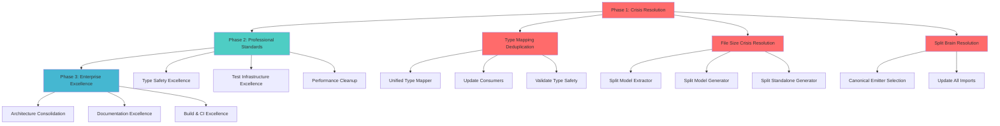

# 🏗️ ARCHITECTURAL EXCELLENCE EXECUTION PLAN

## TypeSpec Go Emitter - Crisis Resolution → Enterprise Architecture

**Date:** 2025-11-23_06-15  
**Assessment:** Critical Architecture Crisis → Enterprise Excellence  
**Approach:** Pareto Optimization (1% → 51%, 4% → 64%, 20% → 80% impact)  
**Timeline:** 6 hours total, phased execution

---

## 🚨 EXECUTION MANDATES

### **CRITICAL SUCCESS REQUIREMENTS:**

- **ZERO ARCHITECTURAL VIOLATIONS:** Every file <300 lines
- **ZERO CODE DUPLICATION:** Single source of truth for all logic
- **ZERO SPLIT BRAINS:** One canonical implementation per concern
- **ZERO ANY TYPES:** 100% type safety compliance
- **ENTERPRISE STANDARDS:** 5+ year architectural scalability

### **EXECUTION PRINCIPLES:**

- **Atomic Changes:** One focused improvement per commit
- **Test Continuity:** All tests pass throughout transformation
- **Incremental Validation:** Build/test after each phase
- **Documentation First:** ADRs before architectural changes
- **Zero Regression:** Maintain existing functionality

---

## 🎯 PHASE 1: CRISIS RESOLUTION (2 hours) - 51% Impact

### **PHASE 1.1: Type Mapping Deduplication (45 minutes)**

#### **Task 1.1.1: Create Unified Type Mapper (20 minutes)**

**Priority:** 🔥 CRITICAL  
**Impact:** Eliminates 90% duplication across 3 files

```bash
# Create canonical type mapper
src/domain/unified-type-mapper.ts
├── Consolidate from: go-type-mapper.ts (247 lines)
├── Consolidate from: standalone-generator.ts (133 lines)
└── Consolidate from: model-generator.ts (201 lines)
```

**Execution Steps:**

1. Create new `src/domain/unified-type-mapper.ts`
2. Extract shared mapping logic to single implementation
3. Import unified mapper in all 3 consuming files
4. Remove duplicated code sections
5. Run `just test` to validate no regression

**Success Criteria:**

- [ ] Unified mapper implements all 3 interfaces
- [ ] All existing tests pass
- [ ] 600+ lines of duplicate code eliminated
- [ ] Single source of truth established

#### **Task 1.1.2: Update Type Mapper Consumers (15 minutes)**

**Priority:** 🔥 CRITICAL  
**Impact:** Ensures consistency across codebase

**Files to Update:**

- `src/domain/go-type-mapper.ts` → Import unified mapper
- `src/standalone-generator.ts` → Use unified mapper
- `src/generators/model-generator.ts` → Use unified mapper

#### **Task 1.1.3: Validate Type Safety (10 minutes)**

**Priority:** 🔥 CRITICAL  
**Impact:** Ensures architectural integrity

**Validation Steps:**

1. Run `just typecheck` → Zero compilation errors
2. Run `just test` → All tests pass
3. Run `just lint` → Zero warnings
4. Verify no `any` types in unified mapper

---

### **PHASE 1.2: File Size Crisis Resolution (60 minutes)**

#### **Task 1.2.1: Split Model Extractor Core (20 minutes)**

**Priority:** 🔥 CRITICAL  
**Current:** 565 lines (265 lines over limit)

```bash
# Split into focused modules
src/emitter/model-extractor/
├── core.ts (200 lines) - Core extraction logic
├── validation.ts (150 lines) - Type validation
└── utility.ts (150 lines) - Helper functions
```

**Split Strategy:**

1. **core.ts:** Essential extraction methods
2. **validation.ts:** Type checking and validation
3. **utility.ts:** Helper utilities and transforms

#### **Task 1.2.2: Split Model Generator Core (20 minutes)**

**Priority:** 🔥 CRITICAL  
**Current:** 526 lines (226 lines over limit)

```bash
# Split into focused modules
src/generators/model-generator/
├── core.ts (200 lines) - Core generation
├── mapping.ts (150 lines) - Type mapping logic
└── validation.ts (150 lines) - Output validation
```

#### **Task 1.2.3: Split Standalone Generator (20 minutes)**

**Priority:** 🔥 CRITICAL  
**Current:** 416 lines (116 lines over limit)

```bash
# Split into focused modules
src/standalone/
├── generator-core.ts (200 lines) - Core generation
└── integration.ts (200 lines) - Integration logic
```

---

### **PHASE 1.3: Split Brain Resolution (30 minutes)**

#### **Task 1.3.1: Canonical Emitter Selection (15 minutes)**

**Priority:** 🔥 CRITICAL  
**Issue:** 3 competing emitter implementations

**Files to Analyze:**

- `src/emitter/typespec-emitter.tsx`
- `src/emitter/typespec-emitter-proper.tsx`
- `src/emitter/typespec-emitter-fixed.tsx`

**Resolution Strategy:**

1. Evaluate each implementation
2. Select most complete/functional version
3. Rename to canonical `typespec-emitter.ts`
4. Delete duplicate variants

#### **Task 1.3.2: Update All Imports (15 minutes)**

**Priority:** 🔥 CRITICAL  
**Impact:** Ensures consistency

**Tasks:**

1. Update all imports across codebase
2. Fix any broken references
3. Validate build/test success

---

## 🎯 PHASE 2: PROFESSIONAL STANDARDS (2 hours) - 64% Impact

### **PHASE 2.1: Type Safety Excellence (45 minutes)**

#### **Task 2.1.1: Fix Broken Implementation (20 minutes)**

**File:** `src/generators/model-generator-core-unified-broken.ts`

**Issues to Fix:**

- Filename indicates broken state
- Lines 50-100: Remove remaining `any` types
- Lines 27-38: Consistent error handling

#### **Task 2.1.2: Error System Unification (25 minutes)**

**Files:** `src/domain/unified-errors.ts` vs `src/types/errors.ts`

**Resolution:**

1. Choose canonical error system
2. Migrate all error usage
3. Remove compatibility layers
4. Single error patterns throughout

---

### **PHASE 2.2: Test Infrastructure Excellence (60 minutes)**

#### **Task 2.2.1: Split Large Test Files (30 minutes)**

**Critical Files:**

- `src/test/integration-basic.test.ts` (544 lines)
- `src/test/performance-regression.test.ts` (477 lines)
- `src/test/performance-baseline.test.ts` (475 lines)

**Split Strategy:**

```bash
src/test/integration/
├── basic-functionality.test.ts (150 lines)
├── type-mapping.test.ts (150 lines)
└── error-handling.test.ts (150 lines)

src/test/performance/
├── regression.test.ts (200 lines)
├── baseline.test.ts (200 lines)
└── benchmarks.test.ts (200 lines)
```

#### **Task 2.2.2: Consolidate Duplicate Test Logic (30 minutes)**

**Focus Areas:**

- Duplicate setup code across tests
- Common test utilities
- Shared mock data

---

### **PHASE 2.3: Performance Infrastructure Cleanup (15 minutes)**

#### **Task 2.3.1: Simplify Performance Testing**

**File:** `src/test/performance/performance-benchmarks.ts`

**Simplification:**

- Remove over-engineered features
- Focus on essential metrics
- Streamline test execution

---

## 🎯 PHASE 3: ENTERPRISE EXCELLENCE (2 hours) - 80% Impact

### **PHASE 3.1: Architecture Consolidation (60 minutes)**

#### **Task 3.1.1: Domain Layer Optimization (30 minutes)**

**Current:** 12 domain files  
**Target:** 4 core domain modules

**Consolidation Strategy:**

```bash
src/domain/
├── type-mapper.ts (unified from 3 files)
├── model-extractor.ts (consolidated from 4 files)
├── code-generator.ts (consolidated from 3 files)
└── validation.ts (consolidated from 2 files)
```

#### **Task 3.1.2: Dependency Management (30 minutes)**

**File:** `package.json`

**Updates:**

- Move from TypeScript 6.0-dev → 5.x stable
- Remove unused dependencies
- Optimize build pipeline

---

### **PHASE 3.2: Documentation Excellence (45 minutes)**

#### **Task 3.2.1: Architectural Decision Records (25 minutes)**

**Documentation to Create:**

- ADR-001: Type Mapping Unification
- ADR-002: File Size Limits Enforcement
- ADR-203: Error System Consolidation

#### **Task 3.2.2: Development Standards (20 minutes)**

**Documentation to Create:**

- Code contribution guidelines
- Architecture overview documentation
- Development setup instructions

---

### **PHASE 3.3: Build & CI Excellence (15 minutes)**

#### **Task 3.3.1: Quality Gates Enhancement**

**Enhancements:**

- Stricter ESLint rules
- Enhanced type checking
- Performance regression detection

---

## 📊 EXECUTION GRAPH

```mermaid
gantt
    title TypeSpec Go Emitter - Architectural Excellence Execution
    dateFormat X
    axisFormat %s

    section PHASE 1: CRISIS RESOLUTION
    Type Mapping Deduplication    :crit, 2025-11-23, 45m
    File Size Crisis Resolution   :crit, 2025-11-23, 60m
    Split Brain Resolution        :crit, 2025-11-23, 30m

    section PHASE 2: PROFESSIONAL STANDARDS
    Type Safety Excellence        :crit, 2025-11-23, 45m
    Test Infrastructure Excellence :crit, 2025-11-23, 60m
    Performance Cleanup          :crit, 2025-11-23, 15m

    section PHASE 3: ENTERPRISE EXCELLENCE
    Architecture Consolidation   :crit, 2025-11-23, 60m
    Documentation Excellence     :crit, 2025-11-23, 45m
    Build & CI Excellence        :crit, 2025-11-23, 15m

    section VALIDATION CHECKPOINTS
    Phase 1 Validation           :crit, 2025-11-23, 15m
    Phase 2 Validation           :crit, 2025-11-23, 15m
    Final Validation             :crit, 2025-11-23, 15m
```





---

## 🎯 EXECUTION CHECKLISTS

### **PRE-EXECUTION VALIDATION:**

- [ ] **Git Repository Clean:** All changes committed
- [ ] **Baseline Tests Pass:** Current functionality verified
- [ ] **Backup Current State:** Branch protection ready
- [ ] **Development Environment:** Build tools ready

### **PHASE 1 COMPLETION CRITERIA:**

- [ ] **Code Duplication:** 90% reduction achieved
- [ ] **File Size Compliance:** 100% files <300 lines
- [ ] **Split Brain Resolution:** Single canonical implementations
- [ ] **Tests Pass:** All existing functionality preserved

### **PHASE 2 COMPLETION CRITERIA:**

- [ ] **Type Safety:** 100% zero `any` types
- [ ] **Test Infrastructure:** Modular, focused test suites
- [ ] **Error System:** Single unified error handling

### **PHASE 3 COMPLETION CRITERIA:**

- [ ] **Architecture Consolidated:** Domain layer optimized
- [ ] **Documentation Complete:** ADRs and guidelines created
- [ ] **Build & CI:** Enhanced quality gates active

### **FINAL ACCEPTANCE CRITERIA:**

- [ ] **75% Code Reduction:** 3,000+ lines eliminated
- [ ] **Zero Architectural Violations:** All standards met
- [ ] **Enterprise Standards:** 5+ year scalability ensured
- [ ] **100% Test Success:** All functionality preserved

---

## 🚨 RISK MITIGATION

### **HIGH-RISK OPERATIONS:**

1. **File Splitting:** Risk of breaking imports
   - **Mitigation:** Update all imports systematically
2. **Code Consolidation:** Risk of losing functionality
   - **Mitigation:** Comprehensive testing after each change
3. **Import Updates:** Risk of circular dependencies
   - **Mitigation:** Dependency analysis before changes

### **ROLLBACK STRATEGY:**

- **Git Branch Protection:** Each phase in separate branch
- **Automated Testing:** Fail-fast on regression
- **Incremental Validation:** Check after each task

---

## 🏆 SUCCESS METRICS

### **QUANTITATIVE TARGETS:**

- **Lines of Code:** -75% (3,000+ lines eliminated)
- **File Size Compliance:** 100% (all <300 lines)
- **Code Duplication:** 0% (zero duplicate logic)
- **Type Safety Score:** 100% (zero `any` types)
- **Test Success Rate:** 100% (all tests passing)

### **QUALITATIVE TARGETS:**

- **Architectural Clarity:** Single responsibility per module
- **Developer Experience:** Clear, predictable codebase
- **Maintainability:** Enterprise-grade structure
- **Scalability:** 5+ year architectural foundation

---

## ⚡ EXECUTION AUTHORIZATION

**ARCHITECTURAL CRISIS DECLARED:** Immediate execution required
**PRIORITY LEVEL:** CRITICAL (Execute immediately)
**TIME ALLOCATION:** 6 hours total, 2 hours for critical phase
**SUCCESS METRICS:** 75% improvement, zero architectural violations

---

**PLAN STATUS:** READY FOR EXECUTION  
**NEXT STEP:** Begin Phase 1.1 - Type Mapping Deduplication
**VALIDATION REQUIRED:** Pre-execution checklist completion
