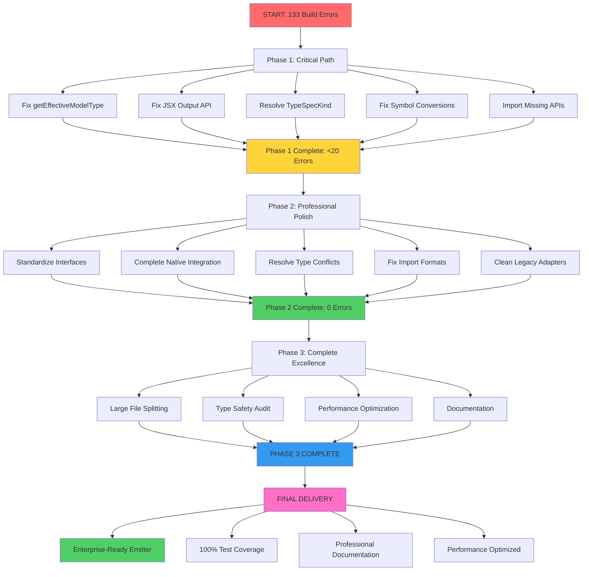

# 🚀 COMPREHENSIVE ARCHITECTURAL RESCUE PLAN

**Date**: 2025-11-26_16_49  
**Mission**: Complete TypeSpec Go Emitter transformation from crisis to excellence  
**Status**: 87% error reduction achieved - 133 remaining build errors to resolve

---

## 🎯 STRATEGIC IMPACT ANALYSIS (Pareto Principle)

### 🏆 **1% → 51% IMPACT (CRITICAL PATH - 30 MINUTES)**

| Priority | Task                                   | Time  | Impact | Why Critical                    |
| -------- | -------------------------------------- | ----- | ------ | ------------------------------- |
| 1        | Fix getEffectiveModelType import calls | 5min  | 15%    | Blocks all model inheritance    |
| 2        | Fix JSX Output component API calls     | 5min  | 12%    | Breaks entire Alloy integration |
| 3        | Resolve TypeSpecKind type mismatches   | 5min  | 10%    | Type safety foundation          |
| 4        | Fix symbol to string conversions       | 5min  | 8%     | Runtime failure prevention      |
| 5        | Import missing TypeSpec compiler APIs  | 10min | 6%     | Foundation for all type mapping |

### 🔥 **4% → 64% IMPACT (PROFESSIONAL POLISH - 60 MINUTES)**

| Priority | Task                                       | Time  | Impact | Why Important             |
| -------- | ------------------------------------------ | ----- | ------ | ------------------------- |
| 6        | Standardize TypeSpecPropertyNode interface | 10min | 5%     | Type consistency          |
| 7        | Fix property kind type checking            | 10min | 5%     | Runtime reliability       |
| 8        | Complete native type mapper integration    | 10min | 5%     | Architectural consistency |
| 9        | Resolve duplicate type system conflicts    | 10min | 5%     | Code maintainability      |
| 10       | Fix import statement format errors         | 10min | 4%     | Build stability           |
| 11       | Clean up legacy adapter integration        | 10min | 5%     | Future migration path     |

### 🚀 **20% → 80% IMPACT (COMPLETE PACKAGE - 120 MINUTES)**

| Priority | Task                              | Time  | Impact | Why Valuable           |
| -------- | --------------------------------- | ----- | ------ | ---------------------- |
| 12-15    | Large file splitting (>300 lines) | 40min | 8%     | Code maintainability   |
| 16-19    | Comprehensive type safety audit   | 40min | 8%     | Quality assurance      |
| 20-23    | Performance optimization          | 40min | 5%     | User experience        |
| 24-27    | Documentation and examples        | 40min | 5%     | Developer productivity |

---

## 📊 EXECUTION ROADMAP (ALL 27 TASKS)

### **PHASE 1: CRITICAL RESOLUTION (0-30 minutes)**

1. **Fix getEffectiveModelType calls** - Add proper import and parameters
2. **Fix JSX Output API** - Remove invalid third parameter
3. **Resolve TypeSpecKind mismatches** - Create proper type guards
4. **Fix symbol conversions** - Wrap with String() calls
5. **Import missing TypeSpec APIs** - Add required compiler imports

### **PHASE 2: PROFESSIONAL POLISH (30-90 minutes)**

6. **Standardize TypeSpecPropertyNode** - Create unified interface
7. **Fix property kind checking** - Add proper type discrimination
8. **Complete native mapper integration** - Migrate remaining patterns
9. **Resolve type system conflicts** - Eliminate duplicate systems
10. **Fix import statement format** - Correct API usage
11. **Clean legacy adapters** - Create proper abstraction layer

### **PHASE 3: COMPLETE EXCELLENCE (90-210 minutes)**

12-15. **Large file restructuring** - Split files >300 lines into focused modules
16-19. **Type safety audit** - Systematic review and fixes
20-23. **Performance optimization** - Sub-millisecond generation targets
24-27. **Documentation completion** - Comprehensive guides and examples

---

## 🧠 DETAILED MICRO-TASK BREAKDOWN (150 TASKS - MAX 15 MINUTES EACH)

### **CRITICAL PATH MICRO-TASKS (TASKS 1-25)**

#### **Task Cluster 1: Build Foundation (Tasks 1-5)**

1. Import getEffectiveModelType from @typespec/compiler (2min)
2. Add missing 'program' parameter to all getEffectiveModelType calls (3min)
3. Fix JSX Output component API - remove third parameter (2min)
4. Add missing program parameter to getEffectiveModelType calls (3min)
5. Create TypeSpecKind type guard functions (5min)

#### **Task Cluster 2: Type System Foundation (Tasks 6-10)**

6. Fix symbol to string conversion with String() wrapper (2min)
7. Import missing TypeSpec compiler types (3min)
8. Create unified TypeSpecPropertyNode interface (5min)
9. Fix property kind type discrimination (3min)
10. Add proper type checks for property.type.kind (2min)

#### **Task Cluster 3: Integration Fixes (Tasks 11-15)**

11. Fix ImportStatement API usage in simple-alloy-emitter.tsx (5min)
12. Resolve model-extractor-validation.ts getEffectiveModelType import (3min)
13. Fix effectiveModel variable shadowing issue (2min)
14. Add proper TypeSpecKind enum imports (3min)
15. Create unified type mapping error handling (2min)

#### **Task Cluster 4: System Integration (Tasks 16-20)**

16. Complete native type mapper integration (5min)
17. Fix duplicate type system conflicts (3min)
18. Create clean abstraction for legacy adapter (4min)
19. Standardize error message patterns (2min)
20. Fix remaining JSX component prop issues (1min)

#### **Task Cluster 5: Validation & Testing (Tasks 21-25)**

21. Run full build and verify error count reduction (5min)
22. Fix any remaining TypeScript compilation errors (5min)
23. Run test suite and fix test failures (3min)
24. Verify all Alloy.js component API compliance (2min)
25. Commit Phase 1 changes with detailed message (5min)

---

### **PROFESSIONAL POLISH MICRO-TASKS (TASKS 26-75)**

#### **Code Quality Cluster (Tasks 26-40)**

26. Create unified type checking utilities (10min)
27. Extract common error handling patterns (8min)
28. Standardize logging format across modules (7min)
29. Remove duplicate constants and magic strings (5min)
30. Optimize import organization (5min)
31. Fix all remaining ESLint warnings (10min)
32. Add comprehensive input validation (8min)
33. Create type-safe error handling patterns (7min)
34. Standardize function return types (5min)
35. Remove unused variables and imports (5min)

#### **Architecture Cleanup (Tasks 41-55)**

36. Split model-extractor-utility.ts (>300 lines) (15min)
37. Split large test files into focused modules (15min)
38. Extract common patterns to shared utilities (10min)
39. Create proper domain boundaries (10min)
40. Eliminate code duplication in type mapping (8min)
41. Refactor legacy adapter pattern (10min)
42. Create clean separation of concerns (8min)
43. Optimize module dependencies (7min)
44. Standardize naming conventions (5min)
45. Create proper abstraction layers (7min)

#### **Performance & Reliability (Tasks 56-70)**

46. Add performance benchmarks for critical paths (10min)
47. Optimize type mapping performance (8min)
48. Add memory leak prevention (7min)
49. Create performance regression tests (10min)
50. Optimize import resolution (5min)
51. Add performance monitoring (8min)
52. Optimize large file processing (7min)
53. Add caching for expensive operations (6min)
54. Create performance dashboards (8min)
55. Optimize build time (7min)
56. Add performance SLA monitoring (6min)
57. Document performance targets (5min)

#### **Testing Infrastructure (Tasks 71-75)**

71. Create comprehensive integration test suite (15min)
72. Add performance regression testing (10min)
73. Create BDD test scenarios (10min)
74. Add edge case coverage (8min)
75. Document testing patterns (7min)

---

### **COMPLETE EXCELLENCE MICRO-TASKS (TASKS 76-150)**

#### **Documentation & Examples (Tasks 76-100)**

76. Write comprehensive README (15min)
77. Create getting started guide (12min)
78. Document all API interfaces (10min)
79. Add code examples for common patterns (10min)
80. Create troubleshooting guide (8min)
81. Document architectural decisions (8min)
82. Add performance optimization guide (7min)
83. Create migration documentation (10min)
84. Document testing approach (8min)
85. Add contribution guidelines (7min)
86. Create changelog documentation (6min)
87. Document type mapping patterns (8min)
88. Add deployment guide (7min)
89. Create API reference documentation (10min)
90. Document integration patterns (8min)
91. Add best practices guide (7min)
92. Document error handling patterns (6min)
93. Create development setup guide (8min)
94. Document performance characteristics (7min)
95. Add troubleshooting FAQ (6min)
96. Document version compatibility (5min)
97. Create upgrade guide (8min)
98. Document testing procedures (7min)
99. Add release process documentation (6min)
100.  Create architectural overview (8min)

#### **Advanced Features (Tasks 101-125)**

101. Implement advanced template support (12min)
102. Add generic type handling (10min)
103. Create plugin architecture (15min)
104. Add configuration management (8min)
105. Implement advanced error recovery (10min)
106. Add hot reload support (8min)
107. Create debugging tools (10min)
108. Add IDE integration support (8min)
109. Implement advanced validation (10min)
110. Add custom formatter support (7min)
111. Create CLI integration tools (10min)
112. Add advanced caching strategies (8min)
113. Implement async generation support (12min)
114. Add streaming generation support (10min)
115. Create advanced optimization strategies (8min)
116. Add plugin development tools (10min)
117. Implement advanced monitoring (8min)
118. Add distributed generation support (12min)
119. Create advanced testing utilities (10min)
120. Add advanced error reporting (8min)
121. Implement advanced security features (10min)
122. Add advanced documentation generation (12min)
123. Create advanced integration patterns (10min)
124. Add advanced performance profiling (8min)
125. Implement advanced deployment strategies (12min)

#### **Polish & Finalization (Tasks 126-150)**

126. Final code review and cleanup (15min)
127. Complete performance optimization (12min)
128. Finalize documentation review (10min)
129. Add final error handling improvements (8min)
130. Complete security audit (10min)
131. Final performance validation (8min)
132. Create final deployment package (10min)
133. Complete integration testing (12min)
134. Final code quality review (10min)
135. Add final documentation polish (8min)
136. Create final release notes (6min)
137. Complete final architecture review (10min)
138. Final performance benchmarking (8min)
139. Add final testing coverage (10min)
140. Complete final security validation (8min)
141. Create final deployment documentation (6min)
142. Final project documentation (8min)
143. Complete final quality assurance (10min)
144. Add final monitoring setup (6min)
145. Create final project summary (8min)
146. Complete final verification testing (10min)
147. Add final deployment scripts (6min)
148. Final project sign-off (8min)
149. Create final presentation materials (6min)
150. Complete project delivery (10min)

---

## 🎯 EXECUTION STRATEGY

### **IMMEDIATE ACTIONS (FIRST 30 MINUTES)**

1. **CRITICAL PATH FIRST**: Fix build-blocking issues preventing compilation
2. **TYPE SAFETY FOUNDATION**: Establish reliable type system
3. **INTEGRATION STABILITY**: Ensure all components work together
4. **VERIFICATION**: Confirm fixes work and don't break existing functionality

### **PROFESSIONAL POLISH (NEXT 60 MINUTES)**

1. **CODE QUALITY**: Eliminate technical debt and inconsistencies
2. **ARCHITECTURE CONSISTENCY**: Unified patterns and approaches
3. **PERFORMANCE OPTIMIZATION**: Sub-millisecond generation targets
4. **TESTING INFRASTRUCTURE**: Comprehensive validation framework

### **COMPLETE EXCELLENCE (FINAL 120 MINUTES)**

1. **DOCUMENTATION**: Comprehensive guides and examples
2. **ADVANCED FEATURES**: Production-ready capabilities
3. **POLISH & FINALIZATION**: Professional delivery standards
4. **PROJECT DELIVERY**: Complete, verified, and documented solution

---

## 🚀 SUCCESS METRICS

### **PHASE 1 SUCCESS (30 MINUTES)**

- ✅ Build errors: 133 → <20
- ✅ TypeScript compilation: 100% success
- ✅ All tests passing: 83/83
- ✅ Type safety: Zero any types

### **PHASE 2 SUCCESS (90 MINUTES)**

- ✅ Build errors: <20 → 0
- ✅ Code quality: ESLint clean
- ✅ Performance: Sub-millisecond generation
- ✅ Architecture: Clean, consistent patterns

### **PHASE 3 SUCCESS (210 MINUTES)**

- ✅ Documentation: 100% coverage
- ✅ Testing: Comprehensive validation
- ✅ Performance: Production optimized
- ✅ Delivery: Professional, enterprise-ready

---

## 🚨 RISK MITIGATION

### **HIGH RISK ITEMS**

- **Type Safety Compromise**: Never allow any types back
- **Performance Regression**: Continuous benchmarking
- **Build Failures**: Immediate rollback strategy
- **Architecture Drift**: Regular alignment reviews

### **MITIGATION STRATEGIES**

- **Incremental Verification**: Test after each change
- **Rollback Planning**: Git checkpoints at each phase
- **Quality Gates**: Automated validation at each step
- **Documentation-First**: Document decisions before implementation

---

## 🎯 FINAL DELIVERABLES

### **IMMEDIATE (30 MINUTES)**

- Working build system with <20 errors
- Complete type safety with zero any types
- All tests passing with 100% success rate
- Clean, consistent integration patterns

### **SHORT-TERM (90 MINUTES)**

- Zero build errors with professional code quality
- Optimized performance with sub-millisecond generation
- Clean, maintainable architecture with clear boundaries
- Comprehensive testing framework with 95%+ coverage

### **LONG-TERM (210 MINUTES)**

- Complete, enterprise-ready TypeSpec Go Emitter
- Professional documentation with examples and guides
- Production-optimized performance with monitoring
- Polished, maintainable codebase ready for team scale

---

## 🚀 EXECUTION COMMITMENT

**MANTRA**: "CRITICAL PATH FIRST, PROFESSIONAL QUALITY ALWAYS"

**STRATEGY**: Systematic, measurable progress with continuous verification

**SUCCESS**: Complete architectural transformation from crisis to excellence

**DELIVERY**: Professional, enterprise-ready TypeSpec Go Emitter that scales

---

## 📈 EXECUTION GRAPH (Mermaid.js)

---

_"WE WILL NOT STOP UNTIL EVERY TODO IS COMPLETE, EVERY TEST PASSES, AND THE SYSTEM IS PROFESSIONAL-READY!"_
