# TypeSpec Go Emitter - Production Excellence Execution Plan

**Created**: November 27, 2025  
**Mission**: Achieve production-ready TypeSpec Go Emitter with maximum impact  
**Branch**: lars/lets-rock  
**Status**: Production Ready - Clean Architecture Complete  

---

## 🎯 PARETO ANALYSIS: MAXIMUM IMPACT FOCUS

### **1% → 51% IMPACT (CRITICAL PATH)**
**Mission**: Make the TypeSpec Go Eitter production-grade for real users

| Priority | Task | Time | Impact | Dependencies |
|----------|------|------|--------|--------------|
| 1 | **Generate proper go.mod file** | 30min | CRITICAL | None |
| 2 | **Handle imports intelligently** | 45min | CRITICAL | None |
| 3 | **Add enum generation** | 60min | HIGH | None |
| 4 | **Error handling system** | 30min | HIGH | None |
| 5 | **Documentation** | 30min | MEDIUM | None |

**Total Time**: 3.25 hours for 51% production value

### **4% → 64% IMPACT (PROFESSIONAL COMPLETION)**
**Mission**: Add professional features for enterprise adoption

| Priority | Task | Time | Impact | Dependencies |
|----------|------|------|--------|--------------|
| 6 | **Union type support** | 45min | HIGH | Error system |
| 7 | **Template support** | 60min | HIGH | Type system |
| 8 | **Performance optimization** | 30min | MEDIUM | Working system |
| 9 | **Comprehensive tests** | 60min | HIGH | All features |
| 10 | **CLI tool** | 45min | MEDIUM | Working emitter |
| 11 | **Advanced decorators** | 30min | MEDIUM | Core features |
| 12 | **Schema validation** | 45min | HIGH | Generated code |

**Total Time**: 5.5 hours additional (8.75 hours total) for 64% production value

### **20% → 80% IMPACT (ENTERPRISE EXCELLENCE)**
**Mission**: Enterprise-grade features for complete solution

| Priority | Task | Time | Impact | Dependencies |
|----------|------|------|--------|--------------|
| 13 | **Integration tests** | 60min | HIGH | Core features |
| 14 | **Documentation website** | 90min | HIGH | Working system |
| 15 | **Example projects** | 45min | MEDIUM | Documentation |
| 16 | **GitHub Actions CI** | 60min | HIGH | Test suite |
| 17 | **Code generation options** | 30min | MEDIUM | Core features |
| 18 | **Custom Go tags** | 45min | MEDIUM | Field generation |
| 19 | **Advanced validation** | 60min | MEDIUM | Basic validation |
| 20 | **Performance benchmarks** | 30min | MEDIUM | Optimization |
| 21 | **Migration tools** | 45min | LOW | Documentation |
| 22 | **VS Code extension** | 90min | LOW | Documentation |
| 23 | **API reference docs** | 60min | MEDIUM | Core features |
| 24 | **Tutorial videos** | 120min | LOW | Documentation |
| 25 | **Community support** | 60min | LOW | All features |

**Total Time**: 12.5 hours additional (21.25 hours total) for 80% production value

---

## 📊 EXECUTION PHASES

### **PHASE 1: CRITICAL PRODUCTION READY (1% → 51%)**
**Timeline**: 3.25 hours  
**Goal**: Emitter ready for real users with production-quality output

#### **Task 1: Generate Proper go.mod File (30min)**
- Current: `module test` 
- Target: `module github.com/typespec-community/typespec-go`
- Add proper Go version and dependencies
- Auto-detect required imports

#### **Task 2: Handle Imports Intelligently (45min)**
- Current: Always imports "encoding/json" and "time"
- Target: Only import what's actually used
- Dynamic import detection
- Proper import grouping

#### **Task 3: Add Enum Generation (60min)**
- Current: No enum support
- Target: Full TypeSpec enum → Go const + stringer
- Support for enum values and naming

#### **Task 4: Error Handling System (30min)**
- Current: Basic console logging
- Target: Structured error handling with TypeSpec diagnostics
- User-friendly error messages

#### **Task 5: Documentation (30min)**
- Current: No user-facing docs
- Target: Clear README with quick start guide
- Installation and usage examples

### **PHASE 2: PROFESSIONAL COMPLETION (4% → 64%)**
**Timeline**: 5.5 hours  
**Goal**: Enterprise-ready features for professional teams

### **PHASE 3: ENTERPRISE EXCELLENCE (20% → 80%)**
**Timeline**: 12.5 hours  
**Goal**: Complete enterprise solution with full ecosystem

---

## 🚀 EXECUTION STRATEGY

### **IMMEDIATE ACTIONS (Next 3.25 hours)**
1. **Start with go.mod generation** - Most critical for production use
2. **Handle imports intelligently** - Clean code generation
3. **Add enum support** - Common real-world requirement
4. **Error handling** - Professional debugging experience
5. **Basic documentation** - User onboarding

### **SUCCESS METRICS**
- Production-ready Go code generation
- All common TypeSpec patterns supported
- Clean, professional output
- Excellent developer experience
- Real-world usability

### **QUALITY GATES**
- Zero compilation errors
- All tests passing
- Professional code quality
- Generated code compiles in Go
- Documentation complete

---

## 📋 TASK BREAKDOWN BY COMPLEXITY

### **LOW COMPLEXITY (30min each)**
- Generate proper go.mod file
- Error handling system
- Documentation
- Performance optimization
- Advanced decorators
- Code generation options
- Custom Go tags
- Performance benchmarks

### **MEDIUM COMPLEXITY (45min each)**
- Handle imports intelligently
- CLI tool
- Schema validation
- Example projects
- Advanced validation
- Migration tools
- API reference docs
- Community support

### **HIGH COMPLEXITY (60min each)**
- Add enum generation
- Comprehensive tests
- Template support
- Integration tests
- Documentation website
- GitHub Actions CI

### **VERY HIGH COMPLEXITY (90min+ each)**
- Union type support
- VS Code extension
- Tutorial videos

---

## 🎯 IMPLEMENTATION PRIORITY MATRIX

```
HIGH IMPACT, LOW EFFORT (DO FIRST):
├── Generate proper go.mod file (30min)
├── Error handling system (30min)
├── Documentation (30min)
└── Performance optimization (30min)

HIGH IMPACT, HIGH EFFORT (DO SECOND):
├── Handle imports intelligently (45min)
├── Add enum generation (60min)
├── Comprehensive tests (60min)
├── Union type support (45min)
└── Template support (60min)

MEDIUM IMPACT, LOW EFFORT (DO THIRD):
├── CLI tool (45min)
├── Advanced decorators (30min)
├── Code generation options (30min)
├── Custom Go tags (45min)
└── Schema validation (45min)

MEDIUM IMPACT, HIGH EFFORT (DO LAST):
├── Integration tests (60min)
├── Documentation website (90min)
├── GitHub Actions CI (60min)
├── Advanced validation (60min)
└── API reference docs (60min)
```

---

## 📊 TIME INVESTMENT BREAKDOWN

| Phase | Tasks | Total Time | % of Total | Impact |
|-------|-------|------------|------------|--------|
| Phase 1 (1% → 51%) | 5 tasks | 3.25 hours | 15% | CRITICAL |
| Phase 2 (4% → 64%) | 7 tasks | 5.5 hours | 26% | HIGH |
| Phase 3 (20% → 80%) | 13 tasks | 12.5 hours | 59% | MEDIUM |

**Total Investment**: 21.25 hours  
**Critical Path**: 3.25 hours for 51% production value  
**Professional Completion**: 8.75 hours for 64% production value  
**Enterprise Excellence**: 21.25 hours for 80% production value

---

## 🎉 SUCCESS CRITERIA

### **Phase 1 Success (Production Ready)**
- [ ] Generate proper go.mod file
- [ ] Intelligent import handling
- [ ] Enum generation works
- [ ] Structured error handling
- [ ] Basic documentation
- [ ] Generated code compiles in Go

### **Phase 2 Success (Professional)**
- [ ] Union type support
- [ ] Template instantiation
- [ ] Comprehensive test suite
- [ ] CLI tool working
- [ ] Performance optimized

### **Phase 3 Success (Enterprise)**
- [ ] Full documentation site
- [ ] CI/CD pipeline
- [ ] Example projects
- [ ] Community resources
- [ ] Enterprise features

---

## 🏁 EXECUTION GRAPH

```mermaid
graph TD
    A[Start: Clean Slate Complete] --> B[Phase 1: Critical Production Ready]
    B --> B1[Generate go.mod file]
    B1 --> B2[Intelligent imports]
    B2 --> B3[Enum generation]
    B3 --> B4[Error handling]
    B4 --> B5[Documentation]
    B5 --> C[Phase 2: Professional Completion]
    C --> C1[Union type support]
    C1 --> C2[Template support]
    C2 --> C3[Performance optimization]
    C3 --> C4[Comprehensive tests]
    C4 --> C5[CLI tool]
    C5 --> C6[Advanced decorators]
    C6 --> C7[Schema validation]
    C7 --> D[Phase 3: Enterprise Excellence]
    D --> D1[Integration tests]
    D1 --> D2[Documentation website]
    D2 --> D3[Example projects]
    D3 --> D4[GitHub Actions CI]
    D4 --> D5[Code generation options]
    D5 --> D6[Custom Go tags]
    D6 --> D7[Advanced validation]
    D7 --> D8[Performance benchmarks]
    D8 --> D9[Migration tools]
    D9 --> D10[VS Code extension]
    D10 --> D11[API reference docs]
    D11 --> D12[Tutorial videos]
    D12 --> D13[Community support]
    D13 --> E[Complete Enterprise Solution]
```



---

## 🎯 IMMEDIATE NEXT STEPS

1. **Execute Phase 1**: Start with go.mod file generation
2. **Verify Each Step**: Test after each task completion
3. **Continuous Integration**: Commit and test after each phase
4. **User Feedback**: Get early feedback after Phase 1
5. **Iterative Improvement**: Based on real-world usage

**Ready for execution!** 🚀