# TypeSpec Go Emitter - Comprehensive Task Table

**Created**: 2025-11-27_06_55  
**Task Count**: 27 tasks (30-100min each)  
**Total Duration**: 12 hours  
**Sort Order**: Impact/Effort/Customer Value Priority  

---

## 📊 TASK EXECUTION MATRIX

| ID | Task Name | Phase | Impact | Effort | Customer Value | Priority | Dependencies | Success Criteria |
|----|-----------|-------|--------|--------|---------------|----------|--------------|------------------|
| **1.1** | **Root Directory Cleanup** | 1 | Critical | 30min | High | 1 | - | Professional project structure |
| **1.2** | **Comprehensive Test Coverage** | 1 | Critical | 90min | Critical | 2 | 1.1 | 95%+ test coverage |
| **1.3** | **Performance Benchmarking** | 1 | Critical | 40min | High | 3 | 1.1 | Sub-millisecond validation |
| **2.1** | **Union Type Support** | 2 | Critical | 60min | Critical | 4 | 1.2 | Sealed interface generation |
| **2.2** | **Template/Generic Support** | 2 | High | 45min | High | 5 | 1.2 | TypeSpec template compliance |
| **2.3** | **CLI Tool Implementation** | 2 | High | 60min | High | 6 | 1.2 | Standalone binary functional |
| **2.4** | **Error Recovery System** | 2 | High | 30min | Medium | 7 | 1.2 | Graceful error handling |
| **2.5** | **Input Validation System** | 2 | High | 25min | High | 8 | 1.2 | Type safety validation |
| **2.6** | **Multi-Package Support** | 2 | Medium | 40min | Medium | 9 | 2.1 | Namespace handling |
| **3.1** | **Comprehensive API Documentation** | 3 | High | 60min | High | 10 | 2.1 | Complete API reference |
| **3.2** | **User Guide with Examples** | 3 | High | 45min | High | 11 | 3.1 | Getting started guide |
| **3.3** | **Advanced Error Handling** | 3 | Medium | 30min | Medium | 12 | 2.4 | User-friendly messages |
| **3.4** | **go.mod Generation** | 3 | Medium | 25min | Medium | 13 | 2.6 | Go ecosystem compliance |
| **3.5** | **Performance Optimization** | 3 | Medium | 40min | High | 14 | 1.3 | Enterprise readiness |
| **3.6** | **Migration Guide** | 3 | Medium | 30min | Medium | 15 | 3.2 | Transition support |
| **3.7** | **Integration Testing** | 3 | Medium | 40min | High | 16 | 2.1 | Quality assurance |
| **3.8** | **Contributing Guidelines** | 3 | Low | 20min | Low | 17 | 3.1 | Community standards |
| **3.9** | **Release Automation** | 3 | Low | 25min | Low | 18 | 3.8 | CI/CD pipeline |
| **4.1** | **Enum Generation with Stringer** | 2 | Medium | 35min | Medium | 19 | 1.2 | Go enum support |
| **4.2** | **JSON Schema Generation** | 2 | Medium | 40min | Medium | 20 | 1.2 | Schema documentation |
| **4.3** | **Validation Tag Generation** | 2 | Medium | 30min | Medium | 21 | 2.5 | Go validation tags |
| **4.4** | **Custom Decorator Support** | 2 | Medium | 45min | Medium | 22 | 2.1 | @go.* decorators |
| **4.5** | **Interface Generation** | 2 | Medium | 35min | Medium | 23 | 1.2 | Go interface support |
| **4.6** | **Embedded Struct Support** | 2 | Medium | 30min | Medium | 24 | 1.2 | Go composition |
| **4.7** | **Import Optimization** | 2 | Low | 25min | Low | 25 | 1.2 | Clean imports |
| **4.8** | **Code Comments Generation** | 3 | Low | 20min | Low | 26 | 1.2 | Documentation |
| **4.9** | **Example Templates** | 3 | Low | 30min | Medium | 27 | 3.2 | Quick start |

---

## 🎯 PARETO IMPACT ANALYSIS

### **1% EFFORT → 51% IMPACT** (Tasks 1.1-1.3)
**Total Time**: 160 minutes (2.7 hours)  
**Focus**: Professional foundation and reliability

| Task | Impact Delivered |
|------|------------------|
| 1.1 Root Directory Cleanup | Professional appearance, developer experience |
| 1.2 Comprehensive Test Coverage | Reliability, regression prevention |
| 1.3 Performance Benchmarking | Production readiness, confidence |

### **4% EFFORT → 64% IMPACT** (Tasks 2.1-2.6)
**Total Time**: 240 minutes (4 hours)  
**Focus**: Essential TypeSpec compliance

| Task | Impact Delivered |
|------|------------------|
| 2.1 Union Type Support | TypeSpec compliance, advanced patterns |
| 2.2 Template/Generic Support | Full TypeSpec feature support |
| 2.3 CLI Tool Implementation | Developer experience, adoption |
| 2.4 Error Recovery System | Robustness, production stability |
| 2.5 Input Validation System | Type safety, error prevention |
| 2.6 Multi-Package Support | Scalability, enterprise usage |

### **20% EFFORT → 80% IMPACT** (Tasks 3.1-4.9)
**Total Time**: 280 minutes (4.7 hours)  
**Focus**: Professional excellence and ecosystem

| Task | Impact Delivered |
|------|------------------|
| 3.1-3.2 Documentation | User adoption, community growth |
| 3.3-3.7 Advanced Features | Enterprise readiness, production use |
| 4.1-4.9 Extended Features | TypeSpec completeness, Go integration |

---

## 📈 EXECUTION PRIORITY MATRIX

```mermaid
graph LR
    A[Critical Impact] --> B[High Customer Value]
    B --> C[Low Effort]
    
    subgraph "Phase 1: Critical Foundation"
        D1["1.1 Directory Cleanup<br/>30min"]
        D2["1.2 Test Coverage<br/>90min"]
        D3["1.3 Performance<br/>40min"]
    end
    
    subgraph "Phase 2: Production Features"
        D4["2.1 Union Types<br/>60min"]
        D5["2.2 Templates<br/>45min"]
        D6["2.3 CLI Tool<br/>60min"]
        D7["2.4 Error Recovery<br/>30min"]
        D8["2.5 Input Validation<br/>25min"]
        D9["2.6 Multi-Package<br/>40min"]
    end
    
    subgraph "Phase 3: Professional Excellence"
        D10["3.1 API Docs<br/>60min"]
        D11["3.2 User Guide<br/>45min"]
        D12["3.3 Error Handling<br/>30min"]
        D13["3.4 go.mod<br/>25min"]
        D14["3.5 Performance<br/>40min"]
    end
    
    A --> D1 --> D2 --> D3 --> D4 --> D5 --> D6 --> D7 --> D8 --> D9 --> D10 --> D11 --> D12 --> D13 --> D14
```

---

## 🎯 SUCCESS CRITERIA BY PHASE

### **PHASE 1: CRITICAL INFRASTRUCTURE**
- [ ] Professional project structure with clean root directory
- [ ] 95%+ test coverage with comprehensive edge cases
- [ ] Performance benchmarks showing sub-millisecond generation
- [ ] Zero TypeScript compilation errors
- [ ] All tests passing consistently

### **PHASE 2: PRODUCTION FEATURES**
- [ ] Full TypeSpec union type support with sealed interfaces
- [ ] Complete template and generic pattern support
- [ ] Working CLI tool with configuration options
- [ ] Robust error recovery with graceful degradation
- [ ] Comprehensive input validation with type safety
- [ ] Multi-package support for enterprise projects

### **PHASE 3: PROFESSIONAL EXCELLENCE**
- [ ] Complete API documentation with examples
- [ ] User guide with getting started tutorial
- [ ] Advanced error handling with user-friendly messages
- [ ] Proper go.mod generation for Go ecosystem
- [ ] Performance optimization for enterprise usage
- [ ] Migration guide for existing projects

---

## 🔄 EXECUTION WORKFLOW

### **MICRO-TASK EXECUTION RULES**
1. **One task at a time** - Complete before starting next
2. **Test immediately** - Verify functionality after each task
3. **Commit progress** - Document changes frequently
4. **Quality gates** - Must pass before proceeding to next phase

### **PHASE TRANSITION CRITERIA**
- **Phase 1 → 2**: 100% critical infrastructure working
- **Phase 2 → 3**: All production features implemented
- **Phase 3 → Release**: Professional excellence achieved

---

## 📊 RESOURCE ALLOCATION

| Phase | Task Count | Time Allocation | Success Rate |
|-------|------------|-----------------|--------------|
| 1: Critical | 3 tasks | 160min | 100% required |
| 2: Production | 6 tasks | 240min | 100% required |
| 3: Excellence | 18 tasks | 280min | 80% for release |

---

## 🎯 FINAL DELIVERABLE

**Mission**: Production-ready TypeSpec Go Emitter for enterprise adoption  
**Timeline**: 12 hours systematic execution  
**Quality**: Professional open-source standards  
**Impact**: Go community gets official TypeSpec support  

**Execution Strategy**: Complete 27 prioritized tasks in order  
**Verification**: Each task validated before proceeding  
**Success**: v1.0.0 ready for production use

---

*Created by: GLM-4.6 via Crush*  
*Last Updated: November 27, 2025*  
*Status: Ready for Execution*