# TypeSpec Go Emitter - Ultra-Detailed Micro-Tasks

**Created**: 2025-11-27_06_55  
**Micro-Task Count**: 125 tasks (max 15min each)  
**Total Duration**: 12.5 hours  
**Sort Order**: Impact/Effort/Customer Value Priority  

---

## 🔥 PHASE 1: CRITICAL INFRASTRUCTURE (8 micro-tasks, 160min)

### **Task 1.1: Root Directory Cleanup (30min)**
| Micro-ID | Sub-Task | Duration | Success Criteria |
|----------|----------|----------|------------------|
| 1.1.1 | Create dev/ directory structure | 5min | dev/ with organized subdirectories |
| 1.1.2 | Move debug-*.mjs files to dev/debug/ | 5min | All debug files moved |
| 1.1.3 | Move test-*.ts files to dev/tests/ | 5min | All test files moved |
| 1.1.4 | Move *.tsp files to dev/typespec/ | 5min | All TypeSpec files moved |
| 1.1.5 | Clean up root directory | 5min | Professional root structure |
| 1.1.6 | Update any file references | 5min | No broken imports/references |

### **Task 1.2: Comprehensive Test Coverage (90min)**
| Micro-ID | Sub-Task | Duration | Success Criteria |
|----------|----------|----------|------------------|
| 1.2.1 | Union type generation tests | 10min | Test union type to Go sealed interface |
| 1.2.2 | Template instantiation tests | 10min | Test template support |
| 1.2.3 | Error handling test suite | 10min | Test all error scenarios |
| 1.2.4 | Performance regression tests | 10min | Benchmark generation speed |
| 1.2.5 | Edge case coverage tests | 10min | Test boundary conditions |
| 1.2.6 | Memory leak detection tests | 10min | No memory leaks in generation |
| 1.2.7 | TypeSpec compliance tests | 10min | Verify spec compliance |
| 1.2.8 | Integration test suite | 10min | End-to-end workflow tests |
| 1.2.9 | Test report generation | 10min | Coverage report generated |

### **Task 1.3: Performance Benchmarking (40min)**
| Micro-ID | Sub-Task | Duration | Success Criteria |
|----------|----------|----------|------------------|
| 1.3.1 | Sub-millisecond generation test | 10min | <1ms for simple models |
| 1.3.2 | Large TypeSpec definition test | 10min | Handle 100+ models efficiently |
| 1.3.3 | Memory usage monitoring | 10min | Memory usage baseline |
| 1.3.4 | Benchmark suite creation | 10min | Automated benchmark reports |

---

## 🚀 PHASE 2: PRODUCTION FEATURES (32 micro-tasks, 240min)

### **Task 2.1: Union Type Support (60min)**
| Micro-ID | Sub-Task | Duration | Success Criteria |
|----------|----------|----------|------------------|
| 2.1.1 | TypeSpec union type detection | 10min | Detect union types in models |
| 2.1.2 | Sealed interface generation | 10min | Generate Go sealed interfaces |
| 2.1.3 | Discriminated union patterns | 10min | Handle discriminator fields |
| 2.1.4 | Union type test cases | 10min | Test union type scenarios |
| 2.1.5 | Interface implementation generation | 10min | Generate struct implementations |
| 2.1.6 | Union type documentation | 10min | Document union type support |

### **Task 2.2: Template/Generic Support (45min)**
| Micro-ID | Sub-Task | Duration | Success Criteria |
|----------|----------|----------|------------------|
| 2.2.1 | TypeSpec template detection | 10min | Detect template models |
| 2.2.2 | Go generic-like patterns | 10min | Generate generic-style code |
| 2.2.3 | Template instantiation | 10min | Handle template parameters |
| 2.2.4 | Template validation | 10min | Validate template usage |
| 2.2.5 | Template test suite | 5min | Test template scenarios |

### **Task 2.3: CLI Tool Implementation (60min)**
| Micro-ID | Sub-Task | Duration | Success Criteria |
|----------|----------|----------|------------------|
| 2.3.1 | CLI framework setup | 10min | Command parsing infrastructure |
| 2.3.2 | Basic compile command | 10min | tsp compile equivalent |
| 2.3.3 | File watching mode | 10min | Watch and recompile |
| 2.3.4 | Configuration options | 10min | Output directory, package name |
| 2.3.5 | Help system | 10min | Usage documentation |
| 2.3.6 | CLI testing | 10min | End-to-end CLI tests |

### **Task 2.4: Error Recovery System (30min)**
| Micro-ID | Sub-Task | Duration | Success Criteria |
|----------|----------|----------|------------------|
| 2.4.1 | Graceful error handling | 10min | Continue on partial failures |
| 2.4.2 | Partial generation recovery | 10min | Generate valid models when possible |
| 2.4.3 | Error reporting improvements | 10min | Better error messages |

### **Task 2.5: Input Validation System (25min)**
| Micro-ID | Sub-Task | Duration | Success Criteria |
|----------|----------|----------|------------------|
| 2.5.1 | TypeSpec model validation | 10min | Validate model structure |
| 2.5.2 | Type compatibility checks | 10min | Check supported types |
| 2.5.3 | Name collision detection | 5min | Detect duplicate names |

### **Task 2.6: Multi-Package Support (40min)**
| Micro-ID | Sub-Task | Duration | Success Criteria |
|----------|----------|----------|------------------|
| 2.6.1 | Namespace detection | 10min | Parse TypeSpec namespaces |
| 2.6.2 | Go package mapping | 10min | Map namespaces to packages |
| 2.6.3 | Import generation | 10min | Generate cross-package imports |
| 2.6.4 | Multi-package tests | 10min | Test package scenarios |

### **Task 4.1: Enum Generation with Stringer (35min)**
| Micro-ID | Sub-Task | Duration | Success Criteria |
|----------|----------|----------|------------------|
| 4.1.1 | Enum type detection | 10min | Detect TypeSpec enums |
| 4.1.2 | Go enum generation | 10min | Generate const and iota |
| 4.1.3 | String method generation | 10min | Generate String() methods |
| 4.1.4 | Enum tests | 5min | Test enum scenarios |

### **Task 4.2: JSON Schema Generation (40min)**
| Micro-ID | Sub-Task | Duration | Success Criteria |
|----------|----------|------------------|
| 4.2.1 | Schema generation setup | 10min | Schema generation infrastructure |
| 4.2.2 | Model to JSON schema mapping | 10min | Convert models to schemas |
| 4.2.3 | Schema file output | 10min | Generate .schema.json files |
| 4.2.4 | Schema validation | 10min | Validate generated schemas |

### **Task 4.3: Validation Tag Generation (30min)**
| Micro-ID | Sub-Task | Duration | Success Criteria |
|----------|----------|------------------|
| 4.3.1 | Required field detection | 10min | Detect required vs optional |
| 4.3.2 | Validation tag generation | 10min | Generate validate tags |
| 4.3.3 | Custom validation support | 10min | Support custom validators |

### **Task 4.4: Custom Decorator Support (45min)**
| Micro-ID | Sub-Task | Duration | Success Criteria |
|----------|----------|------------------|
| 4.4.1 | Decorator detection | 10min | Parse @go.* decorators |
| 4.4.2 | Field name decorators | 10min | @go.fieldname support |
| 4.4.3 | Type override decorators | 10min | @go.type support |
| 4.4.4 | Tag decorators | 10min | @go.tag support |
| 4.4.5 | Decorator validation | 5min | Validate decorator usage |

### **Task 4.5: Interface Generation (35min)**
| Micro-ID | Sub-Task | Duration | Success Criteria |
|----------|----------|------------------|
| 4.5.1 | Interface detection | 10min | Detect TypeSpec interfaces |
| 4.5.2 | Go interface generation | 10min | Generate Go interfaces |
| 4.5.3 | Method signature mapping | 10min | Map method signatures |
| 4.5.4 | Interface tests | 5min | Test interface scenarios |

### **Task 4.6: Embedded Struct Support (30min)**
| Micro-ID | Sub-Task | Duration | Success Criteria |
|----------|----------|------------------|
| 4.6.1 | Extends detection | 10min | Detect model inheritance |
| 4.6.2 | Embedded struct generation | 10min | Generate embedded fields |
| 4.6.3 | Inheritance validation | 10min | Validate inheritance patterns |

### **Task 4.7: Import Optimization (25min)**
| Micro-ID | Sub-Task | Duration | Success Criteria |
|----------|----------|------------------|
| 4.7.1 | Unused import detection | 10min | Detect unused imports |
| 4.7.2 | Import deduplication | 10min | Remove duplicate imports |
| 4.7.3 | Import formatting | 5min | Proper import formatting |

---

## 🏆 PHASE 3: PROFESSIONAL EXCELLENCE (85 micro-tasks, 280min)

### **Task 3.1: Comprehensive API Documentation (60min)**
| Micro-ID | Sub-Task | Duration | Success Criteria |
|----------|----------|----------|------------------|
| 3.1.1 | Main emitter API docs | 10min | Document $onEmit function |
| 3.1.2 | Type mapping API docs | 10min | Document type conversion |
| 3.1.3 | Error handling API docs | 10min | Document error system |
| 3.1.4 | Configuration options docs | 10min | Document configuration |
| 3.1.5 | Code examples for API | 10min | Provide usage examples |
| 3.1.6 | Type definitions docs | 10min | Document TypeScript types |

### **Task 3.2: User Guide with Examples (45min)**
| Micro-ID | Sub-Task | Duration | Success Criteria |
|----------|----------|----------|------------------|
| 3.2.1 | Getting started tutorial | 10min | Installation and first use |
| 3.2.2 | Basic usage examples | 10min | Simple model generation |
| 3.2.3 | Advanced features guide | 10min | Complex scenarios |
| 3.2.4 | Migration from other tools | 10min | Migration guide |
| 3.2.5 | Best practices guide | 5min | Recommended patterns |

### **Task 3.3: Advanced Error Handling (30min)**
| Micro-ID | Sub-Task | Duration | Success Criteria |
|----------|----------|----------|------------------|
| 3.3.1 | User-friendly error messages | 10min | Clear error descriptions |
| 3.3.2 | Suggested fixes | 10min | Provide solution hints |
| 3.3.3 | Error code reference | 10min | Categorized error codes |

### **Task 3.4: go.mod Generation (25min)**
| Micro-ID | Sub-Task | Duration | Success Criteria |
|----------|----------|------------------|
| 3.4.1 | go.mod template creation | 10min | Basic go.mod template |
| 3.4.2 | Module name detection | 10min | Auto-detect module name |
| 3.4.3 | Dependency generation | 5min | Generate required dependencies |

### **Task 3.5: Performance Optimization (40min)**
| Micro-ID | Sub-Task | Duration | Success Criteria |
|----------|----------|----------|------------------|
| 3.5.1 | Generation speed optimization | 10min | Optimize generation logic |
| 3.5.2 | Memory usage optimization | 10min | Reduce memory footprint |
| 3.5.3 | Concurrent processing | 10min | Parallel model generation |
| 3.5.4 | Performance regression tests | 10min | Ensure no regressions |

### **Task 3.6: Migration Guide (30min)**
| Micro-ID | Sub-Task | Duration | Success Criteria |
|----------|----------|------------------|
| 3.6.1 | From other generators | 10min | Migration from swagger-gen etc |
| 3.6.2 | From manual Go structs | 10min | Reverse engineering guide |
| 3.6.3 | Common migration issues | 10min | Troubleshooting migration |

### **Task 3.7: Integration Testing (40min)**
| Micro-ID | Sub-Task | Duration | Success Criteria |
|----------|----------|----------|------------------|
| 3.7.1 | End-to-end workflow tests | 10min | Complete generation pipeline |
| 3.7.2 | Real-world project tests | 10min | Test with actual projects |
| 3.7.3 | CI/CD integration tests | 10min | Test automation pipeline |
| 3.7.4 | Cross-platform tests | 10min | Windows/Linux/macOS |

### **Task 3.8: Contributing Guidelines (20min)**
| Micro-ID | Sub-Task | Duration | Success Criteria |
|----------|----------|----------|------------------|
| 3.8.1 | Development setup guide | 10min | Local development instructions |
| 3.8.2 | Code contribution process | 10min | PR guidelines and standards |

### **Task 3.9: Release Automation (25min)**
| Micro-ID | Sub-Task | Duration | Success Criteria |
|----------|----------|----------|------------------|
| 3.9.1 | GitHub Actions setup | 10min | CI/CD pipeline |
| 3.9.2 | Release workflow | 10min | Automated releases |
| 3.9.3 | Version management | 5min | Semantic versioning |

### **Task 4.8: Code Comments Generation (20min)**
| Micro-ID | Sub-Task | Duration | Success Criteria |
|----------|----------|----------|------------------|
| 4.8.1 | Model comment generation | 10min | Generate model documentation |
| 4.8.2 | Field comment generation | 10min | Generate field documentation |

### **Task 4.9: Example Templates (30min)**
| Micro-ID | Sub-Task | Duration | Success Criteria |
|----------|----------|----------|------------------|
| 4.9.1 | Basic example template | 10min | Simple TypeSpec example |
| 4.9.2 | Advanced example template | 10min | Complex features example |
| 4.9.3 | Quick start guide | 10min | 5-minute getting started |

---

## 📊 EXECUTION PRIORITY MATRIX

```mermaid
gantt
    title TypeSpec Go Emitter - Micro-Task Execution Timeline
    dateFormat X
    axisFormat %s
    
    section Phase 1: Critical (160min)
    Root Cleanup     :a1, 2025-01-01, 30min
    Test Coverage     :a2, after a1, 90min
    Performance       :a3, after a2, 40min
    
    section Phase 2: Production (240min)
    Union Types       :b1, after a3, 60min
    Templates         :b2, after b1, 45min
    CLI Tool          :b3, after b2, 60min
    Error Recovery    :b4, after b3, 30min
    Input Validation  :b5, after b4, 25min
    Multi-Package     :b6, after b5, 40min
    Enum Generation   :b7, after b6, 35min
    JSON Schema       :b8, after b7, 40min
    
    section Phase 3: Excellence (280min)
    API Documentation :c1, after b8, 60min
    User Guide        :c2, after c1, 45min
    Error Handling    :c3, after c2, 30min
    go.mod            :c4, after c3, 25min
    Performance Opt   :c5, after c4, 40min
```

---

## 🎯 MICRO-TASK EXECUTION RULES

### **EXECUTION PRINCIPLES**
1. **One micro-task at a time** - Complete before starting next
2. **Immediate verification** - Test after each micro-task
3. **15-minute maximum** - Break down larger tasks
4. **Progress tracking** - Mark completed micro-tasks
5. **Quality gates** - Must meet success criteria

### **PHASE TRANSITION CRITERIA**
- **Phase 1 → 2**: All 8 critical micro-tasks completed
- **Phase 2 → 3**: All 32 production micro-tasks completed
- **Phase 3 → Release**: All 85 excellence micro-tasks completed

---

## 📊 IMPACT DELIVERY ANALYSIS

### **CRITICAL PATH MICRO-TASKS**
1. **1.1.1-1.1.6**: Professional foundation (30min)
2. **1.2.1-1.2.9**: Reliability foundation (90min)
3. **2.1.1-2.1.6**: TypeSpec compliance (60min)
4. **2.3.1-2.3.6**: Developer experience (60min)
5. **3.1.1-3.1.6**: Usability foundation (60min)

### **HIGH-IMPACT QUICK WINS**
- **1.1.1-1.1.6**: Professional appearance (30min)
- **1.3.1-1.3.4**: Production confidence (40min)
- **2.4.1-2.4.3**: Robustness improvement (30min)
- **2.5.1-2.5.3**: Type safety enhancement (25min)

---

## 🎯 FINAL DELIVERABLE

**Mission**: Production-ready TypeSpec Go Emitter  
**Strategy**: 125 micro-tasks executed systematically  
**Timeline**: 12.5 hours focused execution  
**Quality**: Professional open-source standards  

**Execution Method**: Complete micro-tasks in priority order  
**Verification**: Each micro-task validated before proceeding  
**Success**: v1.0.0 ready for enterprise adoption

---

*Created by: GLM-4.6 via Crush*  
*Last Updated: November 27, 2025*  
*Status: Ready for Execution*