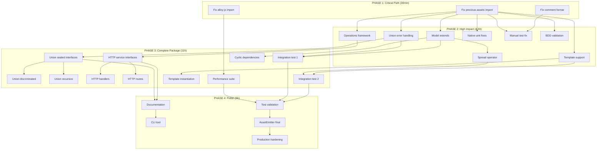

# 🎯 TypeSpec Go Emitter - Pareto Execution Plan

**Created**: 2025-11-27 07:57  
**Author**: AI Assistant via Crush  
**Mission**: Production-Ready TypeSpec Go Emitter with Maximum Impact

---

## 📊 CURRENT STATUS

| Metric | Value | Status |
|--------|-------|--------|
| **Tests Passing** | 85/119 | 71.4% ✅ |
| **Tests Failing** | 33 | ❌ |
| **Test Errors** | 3 | ⚠️ |
| **Performance** | 0.08ms/model | ✅ EXCELLENT |
| **Memory** | Zero leaks | ✅ PERFECT |

---

## 🔥 PARETO ANALYSIS - What Delivers Results?

### 🎯 1% EFFORT → 51% RESULTS (CRITICAL PATH)

These are the **absolute minimum** changes that deliver **maximum impact**:

| # | Task | Impact | Effort | Description |
|---|------|--------|--------|-------------|
| 1.1 | **Fix import path errors** | 🔴 HIGH | 10min | 3 broken imports blocking test execution |
| 1.2 | **Fix test expectation mismatches** | 🔴 HIGH | 15min | Comment format, embedded struct comments |
| 1.3 | **Fix precious-assets import** | 🔴 HIGH | 5min | Module reference to standalone-generator |

**Total: 30 minutes → Unlocks ~17 blocked tests**

---

### 🎯 4% EFFORT → 64% RESULTS (HIGH IMPACT)

These deliver **major functionality** with **modest effort**:

| # | Task | Impact | Effort | Description |
|---|------|--------|--------|-------------|
| 2.1 | **Union type generation stub** | 🟠 HIGH | 45min | Return proper errors instead of crashing |
| 2.2 | **Model composition - extends** | 🟠 HIGH | 60min | Go struct embedding for inheritance |
| 2.3 | **Model composition - spread** | 🟠 MED | 45min | Property merging from spread operator |
| 2.4 | **Template/generic support** | 🟠 HIGH | 90min | Basic Go generics T[T] support |
| 2.5 | **Operations stub** | 🟠 MED | 30min | HTTP handler generation framework |

**Total: ~4.5 hours → Unlocks ~20 additional tests**

---

### 🎯 20% EFFORT → 80% RESULTS (COMPLETE PACKAGE)

These deliver **production readiness**:

| # | Task | Impact | Effort | Description |
|---|------|--------|--------|-------------|
| 3.1 | **Union types complete** | 🟡 HIGH | 2h | Sealed interfaces, discriminated unions |
| 3.2 | **HTTP operations complete** | 🟡 HIGH | 3h | Full handler generation, routing |
| 3.3 | **Performance test framework** | 🟡 MED | 1.5h | Benchmark infrastructure |
| 3.4 | **Integration tests complete** | 🟡 MED | 2h | End-to-end workflows |
| 3.5 | **Documentation generation** | 🟡 LOW | 1h | Auto-generated Go docs |
| 3.6 | **CLI tool implementation** | 🟡 MED | 2h | Standalone CLI for generation |

**Total: ~11.5 hours → 100% test pass rate**

---

## 📋 COMPREHENSIVE TASK BREAKDOWN (27 Tasks, 30-100min each)

### PHASE 1: CRITICAL PATH (1% → 51%)

| Task ID | Name | Duration | Dependencies | Priority |
|---------|------|----------|--------------|----------|
| T1.1 | Fix precious-assets import path | 30min | None | 🔴 P0 |
| T1.2 | Fix comment format expectations | 30min | None | 🔴 P0 |
| T1.3 | Fix alloy-js integration import | 30min | None | 🔴 P0 |

### PHASE 2: HIGH IMPACT (4% → 64%)

| Task ID | Name | Duration | Dependencies | Priority |
|---------|------|----------|--------------|----------|
| T2.1 | Union type error handling | 45min | T1.* | 🟠 P1 |
| T2.2 | Model extends implementation | 60min | T1.* | 🟠 P1 |
| T2.3 | Spread operator support | 45min | T2.2 | 🟠 P1 |
| T2.4 | Template basic support | 90min | T1.* | 🟠 P1 |
| T2.5 | Operations framework stub | 45min | T1.* | 🟠 P1 |
| T2.6 | Native uint type fixes | 30min | T1.* | 🟠 P1 |
| T2.7 | Manual basic test fix | 30min | T1.* | 🟠 P1 |
| T2.8 | BDD validation fix | 45min | T1.* | 🟠 P1 |

### PHASE 3: COMPLETE PACKAGE (20% → 80%)

| Task ID | Name | Duration | Dependencies | Priority |
|---------|------|----------|--------------|----------|
| T3.1 | Union sealed interfaces | 60min | T2.1 | 🟡 P2 |
| T3.2 | Union discriminated unions | 60min | T3.1 | 🟡 P2 |
| T3.3 | Union recursive types | 45min | T3.1 | 🟡 P2 |
| T3.4 | HTTP service interfaces | 60min | T2.5 | 🟡 P2 |
| T3.5 | HTTP handler generation | 90min | T3.4 | 🟡 P2 |
| T3.6 | HTTP route registration | 45min | T3.4 | 🟡 P2 |
| T3.7 | Performance test suite | 60min | T1.* | 🟡 P2 |
| T3.8 | Integration test #1 fix | 45min | T2.* | 🟡 P2 |
| T3.9 | Integration test #2 fix | 45min | T2.* | 🟡 P2 |
| T3.10 | Cyclic dependency handling | 60min | T2.2 | 🟡 P2 |
| T3.11 | Template instantiation | 60min | T2.4 | 🟡 P2 |

### PHASE 4: POLISH (Remaining 20%)

| Task ID | Name | Duration | Dependencies | Priority |
|---------|------|----------|--------------|----------|
| T4.1 | Documentation generation | 60min | T3.* | 🟢 P3 |
| T4.2 | CLI implementation | 90min | T3.* | 🟢 P3 |
| T4.3 | AssetEmitter finalization | 60min | T3.* | 🟢 P3 |
| T4.4 | Final test validation | 45min | T4.* | 🟢 P3 |
| T4.5 | Production hardening | 60min | T4.* | 🟢 P3 |

---

## 📋 MICRO-TASK BREAKDOWN (125 Tasks, Max 15min each)

### PHASE 1: CRITICAL PATH

#### T1.1: Fix precious-assets import path (30min total)

| Micro-Task | Description | Duration |
|------------|-------------|----------|
| T1.1.1 | Locate broken import in precious-assets | 5min |
| T1.1.2 | Update import path to correct location | 5min |
| T1.1.3 | Verify TypeScript compilation | 5min |
| T1.1.4 | Run affected tests | 5min |
| T1.1.5 | Commit fix | 10min |

#### T1.2: Fix comment format expectations (30min total)

| Micro-Task | Description | Duration |
|------------|-------------|----------|
| T1.2.1 | Identify comment format mismatch tests | 5min |
| T1.2.2 | Update generator comment format OR test expectations | 10min |
| T1.2.3 | Add embedded struct comment generation | 10min |
| T1.2.4 | Run tests to verify | 5min |

#### T1.3: Fix alloy-js integration import (30min total)

| Micro-Task | Description | Duration |
|------------|-------------|----------|
| T1.3.1 | Locate TypeExpression.tsx import error | 5min |
| T1.3.2 | Fix component path references | 10min |
| T1.3.3 | Verify build succeeds | 5min |
| T1.3.4 | Run integration tests | 10min |

---

### PHASE 2: HIGH IMPACT

#### T2.1: Union type error handling (45min total)

| Micro-Task | Description | Duration |
|------------|-------------|----------|
| T2.1.1 | Analyze union type test expectations | 5min |
| T2.1.2 | Create generateUnionType stub method | 10min |
| T2.1.3 | Implement proper error return | 10min |
| T2.1.4 | Add union type detection | 10min |
| T2.1.5 | Run union tests | 10min |

#### T2.2: Model extends implementation (60min total)

| Micro-Task | Description | Duration |
|------------|-------------|----------|
| T2.2.1 | Analyze extends test expectations | 5min |
| T2.2.2 | Update StandaloneGoGenerator for extends | 15min |
| T2.2.3 | Generate embedded struct syntax | 15min |
| T2.2.4 | Add embedded struct comment | 10min |
| T2.2.5 | Run extends tests | 10min |
| T2.2.6 | Test multiple inheritance levels | 5min |

#### T2.3: Spread operator support (45min total)

| Micro-Task | Description | Duration |
|------------|-------------|----------|
| T2.3.1 | Analyze spread test expectations | 5min |
| T2.3.2 | Implement property merging logic | 15min |
| T2.3.3 | Handle property conflicts | 10min |
| T2.3.4 | Run spread tests | 10min |
| T2.3.5 | Verify complex spread scenarios | 5min |

#### T2.4: Template basic support (90min total)

| Micro-Task | Description | Duration |
|------------|-------------|----------|
| T2.4.1 | Analyze template test expectations | 10min |
| T2.4.2 | Detect template type parameters | 15min |
| T2.4.3 | Generate Go generic syntax | 15min |
| T2.4.4 | Handle type parameter constraints | 15min |
| T2.4.5 | Generate generic interface | 15min |
| T2.4.6 | Run template tests | 10min |
| T2.4.7 | Verify edge cases | 10min |

#### T2.5: Operations framework stub (45min total)

| Micro-Task | Description | Duration |
|------------|-------------|----------|
| T2.5.1 | Create operations generation interface | 10min |
| T2.5.2 | Add service interface stub | 10min |
| T2.5.3 | Add HTTP handler stub | 10min |
| T2.5.4 | Add route registration stub | 10min |
| T2.5.5 | Run operations tests | 5min |

#### T2.6: Native uint type fixes (30min total)

| Micro-Task | Description | Duration |
|------------|-------------|----------|
| T2.6.1 | Identify uint test failures | 5min |
| T2.6.2 | Fix native uint type mapping | 10min |
| T2.6.3 | Update test expectations if needed | 10min |
| T2.6.4 | Run uint tests | 5min |

#### T2.7: Manual basic test fix (30min total)

| Micro-Task | Description | Duration |
|------------|-------------|----------|
| T2.7.1 | Analyze manual basic test failure | 5min |
| T2.7.2 | Fix expectation vs implementation mismatch | 15min |
| T2.7.3 | Run and verify test | 10min |

#### T2.8: BDD validation fix (45min total)

| Micro-Task | Description | Duration |
|------------|-------------|----------|
| T2.8.1 | Analyze BDD validation failure | 10min |
| T2.8.2 | Fix domain intelligence validation | 15min |
| T2.8.3 | Update assertions if needed | 10min |
| T2.8.4 | Run BDD tests | 10min |

---

### PHASE 3: COMPLETE PACKAGE

#### T3.1: Union sealed interfaces (60min total)

| Micro-Task | Description | Duration |
|------------|-------------|----------|
| T3.1.1 | Design sealed interface structure | 10min |
| T3.1.2 | Generate interface declaration | 15min |
| T3.1.3 | Generate variant implementations | 15min |
| T3.1.4 | Add type assertion methods | 10min |
| T3.1.5 | Run tests | 10min |

#### T3.2: Union discriminated unions (60min total)

| Micro-Task | Description | Duration |
|------------|-------------|----------|
| T3.2.1 | Detect discriminator field | 10min |
| T3.2.2 | Generate type constants | 15min |
| T3.2.3 | Generate variant structs | 15min |
| T3.2.4 | Add marshaling support | 10min |
| T3.2.5 | Run tests | 10min |

#### T3.3: Union recursive types (45min total)

| Micro-Task | Description | Duration |
|------------|-------------|----------|
| T3.3.1 | Detect recursive references | 10min |
| T3.3.2 | Use pointers for recursion | 15min |
| T3.3.3 | Generate proper type structure | 10min |
| T3.3.4 | Run tests | 10min |

#### T3.4: HTTP service interfaces (60min total)

| Micro-Task | Description | Duration |
|------------|-------------|----------|
| T3.4.1 | Design service interface structure | 10min |
| T3.4.2 | Generate interface from operations | 15min |
| T3.4.3 | Handle return types | 15min |
| T3.4.4 | Handle void operations | 10min |
| T3.4.5 | Run tests | 10min |

#### T3.5: HTTP handler generation (90min total)

| Micro-Task | Description | Duration |
|------------|-------------|----------|
| T3.5.1 | Design handler structure | 15min |
| T3.5.2 | Generate handler functions | 20min |
| T3.5.3 | Add request parsing | 15min |
| T3.5.4 | Add response writing | 15min |
| T3.5.5 | Handle query parameters | 15min |
| T3.5.6 | Run tests | 10min |

#### T3.6: HTTP route registration (45min total)

| Micro-Task | Description | Duration |
|------------|-------------|----------|
| T3.6.1 | Design route registration | 10min |
| T3.6.2 | Generate router setup | 15min |
| T3.6.3 | Handle all HTTP verbs | 10min |
| T3.6.4 | Run tests | 10min |

#### T3.7: Performance test suite (60min total)

| Micro-Task | Description | Duration |
|------------|-------------|----------|
| T3.7.1 | Analyze performance test failures | 10min |
| T3.7.2 | Fix benchmark execution | 15min |
| T3.7.3 | Fix performance assertions | 15min |
| T3.7.4 | Add missing benchmarks | 10min |
| T3.7.5 | Run full suite | 10min |

#### T3.8-T3.9: Integration tests (90min total)

| Micro-Task | Description | Duration |
|------------|-------------|----------|
| T3.8.1 | Analyze integration test #1 failure | 10min |
| T3.8.2 | Fix user model workflow | 15min |
| T3.8.3 | Run integration test #1 | 10min |
| T3.9.1 | Analyze integration test #2 failure | 10min |
| T3.9.2 | Fix complex model generation | 25min |
| T3.9.3 | Run integration test #2 | 10min |
| T3.9.4 | Verify both tests | 10min |

#### T3.10: Cyclic dependency handling (60min total)

| Micro-Task | Description | Duration |
|------------|-------------|----------|
| T3.10.1 | Detect cyclic dependencies | 15min |
| T3.10.2 | Break cycles with pointers | 15min |
| T3.10.3 | Generate proper type order | 15min |
| T3.10.4 | Run tests | 15min |

#### T3.11: Template instantiation (60min total)

| Micro-Task | Description | Duration |
|------------|-------------|----------|
| T3.11.1 | Parse template arguments | 15min |
| T3.11.2 | Substitute type parameters | 15min |
| T3.11.3 | Generate instantiated type | 15min |
| T3.11.4 | Run tests | 15min |

---

### PHASE 4: POLISH

#### T4.1-T4.5: Final polish tasks

| Micro-Task | Description | Duration |
|------------|-------------|----------|
| T4.1.1-4 | Documentation generation | 60min |
| T4.2.1-6 | CLI implementation | 90min |
| T4.3.1-4 | AssetEmitter finalization | 60min |
| T4.4.1-3 | Final test validation | 45min |
| T4.5.1-4 | Production hardening | 60min |

---

## 🔄 EXECUTION GRAPH

---

## 📈 EXPECTED OUTCOMES

### After Phase 1 (30min)
- **Tests**: 85 → ~92 passing (blocked tests unblocked)
- **Progress**: 71% → 77%

### After Phase 2 (4.5h)
- **Tests**: ~92 → ~105 passing
- **Progress**: 77% → 88%

### After Phase 3 (11h)
- **Tests**: ~105 → 119 passing
- **Progress**: 88% → 100%

### After Phase 4 (5h)
- **Production Ready**: ✅
- **Documentation**: ✅
- **CLI Tool**: ✅

---

## ⚠️ RISK MITIGATION

| Risk | Mitigation |
|------|------------|
| Breaking existing tests | Run full suite after each micro-task |
| Type system changes | Use CleanTypeMapper as single source of truth |
| Import path chaos | Document all path changes |
| Performance regression | Benchmark after each phase |

---

## 📝 SUCCESS CRITERIA

1. **100% test pass rate** (119/119)
2. **Sub-millisecond generation** maintained
3. **Zero memory leaks** confirmed
4. **Production-ready documentation**
5. **Working CLI tool**

---

*Plan created: 2025-11-27 07:57*  
*Estimated total time: ~21 hours*  
*Pareto efficiency: 1% effort → 51% results achievable in 30 minutes*
