# 🚀 SUPERB EXECUTION PLAN - TypeSpec Go Generator

**Date:** 2025-11-27 13:47 CET  
**Planning Horizon:** 3 Phases, 125 tasks, ~31 hours total  
**Success Criteria:** Production-ready TypeSpec to Go generator

---

## 📊 EXECUTION STRATEGY OVERVIEW

### 🎯 PARETO PRINCIPLE IMPLEMENTATION

#### 1% EFFORT → 51% RESULTS (4 tasks, 60min total)
**Critical Path - Template System Foundation**
```
Task 1: isTypeSpecTemplate() guard (15min)
Task 2: mapTemplateType() method (15min)  
Task 3: Template string parsing <T> (15min)
Task 4: Go generic field generation (15min)
```
**Impact:** 9/11 → 11/11 composition tests passing (100% success)

#### 4% EFFORT → 64% RESULTS (12 tasks, 180min total)  
**Complete Template System + HTTP Framework**
```
Template System (Tasks 5-7, 45min)
HTTP Framework (Tasks 8-9, 30min)
Production Features (Tasks 10-12, 45min)
```
**Impact:** Template 100% + Basic HTTP = 64% overall success

#### 20% EFFORT → 80% RESULTS (36 tasks, 540min total)
**Production-Ready Generator**
```
Advanced Templates (Tasks 13-15, 45min)
Complete HTTP API (Tasks 16-27, 180min)
Union Types (Tasks 28-31, 60min)  
Performance (Tasks 32-36, 90min)
```
**Impact:** Production-ready with all major features

---

## 🏗️ PHASE 1: FOUNDATION (1% → 51%)

### 📋 PHASE 1 TASK BREAKDOWN

| Phase | Task | Module | Time | Dependencies | Success Metric |
|-------|------|--------|------|--------------|----------------|
| 1.1 | Add isTypeSpecTemplate() guard | CleanTypeMapper | 15min | None | Template types detected |
| 1.2 | Implement mapTemplateType() | CleanTypeMapper | 15min | 1.1 | Template types mapped |
| 1.3 | Parse template string <T> | StandaloneGenerator | 15min | None | Template parameters extracted |
| 1.4 | Generate Go generic fields | StandaloneGenerator | 15min | 1.2,1.3 | Go generics generated |

**Phase 1 Timeline:** 60 minutes total  
**Phase 1 Impact:** 11/11 composition tests passing (100% success rate)

---

## 🚀 PHASE 2: PRODUCTION FEATURES (4% → 64%)

### 📋 PHASE 2 TASK BREAKDOWN

| Phase | Task | Module | Time | Dependencies | Success Metric |
|-------|------|--------|------|--------------|----------------|
| 2.1 | Multi-parameter templates | CleanTypeMapper | 15min | 1.1 | <T,K> syntax working |
| 2.2 | Template validation | ErrorFactory | 15min | 2.1 | Invalid templates handled |
| 2.3 | Template documentation | StandaloneGenerator | 15min | 2.2 | Generated code documented |
| 2.4 | HTTP route handler stub | HTTPGenerator | 15min | None | Basic /users routes |
| 2.5 | HTTP request/response models | HTTPGenerator | 15min | 2.4 | API types generated |
| 2.6 | Template property caching | TypeMappingCache | 15min | 2.1 | Performance optimized |
| 2.7 | Template error recovery | ErrorFactory | 15min | 2.6 | Robust error handling |
| 2.8 | Go generic syntax [T any] | StandaloneGenerator | 15min | 2.3 | Modern Go features |

**Phase 2 Timeline:** 120 minutes total  
**Phase 2 Impact:** Template 100% + HTTP 30% = 64% overall success

---

## 📈 PHASE 3: PRODUCTION OPTIMIZATION (20% → 80%)

### 📋 PHASE 3 TASK BREAKDOWN

| Phase | Task | Module | Time | Dependencies | Success Metric |
|-------|------|--------|------|--------------|----------------|
| 3.1 | Recursive template detection | CleanTypeMapper | 15min | 2.1 | Advanced templates |
| 3.2 | Template constraint validation | StandaloneGenerator | 15min | 3.1 | Type safety enhanced |
| 3.3 | Template instantiation optimization | TypeMappingCache | 15min | 3.2 | Performance optimized |
| 3.4 | CRUD operation generation | HTTPGenerator | 15min | 2.5 | Full REST API |
| 3.5 | HTTP middleware integration | HTTPGenerator | 15min | 3.4 | API features complete |
| 3.6 | Route parameter handling | HTTPGenerator | 15min | 3.5 | Dynamic URLs |
| 3.7 | HTTP status code generation | HTTPGenerator | 15min | 3.6 | API responses |
| 3.8 | Request validation generation | HTTPGenerator | 15min | 3.7 | API safety |
| 3.9 | Response serialization | HTTPGenerator | 15min | 3.8 | API output |
| 3.10 | Error response handling | HTTPGenerator | 15min | 3.9 | API errors |
| 3.11 | OpenAPI spec generation | DocsGenerator | 15min | 3.10 | API docs |
| 3.12 | HTTP client generation | ClientGenerator | 15min | 3.11 | API consumers |
| 3.13 | Authentication middleware | HTTPGenerator | 15min | 3.12 | API security |
| 3.14 | Rate limiting generation | HTTPGenerator | 15min | 3.13 | API protection |
| 3.15 | CORS handling generation | HTTPGenerator | 15min | 3.14 | API standards |
| 3.16 | Union type discriminators | UnionGenerator | 15min | None | Type safety |
| 3.17 | Union variant validation | UnionGenerator | 15min | 3.16 | Runtime safety |
| 3.18 | Union serialization | UnionGenerator | 15min | 3.17 | Data interchange |
| 3.19 | Union deserialization | UnionGenerator | 15min | 3.18 | Data parsing |
| 3.20 | Performance benchmarking | BenchmarkRunner | 15min | 3.3 | Quality metrics |
| 3.21 | Memory usage optimization | StandaloneGenerator | 15min | 3.20 | Efficiency |
| 3.22 | Generation caching system | TypeMappingCache | 15min | 3.21 | Performance |
| 3.23 | Parallel type processing | StandaloneGenerator | 15min | 3.22 | Speed |
| 3.24 | Progress reporting system | CLI | 15min | 3.23 | User experience |

**Phase 3 Timeline:** 360 minutes total  
**Phase 3 Impact:** Production-ready generator with all features

---

## 🎯 EXECUTION GRAPH

```mermaid
graph TD
    %% Phase 1: Foundation (51% results)
    A[Start: Clean Repo] --> B[T1: isTypeSpecTemplate guard]
    B --> C[T2: mapTemplateType method]
    C --> D[T3: Template string parsing]
    D --> E[T4: Go generic generation]
    
    %% Phase 1 Success Checkpoint
    E --> F{Phase 1 Success?}
    F -->|Yes: 100% Composition| G[Phase 2: Production Features]
    F -->|No: Debug & Fix| B
    
    %% Phase 2: Production Features (64% results)
    G --> H[T5: Multi-parameter templates]
    H --> I[T6: Template validation]
    I --> J[T7: Template documentation]
    J --> K[T8: HTTP route stub]
    K --> L[T9: HTTP models]
    L --> M[T10: Template caching]
    M --> N[T11: Template error recovery]
    N --> O[T12: Go generic syntax]
    
    %% Phase 2 Success Checkpoint  
    O --> P{Phase 2 Success?}
    P -->|Yes: Templates + Basic HTTP| Q[Phase 3: Optimization]
    P -->|No: Debug & Fix| G
    
    %% Phase 3: Production Optimization (80% results)
    Q --> R[T13: Recursive templates]
    R --> S[T14: Template constraints]
    S --> T[T15: Instantiation optimization]
    T --> U[T16: CRUD operations]
    U --> V[T17: HTTP middleware]
    V --> W[T18: Route parameters]
    W --> X[T19: Status codes]
    X --> Y[T20: Request validation]
    Y --> Z[T21: Response serialization]
    Z --> AA[T22: Error handling]
    AA --> AB[T23: OpenAPI specs]
    AB --> AC[T24: HTTP clients]
    AC --> AD[T25: Authentication]
    AD --> AE[T26: Rate limiting]
    AE --> AF[T27: CORS handling]
    AF --> AG[T28: Union discriminators]
    AG --> AH[T29: Union validation]
    AH --> AI[T30: Union serialization]
    AI --> AJ[T31: Union deserialization]
    AJ --> AK[T32: Performance benchmarks]
    AK --> AL[T33: Memory optimization]
    AL --> AM[T34: Caching system]
    AM --> AN[T35: Parallel processing]
    AN --> AO[T36: Progress reporting]
    
    %% Final Success
    AO --> AP{Production Ready?}
    AP -->|Yes: 80% Features| AQ[SUCCESS: Production Generator]
    AP -->|No: Debug & Fix| Q
    
    %% Styling
    classDef phase1 fill:#4CAF50,stroke:#388E3C,color:#fff
    classDef phase2 fill:#2196F3,stroke:#1976D2,color:#fff  
    classDef phase3 fill:#FF9800,stroke:#F57C00,color:#fff
    classDef checkpoint fill:#9C27B0,stroke:#7B1FA2,color:#fff
    classDef success fill:#4CAF50,stroke:#2E7D32,color:#fff
    
    class A,B,C,D,E phase1
    class G,H,I,J,K,L,M,N,O phase2
    class Q,R,S,T,U,V,W,X,Y,Z,AA,AB,AC,AD,AE,AF,AG,AH,AI,AJ,AK,AL,AM,AN,AO phase3
    class F,P,AP checkpoint
    class AQ success
```



---

## 📊 SUCCESS METRICS & KPIs

### 🎯 PHASE 1 SUCCESS METRICS
- **Test Pass Rate:** 9/11 → 11/11 (100% composition)
- **Template Support:** 0% → 100% 
- **Generation Time:** <1ms for simple templates
- **Code Quality:** Professional Go generics

### 🚀 PHASE 2 SUCCESS METRICS
- **Overall Test Pass Rate:** 82% → 64% (new features)
- **HTTP Generation:** 0% → 30% (basic routes)
- **Template Complexity:** Simple → Multi-parameter
- **Error Handling:** Basic → Comprehensive

### 📈 PHASE 3 SUCCESS METRICS  
- **Overall Test Pass Rate:** 64% → 80% (production)
- **HTTP Generation:** 30% → 90% (complete REST)
- **Performance:** <1ms → <0.1ms (10x improvement)
- **Production Features:** 0% → 100%

---

## 🛠️ IMPLEMENTATION GUIDELINES

### 📋 TASK EXECUTION PROTOCOL
1. **15-MIN TIMEBOXES:** Strict adherence to prevent scope creep
2. **SUCCESS CRITERIA:** Each task has measurable outcome
3. **DEPENDENCY CHAIN:** Respect task sequencing
4. **QUALITY GATES:** Checkpoint validation between phases
5. **ROLLBACK READY:** Git commits after each task

### 🎯 QUALITY STANDARDS
- **ZERO ANY TYPES:** Maintain complete type safety
- **COMPREHENSIVE ERRORS:** All failure modes handled
- **PERFORMANCE FIRST:** Sub-millisecond generation targets
- **PRODUCTION CODE:** Professional Go formatting and idioms

### 🧪 TESTING STRATEGY
- **TASK-LEVEL TESTING:** Each task verified independently
- **INTEGRATION TESTING:** Phase-level functionality
- **PERFORMANCE TESTING:** Benchmark compliance
- **REGRESSION TESTING:** No functionality loss

---

## 🚨 RISK MITIGATION

### 🎯 HIGH-RISK AREAS
1. **Template Complexity:** Recursive or nested templates
2. **Go Generics:** Version compatibility (< Go 1.18)
3. **Performance:** Memory usage with large models
4. **Type Safety:** Edge cases in type mapping

### 🛡️ MITIGATION STRATEGIES
1. **INCREMENTAL DEVELOPMENT:** 15min task limits prevent over-engineering
2. **FALLBACK OPTIONS:** Interface-based templates if generics fail
3. **PERFORMANCE MONITORING:** Real-time benchmarking
4. **TYPE TESTING:** Comprehensive edge case coverage

---

## 📋 RESOURCE ALLOCATION

### ⏰ TIME INVESTMENT
- **Phase 1:** 60 minutes (2% of total, 51% of results)
- **Phase 2:** 120 minutes (4% of total, 64% of results)  
- **Phase 3:** 360 minutes (12% of total, 80% of results)
- **Foundation Tasks:** 1,500 minutes (50% of total, remaining 20%)

### 👥 DEVELOPMENT RESOURCES
- **Primary Developer:** AI Agent + Human Oversight
- **Code Review:** Each phase human-validated
- **Testing:** Automated + manual verification
- **Documentation:** Inline + comprehensive docs

---

## 🎯 SUCCESS CRITERIA

### ✅ PHASE 1 SUCCESS (51% Results)
- [ ] 11/11 composition tests passing
- [ ] Template properties generate: `Data T`
- [ ] Template instantiation works: `PaginatedResponse<User>`
- [ ] Go generic syntax: `[T any]` or equivalent
- [ ] Sub-millisecond generation for templates

### ✅ PHASE 2 SUCCESS (64% Results)  
- [ ] Multi-parameter templates: `<T, K>`
- [ ] Template validation with proper errors
- [ ] Basic HTTP route generation
- [ ] HTTP request/response models
- [ ] Template performance optimization

### ✅ PHASE 3 SUCCESS (80% Results)
- [ ] Complete REST API generation (CRUD)
- [ ] Union types with discriminators
- [ ] Production performance (<0.1ms generation)
- [ ] Comprehensive error handling
- [ ] Memory optimization and caching

---

## 📅 EXECUTION TIMELINE

### 🚀 IMMEDIATE (Next 60 Minutes)
- **Task 1-4:** Template foundation
- **Goal:** 100% composition test success
- **Impact:** Critical path unblocked

### 📈 SHORT-TERM (Next 120 Minutes)  
- **Task 5-12:** Production template features + HTTP basics
- **Goal:** 64% overall feature completeness
- **Impact:** Production viability established

### 🏆 LONG-TERM (Next 360 Minutes)
- **Task 13-36:** Complete production generator
- **Goal:** 80% feature completeness with optimization
- **Impact:** Production-ready TypeSpec Go generator

---

## 🎉 FINAL OUTCOME

**Deliverable:** Production-ready TypeSpec to Go generator  
**Success Rate:** 80% of planned features with optimal performance  
**Timeline:** ~9 hours of focused development  
**Quality:** Enterprise-grade code with comprehensive testing

**Key Achievement:** Working TypeSpec model composition, template system, HTTP generation, and production optimization following strict Pareto principle for maximum business value.

---

*Generated by: AI Agent + Human Oversight*  
*Planning Status: Ready for Execution*  
*Next Step: Begin Phase 1 Task 1 - isTypeSpecTemplate() guard*