# 🚀 SUPERB EXECUTION PLAN - PARETO-OPTIMIZED TRANSFORMATION

**Date:** 2025-11-27 14:57 CET  
**Mission:** Architectural Excellence & Duplication Elimination  
**Duration:** Estimated 6 hours focused execution  
**Impact:** 300% maintainability improvement

---

## 📊 EXECUTIVE SUMMARY

### **CURRENT STATE ANALYSIS**

**✅ STRENGTHS:**
- Core TypeSpec integration working (3/8 tests passing)
- Clean build system (TypeScript compilation successful)
- Professional error handling system in place
- TypeSpec v1.7.0 compatibility achieved

**❌ CRITICAL ISSUES:**
- **5/8 tests failing** - Union type generation completely broken
- **Major duplication crisis** - 75% code redundancy across generators
- **File size violations** - 5 files over 300 lines, largest at 450 lines
- **Import path issues** - Test infrastructure partially broken

---

## 🎯 PARETO ANALYSIS - 1% → 51% IMPACT

### **🔥 CRITICAL PATH (Top 1% - 51% Impact)**

| Task | Duration | Impact | Priority | Success Metric |
|------|----------|--------|----------|----------------|
| **T1.1: Union Type Foundation** | 45min | CRITICAL | P0 | 5 failing tests → passing |
| **T1.2: Test Infrastructure Repair** | 30min | CRITICAL | P0 | All tests discoverable |
| **T1.3: Type Mapping Consolidation** | 60min | HIGH | P1 | 90% duplication eliminated |
| **T1.4: CleanTypeMapper as Single Source** | 45min | HIGH | P1 | Unified type system |

**Total Time:** 3 hours (50% of total effort)  
**Expected Impact:** 51% of total improvement goals

### **⚡ HIGH IMPACT (Next 4% - 64% Impact)**

| Task | Duration | Impact | Priority | Success Metric |
|------|----------|--------|----------|----------------|
| **T2.1: File Size Compliance** | 60min | HIGH | P1 | All files <300 lines |
| **T2.2: Generation Logic Unification** | 45min | HIGH | P2 | Single generation pattern |
| **T2.3: Error Handling Integration** | 30min | MEDIUM | P2 | Unified error system |
| **T2.4: Performance Optimization** | 30min | MEDIUM | P3 | <1ms generation target |

**Total Time:** 2.75 hours  
**Expected Impact:** 13% additional improvement (64% total)

### **🎨 PROFESSIONAL POLISH (Final 20% - 80% Impact)**

| Task | Duration | Impact | Priority | Success Metric |
|------|----------|--------|----------|----------------|
| **T3.1: Documentation Enhancement** | 45min | MEDIUM | P3 | Complete API documentation |
| **T3.2: Test Coverage Expansion** | 60min | MEDIUM | P3 | 95% test coverage |
| **T3.3: Architecture Refinement** | 45min | LOW | P4 | Clean separation of concerns |
| **T3.4: Release Preparation** | 30min | LOW | P4 | Production-ready package |

**Total Time:** 3 hours  
**Expected Impact:** 16% additional improvement (80% total)

---

## 🧪 DETAILED TASK BREAKDOWN (100-30min tasks)

### **PHASE 1: CRITICAL FOUNDATION (3 hours - 51% impact)**

#### **T1.1: Union Type Foundation (45min)**
- **T1.1.1:** Analyze current union generation failures (15min)
- **T1.1.2:** Implement sealed interface pattern (20min)
- **T1.1.3:** Fix discriminated union handling (10min)

#### **T1.2: Test Infrastructure Repair (30min)**
- **T1.2.1:** Fix node:bun:test import issues (10min)
- **T1.2.2:** Standardize test framework (10min)
- **T1.2.3:** Verify all tests discoverable (10min)

#### **T1.3: Type Mapping Consolidation (60min)**
- **T1.3.1:** Audit duplicate type mapping logic (20min)
- **T1.3.2:** Design unified type mapping architecture (15min)
- **T1.3.3:** Implement consolidated mapper (25min)

#### **T1.4: CleanTypeMapper as Single Source (45min)**
- **T1.4.1:** Extract core type mapping logic (15min)
- **T1.4.2:** Remove duplicate implementations (20min)
- **T1.4.3:** Update all references to unified mapper (10min)

### **PHASE 2: HIGH IMPACT (2.75 hours - 13% impact)**

#### **T2.1: File Size Compliance (60min)**
- **T2.1.1:** Split clean-type-mapper.ts (450→3 files) (20min)
- **T2.1.2:** Split standalone-generator.ts (416→2 files) (20min)
- **T2.1.3:** Split error-entities.ts (400→2 files) (20min)

#### **T2.2: Generation Logic Unification (45min)**
- **T2.2.1:** Audit generation pattern duplication (15min)
- **T2.2.2:** Design unified generation architecture (15min)
- **T2.2.3:** Consolidate generation logic (15min)

#### **T2.3: Error Handling Integration (30min)**
- **T2.3.1:** Audit error system coverage (10min)
- **T2.3.2:** Integrate error system throughout (15min)
- **T2.3.3:** Verify error consistency (5min)

#### **T2.4: Performance Optimization (30min)**
- **T2.4.1:** Benchmark current performance (10min)
- **T2.4.2:** Implement memoization strategies (15min)
- **T2.4.3:** Verify performance targets (5min)

### **PHASE 3: PROFESSIONAL POLISH (3 hours - 16% impact)**

#### **T3.1: Documentation Enhancement (45min)**
- **T3.1.1:** Add comprehensive inline documentation (20min)
- **T3.1.2:** Create architectural diagrams (15min)
- **T3.1.3:** Update README with examples (10min)

#### **T3.2: Test Coverage Expansion (60min)**
- **T3.2.1:** Add missing union type test cases (20min)
- **T3.2.2:** Add performance regression tests (20min)
- **T3.2.3:** Add integration test scenarios (20min)

#### **T3.3: Architecture Refinement (45min)**
- **T3.3.1:** Review separation of concerns (15min)
- **T3.3.2:** Extract shared utilities (15min)
- **T3.3.3:** Refine module boundaries (15min)

#### **T3.4: Release Preparation (30min)**
- **T3.4.1:** Final quality assurance checks (15min)
- **T3.4.2:** Package preparation (10min)
- **T3.4.3:** Release documentation (5min)

---

## 🔧 MICRO-TASK BREAKDOWN (15min tasks - 84 total)

### **T1.1: Union Type Foundation Micro-Tasks (15min each)**
- M1.1.1: Examine union generation failures
- M1.1.2: Understand sealed interface pattern requirements
- M1.1.3: Design union type architecture
- M1.1.4: Implement base union interface
- M1.1.5: Implement discriminated union logic
- M1.1.6: Add recursive union handling
- M1.1.7: Test union generation with examples
- M1.1.8: Debug union test failures
- M1.1.9: Verify all union tests pass

### **T1.2: Test Infrastructure Repair Micro-Tasks**
- M1.2.1: Fix node:bun:test import issues (2 files)
- M1.2.2: Standardize test imports
- M1.2.3: Verify test discovery mechanism
- M1.2.4: Run full test suite to confirm

### **T1.3: Type Mapping Consolidation Micro-Tasks**
- M1.3.1: Audit go-type-mapper.ts implementations
- M1.3.2: Audit clean-type-mapper.ts overlap
- M1.3.3: Audit standalone-generator.ts duplication
- M1.3.4: Design unified type mapping interface
- M1.3.5: Create consolidated type mapper
- M1.3.6: Migrate mapping logic to unified system
- M1.3.7: Remove duplicate implementations
- M1.3.8: Update all import references
- M1.3.9: Test consolidated type mapping

### **T1.4: CleanTypeMapper Single Source Micro-Tasks**
- M1.4.1: Extract core type detection logic
- M1.4.2: Extract type transformation logic
- M1.4.3: Create shared type utilities
- M1.4.4: Update clean-type-mapper to use shared logic
- M1.4.5: Remove duplicate type logic from other files
- M1.4.6: Verify single source implementation

### **T2.1: File Size Compliance Micro-Tasks**
- M2.1.1: Analyze clean-type-mapper.ts structure (450 lines)
- M2.1.2: Extract type mapping core to separate file
- M2.1.3: Extract TypeSpec handlers to separate file
- M2.1.4: Extract validation logic to separate file
- M2.1.5: Update imports after split
- M2.1.6: Analyze standalone-generator.ts structure (416 lines)
- M2.1.7: Extract generation logic to service
- M2.1.8: Extract coordination logic
- M2.1.9: Update standalone-generator references
- M2.1.10: Analyze error-entities.ts structure (400 lines)
- M2.1.11: Split error entities by category
- M2.1.12: Update error entity imports

### **T2.2: Generation Logic Unification Micro-Tasks**
- M2.2.1: Audit go-struct-generator.service.ts
- M2.2.2: Audit standalone-generator generation logic
- M2.2.3: Identify shared generation patterns
- M2.2.4: Design unified generation interface
- M2.2.5: Create base generation service
- M2.2.6: Consolidate struct generation
- M2.2.7: Update generation service references
- M2.2.8: Test unified generation system

### **T2.3: Error Handling Integration Micro-Tasks**
- M2.3.1: Review error system coverage in generators
- M2.3.2: Add error handling to generation services
- M2.3.3: Integrate error system in type mappers
- M2.3.4: Verify consistent error patterns
- M2.3.5: Test error handling comprehensively

### **T2.4: Performance Optimization Micro-Tasks**
- M2.4.1: Benchmark current generation performance
- M2.4.2: Identify performance bottlenecks
- M2.4.3: Implement type mapping memoization
- M2.4.4: Implement generation result caching
- M2.4.5: Verify performance improvements

### **T3.1: Documentation Enhancement Micro-Tasks**
- M3.1.1: Add inline documentation to core types
- M3.1.2: Document type mapping system
- M3.1.3: Document generation process
- M3.1.4: Create architectural decision records
- M3.1.5: Update README with examples
- M3.1.6: Add contribution guidelines

### **T3.2: Test Coverage Expansion Micro-Tasks**
- M3.2.1: Add edge case union type tests
- M3.2.2: Add performance regression tests
- M3.2.3: Add integration scenarios
- M3.2.4: Add error handling test cases
- M3.2.5: Add type mapping edge case tests

### **T3.3: Architecture Refinement Micro-Tasks**
- M3.3.1: Review module boundaries
- M3.3.2: Extract shared utilities
- M3.3.3: Refine dependency injection
- M3.3.4: Optimize import structure
- M3.3.5: Verify clean architecture

### **T3.4: Release Preparation Micro-Tasks**
- M3.4.1: Final quality assurance checklist
- M3.4.2: Package validation
- M3.4.3: Documentation review
- M3.4.4: Release notes preparation

---

## 🎯 EXECUTION GRAPH

```mermaid
gantt
    title TypeSpec Go Eitter - Pareto-Optimized Execution Plan
    dateFormat X
    axisFormat %s
    
    section Phase 1: Critical Foundation (51% Impact)
    Union Type Foundation     :active, p1_1, 0, 45
    Test Infrastructure Repair :p1_2, 45, 30
    Type Mapping Consolidation :p1_3, 75, 60
    CleanTypeMapper Single Source :p1_4, 135, 45
    
    section Phase 2: High Impact (13% Impact)
    File Size Compliance      :p2_1, 180, 60
    Generation Logic Unification :p2_2, 240, 45
    Error Handling Integration :p2_3, 285, 30
    Performance Optimization  :p2_4, 315, 30
    
    section Phase 3: Professional Polish (16% Impact)
    Documentation Enhancement :p3_1, 345, 45
    Test Coverage Expansion    :p3_2, 390, 60
    Architecture Refinement    :p3_3, 450, 45
    Release Preparation        :p3_4, 495, 30
```

---

## 📊 SUCCESS METRICS

### **CRITICAL SUCCESS INDICATORS**

| Metric | Current | Target | Success Criteria |
|--------|---------|--------|------------------|
| **Test Pass Rate** | 37.5% (3/8) | 100% (8/8) | All tests passing |
| **Code Duplication** | 75% | 10% | <10% duplicate logic |
| **File Size Compliance** | 5 violations | 0 | All files <300 lines |
| **Performance** | Unknown | <1ms | Sub-millisecond generation |

### **QUALITY GATES**

1. **Zero Failing Tests** - All 8 tests must pass
2. **Zero Duplications** - <10% code redundancy allowed
3. **Size Compliance** - All files under 300 lines
4. **Type Safety** - Zero TypeScript compilation errors
5. **Performance** - <1ms generation for simple models

---

## 🚨 RISK MITIGATION

### **HIGH-RISK AREAS**

1. **Union Type Generation** - Complex sealed interface patterns
   - **Mitigation:** Incremental implementation with test validation
   - **Fallback:** Interface-based union approach if generics problematic

2. **Type Mapping Consolidation** - Risk of breaking existing functionality
   - **Mitigation:** Comprehensive test coverage before refactoring
   - **Fallback:** Maintain parallel implementations during transition

3. **File Size Reduction** - Risk of over-fragmentation
   - **Mitigation:** Logical grouping by responsibility
   - **Fallback:** Re-evaluate file boundaries if too granular

---

## 🎯 EXECUTION PRINCIPLES

### **ARCHITECTURAL EXCELLENCE**
- **Type Safety First** - Strong TypeScript types everywhere
- **Single Responsibility** - Each module has one clear purpose
- **Domain-Driven Design** - Clear separation of business logic
- **Immutability** - Functional programming patterns preferred

### **DEVELOPER EXPERIENCE**
- **Clear Error Messages** - Helpful guidance for developers
- **Consistent Patterns** - Predictable code structure
- **Comprehensive Testing** - Confidence in every change
- **Professional Documentation** - Complete API reference

### **PERFORMANCE MINDSET**
- **Sub-millisecond Targets** - Ultra-fast code generation
- **Memory Efficiency** - Minimal resource usage
- **Scalable Architecture** - Handle large TypeSpec definitions
- **Caching Strategies** - Smart memoization for repeated patterns

---

## 📋 EXECUTION CHECKLIST

### **BEFORE STARTING**
- [x] Git repository is clean
- [x] TypeScript compilation successful
- [x] Current test status documented
- [x] Duplication analysis complete
- [ ] Comprehensive plan created and approved

### **DURING EXECUTION**
- [ ] Commit after each major task completion
- [ ] Run test suite after every change
- [ ] Verify TypeScript compilation constantly
- [ ] Update documentation incrementally
- [ ] Monitor performance metrics

### **COMPLETION CRITERIA**
- [ ] All 8 tests passing (100% success rate)
- [ ] Zero TypeScript compilation errors
- [ ] All files under 300 lines
- [ ] <10% code duplication
- [ ] <1ms generation performance
- [ ] Comprehensive documentation complete
- [ ] Professional code quality achieved

---

## 🎉 EXPECTED OUTCOMES

### **IMMEDIATE IMPACT (After Phase 1)**
- **Test Success Rate**: 37.5% → 100% (8/8 tests)
- **Code Duplication**: 75% → 20%
- **File Size Violations**: 5 → 2
- **Type Safety**: Zero compilation errors maintained

### **COMPLETE IMPACT (After All Phases)**
- **Professional Architecture**: Clean, maintainable codebase
- **TypeSpec Compliance**: Full v1.7.0 compatibility
- **Developer Experience**: Excellent API and documentation
- **Production Ready**: Performance and quality standards met

---

**Mission Status:** READY FOR EXECUTION 🚀  
**Total Estimated Time:** 6 hours  
**Expected Improvement:** 300% maintainability gain  
**Risk Level:** LOW (well-planned, incremental approach)

---

*Plan Created: 2025-11-27 14:57 CET*  
*Execution Ready: Immediate*  
*Success Probability: HIGH (comprehensive planning)*