# TypeSpec Go Emitter - PARETO-OPTIMIZED EXECUTION PLAN

**Date:** 2025-11-30_07_45-PARETO-OPTIMIZED-EXECUTION-PLAN.md  
**Author:** Crush AI Assistant  
**Phase:** PARETO PRINCIPLE EXECUTION  
**Status:** READY FOR IMMEDIATE EXECUTION

---

## 🎯 PARETO ANALYSIS: 80/20 BREAKDOWN

### 🚨 1% → 51% IMPACT (CRITICAL PATH - 15min tasks)

| Task                                      | Impact          | Effort | Time  | Customer Value | Priority |
| ----------------------------------------- | --------------- | ------ | ----- | -------------- | -------- |
| **P1**: Fix TypeScript compilation errors | 🔴 CATASTROPHIC | LOW    | 15min | 💎 BLOCKER     | #1       |
| **P2**: Create 1 working Go component     | 🔴 CRITICAL     | LOW    | 15min | 💎 FOUNDATION  | #2       |
| **P3**: Test basic generation end-to-end  | 🔴 CRITICAL     | LOW    | 15min | 💎 VALIDATION  | #3       |
| **P4**: Fix emitter import paths          | 🔴 CRITICAL     | LOW    | 15min | 💎 INTEGRATION | #4       |
| **P5**: Update component exports          | 🔴 HIGH         | LOW    | 15min | 💀 ESSENTIAL   | #5       |

### 🔥 4% → 64% IMPACT (HIGH IMPACT - 30min tasks)

| Task                                      | Impact      | Effort | Time  | Customer Value   | Priority |
| ----------------------------------------- | ----------- | ------ | ----- | ---------------- | -------- |
| **H1**: Research Alloy-JS Go API          | 🔴 CRITICAL | MEDIUM | 30min | 💎 KNOWLEDGE     | #6       |
| **H2**: Fix all component interfaces      | 🔴 CRITICAL | MEDIUM | 30min | 💎 COMPATIBILITY | #7       |
| **H3**: Implement basic import management | 🔴 HIGH     | MEDIUM | 30min | 💀 ESSENTIAL     | #8       |
| **H4**: Create working type mapper        | 🔴 HIGH     | MEDIUM | 30min | 💀 CORE          | #9       |
| **H5**: Add basic error handling          | 🔴 MEDIUM   | LOW    | 30min | 💀 STABILITY     | #10      |
| **H6**: Update all test imports           | 🔴 MEDIUM   | MEDIUM | 30min | 💀 TESTING       | #11      |

### 📈 20% → 80% IMPACT (MEDIUM IMPACT - 60min tasks)

| Task                               | Impact    | Effort | Time  | Customer Value    | Priority |
| ---------------------------------- | --------- | ------ | ----- | ----------------- | -------- |
| **M1**: Complete component library | 🔴 HIGH   | HIGH   | 60min | 💀 COMPLETION     | #12      |
| **M2**: Implement refkey system    | 🔴 HIGH   | HIGH   | 60min | 💀 ADVANCED       | #13      |
| **M3**: Add template support       | 🔴 MEDIUM | HIGH   | 60min | 💀 FEATURES       | #14      |
| **M4**: Performance optimization   | 🔴 MEDIUM | HIGH   | 60min | 💀 SCALABILITY    | #15      |
| **M5**: Comprehensive testing      | 🔴 MEDIUM | HIGH   | 60min | 💀 QUALITY        | #16      |
| **M6**: Documentation and examples | 🔴 MEDIUM | MEDIUM | 60min | 💀 MAINTENABILITY | #17      |

---

## 🏗️ EXECUTION STRATEGY: PARETO-ORDERED

### 🚀 IMMEDIATE (Next 75 minutes - 51% Impact)

1. **Fix TypeScript compilation** (15min) - Remove all blockages
2. **Create 1 working component** (15min) - Basic struct generation
3. **Test end-to-end generation** (15min) - Validate pipeline works
4. **Fix emitter imports** (15min) - Connect new components
5. **Update component exports** (15min) - Clean import paths

### 🔥 CRITICAL (Next 180 minutes - 64% Impact)

6. **Research Alloy-JS Go API** (30min) - Understand actual usage
7. **Fix all component interfaces** (30min) - Match real API
8. **Implement basic imports** (30min) - Working import management
9. **Create working type mapper** (30min) - Proper type conversion
10. **Add basic error handling** (30min) - Graceful failures
11. **Update test imports** (30min) - Make tests work

### 📈 COMPREHENSIVE (Next 360 minutes - 80% Impact)

12. **Complete component library** (60min) - All components working
13. **Implement refkey system** (60min) - Cross-file references
14. **Add template support** (60min) - Generic patterns
15. **Performance optimization** (60min) - Speed improvements
16. **Comprehensive testing** (60min) - Full coverage
17. **Documentation and examples** (60min) - Professional docs

---

## 📋 DETAILED TASK BREAKDOWN (100-30min tasks)

### 🚨 CRITICAL PATH (15min tasks - 5 tasks)

| ID  | Task                              | Impact       | Effort | Time  | Dependencies |
| --- | --------------------------------- | ------------ | ------ | ----- | ------------ |
| C1  | Fix TypeScript compilation errors | CATASTROPHIC | LOW    | 15min | -            |
| C2  | Create 1 working Go component     | CRITICAL     | LOW    | 15min | C1           |
| C3  | Test basic generation end-to-end  | CRITICAL     | LOW    | 15min | C2           |
| C4  | Fix emitter import paths          | CRITICAL     | LOW    | 15min | C2           |
| C5  | Update component exports          | HIGH         | LOW    | 15min | C2           |

### 🔥 HIGH IMPACT (30min tasks - 11 tasks)

| ID  | Task                                 | Impact   | Effort | Time  | Dependencies |
| --- | ------------------------------------ | -------- | ------ | ----- | ------------ |
| H1  | Research Alloy-JS Go API             | CRITICAL | MEDIUM | 30min | -            |
| H2  | Fix all component interfaces         | CRITICAL | MEDIUM | 30min | H1           |
| H3  | Implement basic import management    | HIGH     | MEDIUM | 30min | H2           |
| H4  | Create working type mapper           | HIGH     | MEDIUM | 30min | H2           |
| H5  | Add basic error handling             | MEDIUM   | LOW    | 30min | H4           |
| H6  | Update all test imports              | MEDIUM   | MEDIUM | 30min | H2           |
| H7  | Create basic documentation component | MEDIUM   | LOW    | 30min | C2           |
| H8  | Implement simple JSX output          | MEDIUM   | MEDIUM | 30min | C2           |
| H9  | Add basic validation logic           | MEDIUM   | LOW    | 30min | H4           |
| H10 | Create minimal working emitter       | HIGH     | MEDIUM | 30min | C2           |
| H11 | Test with real TypeSpec file         | HIGH     | MEDIUM | 30min | H10          |

### 📈 MEDIUM IMPACT (60min tasks - 17 tasks)

| ID  | Task                          | Impact | Effort | Time  | Dependencies |
| --- | ----------------------------- | ------ | ------ | ----- | ------------ |
| M1  | Complete component library    | HIGH   | HIGH   | 60min | H2           |
| M2  | Implement refkey system       | HIGH   | HIGH   | 60min | M1           |
| M3  | Add template support          | MEDIUM | HIGH   | 60min | M1           |
| M4  | Performance optimization      | MEDIUM | HIGH   | 60min | M1           |
| M5  | Comprehensive testing         | MEDIUM | HIGH   | 60min | M1           |
| M6  | Documentation and examples    | MEDIUM | MEDIUM | 60min | M5           |
| M7  | Advanced import management    | MEDIUM | HIGH   | 60min | M3           |
| M8  | Union type support            | MEDIUM | MEDIUM | 60min | M4           |
| M9  | Array type support            | MEDIUM | MEDIUM | 60min | M4           |
| M10 | Context system implementation | LOW    | MEDIUM | 60min | M2           |
| M11 | Reactive patterns             | LOW    | MEDIUM | 60min | M2           |
| M12 | Error boundary components     | LOW    | MEDIUM | 60min | H5           |
| M13 | Debug utilities               | LOW    | LOW    | 60min | H5           |
| M14 | Multi-language foundation     | LOW    | MEDIUM | 60min | M1           |
| M15 | Configuration system          | LOW    | MEDIUM | 60min | M6           |
| M16 | CI/CD integration             | LOW    | MEDIUM | 60min | M5           |
| M17 | Migration guide creation      | LOW    | LOW    | 60min | M6           |

---

## 🦠 MICRO-TASK BREAKDOWN (15min tasks - 125 tasks total)

### 🚨 IMMEDIATE CRISIS (Tasks 1-20 - 15min each)

| ID  | Task                            | Description                                | Priority | Dependencies |
| --- | ------------------------------- | ------------------------------------------ | -------- | ------------ |
| T1  | Fix ImportStatement import      | Change to SingleImportStatement            | #1       | -            |
| T2  | Remove JSX span errors          | Simplify GoDocumentation component         | #2       | T1           |
| T3  | Fix StructMember refkey type    | Convert string to proper Refkey            | #3       | T1           |
| T4  | Fix StructTypeDeclaration props | Remove unsupported documentation prop      | #4       | T1           |
| T5  | Fix SourceFile key prop         | Remove unsupported key prop                | #5       | T1           |
| T6  | Update component index exports  | Remove non-existent exports                | #6       | T1           |
| T7  | Fix GoFieldDeclaration import   | Update import path                         | #7       | T1           |
| T8  | Fix TypeScript core exports     | Remove createRefkey export                 | #8       | T1           |
| T9  | Fix error factory types         | Correct type interfaces                    | #9       | T1           |
| T10 | Fix service import paths        | Update to correct module paths             | #10      | T9           |
| T11 | Fix type mapper interfaces      | Correct TypeSpecKind usage                 | #11      | T10          |
| T12 | Fix standalone generator types  | Correct error interfaces                   | #12      | T11          |
| T13 | Fix core type definitions       | Update to correct TypeSpec types           | #13      | T12          |
| T14 | Fix utility import paths        | Update to correct module paths             | #14      | T13          |
| T15 | Fix test utilities imports      | Update to correct module paths             | #15      | T14          |
| T16 | Remove unused legacy components | Delete GoModel.tsx, old TypeExpression.tsx | #16      | T15          |
| T17 | Create simple working component | Basic GoStruct that compiles               | #17      | T16          |
| T18 | Test TypeScript compilation     | Verify all errors resolved                 | #18      | T17          |
| T19 | Create basic generation test    | Simple User struct generation              | #19      | T18          |
| T20 | Validate end-to-end pipeline    | Full TypeSpec to Go flow                   | #20      | T19          |

### 🔥 HIGH IMPACT (Tasks 21-60 - 15min each)

| ID  | Task                                     | Description                 | Priority | Dependencies |
| --- | ---------------------------------------- | --------------------------- | -------- | ------------ |
| T21 | Research Alloy-JS documentation          | Find actual usage patterns  | #21      | T20          |
| T22 | Examine test files in alloy-js           | Find working examples       | #22      | T21          |
| T23 | Create minimal working example           | Single component that works | #23      | T22          |
| T24 | Update GoStructDeclaration interface     | Match actual API            | #24      | T23          |
| T25 | Update GoFieldDeclaration interface      | Match actual API            | #25      | T24          |
| T26 | Update GoImportManager interface         | Match actual API            | #26      | T25          |
| T27 | Update TypeExpression interface          | Match actual API            | #27      | T26          |
| T28 | Test each component individually         | Unit test each component    | #28      | T27          |
| T29 | Create component integration test        | Test components together    | #29      | T28          |
| T30 | Update emitter to use working components | Replace broken components   | #30      | T29          |
| T31 | Implement basic import logic             | Hardcode common imports     | #31      | T30          |
| T32 | Create working type mapper               | Basic scalar mapping        | #32      | T31          |
| T33 | Test with simple TypeSpec model          | Generate basic User struct  | #33      | T32          |
| T34 | Add optional field support               | Pointer types for optional  | #34      | T33          |
| T35 | Add JSON tag generation                  | Proper struct tags          | #35      | T34          |
| T36 | Test complete model generation           | Full TypeSpec model to Go   | #36      | T35          |
| T37 | Add basic error handling                 | Graceful error messages     | #37      | T36          |
| T38 | Create error boundary component          | JSX error boundary          | #38      | T37          |
| T39 | Add debugging utilities                  | Component debug output      | #39      | T38          |
| T40 | Update all test files                    | Fix broken test imports     | #40      | T39          |
| T41 | Create component unit tests              | Test each component         | #41      | T40          |
| T42 | Create integration tests                 | Test full pipeline          | #42      | T41          |
| T43 | Add performance monitoring               | Measure generation time     | #43      | T42          |
| T44 | Optimize component rendering             | Improve generation speed    | #44      | T43          |
| T45 | Add memory management                    | Prevent memory leaks        | #45      | T44          |
| T46 | Create documentation component           | Professional doc generation | #46      | T45          |
| T47 | Add comment generation                   | Struct field comments       | #47      | T46          |
| T48 | Test documentation output                | Verify generated docs       | #48      | T47          |
| T49 | Update component documentation           | API docs for each component | #49      | T48          |
| T50 | Create usage examples                    | Component usage patterns    | #50      | T49          |

### 📈 COMPREHENSIVE COMPLETION (Tasks 61-125 - 15min each)

| ID   | Task                                   | Description                       | Priority | Dependencies |
| ---- | -------------------------------------- | --------------------------------- | -------- | ------------ |
| T51  | Implement refkey creation              | Proper refkey generation          | #51      | T50          |
| T52  | Add cross-file reference tracking      | Refkey-based references           | #52      | T51          |
| T53  | Implement automatic imports            | Dynamic import detection          | #53      | T52          |
| T54  | Add import deduplication               | Remove duplicate imports          | #54      | T53          |
| T55  | Create template parser                 | Parse generic patterns            | #55      | T54          |
| T56  | Add template instantiation             | Generate concrete types           | #56      | T55          |
| T57  | Test template generation               | Verify template patterns          | #57      | T56          |
| T58  | Add union type support                 | Handle union types                | #58      | T57          |
| T59  | Add array type support                 | Handle array models               | #59      | T58          |
| T60  | Test complex type generation           | Comprehensive type tests          | #60      | T59          |
| T61  | Add caching system                     | Component memoization             | #61      | T60          |
| T62  | Implement lazy loading                 | On-demand generation              | #62      | T61          |
| T63  | Add incremental generation             | Change detection                  | #63      | T62          |
| T64  | Create configuration context           | Component configuration           | #64      | T63          |
| T65  | Add reactive patterns                  | Dynamic generation                | #65      | T64          |
| T66  | Test performance with large models     | Scalability tests                 | #66      | T65          |
| T67  | Optimize memory usage                  | Memory efficiency                 | #67      | T66          |
| T68  | Add comprehensive error types          | Detailed error handling           | #68      | T67          |
| T69  | Create error recovery system           | Graceful degradation              | #69      | T68          |
| T70  | Test error handling                    | Error scenario tests              | #70      | T69          |
| T71  | Add component documentation            | Complete API docs                 | #71      | T70          |
| T72  | Create migration guide                 | String to component guide         | #72      | T71          |
| T73  | Add usage examples                     | Comprehensive examples            | #73      | T72          |
| T74  | Create tutorial documentation          | Step-by-step guide                | #74      | T73          |
| T75  | Test documentation completeness        | Verify docs coverage              | #75      | T74          |
| T76  | Add CI/CD pipeline integration         | Build/test automation             | #76      | T75          |
| T77  | Create automated testing               | Test automation                   | #77      | T76          |
| T78  | Add performance benchmarking           | Continuous performance monitoring | #78      | T77          |
| T79  | Create release automation              | Automated releases                | #79      | T78          |
| T80  | Test deployment pipeline               | Verify deployment                 | #80      | T79          |
| T81  | Add multi-language foundation          | Language abstraction layer        | #81      | T80          |
| T82  | Create TypeScript component foundation | TypeScript generation components  | #82      | T81          |
| T83  | Add C# component foundation            | C# generation components          | #83      | T82          |
| T84  | Add Java component foundation          | Java generation components        | #84      | T83          |
| T85  | Add Python component foundation        | Python generation components      | #85      | T84          |
| T86  | Test multi-language generation         | Verify all language outputs       | #86      | T85          |
| T87  | Create plugin system foundation        | Extensible architecture           | #87      | T86          |
| T88  | Add community contribution guidelines  | Contribution guidelines           | #88      | T87          |
| T89  | Create issue templates                 | GitHub issue templates            | #89      | T88          |
| T90  | Test community workflow                | Verify contribution process       | #90      | T89          |
| T91  | Add monitoring and observability       | Generation metrics                | #91      | T90          |
| T92  | Create dashboard for metrics           | Visualization dashboard           | #92      | T91          |
| T93  | Add alerting system                    | Error notifications               | #93      | T92          |
| T94  | Test monitoring system                 | Verify monitoring works           | #94      | T93          |
| T95  | Add security scanning                  | Code security checks              | #95      | T94          |
| T96  | Create security audit process          | Regular security reviews          | #96      | T95          |
| T97  | Test security measures                 | Verify security effectiveness     | #97      | T96          |
| T98  | Add compliance checking                | Industry compliance               | #98      | T97          |
| T99  | Create compliance reporting            | Compliance documentation          | #99      | T98          |
| T100 | Test compliance system                 | Verify compliance measures        | #100     | T99          |
| T101 | Add backup and recovery                | Data protection measures          | #101     | T100         |
| T102 | Create disaster recovery plan          | Emergency procedures              | #102     | T101         |
| T103 | Test recovery procedures               | Verify recovery works             | #103     | T102         |
| T104 | Add knowledge base integration         | Documentation integration         | #104     | T103         |
| T105 | Create help system                     | User assistance system            | #105     | T104         |
| T106 | Test help system                       | Verify help effectiveness         | #106     | T105         |
| T107 | Add analytics integration              | Usage analytics                   | #107     | T106         |
| T108 | Create improvement recommendations     | Automated suggestions             | #108     | T107         |
| T109 | Test analytics system                  | Verify analytics accuracy         | #109     | T108         |
| T110 | Add version management                 | Component versioning              | #110     | T109         |
| T111 | Create upgrade system                  | Automated upgrades                | #111     | T110         |
| T112 | Test upgrade procedures                | Verify upgrade process            | #112     | T111         |
| T113 | Add rollback capabilities              | Safe rollback system              | #113     | T112         |
| T114 | Test rollback procedures               | Verify rollback works             | #114     | T113         |
| T115 | Add health checks                      | System health monitoring          | #115     | T114         |
| T116 | Create maintenance procedures          | Regular maintenance               | #116     | T115         |
| T117 | Test maintenance system                | Verify maintenance works          | #117     | T116         |
| T118 | Add capacity planning                  | Resource planning                 | #118     | T117         |
| T119 | Create scaling procedures              | Auto-scaling system               | #119     | T118         |
| T120 | Test scaling system                    | Verify scaling effectiveness      | #120     | T119         |
| T121 | Add data integration                   | External data sources             | #121     | T120         |
| T122 | Create synchronization system          | Data sync capabilities            | #122     | T121         |
| T123 | Test data integration                  | Verify data sync works            | #123     | T122         |
| T124 | Add reporting system                   | Comprehensive reporting           | #124     | T123         |
| T125 | Create final validation                | Complete system validation        | #125     | T124         |

---

## 🎯 EXECUTION GRAPH (Mermaid)

```mermaid
graph TD
    A[Start: Fix Compilation Crisis] --> B[T1: Fix ImportStatement import]
    B --> C[T2: Remove JSX span errors]
    C --> D[T3: Fix StructMember refkey type]
    D --> E[T4: Fix StructTypeDeclaration props]
    E --> F[T5: Fix SourceFile key prop]
    F --> G[T6: Update component index exports]
    G --> H[T7: Fix GoFieldDeclaration import]
    H --> I[T8: Fix TypeScript core exports]
    I --> J[T9: Fix error factory types]
    J --> K[T10: Fix service import paths]
    K --> L[T11: Fix type mapper interfaces]
    L --> M[T12: Fix standalone generator types]
    M --> N[T13: Fix core type definitions]
    N --> O[T14: Fix utility import paths]
    O --> P[T15: Fix test utilities imports]
    P --> Q[T16: Remove unused legacy components]
    Q --> R[T17: Create simple working component]
    R --> S[T18: Test TypeScript compilation]
    S --> T[T19: Create basic generation test]
    T --> U[T20: Validate end-to-end pipeline]

    U --> V[Phase 2: High Impact Tasks]
    V --> W[T21: Research Alloy-JS documentation]
    W --> X[T22: Examine test files in alloy-js]
    X --> Y[T23: Create minimal working example]
    Y --> Z[T24-30: Update all component interfaces]
    Z --> AA[T31-40: Implement core functionality]
    AA --> BB[T41-50: Add testing and optimization]

    BB --> CC[Phase 3: Comprehensive Completion]
    CC --> DD[T51-70: Advanced features]
    DD --> EE[T71-90: Documentation and quality]
    EE --> FF[T91-110: Operations and monitoring]
    FF --> GG[T111-125: Enterprise features]
    GG --> HH[Complete: Production-Ready System]

    style A fill:#ff0000,color:#ffffff
    style U fill:#ffff00,color:#000000
    style HH fill:#00ff00,color:#000000
```

---

## 🚀 IMMEDIATE EXECUTION PLAN

### RIGHT NOW (Next 15 minutes)

**EXECUTE TASK T1**: Fix ImportStatement import error

- Change `ImportStatement` to `SingleImportStatement` in GoImportManager.tsx
- Run TypeScript check to verify error resolved

### TODAY (Next 4 hours)

**EXECUTE TASKS T1-T20** (5 hours total)

- Fix all compilation errors (T1-T20)
- Achieve working basic component system
- Validate end-to-end generation works

### THIS WEEK (Next 3 days)

**EXECUTE TASKS T21-T60** (15 hours total)

- Complete all high-impact tasks
- Implement full component library
- Achieve 80% feature completeness

---

## 📋 SUCCESS METRICS

### ✅ CRITICAL SUCCESS (Tasks 1-20 Complete)

- [ ] TypeScript compilation with 0 errors
- [ ] At least 1 working Go component
- [ ] Basic model generation working
- [ ] End-to-end pipeline functional
- [ ] Performance under 200ms for simple generation

### 🎯 HIGH IMPACT SUCCESS (Tasks 21-60 Complete)

- [ ] All components working correctly
- [ ] Full TypeSpec to Go type mapping
- [ ] Comprehensive testing coverage
- [ ] Professional code generation
- [ ] Performance under 100ms for 100 models

### 🏆 COMPREHENSIVE SUCCESS (Tasks 61-125 Complete)

- [ ] Advanced features implemented
- [ ] Multi-language foundation
- [ ] Production-ready system
- [ ] Enterprise-level quality
- [ ] Full documentation and examples

---

## 🎯 FINAL ASSESSMENT

**TOTAL PLANNED**: 125 micro-tasks (15min each) = 31.25 hours  
**PARETO-OPTIMIZED**: 51% impact in first 75 minutes  
**CRITICAL PATH**: 20 tasks to basic functionality  
**HIGH IMPACT**: 40 tasks to comprehensive solution  
**COMPREHENSIVE**: 65 tasks to enterprise completion

**STRATEGY**: Execute tasks T1-T20 immediately (first 75 minutes) to achieve 51% impact, then continue with Pareto-optimized sequence.

---

**Status: READY FOR IMMEDIATE EXECUTION**  
**Phase: PARETO-OPTIMIZED MICRO-TASK EXECUTION**  
**Action: BEGIN WITH TASK T1 RIGHT NOW**

---

_Last Updated: 2025-11-30_07_45_  
_Strategy: Pareto Principle Optimization_  
_Total Tasks: 125 micro-tasks_
