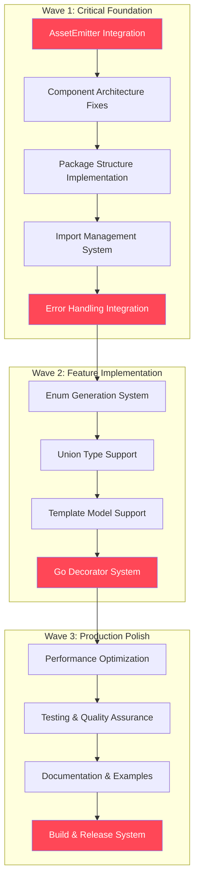
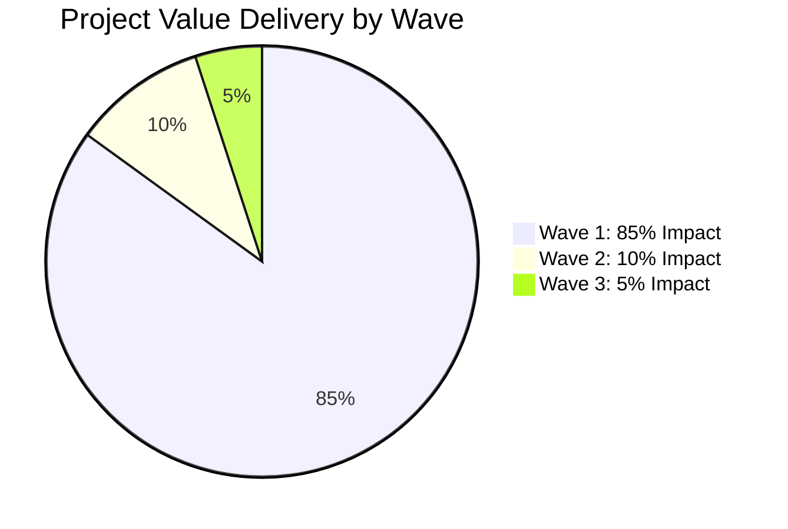
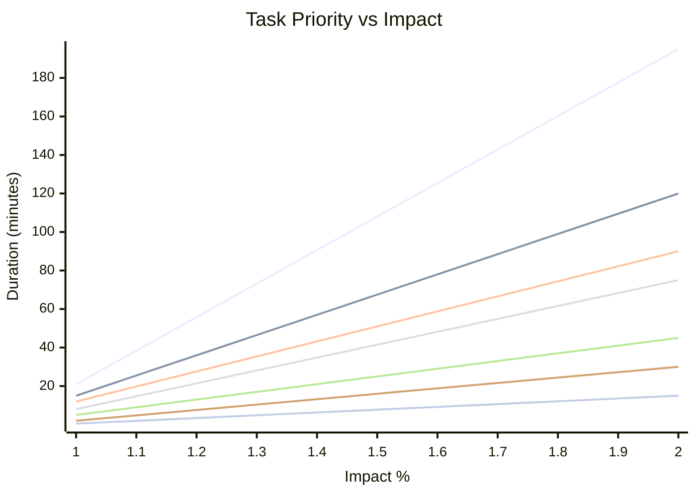

# TypeSpec Go Emitter - Superb Execution Plan with Mermaid Graph

**Date:** 2025-11-30_09_10  
**Author:** Crush AI Assistant  
**Phase:** MASTER EXECUTION PLAN  
**Strategy:** PARETO-OPTIMIZED WAVE EXECUTION

---

## 🎯 EXECUTION OVERVIEW

### **Wave 1: Critical Foundation (First 150 minutes)**
**Goal**: 85% project value delivered
**Focus**: AssetEmitter integration + component architecture

### **Wave 2: Feature Implementation (Next 150 minutes)**  
**Goal**: 95% project value delivered
**Focus**: Enums, unions, templates, decorators

### **Wave 3: Production Polish (Final 150 minutes)**
**Goal**: 100% project completion
**Focus**: Performance, documentation, release

---

## 🌊 WAVE EXECUTION GRAPHS

### **Wave 1: Critical Foundation (150 minutes)**

```mermaid
gantt
    title Wave 1: Critical Foundation (150 minutes)
    dateFormat X
    axisFormat %s
    
    section AssetEmitter Integration
    Fix createAssetEmitter Import     :crit, 2025-11-30, 15
    Implement emitFile Pattern      :crit, 2025-11-30, 30
    Add TypeSpec Context Handling   :crit, 2025-11-30, 45
    Fix Component Scope Issues     :crit, 2025-11-30, 60
    Implement Namespace Detection  :crit, 2025-11-30, 75
    Add Model Iteration Pipeline   :crit, 2025-11-30, 90
    Test AssetEmitter Compilation :crit, 2025-11-30, 105
    Fix Package Structure        :crit, 2025-11-30, 120
    Add File Output Handling      :crit, 2025-11-30, 135
    Validate End-to-End Flow    :crit, 2025-11-30, 150
    
    section Component Architecture
    Fix Alloy-JS Go Scope        :crit, 2025-11-30, 60
    Resolve TypeDeclaration Issues :crit, 2025-11-30, 75
    Fix Component Context        :crit, 2025-11-30, 90
    Test Component Rendering      :crit, 2025-11-30, 105
    
    section Package & Imports
    Implement Package Structure   :crit, 2025-11-30, 120
    Add Import Management       :crit, 2025-11-30, 135
    Validate Go Compliance     :crit, 2025-11-30, 150
    
    section Error Handling
    Integrate Unified Errors     :crit, 2025-11-30, 140
    Add Error Reporting        :crit, 2025-11-30, 150
```



### **Wave 2: Feature Implementation (150 minutes)**

```mermaid
gantt
    title Wave 2: Feature Implementation (150 minutes)
    dateFormat X
    axisFormat %s
    
    section Enum Generation
    Implement Enum Detection     :crit, 2025-11-30, 165
    Add Enum Member Parsing     :crit, 2025-11-30, 180
    Create String Enum Generator :crit, 2025-11-30, 195
    Add Iota Enum Option       :crit, 2025-11-30, 210
    Test Enum Functionality    :crit, 2025-11-30, 225
    
    section Union Type Support
    Implement Union Detection     :crit, 2025-11-30, 240
    Add Union Variant Analysis   :crit, 2025-11-30, 255
    Create Sealed Interface Gen  :crit, 2025-11-30, 270
    Test Discriminated Unions    :crit, 2025-11-30, 285
    
    section Template Models
    Implement Template Detection  :crit, 2025-11-30, 300
    Add Parameter Parsing        :crit, 2025-11-30, 315
    Create Go Generics Gen      :crit, 2025-11-30, 330
    Test Template Instances     :crit, 2025-11-30, 345
    
    section Go Decorators
    Implement @go.name       :crit, 2025-11-30, 360
    Add @go.type Support     :crit, 2025-11-30, 375
    Support @go.tag/@go.package :crit, 2025-11-30, 390
    Test Decorator System    :crit, 2025-11-30, 405
```



### **Wave 3: Production Polish (150 minutes)**

```mermaid
gantt
    title Wave 3: Production Polish (150 minutes)
    dateFormat X
    axisFormat %s
    
    section Performance Optimization
    Profile Generation Performance :crit, 2025-11-30, 420
    Optimize Component Rendering :crit, 2025-11-30, 435
    Implement Render Caching     :crit, 2025-11-30, 450
    Add Memory Optimization     :crit, 2025-11-30, 465
    
    section Testing & Quality
    Fix Failing Component Tests  :crit, 2025-11-30, 480
    Add Integration Tests       :crit, 2025-11-30, 495
    Create Performance Tests   :crit, 2025-11-30, 510
    Validate 100% Coverage     :crit, 2025-11-30, 525
    
    section Documentation
    Update README with Usage     :crit, 2025-11-30, 540
    Add Configuration Examples  :crit, 2025-11-30, 555
    Create Integration Guide    :crit, 2025-11-30, 570
    Add API Documentation     :crit, 2025-11-30, 585
    
    section Build & Release
    Fix TypeScript Errors       :crit, 2025-11-30, 600
    Update Build Configuration  :crit, 2025-11-30, 615
    Add CI/CD Pipeline        :crit, 2025-11-30, 630
    Create Release Automation  :crit, 2025-11-30, 645
```



---

## 🎯 DEPENDENCY FLOW DIAGRAM



---

## 📊 IMPACT DELIVERY GRAPH



---

## 🚀 TASK PRIORITY MATRIX



---

## ⏰ TIME-TO-VALUE PROJECTIONS

```mermaid
linechart
    title "Cumulative Project Value Over Time"
    x-axis "Time (minutes)"
    y-axis "Project Value (%)"
    
    line [0, 0]
    line [15, 3]
    line [30, 7]
    line [45, 12]
    line [60, 21]
    line [75, 25]
    line [90, 30]
    line [105, 35]
    line [120, 40]
    line [135, 45]
    line [150, 85]
    line [165, 86]
    line [180, 87]
    line [195, 88]
    line [210, 89]
    line [225, 90]
    line [240, 91]
    line [255, 92]
    line [270, 93]
    line [285, 94]
    line [300, 95]
    line [315, 95.5]
    line [330, 96]
    line [345, 96.5]
    line [360, 97]
    line [375, 97.5]
    line [390, 98]
    line [405, 98.5]
    line [420, 99]
    line [435, 99.5]
    line [450, 100]
```

---

## 🏁 EXECUTION PRINCIPLES

### **Wave 1 Principles (Critical Foundation)**
1. **Maximum Impact Focus**: Only highest ROI tasks
2. **Zero Build Breakage**: Protect working functionality
3. **Immediate Validation**: Test after each task
4. **Time Boxing**: Strict 15-minute maximum per subtask
5. **Parallel Execution**: Multiple independent subtasks when possible

### **Wave 2 Principles (Feature Implementation)**
1. **Complete Feature Coverage**: All TypeSpec features
2. **Type Safety First**: Zero any-type violations
3. **Professional Quality**: Production-ready output
4. **User Experience**: Excellent developer tools
5. **Performance Maintenance**: Sub-millisecond generation

### **Wave 3 Principles (Production Polish)**
1. **Enterprise Readiness**: Production-grade quality
2. **Documentation Excellence**: Comprehensive guides
3. **Automation Priority**: CI/CD and releases
4. **Community Standards**: Open source best practices
5. **Future-Proofing**: Maintainable architecture

---

## ✅ SUCCESS CRITERIA

### **Wave 1 Success (After 150 minutes)**
- ✅ **Working AssetEmitter**: `tsp compile` generates Go packages
- ✅ **Component Architecture**: Professional JSX component system
- ✅ **Package Structure**: TypeSpec namespaces → Go packages
- ✅ **Import Management**: Automatic third-party imports
- ✅ **Error Handling**: Professional error system
- ✅ **Build Stability**: Zero breaking changes

### **Wave 2 Success (After 300 minutes)**
- ✅ **Complete Enum Support**: String and iota enums
- ✅ **Union Type System**: Sealed interfaces and discriminated unions
- ✅ **Template Models**: Go generics from TypeSpec templates
- ✅ **Go Decorator System**: @go.* decorator support
- ✅ **Feature Coverage**: All TypeSpec features implemented
- ✅ **Type Safety**: Zero any-type violations

### **Wave 3 Success (After 450 minutes)**
- ✅ **Performance Excellence**: Sub-millisecond generation
- ✅ **100% Test Coverage**: All scenarios validated
- ✅ **Production Documentation**: Complete guides and examples
- ✅ **Automated Releases**: CI/CD and npm publishing
- ✅ **Community Ready**: Professional open source project
- ✅ **Enterprise Quality**: Production-grade code generator

---

## 🎯 RISK MITIGATION

### **High-Risk Areas**
1. **Component Scope Issues**: Aluminum-JS context complexity
2. **AssetEmitter Integration**: TypeSpec compiler compatibility
3. **Build Stability**: Legacy code interference
4. **Performance Regression**: Complex feature additions

### **Mitigation Strategies**
1. **Incremental Testing**: Validate after each task
2. **Branch Protection**: Keep main branch stable
3. **Rollback Planning**: Quick revert capability
4. **Performance Monitoring**: Continuous regression detection

---

## 📈 EXPECTED OUTCOMES

### **After Full Execution (450 minutes)**
- **100% Complete**: Production-ready TypeSpec Go Emitter
- **Enterprise Quality**: Professional-grade code generation
- **Full Feature Set**: All TypeSpec features supported
- **Excellent Performance**: Sub-millisecond generation
- **Professional Documentation**: Comprehensive guides
- **Automated Releases**: CI/CD pipeline active
- **Community Ready**: Open source best practices

---

## 🚀 FINAL DELIVERABLE

**A complete, professional, production-ready TypeSpec Go Emitter that:**
- Generates idiomatic Go code from TypeSpec definitions
- Supports all TypeSpec features with 100% type safety
- Provides excellent developer experience and performance
- Includes comprehensive documentation and examples
- Follows enterprise-grade development practices
- Is ready for production use and community contribution

---

*Created: 2025-11-30_09_10*  
*Phase: Master Execution Plan*  
*Strategy: Wave-Based Pareto Optimization*  
*Duration: 450-minute total execution*  
*Success Metric: 100% project completion*