# TypeSpec Go Emitter - Wave 4 Pareto Excellence Plan

**Date:** 2025-11-30 10:15  
**Branch:** lars/lets-rock  
**Current Status:** 40/40 tests passing (100%), Wave 3 complete

---

## 📊 Pareto Analysis Summary

### 🎯 1% → 51% Impact (Critical Path - 3 Tasks)

| ID | Task | Time | Impact | Why |
|----|------|------|--------|-----|
| C1 | Fix `as any` cast in GoPackageDirectory.tsx:71 | 10min | HIGH | Type safety violation |
| C2 | Fix `any` parameter in GoStructDeclaration.tsx:72 | 15min | HIGH | Type safety violation |
| C3 | Remove unused imports across all files | 10min | MEDIUM | Clean code compliance |

### 🎯 4% → 64% Impact (Professional Polish - 6 Tasks)

| ID | Task | Time | Impact | Why |
|----|------|------|--------|-----|
| P1 | Add go.mod generation to output | 20min | HIGH | Makes generated code immediately usable |
| P2 | Add gofmt post-processing | 15min | MEDIUM | Professional formatting |
| P3 | Consolidate duplicate capitalize functions | 10min | LOW | DRY principle |
| P4 | Add @doc decorator → Go comment support | 20min | MEDIUM | Documentation quality |
| P5 | Remove unused `relative` import in emitter | 5min | LOW | Clean code |
| P6 | Add optional pointer types for nested models | 15min | MEDIUM | Proper Go patterns |

### 🎯 20% → 80% Impact (Feature Completion - 8 Tasks)

| ID | Task | Time | Impact | Why |
|----|------|------|--------|-----|
| F1 | Template/generic model support | 30min | HIGH | Complex type support |
| F2 | Cyclic reference detection | 25min | MEDIUM | Prevent infinite loops |
| F3 | Custom struct tags via decorators | 20min | MEDIUM | Flexibility |
| F4 | Operation → Go interface methods | 30min | HIGH | HTTP handlers |
| F5 | HTTP service generation | 30min | HIGH | Full API support |
| F6 | Error type generation | 25min | MEDIUM | Error handling |
| F7 | Validation generation (from constraints) | 25min | MEDIUM | Data validation |
| F8 | Add more scalar type mappings | 15min | LOW | Extended type support |

---

## 📋 27-Task Breakdown (30-100min each)

| # | Task ID | Description | Time | Priority | Dependencies |
|---|---------|-------------|------|----------|--------------|
| 1 | C1 | Replace `as any` with proper type guard in GoPackageDirectory | 10min | P0-CRITICAL | - |
| 2 | C2 | Create TypeSpecType interface, replace `any` in mapTypeSpecToGoType | 15min | P0-CRITICAL | - |
| 3 | C3 | Clean up unused imports (relative, refkey where unused, For) | 10min | P0-CRITICAL | - |
| 4 | P1 | Add GoModFile component for go.mod generation | 20min | P1-HIGH | - |
| 5 | P2 | Add gofmt integration (shell exec or library) | 15min | P1-HIGH | 4 |
| 6 | P3 | Extract shared capitalize function to utils | 10min | P2-MEDIUM | - |
| 7 | P4 | Add @doc decorator parsing and Go comment generation | 20min | P2-MEDIUM | - |
| 8 | P5 | Remove unused `relative` import from typespec-go-emitter | 5min | P2-MEDIUM | - |
| 9 | P6 | Add pointer type detection for optional nested models | 15min | P2-MEDIUM | - |
| 10 | F1 | Add template parameter extraction and Go generics stub | 30min | P1-HIGH | 2 |
| 11 | F2 | Implement cyclic reference detection in model processing | 25min | P2-MEDIUM | - |
| 12 | F3 | Add custom struct tag decorator (@go.tag) | 20min | P2-MEDIUM | - |
| 13 | F4 | Add Operation parsing and Go interface generation | 30min | P1-HIGH | - |
| 14 | F5 | Add HTTP handler skeleton generation | 30min | P1-HIGH | 13 |
| 15 | F6 | Add error model detection and Go error generation | 25min | P2-MEDIUM | - |
| 16 | F7 | Add constraint-based validation code generation | 25min | P2-MEDIUM | - |
| 17 | F8 | Add extended scalar mappings (uri, ip, etc.) | 15min | P3-LOW | - |
| 18 | T1 | Add test for go.mod generation | 10min | P1-HIGH | 4 |
| 19 | T2 | Add test for gofmt output formatting | 10min | P1-HIGH | 5 |
| 20 | T3 | Add test for type guard replacements | 10min | P0-CRITICAL | 1,2 |
| 21 | T4 | Add test for @doc decorator handling | 10min | P2-MEDIUM | 7 |
| 22 | T5 | Add test for cyclic reference handling | 10min | P2-MEDIUM | 11 |
| 23 | T6 | Add test for operation interface generation | 10min | P1-HIGH | 13 |
| 24 | D1 | Update README with new features | 20min | P2-MEDIUM | 4,5,7 |
| 25 | D2 | Add API reference for decorators | 15min | P2-MEDIUM | 7,12 |
| 26 | D3 | Create getting started guide | 20min | P2-MEDIUM | 24 |
| 27 | V1 | Full end-to-end validation with complex TypeSpec | 30min | P0-CRITICAL | ALL |

---

## 📋 150-Task Micro-Breakdown (≤15min each)

### Wave 4.1: Critical Type Safety (1% → 51%)

| # | Task | Time | File | Priority |
|---|------|------|------|----------|
| 1.1 | View GoPackageDirectory.tsx line 70-80 | 2min | GoPackageDirectory.tsx | P0 |
| 1.2 | Create TypeSpecProperty interface with type field | 5min | types/typespec-domain.ts | P0 |
| 1.3 | Create isTypeSpecScalar type guard | 5min | GoPackageDirectory.tsx | P0 |
| 1.4 | Replace `as any` with type guard call | 3min | GoPackageDirectory.tsx | P0 |
| 1.5 | Verify TypeScript compilation | 2min | - | P0 |
| 2.1 | View GoStructDeclaration.tsx line 70-145 | 2min | GoStructDeclaration.tsx | P0 |
| 2.2 | Create TypeSpecTypeNode interface (union type) | 5min | types/typespec-domain.ts | P0 |
| 2.3 | Create isScalar, isModel, isEnum type guards | 8min | GoStructDeclaration.tsx | P0 |
| 2.4 | Refactor mapTypeSpecToGoType with type guards | 10min | GoStructDeclaration.tsx | P0 |
| 2.5 | Run tests to verify no regressions | 3min | - | P0 |
| 3.1 | Grep for unused `relative` import | 1min | - | P0 |
| 3.2 | Remove unused `relative` from emitter | 2min | typespec-go-emitter.tsx | P0 |
| 3.3 | Check `refkey`, `For` usage in GoEnumDeclaration | 2min | GoEnumDeclaration.tsx | P0 |
| 3.4 | Remove unused imports from GoEnumDeclaration | 2min | GoEnumDeclaration.tsx | P0 |
| 3.5 | Run ESLint to verify clean imports | 2min | - | P0 |

### Wave 4.2: Professional Polish (4% → 64%)

| # | Task | Time | File | Priority |
|---|------|------|------|----------|
| 4.1 | Create GoModFile component interface | 5min | components/go/GoModFile.tsx | P1 |
| 4.2 | Implement GoModFile body (module, go version) | 8min | components/go/GoModFile.tsx | P1 |
| 4.3 | Add require statements for common deps | 5min | components/go/GoModFile.tsx | P1 |
| 4.4 | Export from components/go/index.ts | 2min | components/go/index.ts | P1 |
| 4.5 | Integrate GoModFile in GoPackageDirectory | 5min | GoPackageDirectory.tsx | P1 |
| 4.6 | Add test for go.mod content | 10min | tests | P1 |
| 5.1 | Research gofmt integration options | 5min | - | P1 |
| 5.2 | Create formatGoCode utility function | 8min | utils/go-formatter.ts | P1 |
| 5.3 | Integrate formatter in emitter output | 7min | typespec-go-emitter.tsx | P1 |
| 5.4 | Add test for formatted output | 5min | tests | P1 |
| 6.1 | Create utils/strings.ts with capitalize | 5min | utils/strings.ts | P2 |
| 6.2 | Update GoEnumDeclaration import | 3min | GoEnumDeclaration.tsx | P2 |
| 6.3 | Update GoUnionDeclaration import | 3min | GoUnionDeclaration.tsx | P2 |
| 6.4 | Update GoStructDeclaration import | 3min | GoStructDeclaration.tsx | P2 |
| 6.5 | Remove duplicate capitalize functions | 5min | multiple files | P2 |
| 7.1 | Research @doc decorator access in TypeSpec | 5min | - | P2 |
| 7.2 | Add getDocumentation utility function | 8min | utils/typespec-utils.ts | P2 |
| 7.3 | Update GoStructDeclaration for doc comments | 7min | GoStructDeclaration.tsx | P2 |
| 7.4 | Update GoEnumDeclaration for doc comments | 5min | GoEnumDeclaration.tsx | P2 |
| 7.5 | Add test for doc comment generation | 5min | tests | P2 |
| 8.1 | View emitter imports | 1min | typespec-go-emitter.tsx | P2 |
| 8.2 | Remove `relative` import | 2min | typespec-go-emitter.tsx | P2 |
| 8.3 | Run TypeScript check | 2min | - | P2 |
| 9.1 | Add isOptionalNestedModel detection | 8min | GoStructDeclaration.tsx | P2 |
| 9.2 | Generate pointer type for optional nested | 5min | GoStructDeclaration.tsx | P2 |
| 9.3 | Add test for pointer types | 7min | tests | P2 |

### Wave 4.3: Feature Completion (20% → 80%)

| # | Task | Time | File | Priority |
|---|------|------|------|----------|
| 10.1 | Research TypeSpec template API | 5min | - | P1 |
| 10.2 | Create isTemplateModel type guard | 5min | utils/typespec-utils.ts | P1 |
| 10.3 | Add template parameter extraction | 8min | GoStructDeclaration.tsx | P1 |
| 10.4 | Generate Go type parameters (stub) | 10min | GoStructDeclaration.tsx | P1 |
| 10.5 | Add test for template handling | 7min | tests | P1 |
| 11.1 | Create visitedModels Set in emitter | 5min | typespec-go-emitter.tsx | P2 |
| 11.2 | Add cyclic check before model processing | 8min | typespec-go-emitter.tsx | P2 |
| 11.3 | Add warning log for cyclic refs | 5min | typespec-go-emitter.tsx | P2 |
| 11.4 | Add test for cyclic detection | 7min | tests | P2 |
| 12.1 | Research @go.tag decorator pattern | 5min | - | P2 |
| 12.2 | Create GoTagDecorator definition | 8min | lib/decorators.tsp | P2 |
| 12.3 | Add getGoTag utility function | 7min | utils/typespec-utils.ts | P2 |
| 12.4 | Integrate custom tags in GoStructDeclaration | 8min | GoStructDeclaration.tsx | P2 |
| 12.5 | Add test for custom tags | 7min | tests | P2 |
| 13.1 | Create GoInterfaceDeclaration component | 10min | components/go/GoInterfaceDeclaration.tsx | P1 |
| 13.2 | Add operation collection in emitter | 8min | typespec-go-emitter.tsx | P1 |
| 13.3 | Map TypeSpec operation to Go method | 10min | GoInterfaceDeclaration.tsx | P1 |
| 13.4 | Export and integrate interface generation | 7min | multiple files | P1 |
| 13.5 | Add test for interface generation | 10min | tests | P1 |
| 14.1 | Create GoHandlerStub component | 10min | components/go/GoHandlerStub.tsx | P1 |
| 14.2 | Add HTTP method mapping (GET → Get) | 8min | GoHandlerStub.tsx | P1 |
| 14.3 | Generate handler function signature | 7min | GoHandlerStub.tsx | P1 |
| 14.4 | Add handlers.go file generation | 7min | GoPackageDirectory.tsx | P1 |
| 14.5 | Add test for handler stub generation | 8min | tests | P1 |
| 15.1 | Detect @error decorator on models | 5min | utils/typespec-utils.ts | P2 |
| 15.2 | Create GoErrorDeclaration component | 10min | components/go/GoErrorDeclaration.tsx | P2 |
| 15.3 | Implement Error() method generation | 7min | GoErrorDeclaration.tsx | P2 |
| 15.4 | Add errors.go file generation | 5min | GoPackageDirectory.tsx | P2 |
| 15.5 | Add test for error generation | 8min | tests | P2 |
| 16.1 | Research TypeSpec constraint decorators | 5min | - | P2 |
| 16.2 | Create constraint mapping table | 5min | domain/constraints.ts | P2 |
| 16.3 | Add Validate() method skeleton | 10min | GoStructDeclaration.tsx | P2 |
| 16.4 | Generate constraint checks | 10min | GoStructDeclaration.tsx | P2 |
| 16.5 | Add test for validation code | 10min | tests | P2 |
| 17.1 | Add uri → string mapping | 3min | GoStructDeclaration.tsx | P3 |
| 17.2 | Add ip → net.IP mapping | 3min | GoStructDeclaration.tsx | P3 |
| 17.3 | Add ipv4/ipv6 mappings | 3min | GoStructDeclaration.tsx | P3 |
| 17.4 | Add numeric type variants | 3min | GoStructDeclaration.tsx | P3 |
| 17.5 | Add test for extended scalars | 8min | tests | P3 |

### Wave 4.4: Testing & Documentation

| # | Task | Time | File | Priority |
|---|------|------|------|----------|
| 18.1 | Create go-mod-generation.test.ts file | 3min | tests | P1 |
| 18.2 | Write test for go.mod module name | 5min | tests | P1 |
| 18.3 | Write test for go.mod go version | 5min | tests | P1 |
| 19.1 | Create gofmt-output.test.ts file | 3min | tests | P1 |
| 19.2 | Write test for properly indented output | 5min | tests | P1 |
| 19.3 | Write test for import grouping | 5min | tests | P1 |
| 20.1 | Create type-guards.test.ts file | 3min | tests | P0 |
| 20.2 | Write test for isTypeSpecScalar | 5min | tests | P0 |
| 20.3 | Write test for type mapping without any | 5min | tests | P0 |
| 21.1 | Create doc-comments.test.ts file | 3min | tests | P2 |
| 21.2 | Write test for model doc comment | 5min | tests | P2 |
| 21.3 | Write test for field doc comment | 5min | tests | P2 |
| 22.1 | Create cyclic-refs.test.ts file | 3min | tests | P2 |
| 22.2 | Write test for self-referencing model | 5min | tests | P2 |
| 22.3 | Write test for mutual recursion | 5min | tests | P2 |
| 23.1 | Create operation-interface.test.ts file | 3min | tests | P1 |
| 23.2 | Write test for basic operation interface | 7min | tests | P1 |
| 23.3 | Write test for operation parameters | 7min | tests | P1 |
| 24.1 | Update README overview section | 8min | README.md | P2 |
| 24.2 | Update README features list | 7min | README.md | P2 |
| 24.3 | Add usage examples section | 10min | README.md | P2 |
| 25.1 | Create decorators.md file | 5min | docs/decorators.md | P2 |
| 25.2 | Document @go.tag decorator | 8min | docs/decorators.md | P2 |
| 25.3 | Document @doc usage | 7min | docs/decorators.md | P2 |
| 26.1 | Create getting-started.md outline | 5min | docs/getting-started.md | P2 |
| 26.2 | Write installation section | 7min | docs/getting-started.md | P2 |
| 26.3 | Write first TypeSpec example | 8min | docs/getting-started.md | P2 |
| 27.1 | Create complex.tsp test file | 10min | tests/fixtures/complex.tsp | P0 |
| 27.2 | Run full emitter on complex.tsp | 5min | - | P0 |
| 27.3 | Verify go build on output | 5min | - | P0 |
| 27.4 | Verify go test on output | 5min | - | P0 |
| 27.5 | Final test suite run | 5min | - | P0 |

---

## 🔀 Mermaid Execution Graph

```mermaid
flowchart TD
    subgraph "Wave 4.1: Critical Type Safety (1% → 51%)"
        C1[C1: Fix as any GoPackageDirectory]
        C2[C2: Fix any param GoStructDeclaration]
        C3[C3: Remove unused imports]
        T3[T3: Type guard tests]
        
        C1 --> T3
        C2 --> T3
        C3 --> T3
    end
    
    subgraph "Wave 4.2: Professional Polish (4% → 64%)"
        P1[P1: go.mod generation]
        P2[P2: gofmt integration]
        P3[P3: Consolidate capitalize]
        P4[P4: @doc decorator support]
        P5[P5: Remove relative import]
        P6[P6: Pointer types]
        T1[T1: go.mod tests]
        T2[T2: gofmt tests]
        T4[T4: @doc tests]
        
        P1 --> T1
        P1 --> P2
        P2 --> T2
        P4 --> T4
    end
    
    subgraph "Wave 4.3: Feature Completion (20% → 80%)"
        F1[F1: Template/generics]
        F2[F2: Cyclic detection]
        F3[F3: Custom struct tags]
        F4[F4: Operation interfaces]
        F5[F5: HTTP handlers]
        F6[F6: Error generation]
        F7[F7: Validation]
        F8[F8: Extended scalars]
        T5[T5: Cyclic tests]
        T6[T6: Operation tests]
        
        C2 --> F1
        F2 --> T5
        F4 --> F5
        F4 --> T6
    end
    
    subgraph "Wave 4.4: Documentation"
        D1[D1: Update README]
        D2[D2: Decorator docs]
        D3[D3: Getting started]
        
        P1 --> D1
        P2 --> D1
        P4 --> D1
        P4 --> D2
        F3 --> D2
        D1 --> D3
    end
    
    subgraph "Final Validation"
        V1[V1: End-to-end validation]
        
        T3 --> V1
        T1 --> V1
        T2 --> V1
        T5 --> V1
        T6 --> V1
        D1 --> V1
    end
    
    %% Dependencies from earlier to later
    C1 --> P5
    C3 --> P3
    T3 --> F1
```

---

## 📊 Priority Execution Order

### Phase 1: Critical Path (Execute Now - 35min)
1. C1 → C2 → C3 → T3

### Phase 2: Polish (After Phase 1 - 60min)
2. P1 → T1 → P2 → T2 → P5 → P3

### Phase 3: Documentation Basics (After Phase 2 - 35min)
3. P4 → T4 → P6

### Phase 4: Features (After Phase 3 - 2.5hr)
4. F1 → F4 → F5 → T6
5. F2 → T5 → F3 → F6 → F7 → F8

### Phase 5: Documentation & Validation (After Phase 4 - 1hr)
6. D1 → D2 → D3 → V1

---

## ✅ Success Metrics

| Metric | Current | Target | Status |
|--------|---------|--------|--------|
| Test Pass Rate | 100% | 100% | ✅ |
| Any Types | 2 | 0 | 🔧 |
| Unused Imports | 3+ | 0 | 🔧 |
| go.mod Generation | ❌ | ✅ | 📋 |
| gofmt Integration | ❌ | ✅ | 📋 |
| Doc Comments | ❌ | ✅ | 📋 |
| Operation Support | ❌ | ✅ | 📋 |

---

*Generated by Claude Opus 4.5 via Crush*
