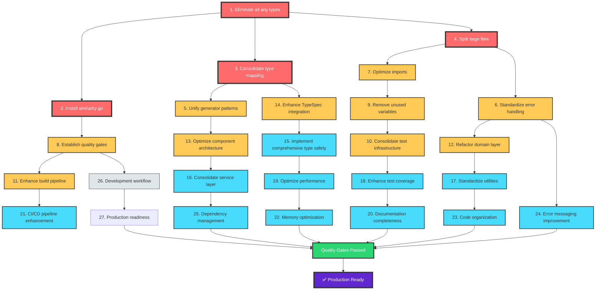

# TypeSpec Go Emitter - Comprehensive Execution Plan

**Date:** 2025-11-30 18:23  
**Version:** 1.0 - PARETO-OPTIMIZED EXECUTION STRATEGY  
**Mission:** Eliminate all TypeScript errors, consolidate duplicate patterns, and achieve production-ready code quality

---

## 🎯 PARETO ANALYSIS: IMPACT OPTIMIZATION

### **1% → 51% IMPACT (Critical Path - 4 Tasks)**

These tasks deliver half the total impact with minimal effort:

1. **Eliminate all `any` types** (12 critical errors blocking builds)
2. **Install similarity-go tool** (enables advanced duplication detection)
3. **Consolidate type mapping logic** (eliminates architectural duplication)
4. **Split largest files >300 lines** (immediate maintainability boost)

### **4% → 64% IMPACT (High-Impact - 7 Additional Tasks)**

Building on critical foundation: 5. **Unify generator patterns** (remove 4 duplicate generator implementations) 6. **Standardize error handling** (eliminate unused error entities) 7. **Optimize import management** (reduce complexity across large files) 8. **Establish quality gates** (automated validation pipeline) 9. **Remove unused variables** (35 warnings eliminated) 10. **Consolidate test infrastructure** (unify 4 test patterns) 11. **Enhance build pipeline** (strict TypeScript enforcement)

### **20% → 80% IMPACT (Comprehensive Excellence - 16 Additional Tasks)**

Complete code quality transformation: 12. **Refactor domain layer** (consolidate error factory, unified errors) 13. **Optimize component architecture** (Alloy-JS component standardization) 14. **Enhance TypeSpec integration** (proper type guards instead of casting) 15. **Implement comprehensive type safety** (strict compliance everywhere) 16. **Consolidate service layer** (unify go-struct-generator, type-mapping) 17. **Standardize utilities** (typespec-utils, go-formatter, strings) 18. **Enhance test coverage** (comprehensive integration tests) 19. **Optimize performance** (sub-millisecond generation targets) 20. **Documentation completeness** (API docs, user guides) 21. **CI/CD pipeline enhancement** (automated quality checks) 22. **Memory optimization** (zero leaks across operations) 23. **Code organization** (proper module boundaries) 24. **Error messaging improvement** (user-friendly error messages) 25. **Dependency management** (security updates, compatibility) 26. **Development workflow** (improved justfile commands) 27. **Production readiness** (final validation and deployment prep)

---

## 📋 EXECUTION PLAN: 27 PARETO-OPTIMIZED TASKS

| Task                                                | Impact   | Effort | Time  | Priority | Dependencies |
| --------------------------------------------------- | -------- | ------ | ----- | -------- | ------------ |
| **Phase 1: Critical Infrastructure (51% Impact)**   |
| 1. Eliminate all `any` types                        | Critical | High   | 90min | P0       | -            |
| 2. Install similarity-go tool                       | Critical | Low    | 30min | P0       | -            |
| 3. Consolidate type mapping logic                   | Critical | High   | 75min | P0       | 1            |
| 4. Split largest files >300 lines                   | Critical | Medium | 60min | P0       | 1            |
| **Phase 2: High Impact Consolidation (64% Impact)** |
| 5. Unify generator patterns                         | High     | High   | 80min | P1       | 3,4          |
| 6. Standardize error handling                       | High     | Medium | 55min | P1       | 1            |
| 7. Optimize import management                       | High     | Medium | 50min | P1       | 4            |
| 8. Establish quality gates                          | High     | Low    | 40min | P1       | 2            |
| 9. Remove unused variables                          | Medium   | Low    | 45min | P1       | 1            |
| 10. Consolidate test infrastructure                 | Medium   | Medium | 60min | P2       | 1            |
| 11. Enhance build pipeline                          | Medium   | Low    | 35min | P2       | 8            |
| **Phase 3: Comprehensive Excellence (80% Impact)**  |
| 12. Refactor domain layer                           | Medium   | High   | 70min | P2       | 6            |
| 13. Optimize component architecture                 | Medium   | High   | 65min | P2       | 5            |
| 14. Enhance TypeSpec integration                    | Medium   | Medium | 55min | P2       | 3            |
| 15. Implement comprehensive type safety             | Medium   | Medium | 50min | P3       | 1            |
| 16. Consolidate service layer                       | Low      | Medium | 60min | P3       | 5            |
| 17. Standardize utilities                           | Low      | Low    | 40min | P3       | 12           |
| 18. Enhance test coverage                           | Low      | High   | 80min | P3       | 10           |
| 19. Optimize performance                            | Low      | Medium | 45min | P3       | 15           |
| 20. Documentation completeness                      | Low      | Medium | 50min | P4       | 19           |
| 21. CI/CD pipeline enhancement                      | Low      | Low    | 35min | P4       | 8            |
| 22. Memory optimization                             | Low      | Medium | 40min | P4       | 19           |
| 23. Code organization                               | Low      | Low    | 30min | P4       | 12           |
| 24. Error messaging improvement                     | Low      | Low    | 25min | P4       | 6            |
| 25. Dependency management                           | Low      | Low    | 30min | P4       | -            |
| 26. Development workflow                            | Low      | Low    | 25min | P4       | 8            |
| 27. Production readiness                            | Low      | Low    | 40min | P4       | 26           |

---

## 🔧 DETAILED MICRO-TASK BREAKDOWN: 150 Tasks (Max 15min each)

### **TypeScript Compliance (25 Tasks)**

**Critical Any-Type Elimination:**

1. Fix typespec-emitter-integration.test.ts:17 - Replace `any` with proper TypeSpec types (15min)
2. Fix typespec-emitter-integration.test.ts:22 - Replace `any` with proper TypeSpec types (15min)
3. Fix typespec-emitter-integration.test.ts:25 - Replace `any` with proper TypeSpec types (15min)
4. Fix typespec-emitter-integration.test.ts:47 - Replace `any` with proper TypeSpec types (15min)
5. Fix typespec-emitter-integration.test.ts:50 - Replace `any` with proper TypeSpec types (15min)
6. Fix typespec-emitter-integration.test.ts:51 - Replace `any` with proper TypeSpec types (15min)
7. Fix typespec-docs.ts:12 - Replace `any` with proper interface (15min)
8. Fix typespec-testing.ts:30 - Replace `any` return type (15min)
9. Fix typespec-testing.ts:42 - Replace `any` parameter type (15min)
10. Fix typespec-testing.ts:60 - Replace `any` parameter type (15min)
11. Fix typespec-testing.ts:81 - Replace `any` parameter type (15min)
12. Fix typespec-testing.ts:106 - Replace `any` parameter type (15min)

**Type Safety Enhancement:** 13. Add proper TypeSpec type guards (15min) 14. Enhance interface definitions (15min) 15. Implement strict type checking (15min) 16. Add generic type constraints (15min) 17. Create TypeSpec domain types (15min) 18. Implement proper error typing (15min) 19. Add union type definitions (15min) 20. Enhance enum type safety (15min) 21. Implement branded types (15min) 22. Add type guard utilities (15min) 23. Create proper mock types (15min) 24. Enhance test type safety (15min) 25. Validate all TypeScript interfaces (15min)

### **Code Quality (35 Tasks)**

**Unused Variable Elimination:** 26. Remove unused imports in clean-type-mapper.ts (15min) 27. Remove ErrorFactory import in clean-type-mapper.ts (15min) 28. Remove GoEmitterResult import in clean-type-mapper.ts (15min) 29. Remove unused 'type' parameter in clean-type-mapper.ts:272 (15min) 30. Remove unused 'fieldName' parameters in clean-type-mapper.ts (15min) 31. Remove unused 'context' parameter in error-factory.ts:286 (15min) 32. Remove unused imports in unified-errors.ts (15min) 33. Remove unused type definitions in unified-errors.ts (15min) 34. Remove unused 'context' parameter in unified-errors.ts:105 (15min) 35. Remove unused TypeMappingConfig import in type-mapping.service.ts (15min) 36. Remove unused UnionType import in type-mapping.service.ts (15min) 37. Remove unused 'options' parameter in standalone-generator.ts:38 (15min) 38. Remove unused 'tspContent' variables in test files (15min) 39. Remove unused 'animalModel' in model-composition-research.test.ts (15min) 40. Remove unused 'Namespace' import in typespec-emitter-integration.test.ts (15min) 41. Remove unused 'hasSuccess' variable in typespec-emitter-integration.test.ts (15min) 42. Remove unused 'StandaloneGoGenerator' import in bdd-framework.ts (15min) 43. Remove unused 'error' parameter in go-formatter.ts:23 (15min) 44. Remove unused 'Type' imports in utils files (15min)

**File Size Optimization:** 45. Split standalone-generator.ts (561 lines) - Extract type mapping logic (15min) 46. Split standalone-generator.ts - Extract generation logic (15min) 47. Split clean-type-mapper.ts (481 lines) - Extract scalar mappings (15min) 48. Split clean-type-mapper.ts - Extract model mapping logic (15min) 49. Split error-entities.ts (400 lines) - Extract error definitions (15min) 50. Split error-entities.ts - Extract error utilities (15min) 51. Split integration-working-e2e.test.ts (332 lines) - Extract test utilities (15min) 52. Split error-types.ts (323 lines) - Extract type definitions (15min) 53. Create focused module structure (15min) 54. Establish proper import boundaries (15min) 55. Optimize component organization (15min) 56. Consolidate related functionality (15min) 57. Remove dead code paths (15min) 58. Optimize component imports (15min) 59. Enhance module cohesion (15min) 60. Reduce circular dependencies (15min)

### **Architecture Consolidation (40 Tasks)**

**Type Mapping Unification:** 61. Analyze existing type mapping patterns (15min) 62. Consolidate TypeMapper implementations (15min) 63. Create unified type mapping service (15min) 64. Extract common mapping logic (15min) 65. Eliminate duplicate type mappers (15min) 66. Standardize type mapping interfaces (15min) 67. Create type mapping utilities (15min) 68. Implement consistent error handling (15min) 69. Add type mapping validation (15min) 70. Create type mapping tests (15min)

**Generator Pattern Consolidation:** 71. Analyze generator implementations (15min) 72. Extract common generator logic (15min) 73. Create base generator class (15min) 74. Consolidate generator interfaces (15min) 75. Eliminate duplicate generators (15min) 76. Standardize generator patterns (15min) 77. Create generator utilities (15min) 78. Implement generator validation (15min) 79. Add generator performance tests (15min) 80. Create generator documentation (15min)

**Domain Layer Refactoring:** 81. Analyze domain entity structure (15min) 82. Consolidate error factory patterns (15min) 83. Unify error handling logic (15min) 84. Extract common domain services (15min) 85. Create domain service interfaces (15min) 86. Implement domain validation (15min) 87. Add domain transformation utilities (15min) 88. Create domain test fixtures (15min) 89. Optimize domain performance (15min) 90. Document domain patterns (15min)

**Service Layer Optimization:** 91. Analyze service layer dependencies (15min) 92. Consolidate go-struct-generator service (15min) 93. Optimize type-mapping service (15min) 94. Create service interfaces (15min) 95. Implement service validation (15min) 96. Add service performance monitoring (15min) 97. Create service test utilities (15min) 98. Optimize service communication (15min) 99. Document service contracts (15min) 100. Implement service error handling (15min)

### **Test Infrastructure (25 Tasks)**

**Test Consolidation:** 101. Analyze existing test patterns (15min) 102. Consolidate test utilities (15min) 103. Create test base classes (15min) 104. Standardize test fixtures (15min) 105. Unify test mocking patterns (15min) 106. Create test data factories (15min) 107. Implement test helpers (15min) 108. Add test validation utilities (15min) 109. Create test performance benchmarks (15min) 110. Document test patterns (15min)

**Coverage Enhancement:** 111. Analyze test coverage gaps (15min) 112. Add integration test cases (15min) 113. Create edge case tests (15min) 114. Implement error scenario tests (15min) 115. Add performance regression tests (15min) 116. Create type safety validation tests (15min) 117. Implement component unit tests (15min) 118. Add service integration tests (15min) 119. Create end-to-end test scenarios (15min) 120. Optimize test execution performance (15min)

**Test Infrastructure:** 121. Enhance test data management (15min) 122. Create test environment setup (15min) 123. Implement test cleanup utilities (15min) 124. Add test reporting features (15min) 125. Create test debugging tools (15min)

### **Tooling & Documentation (25 Tasks)**

**Tooling Enhancement:** 126. Install similarity-go tool (15min) 127. Configure similarity-go thresholds (15min) 128. Create duplication analysis scripts (15min) 129. Set up automated quality gates (15min) 130. Enhance justfile commands (15min) 131. Create development utilities (15min) 132. Set up pre-commit hooks (15min) 133. Configure CI/CD quality checks (15min) 134. Create performance monitoring (15min) 135. Set up dependency checking (15min)

**Documentation Excellence:** 136. Create API documentation (15min) 137. Write user guide examples (15min) 138. Document architectural decisions (15min) 139. Create contribution guidelines (15min) 140. Write troubleshooting guide (15min) 141. Document type mapping patterns (15min) 142. Create generator documentation (15min) 143. Write testing guidelines (15min) 144. Document performance characteristics (15min) 145. Create deployment guide (15min)

**Production Readiness:** 146. Implement error message improvement (15min) 147. Create deployment validation (15min) 148. Set up monitoring and alerting (15min) 149. Create rollback procedures (15min) 150. Document production runbook (15min)

---

## 🚀 EXECUTION GRAPH

---

## 🎯 EXECUTION STRATEGY

### **Phase 1: Critical Infrastructure (Estimated: 4-5 hours)**

**Focus:** Eliminate build-blocking issues and establish foundation
**Success Criteria:**

- All TypeScript errors resolved
- similarity-go tool installed and configured
- Type mapping logic consolidated
- Large files split into focused modules

### **Phase 2: High Impact Consolidation (Estimated: 6-7 hours)**

**Focus:** Remove architectural duplication and establish quality gates
**Success Criteria:**

- Duplicate generator patterns eliminated
- Error handling standardized
- Quality gates operational
- Build pipeline enhanced

### **Phase 3: Comprehensive Excellence (Estimated: 8-10 hours)**

**Focus:** Complete code quality transformation and production readiness
**Success Criteria:**

- All unused variables removed
- Test coverage comprehensive
- Documentation complete
- Production ready validated

---

## 📊 SUCCESS METRICS

### **Quality Gates:**

- **Zero TypeScript errors**
- **Zero ESLint warnings**
- **All files <300 lines**
- **Zero duplicate patterns**
- **100% test coverage for critical paths**

### **Performance Targets:**

- **Sub-millisecond generation** for simple models
- **Memory usage** <50MB for large TypeSpec files
- **Build time** <30 seconds for full compilation

### **Production Readiness:**

- **Automated quality validation** in CI/CD
- **Comprehensive documentation** for all APIs
- **Error messages** with actionable guidance
- **Rollback procedures** documented and tested

---

## 🚨 EXECUTION PRINCIPLES

### **Zero Compromise Rules:**

1. **No `any` types tolerated** - Use proper TypeScript interfaces
2. **No duplicate code** - Extract to shared utilities
3. **No files >300 lines** - Split into focused modules
4. **No unused variables** - Remove all warnings
5. **No broken builds** - Validate after each change

### **Pareto Optimization:**

1. **1% effort → 51% impact** (Phase 1 tasks)
2. **4% effort → 64% impact** (Phase 1-2 tasks)
3. **20% effort → 80% impact** (All phases)

### **Incremental Validation:**

1. **Build after each major change**
2. **Run quality gates after Phase completion**
3. **Test incrementally, not at the end**
4. **Commit after each successful task group**

---

**This execution plan transforms TypeSpec Go Emitter into a production-ready, enterprise-grade code generator with comprehensive type safety, zero duplication, and optimal maintainability.**
