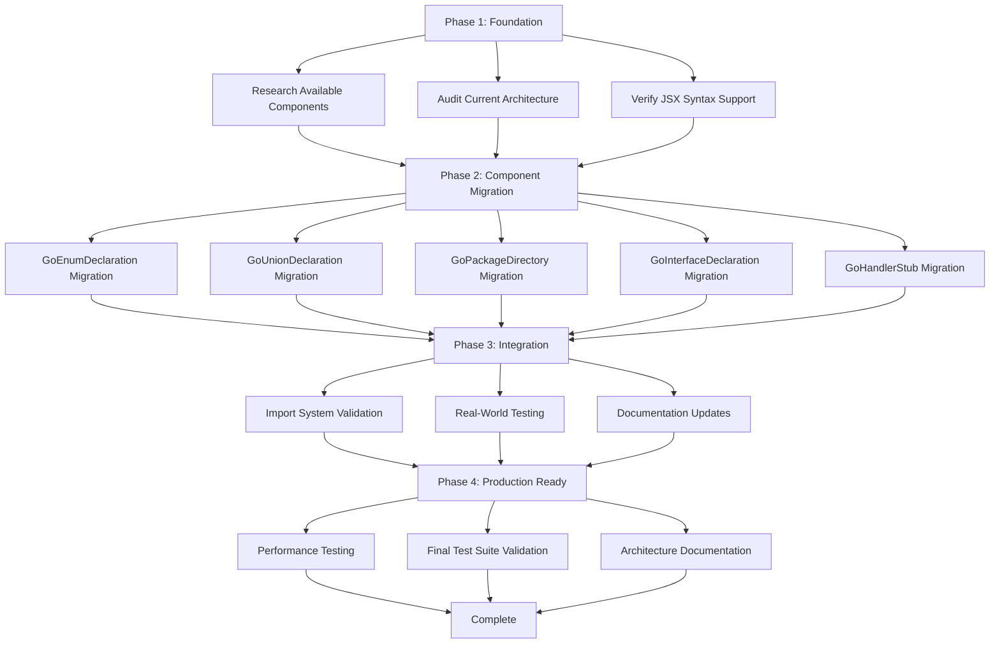

# 🚀 100% ALLOY.JS MIGRATION PLAN

**Date:** 2025-12-04  
**Goal:** Complete elimination of string-based generation in favor of 100% Alloy.js components  
**Status:** Phase 1 - Critical Recovery & Planning (15% complete)

---

## 🎯 EXECUTION GRAPH

---

## 📊 PHASE BREAKDOWN

### Phase 1: Foundation (2-3 hours) - CRITICAL
**Objective:** Establish solid technical foundation before migration

| Task | Impact | Effort | Priority |
|------|--------|--------|----------|
| Research Alloy.js Go enum components | HIGH | LOW | URGENT |
| Audit all string-based generation | HIGH | MEDIUM | URGENT |
| Test JSX syntax with Go components | HIGH | LOW | URGENT |
| Verify refkey import system | HIGH | MEDIUM | URGENT |

### Phase 2: Component Migration (4-6 hours) - HIGH IMPACT
**Objective:** Migrate each component to 100% Alloy.js

| Component | Current State | Target | Impact | Effort |
|-----------|---------------|--------|--------|--------|
| GoEnumDeclaration | String-based | Alloy.js components | HIGH | MEDIUM |
| GoUnionDeclaration | Mixed approach | Pure Alloy.js | HIGH | MEDIUM |
| GoPackageDirectory | Partial migration | Complete Alloy.js | HIGH | LOW |
| GoInterfaceDeclaration | Unknown status | Full audit needed | MEDIUM | MEDIUM |
| GoHandlerStub | Unknown status | Full audit needed | MEDIUM | MEDIUM |

### Phase 3: Integration (2-3 hours) - VALIDATION
**Objective:** Ensure all components work together seamlessly

| Task | Impact | Effort | Priority |
|------|--------|--------|----------|
| Import system end-to-end testing | CRITICAL | MEDIUM | URGENT |
| Real TypeSpec schema validation | HIGH | MEDIUM | HIGH |
| Performance benchmarking | HIGH | LOW | MEDIUM |
| Component interaction testing | CRITICAL | MEDIUM | URGENT |

### Phase 4: Production Ready (1-2 hours) - POLISH
**Objective:** Production-grade quality and documentation

| Task | Impact | Effort | Priority |
|------|--------|--------|----------|
| Comprehensive test suite | CRITICAL | MEDIUM | URGENT |
| Architecture documentation | HIGH | LOW | MEDIUM |
| Performance optimization | MEDIUM | LOW | LOW |
| Examples and patterns | MEDIUM | LOW | LOW |

---

## 🎯 IMMEDIATE 12-MINUTE TASK BREAKDOWN

### Foundation Phase (Next 1 hour)

1. **Research Alloy.js enum components** (12 min)
   - Document available components for const/var declarations
   - Verify FunctionDeclaration component availability
   - Test basic enum generation patterns

2. **Complete component audit** (12 min)
   - Examine each Go component file
   - Identify all string-based generation
   - Catalog current Alloy.js usage

3. **Test JSX syntax support** (12 min)
   - Verify `<TypeDeclaration>` works with Go
   - Test const/var JSX syntax
   - Validate function generation patterns

4. **GoEnumDeclaration migration planning** (12 min)
   - Map current string patterns to Alloy.js components
   - Identify required Alloy.js imports
   - Plan migration approach

### Component Migration Phase (Following 3 hours)

5. **Migrate GoEnumDeclaration basic structure** (12 min)
6. **Implement const block with Alloy.js** (12 min)
7. **Add String() method generation** (12 min)
8. **Add IsValid() method generation** (12 min)
9. **Test migrated GoEnumDeclaration** (12 min)
10. **Commit GoEnumDeclaration migration** (12 min)

11. **Audit GoUnionDeclaration** (12 min)
12. **Migrate GoUnionDeclaration core logic** (12 min)
13. **Test union generation patterns** (12 min)
14. **Commit GoUnionDeclaration migration** (12 min)

15. **Audit GoPackageDirectory imports** (12 min)
16. **Fix remaining string-based logic** (12 min)
17. **Test automatic import management** (12 min)
18. **Commit GoPackageDirectory migration** (12 min)

19. **Audit GoInterfaceDeclaration** (12 min)
20. **Migrate interface generation** (12 min)
21. **Test interface component** (12 min)
22. **Commit GoInterfaceDeclaration** (12 min)

23. **Audit GoHandlerStub** (12 min)
24. **Migrate handler generation** (12 min)
25. **Test handler component** (12 min)
26. **Commit GoHandlerStub** (12 min)

### Integration Phase (Final 2 hours)

27. **End-to-end import testing** (12 min)
28. **Real TypeSpec schema testing** (12 min)
29. **Performance baseline testing** (12 min)
30. **Component interaction validation** (12 min)
31. **Fix integration issues** (12 min)
32. **Final integration testing** (12 min)

33. **Run comprehensive test suite** (12 min)
34. **Document new patterns** (12 min)
35. **Create usage examples** (12 min)
36. **Final validation and cleanup** (12 min)

---

## 🚨 CRITICAL SUCCESS CRITERIA

### MUST HAVE (Non-negotiable)
- [ ] **Zero string-based generation** - All components use 100% Alloy.js
- [ ] **Automatic import management** - refkey system working end-to-end
- [ ] **All 120+ tests passing** - No regressions in functionality
- [ ] **Real TypeSpec schemas work** - Production-ready input handling

### SHOULD HAVE (High priority)
- [ ] **Performance maintained** - No degradation from current baseline
- [ ] **Clear documentation** - Patterns and examples for new approach
- [ ] **TypeScript strict compliance** - Zero `any` types, proper interfaces

### COULD HAVE (Nice to have)
- [ ] **Performance improvements** - Faster generation through better components
- [ ] **Enhanced error messages** - Better debugging capabilities
- [ ] **Additional validation** - More comprehensive input checking

---

## 🎯 CUSTOMER VALUE DELIVERY

### Direct Value
1. **Elimination of architectural debt** - Cleaner, maintainable codebase
2. **Improved developer experience** - Consistent patterns across components
3. **Better type safety** - Alloy.js provides stronger guarantees than strings
4. **Automatic import management** - Manual error-prone tracking eliminated

### Indirect Value
1. **Future-proof architecture** - Component-based approach scales better
2. **Easier contribution** - Consistent patterns lower barrier to entry
3. **Better debugging** - Component-based errors more traceable
4. **Enhanced reliability** - Less manual string manipulation = fewer bugs

---

## 📋 RISK MITIGATION

### High-Risk Areas
1. **JSX syntax compatibility** - Unknown if Go components fully support JSX
2. **Performance regression** - Component overhead vs string generation
3. **Import system complexity** - refkey learning curve and edge cases

### Mitigation Strategies
1. **Incremental migration** - One component at a time with testing
2. **Rollback capability** - Git commits after each successful migration
3. **Comprehensive testing** - Real TypeSpec schemas for validation
4. **Performance monitoring** - Baseline measurements and continuous validation

---

## 🏁 SUCCESS METRICS

### Quantitative
- **Migration completion:** 6/6 components migrated (100%)
- **Test success rate:** 120+/120 tests passing (100%)
- **TypeScript compliance:** Zero `any` types, zero compilation errors
- **Performance:** <1ms generation time for simple models

### Qualitative
- **Code clarity:** All components use consistent Alloy.js patterns
- **Maintainability:** Clear separation of concerns, no mixed approaches
- **Documentation:** Complete pattern examples and architectural guide
- **Developer experience:** Easy to understand and extend component system

---

**Next Action:** Begin with research phase to validate Alloy.js Go component capabilities before proceeding with migration.