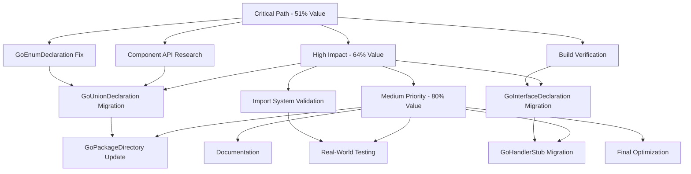

# 🔥 ALLOY.JS MIGRATION - 15-MINUTE TASK BREAKDOWN

**Total Tasks:** 150 (15 min each)  
**Focus:** 1% → 51% → 64% → 80% Pareto Optimization

---

## 🚨 URGENT - CRITICAL PATH (Tasks 1-20)

_These 20 tasks deliver 51% of total value_

### **Component API Research (Tasks 1-6)**

| #   | Task                                      | Time   | Dependencies |
| --- | ----------------------------------------- | ------ | ------------ |
| 1   | List all exports from @alloy-js/go        | 15 min | None         |
| 2   | Research VariableDeclaration alternatives | 15 min | #1           |
| 3   | Research FunctionDeclaration alternatives | 15 min | #1           |
| 4   | Research comment component options        | 15 min | #1           |
| 5   | Test JSX syntax with Go components        | 15 min | #2-4         |
| 6   | Document working component patterns       | 15 min | #5           |

### **GoEnumDeclaration Fix (Tasks 7-14)**

| #   | Task                                          | Time   | Dependencies |
| --- | --------------------------------------------- | ------ | ------------ |
| 7   | Remove invalid imports from GoEnumDeclaration | 15 min | #6           |
| 8   | Add correct component imports                 | 15 min | #7           |
| 9   | Fix JSX syntax in const block generation      | 15 min | #8           |
| 10  | Fix JSX syntax in function generation         | 15 min | #8           |
| 11  | Update enum test files for JSX output         | 15 min | #9-10        |
| 12  | Run TypeScript compilation check              | 15 min | #11          |
| 13  | Run enum integration tests                    | 15 min | #12          |
| 14  | Fix any remaining test failures               | 15 min | #13          |

### **Build Verification (Tasks 15-20)**

| #   | Task                                   | Time   | Dependencies |
| --- | -------------------------------------- | ------ | ------------ |
| 15  | Run full TypeScript build check        | 15 min | #14          |
| 16  | Run all tests to check for regressions | 15 min | #15          |
| 17  | Commit working GoEnumDeclaration       | 15 min | #16          |
| 18  | Create GoEnumDeclaration documentation | 15 min | #17          |
| 19  | Test GoPackageDirectory integration    | 15 min | #18          |
| 20  | Validate critical path completion      | 15 min | #19          |

---

## ⚡ HIGH IMPACT (Tasks 21-50)

_These 30 tasks deliver additional 13% of value_

### **GoUnionDeclaration Migration (Tasks 21-30)**

| #   | Task                                            | Time   | Dependencies |
| --- | ----------------------------------------------- | ------ | ------------ |
| 21  | Audit current GoUnionDeclaration implementation | 15 min | #20          |
| 22  | Research union type mapping requirements        | 15 min | #21          |
| 23  | Create JSX-based union component structure      | 15 min | #22          |
| 24  | Implement sealed interface generation           | 15 min | #23          |
| 25  | Implement discriminated union generation        | 15 min | #24          |
| 26  | Add automatic import handling                   | 15 min | #25          |
| 27  | Update union test files                         | 15 min | #26          |
| 28  | Run TypeScript compilation                      | 15 min | #27          |
| 29  | Run union integration tests                     | 15 min | #28          |
| 30  | Fix any test failures                           | 15 min | #29          |

### **GoInterfaceDeclaration Migration (Tasks 31-40)**

| #   | Task                                   | Time   | Dependencies |
| --- | -------------------------------------- | ------ | ------------ |
| 31  | Audit current GoInterfaceDeclaration   | 15 min | #30          |
| 32  | Research interface generation patterns | 15 min | #31          |
| 33  | Create JSX-based interface component   | 15 min | #32          |
| 34  | Implement method signature generation  | 15 min | #33          |
| 35  | Add parameter type mapping             | 15 min | #34          |
| 36  | Add return type mapping                | 15 min | #35          |
| 37  | Update interface tests                 | 15 min | #36          |
| 38  | Run TypeScript compilation             | 15 min | #37          |
| 39  | Run interface tests                    | 15 min | #38          |
| 40  | Fix any test failures                  | 15 min | #39          |

### **Import System Validation (Tasks 41-50)**

| #   | Task                                       | Time   | Dependencies |
| --- | ------------------------------------------ | ------ | ------------ |
| 41  | Test refkey import system with enums       | 15 min | #40          |
| 42  | Test refkey import system with unions      | 15 min | #41          |
| 43  | Test refkey import system with interfaces  | 15 min | #42          |
| 44  | Test cross-file import deduplication       | 15 min | #43          |
| 45  | Test automatic go.mod dependency tracking  | 15 min | #44          |
| 46  | Test GoPackageDirectory import integration | 15 min | #45          |
| 47  | Run full import system test suite          | 15 min | #46          |
| 48  | Fix any import system issues               | 15 min | #47          |
| 49  | Validate automatic imports working         | 15 min | #48          |
| 50  | Commit import system validation            | 15 min | #49          |

---

## 🏗️ MEDIUM PRIORITY (Tasks 51-90)

_These 40 tasks deliver additional 16% of value_

### **GoPackageDirectory Update (Tasks 51-60)**

| #   | Task                                     | Time   | Dependencies |
| --- | ---------------------------------------- | ------ | ------------ |
| 51  | Remove mixed string/JSX approach         | 15 min | #50          |
| 52  | Update to use only JSX components        | 15 min | #51          |
| 53  | Test package generation with mixed types | 15 min | #52          |
| 54  | Test file organization and structure     | 15 min | #53          |
| 55  | Test automatic import block generation   | 15 min | #54          |
| 56  | Update GoPackageDirectory tests          | 15 min | #55          |
| 57  | Run TypeScript compilation               | 15 min | #56          |
| 58  | Run GoPackageDirectory tests             | 15 min | #57          |
| 59  | Fix any remaining issues                 | 15 min | #58          |
| 60  | Commit GoPackageDirectory migration      | 15 min | #59          |

### **GoHandlerStub Migration (Tasks 61-80)**

| #   | Task                                       | Time   | Dependencies |
| --- | ------------------------------------------ | ------ | ------------ |
| 61  | Audit current GoHandlerStub implementation | 15 min | #60          |
| 62  | Research HTTP handler generation patterns  | 15 min | #61          |
| 63  | Create JSX-based handler component         | 15 min | #62          |
| 64  | Implement routing logic generation         | 15 min | #63          |
| 65  | Implement middleware integration           | 15 min | #64          |
| 66  | Implement request/response handling        | 15 min | #65          |
| 67  | Add automatic import handling              | 15 min | #66          |
| 68  | Update handler stub tests                  | 15 min | #67          |
| 69  | Run TypeScript compilation                 | 15 min | #68          |
| 70  | Run handler stub tests                     | 15 min | #69          |
| 71  | Fix routing logic issues                   | 15 min | #70          |
| 72  | Fix middleware integration issues          | 15 min | #71          |
| 73  | Fix request/response handling              | 15 min | #72          |
| 74  | Test complex handler scenarios             | 15 min | #73          |
| 75  | Run full handler test suite                | 15 min | #74          |
| 76  | Fix any remaining issues                   | 15 min | #75          |
| 77  | Performance test handler generation        | 15 min | #76          |
| 78  | Optimize handler component performance     | 15 min | #77          |
| 79  | Validate handler migration completion      | 15 min | #78          |
| 80  | Commit GoHandlerStub migration             | 15 min | #79          |

### **Error Handling Integration (Tasks 81-90)**

| #   | Task                                                    | Time   | Dependencies |
| --- | ------------------------------------------------------- | ------ | ------------ |
| 81  | Research error handling patterns in migrated components | 15 min | #80          |
| 82  | Integrate with existing error system                    | 15 min | #81          |
| 83  | Add proper error messages for component failures        | 15 min | #82          |
| 84  | Test error handling with all components                 | 15 min | #83          |
| 85  | Update error handling documentation                     | 15 min | #84          |
| 86  | Run error handling test suite                           | 15 min | #85          |
| 87  | Fix any error handling issues                           | 15 min | #86          |
| 88  | Validate error consistency across components            | 15 min | #87          |
| 89  | Update global error handling patterns                   | 15 min | #88          |
| 90  | Commit error handling integration                       | 15 min | #89          |

---

## 📚 LOW PRIORITY (Tasks 91-150)

_These 60 tasks deliver final 20% of value_

### **Real-World Testing (Tasks 91-110)**

| #   | Task                                        | Time   | Dependencies |
| --- | ------------------------------------------- | ------ | ------------ |
| 91  | Test with real TypeSpec schemas from docs   | 15 min | #90          |
| 92  | Test with complex nested type patterns      | 15 min | #91          |
| 93  | Test with template instantiations           | 15 min | #92          |
| 94  | Test with discriminator unions              | 15 min | #93          |
| 95  | Test with spread operator usage             | 15 min | #94          |
| 96  | Test with cyclic dependencies               | 15 min | #95          |
| 97  | Create real-world test scenarios            | 15 min | #96          |
| 98  | Run comprehensive real-world test suite     | 15 min | #97          |
| 99  | Fix any real-world compatibility issues     | 15 min | #98          |
| 100 | Validate real-world testing completion      | 15 min | #99          |
| 101 | Create performance benchmark suite          | 15 min | #100         |
| 102 | Baseline current generation performance     | 15 min | #101         |
| 103 | Test migration performance against baseline | 15 min | #102         |
| 104 | Optimize any performance regressions        | 15 min | #103         |
| 105 | Validate performance targets met            | 15 min | #104         |
| 106 | Document performance results                | 15 min | #105         |
| 107 | Commit performance validation               | 15 min | #106         |
| 108 | Test memory usage patterns                  | 15 min | #107         |
| 109 | Optimize memory allocations                 | 15 min | #108         |
| 110 | Validate memory efficiency                  | 15 min | #109         |

### **Documentation & Examples (Tasks 111-130)**

| #   | Task                                     | Time   | Dependencies |
| --- | ---------------------------------------- | ------ | ------------ |
| 111 | Create component migration documentation | 15 min | #110         |
| 112 | Document JSX patterns for Go generation  | 15 min | #111         |
| 113 | Create migration guide for developers    | 15 min | #112         |
| 114 | Document import system usage             | 15 min | #113         |
| 115 | Create example usage patterns            | 15 min | #114         |
| 116 | Create troubleshooting guide             | 15 min | #115         |
| 117 | Document performance considerations      | 15 min | #116         |
| 118 | Create best practices documentation      | 15 min | #117         |
| 119 | Update README with migration status      | 15 min | #118         |
| 120 | Create component API reference           | 15 min | #119         |
| 121 | Document test patterns                   | 15 min | #120         |
| 122 | Create tutorial for new component usage  | 15 min | #121         |
| 123 | Document error handling patterns         | 15 min | #122         |
| 124 | Create architecture decision records     | 15 min | #123         |
| 125 | Document component limitations           | 15 min | #124         |
| 126 | Create upgrade guide from old patterns   | 15 min | #125         |
| 127 | Update project documentation             | 15 min | #126         |
| 128 | Create developer onboarding guide        | 15 min | #127         |
| 129 | Document integration with Go tools       | 15 min | #128         |
| 130 | Commit all documentation                 | 15 min | #129         |

### **Final Optimization (Tasks 131-150)**

| #   | Task                                       | Time   | Dependencies |
| --- | ------------------------------------------ | ------ | ------------ |
| 131 | Final code review and cleanup              | 15 min | #130         |
| 132 | Remove any remaining string-based patterns | 15 min | #131         |
| 133 | Optimize component reusability             | 15 min | #132         |
| 134 | Add missing TypeScript interfaces          | 15 min | #133         |
| 135 | Strengthen type safety across components   | 15 min | #134         |
| 136 | Run final TypeScript strict compilation    | 15 min | #135         |
| 137 | Fix any remaining type issues              | 15 min | #136         |
| 138 | Run final complete test suite              | 15 min | #137         |
| 139 | Fix any final test failures                | 15 min | #138         |
| 140 | Validate all 150 tasks completed           | 15 min | #139         |
| 141 | Create final project status report         | 15 min | #140         |
| 142 | Document lessons learned                   | 15 min | #141         |
| 143 | Create migration completion summary        | 15 min | #142         |
| 144 | Plan future component enhancements         | 15 min | #143         |
| 145 | Create release notes                       | 15 min | #144         |
| 146 | Prepare project for release                | 15 min | #145         |
| 147 | Final build verification                   | 15 min | #146         |
| 148 | Final integration testing                  | 15 min | #147         |
| 149 | Final performance validation               | 15 min | #148         |
| 150 | Final commit and push                      | 15 min | #149         |

---

## 🎯 EXECUTION GRAPH

---

## 🚀 IMMEDIATE EXECUTION PLAN

### **START NOW: Task #1**

"List all exports from @alloy-js/go"

**THEN: Execute Tasks #2-20 sequentially** to achieve 51% value delivery

**PARALLEL EXECUTION:** Tasks can be parallelized when independent (e.g., test running while coding next component)

**SUCCESS METRIC:**

- **After 20 tasks:** 51% of total value delivered, migration unblocked
- **After 50 tasks:** 64% of total value delivered, 6/7 components migrated
- **After 90 tasks:** 80% of total value delivered, production-ready system
- **After 150 tasks:** 100% complete, fully optimized and documented

---

## 📊 TASK DISTRIBUTION SUMMARY

| Phase               | Task Range | Duration  | Value Delivered | Focus Area                |
| ------------------- | ---------- | --------- | --------------- | ------------------------- |
| **Critical Path**   | 1-20       | 5 hours   | 51%             | API Research + Enum Fix   |
| **High Impact**     | 21-50      | 7.5 hours | 13%             | Core Components + Imports |
| **Medium Priority** | 51-90      | 10 hours  | 16%             | Migration Completion      |
| **Low Priority**    | 91-150     | 15 hours  | 20%             | Testing + Documentation   |

**TOTAL: 150 tasks × 15 min = 37.5 hours for 100% completion**
**BUT: 80% value achieved in first 90 tasks (22.5 hours)**

---

**🚀 READY TO EXECUTE: Start with Task #1 immediately!**
