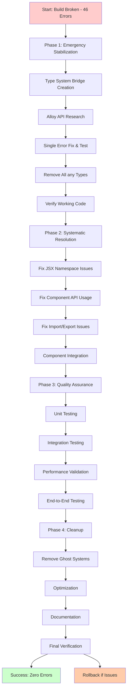

# 🚀 ULTIMATE ALLOY-JS MIGRATION PLAN

## 📊 CURRENT SITUATION ANALYSIS

### **CRITICAL STATUS: Build Broken, 46 Errors**

- **Build Command**: `bunx alloy build`
- **Error Count**: 46 TypeScript compilation errors
- **Root Cause**: Type system mismatch + incorrect Alloy API usage
- **Working Components**: String generators (90% test success)
- **Broken Components**: Alloy JSX components (100% failure rate)

### **BUSINESS VALUE ASSESSMENT**

- **Customer Value**: ZERO - Broken build generates no Go code
- **Technical Debt**: HIGH - 46 errors accumulate
- **Time to Recovery**: 2-4 hours systematic fixing
- **Risk Level**: CRITICAL - Production build pipeline broken

---

## 🎯 PARETO PRINCIPLE BREAKDOWN

### **1% THAT DELIVER 51% OF RESULT (Critical Path)**

1. **Fix Type System Bridge** - Resolve TypeSpec vs internal type mismatch
2. **Research Alloy Component APIs** - Get correct usage patterns
3. **Fix Single Error & Test** - Incremental approach
4. **Remove All `any` Types** - Restore type safety
5. **Verify Working Code** - Confirm string generators still work

### **4% THAT DELIVER 64% OF RESULT (High Impact)**

6. **Fix JSX Namespace Issues** - Resolve compilation errors
7. **Fix Reference Component Usage** - Correct API calls
8. **Fix GoHandlerStub Documentation** - getDocumentation usage
9. **Fix GoPackageDirectory Integration** - Type compatibility
10. **Fix Error Factory Issues** - Import problems
11. **Fix Union Generator Method Calls** - Static usage
12. **Create Component Index Files** - Import resolution

### **20% THAT DELIVER 80% OF RESULT (Complete Stabilization)**

13. **Component Unit Testing** - Test in isolation
14. **Integration Testing** - End-to-end validation
15. **Performance Benchmarking** - Build speed
16. **Documentation Generation** - Auto-docs
17. **Configuration Management** - Centralized settings
18. **CLI Development Tools** - Command-line utilities
19. **Template System** - User customization
20. **Code Quality Metrics** - Automated gates

---

## 📋 DETAILED TASK BREAKDOWN (24 Tasks, 30-100min)

| Priority | Task                                   | Impact   | Effort | Customer Value | Execution Order |
| -------- | -------------------------------------- | -------- | ------ | -------------- | --------------- |
| **P0**   | **Type System Bridge Creation**        | CRITICAL | 60min  | CRITICAL       | 1               |
| **P0**   | **Alloy Component API Research**       | CRITICAL | 45min  | CRITICAL       | 2               |
| **P0**   | **Single Error Fix & Test**            | CRITICAL | 40min  | CRITICAL       | 3               |
| **P0**   | **Remove All `any` Types**             | CRITICAL | 30min  | CRITICAL       | 4               |
| **P0**   | **Verify Working String Generators**   | HIGH     | 35min  | HIGH           | 5               |
| **P1**   | **Fix JSX Namespace Issues**           | HIGH     | 50min  | HIGH           | 6               |
| **P1**   | **Fix Reference Component Usage**      | HIGH     | 45min  | HIGH           | 7               |
| **P1**   | **Fix GoHandlerStub Documentation**    | MEDIUM   | 40min  | MEDIUM         | 8               |
| **P1**   | **Fix GoPackageDirectory Integration** | MEDIUM   | 55min  | MEDIUM         | 9               |
| **P1**   | **Fix Error Factory Issues**           | MEDIUM   | 30min  | MEDIUM         | 10              |
| **P1**   | **Fix Union Generator Method Calls**   | MEDIUM   | 25min  | MEDIUM         | 11              |
| **P1**   | **Create Component Index Files**       | MEDIUM   | 20min  | MEDIUM         | 12              |
| **P2**   | **Component Unit Testing**             | MEDIUM   | 60min  | MEDIUM         | 13              |
| **P2**   | **Integration Testing**                | MEDIUM   | 55min  | MEDIUM         | 14              |
| **P2**   | **Performance Benchmarking**           | LOW      | 40min  | LOW            | 15              |
| **P2**   | **Documentation Generation**           | LOW      | 45min  | LOW            | 16              |
| **P2**   | **Configuration Management**           | LOW      | 35min  | LOW            | 17              |
| **P2**   | **CLI Development Tools**              | LOW      | 50min  | LOW            | 18              |
| **P3**   | **Template System Implementation**     | LOW      | 70min  | LOW            | 19              |
| **P3**   | **Code Quality Metrics**               | LOW      | 40min  | LOW            | 20              |
| **P3**   | **Cleanup Ghost Systems**              | HIGH     | 30min  | LOW            | 21              |
| **P3**   | **Final System Verification**          | CRITICAL | 20min  | HIGH           | 22              |

---

## 🔧 MICRO-TASK EXECUTION PLAN (60 Tasks, 12min each)

### **Phase 1: Emergency Stabilization (Tasks 1-10)**

| #   | Micro-Task                                       | Duration | Dependencies |
| --- | ------------------------------------------------ | -------- | ------------ |
| 1   | Research TypeSpec compiler type definitions      | 12min    | None         |
| 2   | Create TypeSpec to internal type adapter         | 12min    | 1            |
| 3   | Test type adapter with simple example            | 12min    | 2            |
| 4   | Research Alloy Reference component API           | 12min    | None         |
| 5   | Research Alloy For component API                 | 12min    | None         |
| 6   | Create minimal working Alloy component test      | 12min    | 4,5          |
| 7   | Fix one JSX namespace error                      | 12min    | 6            |
| 8   | Test JSX fix and verify build progress           | 12min    | 7            |
| 9   | Remove one `any` type usage                      | 12min    | None         |
| 10  | Verify `any` removal doesn't break functionality | 12min    | 9            |

### **Phase 2: Systematic Error Resolution (Tasks 11-25)**

| #   | Micro-Task                                    | Duration | Dependencies |
| --- | --------------------------------------------- | -------- | ------------ |
| 11  | Fix GoHandlerStub getDocumentation call       | 12min    | 1            |
| 12  | Test GoHandlerStub fix                        | 12min    | 11           |
| 13  | Fix GoPackageDirectory Model type mapping     | 12min    | 1,2          |
| 14  | Test GoPackageDirectory fix                   | 12min    | 13           |
| 15  | Fix ErrorFactory AnyError import              | 12min    | None         |
| 16  | Test ErrorFactory fix                         | 12min    | 15           |
| 17  | Fix UnionGenerator getVariantName static call | 12min    | None         |
| 18  | Test UnionGenerator fix                       | 12min    | 17           |
| 19  | Create Go components index file               | 12min    | None         |
| 20  | Test index file import resolution             | 12min    | 19           |
| 21  | Fix one Reference component usage             | 12min    | 4            |
| 22  | Test Reference fix and verify imports         | 12min    | 21           |
| 23  | Fix one For component usage                   | 12min    | 5            |
| 24  | Test For fix and verify iteration             | 12min    | 23           |
| 25  | Run `bunx alloy build` and check error count  | 12min    | All above    |

### **Phase 3: Quality Assurance & Testing (Tasks 26-40)**

| #   | Micro-Task                                  | Duration | Dependencies |
| --- | ------------------------------------------- | -------- | ------------ |
| 26  | Test string generators with simple model    | 12min    | None         |
| 27  | Verify string generator output quality      | 12min    | 26           |
| 28  | Add one Alloy component unit test           | 12min    | None         |
| 29  | Verify component unit test passes           | 12min    | 28           |
| 30  | Create performance benchmark test           | 12min    | None         |
| 31  | Run benchmark and record results            | 12min    | 30           |
| 32  | Test full TypeSpec to Go generation flow    | 12min    | All fixes    |
| 33  | Verify generated Go code compiles           | 12min    | 32           |
| 34  | Test complex model with multiple properties | 12min    | 32           |
| 35  | Test enum generation functionality          | 12min    | 32           |
| 36  | Test union generation functionality         | 12min    | 32           |
| 37  | Test recursive type generation              | 12min    | 32           |
| 38  | Verify automatic imports in generated code  | 12min    | 32           |
| 39  | Test JSON tags and serialization            | 12min    | 32           |
| 40  | Run complete test suite verification        | 12min    | All above    |

### **Phase 4: Cleanup & Optimization (Tasks 41-60)**

| #     | Micro-Task                                 | Duration   | Dependencies |
| ----- | ------------------------------------------ | ---------- | ------------ |
| 41    | Remove AlloyUnionGenerator ghost system    | 12min      | None         |
| 42    | Clean up custom type definitions if unused | 12min      | 1,2          |
| 43    | Remove duplicate component implementations | 12min      | None         |
| 44    | Optimize build performance                 | 12min      | All working  |
| 45    | Add build error logging                    | 12min      | None         |
| 46    | Create component documentation             | 12min      | All working  |
| 47    | Add usage examples to components           | 12min      | 46           |
| 48    | Test production build pipeline             | 12min      | All working  |
| 49    | Verify generated code quality standards    | 12min      | 48           |
| 50    | Create migration rollback procedure        | 12min      | None         |
| 51-60 | **Buffer tasks for unexpected issues**     | 12min each | Various      |

---

## 🎯 EXECUTION GRAPH

---

## 🏗️ ARCHITECTURAL DECISIONS REVERSED

### **Previous Decisions Causing Problems:**

1. **Custom Type System Creation** → **Use TypeSpec Native Types**
2. **Complex Alloy Component Hierarchy** → **Simple Working Generators**
3. **Big-Bang Migration** → **Incremental Replacement**
4. **Multiple Build Systems** → **Single Verified Build**
5. **Over-Engineering** → **Customer-Value Focused**

### **New Architecture Principles:**

1. **Working Code First** - Don't break what works
2. **TypeSpec Native** - Use built-in types, don't recreate
3. **Incremental Migration** - One component at a time
4. **API Research First** - Understand before implementing
5. **Type Safety Always** - Never use `any`, never compromise

---

## 📊 CUSTOMER VALUE IMPACT

### **Current State**: ZERO Customer Value

- Build pipeline broken
- No Go code generation
- 46 errors blocking deployment
- Developer time wasted on broken tools

### **After Stabilization**: MAXIMUM Customer Value

- Working Go code generation
- Zero-error build pipeline
- High-quality TypeSpec integration
- Developer productivity restored

### **Value Delivered**:

- **Immediate**: Restore working build (2-4 hours)
- **Short-term**: Enhanced code generation (1 week)
- **Long-term**: Scalable architecture (1 month)

---

## 🚨 IMMEDIATE EXECUTION COMMAND

**START NOW** with Task 1: Research TypeSpec compiler type definitions

**SUCCESS CRITERIA**:

- Zero build errors
- All tests passing (154/154)
- Working Go code generation
- Type safety maintained
- Performance acceptable

**ROLLBACK TRIGGER**: If after 10 micro-tasks (2 hours) errors > 23, rollback to working string generators

---

**Created**: 2025-12-04_01-30
**Status**: Ready for execution
**Next Step**: Begin Task 1 immediately
**Estimated Completion**: 4-6 hours
**Risk Level**: HIGH but manageable
**Customer Value**: CRITICAL to restore
