# TypeSpec Go Emitter - Comprehensive Execution Plan

**Date:** 2025-12-04 05:18  
**Strategy:** Pareto Optimization - Critical Few Items for Maximum Impact

## 🎯 PARETO ANALYSIS BREAKDOWN

### **1% delivering 51% of Results (CRITICAL PATH - 30min tasks)**

| Priority | Task | Impact | Time | File | Expected Result |
|----------|------|--------|------|------|----------------|
| #1 | Fix Union Generation Core | 25% | 30min | `GoUnionDeclaration.tsx` | Union tests pass |
| #2 | Fix Component Import System | 15% | 30min | Test imports | Component tests pass |
| #3 | Replace Missing renderAsync | 11% | 15min | Test files | Async tests work |

### **4% delivering 64% of Results (HIGH IMPACT - 60min tasks)**

| Priority | Task | Impact | Time | File | Expected Result |
|----------|------|--------|------|------|----------------|
| #4 | Debug Reference Component System | 12% | 60min | `GoStructDeclaration.tsx` | Pointer types work |
| #5 | Complete GoHandlerStub Migration | 10% | 45min | `GoHandlerStub.tsx` | Handler generation works |
| #6 | Stabilize Test Suite | 8% | 30min | Multiple tests | Test pass rate 95%+ |
| #7 | Fix Enum Integration Issues | 7% | 30min | `GoEnumDeclaration.tsx` | Enum unions work |
| #8 | Fix Doc Decorator Support | 6% | 20min | Documentation system | Decorator tests pass |

### **20% delivering 80% of Results (MEDIUM IMPACT - 90min tasks)**

| Priority | Task | Impact | Time | File | Expected Result |
|----------|------|--------|------|------|----------------|
| #9 | Implement Component Error Handling | 5% | 45min | Error system | Structured errors |
| #10 | Add Union JSON Serialization | 4% | 60min | Union system | Marshal/Unmarshal |
| #11 | Create Component Testing Utils | 3% | 30min | Test infrastructure | Easier component testing |
| #12 | Implement Recursive Union Support | 3% | 75min | Union system | Self-referencing types |
| #13 | Add Performance Benchmarks | 2% | 60min | Performance system | Optimization metrics |

## 📋 COMPREHENSIVE TASK BREAKDOWN (27 TASKS)

### **Phase 1: CRITICAL RECOVERY (First 2 Hours)**

| ID | Task | Time | Dependencies | Success Criteria |
|----|------|------|-------------|-----------------|
| T1 | Debug GoUnionDeclaration returning "error" | 30min | None | Union tests pass |
| T2 | Fix component import paths in tests | 30min | T1 | Component tests pass |
| T3 | Add renderAsync to test files | 15min | T1 | Async tests work |
| T4 | Debug Component.C tag errors | 60min | T1 | Pointer types work |
| T5 | Complete GoHandlerStub conditional logic | 45min | T1 | Handler generation works |
| T6 | Fix enum integration async issues | 30min | T1 | Enum tests pass |
| T7 | Stabilize doc decorator support | 20min | T1 | Decorator tests pass |
| T8 | Run full test suite verification | 10min | T1-T7 | 95%+ pass rate |

### **Phase 2: SYSTEM STABILIZATION (Next 4 Hours)**

| ID | Task | Time | Dependencies | Success Criteria |
|----|------|------|-------------|-----------------|
| T9 | Implement component error boundaries | 45min | Phase 1 | Structured error handling |
| T10 | Add union JSON marshaling methods | 60min | T1 | JSON serialization works |
| T11 | Create component testing utilities | 30min | Phase 1 | Standardized component tests |
| T12 | Implement recursive union patterns | 75min | T1 | Self-referencing unions work |
| T13 | Add performance benchmark suite | 60min | Phase 1 | Performance metrics available |
| T14 | Fix pointer type generation | 30min | T4 | All pointer types pass |
| T15 | Implement union validation methods | 45min | T10 | Runtime type checking |
| T16 | Add template constraint validation | 40min | T1 | Template constraints work |
| T17 | Create component documentation | 50min | Phase 1 | Clear component usage guide |

### **Phase 3: FEATURE COMPLETION (Next 8 Hours)**

| ID | Task | Time | Dependencies | Success Criteria |
|----|------|------|-------------|-----------------|
| T18 | Implement union pattern matching | 70min | T12 | Switch statement generation |
| T19 | Add union type constraints support | 60min | T16 | Generic constraints work |
| T20 | Create union caching strategy | 40min | T13 | Optimized generation |
| T21 | Implement union composition patterns | 80min | T18 | Complex union scenarios |
| T22 | Add comprehensive union tests | 60min | Phase 2 | Full test coverage |
| T23 | Create union debugging tools | 45min | Phase 1 | Component visualization |
| T24 | Implement union schema validation | 55min | T15 | TypeSpec schema mapping |
| T25 | Create union generation CLI | 70min | Phase 2 | Command-line tools |
| T26 | Add union documentation site | 90min | T17 | Interactive examples |
| T27 | Implement final performance optimization | 60min | T20 | Production-ready performance |

## 🎯 EXECUTION STRATEGY

### **MERMAID EXECUTION GRAPH**

```mermaid
graph TD
    A[Phase 1: Critical Recovery] --> B[Phase 2: System Stabilization]
    B --> C[Phase 3: Feature Completion]
    
    A --> T1[Fix Union Generation Core]
    A --> T2[Fix Component Imports]
    A --> T3[Add renderAsync]
    A --> T4[Debug Reference Components]
    A --> T5[Complete GoHandlerStub]
    A --> T6[Fix Enum Integration]
    A --> T7[Fix Doc Decorators]
    A --> T8[Test Suite Verification]
    
    T1 --> T10[Union JSON Serialization]
    T4 --> T14[Fix Pointer Types]
    T3 --> T11[Component Testing Utils]
    T8 --> T9[Error Boundaries]
    
    B --> T12[Recursive Union Support]
    B --> T13[Performance Benchmarks]
    B --> T15[Union Validation]
    B --> T16[Template Constraints]
    B --> T17[Component Documentation]
    
    C --> T18[Union Pattern Matching]
    C --> T19[Type Constraints Support]
    C --> T20[Union Caching]
    C --> T21[Union Composition]
    C --> T22[Comprehensive Tests]
    C --> T23[Debugging Tools]
    C --> T24[Schema Validation]
    C --> T25[CLI Tools]
    C --> T26[Documentation Site]
    C --> T27[Final Optimization]
```

## 🔥 IMMEDIATE EXECUTION PLAN

### **FIRST 30 MINUTES - CRITICAL PATH**
1. **Fix GoUnionDeclaration** (T1) - Debug why component returns "error"
2. **Fix component imports** (T2) - Update test import paths
3. **Add renderAsync** (T3) - Enable async test functions

### **SECOND 60 MINUTES - SYSTEM RECOVERY**  
4. **Debug Reference Components** (T4) - Fix Component.C tag errors
5. **Complete GoHandlerStub** (T5) - Fix conditional logic
6. **Fix enum integration** (T6) - Resolve async issues
7. **Stabilize doc decorators** (T7) - Fix decorator support

### **VERIFICATION CHECKPOINT**
8. **Full test verification** (T8) - Confirm 95%+ pass rate

## 📊 SUCCESS METRICS

### **Immediate Goals (2 Hours):**
- Test pass rate: 72% → 95%
- Component functionality: 71% → 95%
- Build stability: 100% maintained
- Union generation: 0% → 100%

### **Phase Goals (6 Hours):**
- Test pass rate: 95% → 100%
- Component functionality: 95% → 100%
- Performance: <1ms simple generation
- Documentation: 100% coverage

### **Final Goals (14 Hours):**
- Production-ready TypeSpec Go Emitter
- Comprehensive union support
- Performance optimization
- Complete documentation

## ⚠️ RISK MITIGATION

### **High-Risk Items:**
1. **Alloy-JS Component Syntax** - Unknown patterns
2. **Complex Union Logic** - Implementation complexity
3. **Performance Requirements** - Sub-millisecond targets

### **Contingency Plans:**
- **Component Syntax Issues** - Use string-based fallback
- **Complex Logic** - Break into smaller components
- **Performance Issues** - Optimize iteratively

---

**EXECUTION STARTING NOW - TARGETING 100% COMPLETION**

**Total Planned Time:** 14 hours  
**Total Tasks:** 27  
**Success Criteria:** 151/151 tests passing, production-ready functionality